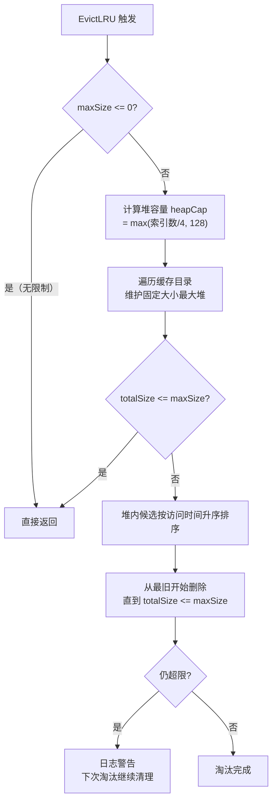
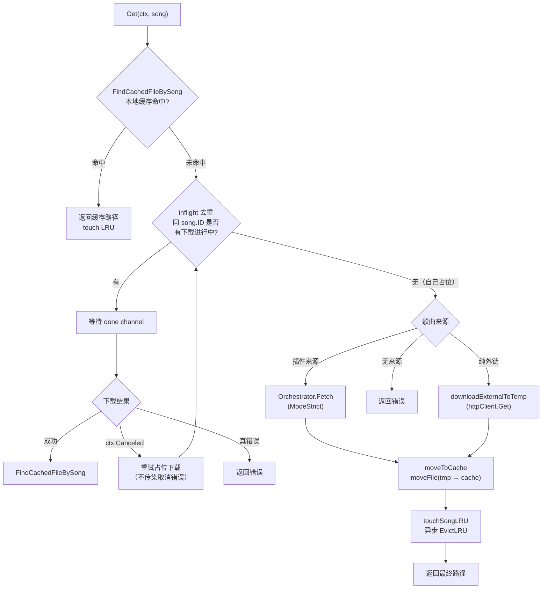

# 音频缓存与代理

本文档基于以下源文件编写：

- `internal/services/cache_service.go` -- 缓存核心结构、LRU 淘汰、配置管理
- `internal/services/cache_service_song.go` -- 歌曲级缓存操作、inflight 去重、cache key 计算
- `internal/services/cache_service_transcode.go` -- 转码缓存、ffmpeg 调用、格式映射
- `internal/handlers/cache.go` -- 缓存管理 API handler
- `internal/handlers/hls.go` -- HLS 电台反代、m3u8 改写引擎
- `internal/handlers/proxy.go` -- 通用资源代理、CORS 绕过
- `internal/services/whitelist.go` -- SSRF 防护、内网封禁
- `internal/services/file_move.go` -- 跨设备文件移动
- `internal/httputil/proxy.go` -- 全局出站 HTTP 代理配置
- `internal/handlers/jsplugin_registry.go` -- HTTP Proxy 设置端点

## 目录

1. [概览](#1-概览)
2. [音频缓存系统](#2-音频缓存系统)
3. [缓存操作流程](#3-缓存操作流程)
4. [转码缓存](#4-转码缓存)
5. [HLS 电台代理](#5-hls-电台代理)
6. [通用资源代理](#6-通用资源代理)
7. [全局出站 HTTP Proxy](#7-全局出站-http-proxy)
8. [SSRF 防护](#8-ssrf-防护)
9. [跨设备文件移动](#9-跨设备文件移动)
10. [数据结构与常量速查](#10-数据结构与常量速查)

---

## 1. 概览

Songloft 的缓存与代理子系统承担三项核心职责：(1) 远程歌曲播放时透明缓存音频到服务端，避免重复下载；(2) 为 HLS 电台流提供反向代理，解决源站防盗链和 CORS 限制；(3) 为前端资源请求（封面、歌词等）提供通用代理通道。三者共享统一的 SSRF 防护层和出站代理配置。

**章节来源**: `internal/services/cache_service.go`（CacheService 结构定义）、`internal/handlers/hls.go`（HLSHandler）、`internal/handlers/proxy.go`（ProxyHandler）

---

## 2. 音频缓存系统

### 2.1 整体设计

CacheService 是缓存子系统的核心，负责缓存文件的存储、查找、淘汰和配置管理。歌曲缓存后仍保持 `remote` 类型不变，缓存命中时直接返回本地文件路径，对调用方透明。核心字段包括：当前/默认缓存目录、LRU 索引（`map[string]time.Time`）、插件源下载编排器（`CacheSongFetcher` 接口，由 `app.go` 注入）、ffmpeg 路径和转码串行信号量（size=1）。

**章节来源**: `internal/services/cache_service.go`（CacheService 结构体、NewCacheService）

### 2.2 缓存文件命名与目录布局

缓存文件采用两级分片目录 + 复合文件名，防止单目录文件数过多，同时通过 cache key 绑定歌曲身份防止跨 DB 重建后的误命中。

**章节来源**: `internal/services/cache_service_song.go`（getCachePath、cacheKeyOf、sanitizeCacheKey）

```
布局: cache_dir/<id/100%1000>/<id/10000%100>/<id>.<key>.<ext>

示例: id=1234, key="subsonic_srv1_550109760"
  → cache_dir/12/0/1234.subsonic_srv1_550109760.mp3
```

**cache key 计算规则** (`cacheKeyOf`)：

| 歌曲来源 | key 计算方式 | 示例 |
|----------|-------------|------|
| 插件来源（有 `plugin_entry_path` + `dedup_key`） | `sanitize(plugin + "_" + dedup_key)` | `subsonic_srv1_550109760` |
| 纯外链（仅 URL） | `"u" + md5(URL)[:12]` | `u3a7f2b1c9d4e` |
| 无可识别源 | 返回空，不走缓存路径 | -- |

`sanitizeCacheKey` 过滤非 `[a-zA-Z0-9._-]` 字符为下划线，截断到 64 字节，保证文件名安全。

旧格式 `<id><ext>`（无 `.key` 段）的残留文件不会被 `FindCachedFileBySong` 命中，这是设计意图：跨 DB 重建后旧缓存因 key 不一致自然失效，触发重新下载。

### 2.3 LRU 淘汰机制

缓存总量超过 `max_size`（默认 1GB，0 表示不限制）时，按最后访问时间淘汰最旧的文件。淘汰算法使用 `container/heap` 最大堆，只保留最旧的 N 个文件作为候选，内存开销从 O(全部文件数) 降为 O(候选数)。

**章节来源**: `internal/services/cache_service.go`（EvictLRU、lruMaxHeap、lruHeapCap）



**堆容量公式**：`heapCap = max(len(lruIndex)/4, 128)`，上限不超过索引总数。这意味着单次淘汰最多评估 25% 的文件，对超大缓存（数万文件）避免全量排序的开销。若单轮淘汰后仍超限（候选不够），日志打 Warn，下次触发会继续清理。

LRU 索引在启动时通过 `loadLRUIndex` 从文件系统 mtime 加载，运行时通过 `touchSongLRU` 更新内存时间戳。临时文件（`.tmp` 后缀）在遍历和索引加载时均被跳过。

### 2.4 缓存配置管理

缓存配置持久化到 configs 表（key = `music_cache_config`），JSON 格式存储 `max_size` 和 `cache_dir` 两个字段。

**章节来源**: `internal/services/cache_service.go`（CacheConfig、CacheConfigResponse、UpdateCacheConfig、setCacheDir）、`internal/handlers/cache.go`（HandleUpdateCacheConfig、HandleValidateCacheDir）

| 配置项 | 类型 | 默认值 | 说明 |
|--------|------|--------|------|
| `max_size` | int64 | 1GB (1073741824) | 缓存上限，0 为不限制，不可为负 |
| `cache_dir` | string | `""` | 自定义缓存目录，空串使用默认目录 |

**目录切换流程**：调用 `UpdateCacheConfig` 时，若 `cache_dir` 变化，执行 `setCacheDir`：创建新目录 → 清空内存 LRU 索引 → 从新目录重建索引。旧目录的文件不会自动迁移。切换后异步触发 `EvictLRU`。

**目录验证端点** (`POST /api/v1/cache-manage/validate-dir`)：前端在用户输入目录后可预先验证，接口自动创建目录、写入测试文件检查可写性、通过 `syscall.Statfs` 返回磁盘总量和可用空间。响应包含 `valid`（是否可用）、`created`（是否新建）、`total_size`/`free_size`（磁盘容量）和 `error`（失败原因）。

### 2.5 缓存管理 API

**章节来源**: `internal/handlers/cache.go`（CacheHandler 全部方法）

| 端点 | 方法 | 说明 |
|------|------|------|
| `/api/v1/cache-manage/stats` | GET | 返回 `CacheStats`（总大小、文件数、上限） |
| `/api/v1/cache-manage/clean` | POST | 删除全部缓存文件并清空内存索引 |
| `/api/v1/cache-manage/config` | GET | 返回 `CacheConfigResponse`（含只读的默认目录） |
| `/api/v1/cache-manage/config` | PUT | 更新 `CacheConfig`，触发 LRU 淘汰 |
| `/api/v1/cache-manage/validate-dir` | POST | 验证目录可用性（自动创建 + 可写性 + 磁盘空间） |

---

## 3. 缓存操作流程

### 3.1 Get 统一入口

`CacheService.Get(ctx, song)` 是缓存 handler 的统一入口，涵盖缓存命中、inflight 去重、实际下载和移入缓存四个阶段。

**章节来源**: `internal/services/cache_service_song.go`（Get、downloadExternalToTemp、moveToCache、FindCachedFileBySong）



### 3.2 Inflight 去重

同一 `song.ID` 的并发请求通过 `songCacheState.inflight`（`map[int64]*inflightDownload`）去重。每个 `inflightDownload` 持有 `done chan struct{}` 和 `err error`。全局唯一的 `songCacheState` 还维护转码 inflight（`map[string]*inflightDownload`，key 为 `"tc_{songID}_{format}"`）和 song 级 LRU 时间戳。

**章节来源**: `internal/services/cache_service_song.go`（songCacheState、Get 方法中的 inflight 逻辑）

关键设计：当首请求因 `ctx.Canceled`（用户切歌导致请求 abort）失败时，后续等待者不会继承这个取消错误。等待者检测到 `errors.Is(dl.err, context.Canceled)` 后会重新进入占位循环，成为新的下载者。这解决了"切走又切回同一首歌时立刻 502"的问题（issue #79）。等待者同时监听自己的 `ctx.Done()`，防止首请求卡住时后续等待者也被拖死。

### 3.3 下载路径

根据歌曲来源分为两条路径：

| 来源 | 方法 | 特点 |
|------|------|------|
| 插件来源 (`IsPluginSourced()`) | `Orchestrator.Fetch(ModeStrict)` | 严格模式，不走 fallback，失败时调用方触发 `AsyncReassign` 后台切源 |
| 纯外链 (`song.URL != ""`) | `downloadExternalToTemp` | 简化 HTTP GET，无 fallback 无元数据校验 |

`downloadExternalToTemp` 写入系统临时目录，校验下载体积不小于 `MinAudioSize`（1KB），防止错误响应被缓存。Content-Type 映射为文件扩展名（`audio/mpeg` → `.mp3`，`audio/flac` → `.flac` 等）。

### 3.4 移入缓存

`moveToCache` 调用 `moveFile`（见第 9 节）将临时文件原子搬移到缓存目录。Windows 上若目标已存在则先删除。文件名格式为 `<id>.<key><ext>`。

### 3.5 缓存驱逐

`EvictSong(songID)` 删除指定 song 的所有缓存文件（包含历史多个 key 的残留和旧格式），供 `SongService.Delete` 钩子调用。匹配规则：目录下所有以 `<id>` 开头且后跟 `.` 或文件结束的文件，避免 id=12 误删 1234.mp3。

**章节来源**: `internal/services/cache_service_song.go`（EvictSong）

---

## 4. 转码缓存

### 4.1 设计概述

当客户端请求的目标格式与源文件格式不同时，CacheService 通过 ffmpeg 转码并将结果缓存，避免重复转码。转码缓存与原始缓存共用同一目录体系。

**章节来源**: `internal/services/cache_service_transcode.go`（GetOrTranscode、doTranscode、runFFmpeg）

### 4.2 GetOrTranscode 流程

1. 源格式 == 目标格式 → 直接返回 `srcPath`（`NeedsTranscode` 判定）
2. `FindTranscodedFile` 命中 → 返回缓存路径并 touch LRU
3. 未命中 → 检查转码 inflight 去重（key = `"tc_{songID}_{format}"`），有进行中则等待
4. 占位后执行 `doTranscode` → `runFFmpeg`（串行信号量控制）→ `os.Rename`（同目录无 EXDEV）
5. touch LRU、异步 `EvictLRU`、返回转码文件路径

### 4.3 格式识别与映射

**章节来源**: `internal/services/cache_service_transcode.go`（NeedsTranscode、EffectiveSourceFormat、NormalizeFormat、tagFormatToAudioFormat）

源格式通过 `EffectiveSourceFormat` 确定：优先使用 `song.Format`（tag 库返回的元数据格式名如 `ID3v2.3`、`MP4`），通过 `tagFormatToAudioFormat` 映射为音频格式；无法确定时回退到文件扩展名。

`NormalizeFormat` 统一别名：

| 输入 | 标准化结果 |
|------|-----------|
| `mpeg` / `mp3` | `mp3` |
| `mp4` / `m4a` / `aac` | `m4a` |
| `ogg` / `vorbis` | `ogg` |
| `wav` / `wave` | `wav` |
| `wma` / `asf` | `wma` |

### 4.4 ffmpeg 参数

| 目标格式 | 编码器 | 质量参数 | muxer |
|----------|--------|---------|-------|
| mp3 | libmp3lame | `-q:a 0` | mp3 |
| ogg | libvorbis | `-q:a 6` | ogg |
| m4a | aac | `-b:a 256k` | ipod |
| flac | flac | (无) | flac |
| wav | pcm_s16le | (无) | wav |

所有转码命令统一加 `-vn`（剥离视频轨）。`transcodeSem` 信号量（容量 1）保证同一时刻最多一个 ffmpeg 进程，避免并发转码占满 CPU 影响当前播放。等待信号量时监听 ctx，超时或取消可提前退出。

### 4.5 转码缓存文件命名

转码文件名格式为 `{id}.{key}.tc.{format}` 或 `{id}.tc.{format}`（无 key 时）。临时文件创建在目标目录（同设备），`os.Rename` 不会触发 EXDEV。

---

## 5. HLS 电台代理

### 5.1 设计目标

HLS 代理解决两个问题：(1) 源站 Referer/UA 防盗链导致播放器直连失败；(2) Web 嵌入模式下浏览器 CORS 策略阻止跨域 m3u8 拉取。开启代理后，所有 HLS 切片字节经本机转发，player 只与 Songloft 服务通信。

**章节来源**: `internal/handlers/hls.go`（HLSHandler 结构、ServeProxy、HandlePlaylist、HandleSegment）

### 5.2 代理开关

业务端点 `GET/PUT /api/v1/settings/hls-proxy`，请求体 `{enabled: bool}`，默认 `false`。

**章节来源**: `internal/handlers/hls.go`（hlsProxyConfigKey、IsEnabled、SetEnabled、GetProxySetting、UpdateProxySetting）

- `false`（关闭）：电台 `.m3u8` 地址直接 302 给 player，由 player 自行拉源站。零带宽开销但受源站限制。
- `true`（开启）：服务端拉取并改写 m3u8，代理所有切片/key/init 段。所有切片字节走本机带宽。

配置以 `"true"/"false"` 字符串存储在 configs 表（key = `hls_proxy_enabled`），`ConfigService.GetBool` 解析。

### 5.3 代理流程

代理模式下的请求链路：Player 请求 `/songs/{id}/play.m3u8` → Songloft 拉取上游 m3u8 → `rewriteM3U8` 将同源 URI 改写为相对路径（`playlist?u=base64` / `segment?u=base64`）并注入 `access_token` → 返回改写后的 m3u8。Player 解析后续回访 `hls/segment?u=xxx`（切片透传）或 `hls/playlist?u=xxx`（子 m3u8 再次改写）。

### 5.4 端点详情

| 端点 | 方法 | 说明 |
|------|------|------|
| `/api/v1/songs/{id}/play.m3u8` | GET | 顶层入口，由 `serveRadio` 调用 `ServeProxy` |
| `/api/v1/songs/{id}/hls/playlist?u=<base64url>` | GET/HEAD | 子层 m3u8 代理 |
| `/api/v1/songs/{id}/hls/segment?u=<base64url>` | GET/HEAD | 切片/key/init 段代理 |
| `/api/v1/settings/hls-proxy` | GET/PUT | 代理开关 |

`u` 参数使用 `base64.RawURLEncoding` 编码上游绝对 URL。

### 5.5 m3u8 改写引擎

`rewriteM3U8` 是改写核心，逐行解析 m3u8 并替换所有同源 URI 为本机相对路径。

**章节来源**: `internal/handlers/hls.go`（rewriteM3U8、rewriteAttrTagURI、parseAttrLine、parseAttrList）

**改写覆盖范围**（经典 HLS + LL-HLS 全集）：

| HLS 标签 | URI 属性 | 改写目标 |
|----------|---------|---------|
| `#EXT-X-STREAM-INF` | 紧随的裸 URL 行 | playlist |
| `#EXT-X-I-FRAME-STREAM-INF` | `URI` | playlist |
| `#EXT-X-MEDIA` | `URI` | playlist |
| `#EXT-X-RENDITION-REPORT` | `URI` | playlist |
| `#EXT-X-KEY` / `#EXT-X-SESSION-KEY` | `URI` | segment |
| `#EXT-X-MAP` | `URI` | segment |
| `#EXT-X-PRELOAD-HINT` | `URI` | segment |
| `#EXT-X-PART` | `URI` | segment |
| `#EXT-X-SESSION-DATA` | `URI` | segment |
| `#EXT-X-DATERANGE` | `X-ASSET-URI` | 根据后缀判定 |
| 裸 URL 行（媒体切片） | -- | segment |

**未改写项**：`#EXT-X-DATERANGE` 的 `X-ASSET-LIST`（JSON 子代理在 MVP 之外，原样透传 fail-open 到客户端直连）。

**HLS attribute list 解析** (`parseAttrList`)：手写解析器正确处理引号内逗号（如 `CODECS="avc1.42c01e,mp4a.40.2"`），避免误切分。

### 5.6 相对路径与 access_token 注入

改写后的 URL 全部使用相对路径（非绝对路径），规避 `BASE_PATH` 子路径部署拼接问题。顶层 `ServeProxy`（当前请求 `.../play`）使用 `pathPrefix = "hls/"`；子层 `HandlePlaylist`（已在 `.../hls/playlist`）使用空前缀。

**章节来源**: `internal/handlers/hls.go`（makeRewriter、servePlaylist）

player（just_audio / libmpv）跟随 m3u8 内部 URL 时不复用 Authorization header，相对 URL 解析也丢失 base 的 query。因此改写时从当前请求提取 `access_token` 查询参数，注入到每条子 URL（如 `segment?u=xxx&access_token=yyy`），保证鉴权中间件不拒绝回访请求。

### 5.7 同源校验与安全

每次端点入口调用 `checkOrigin` 执行双重校验：

**章节来源**: `internal/handlers/hls.go`（checkOrigin、isSameOrigin）

1. **同源校验**：比较 `scheme + hostname(小写) + port`，上游 URL 必须与 `song.URL` 严格同源，非同源 URL 保持原样不改写
2. **SSRF 兜底**：`services.IsHostnameAllowed` 拒绝内网地址（详见第 8 节）

仅允许 `http` / `https` scheme，其他 scheme 直接拒绝。

### 5.8 上游错误处理与限制

上游 4xx/5xx 透传给 player（status + body + Content-Type）；playlist 体上限 1MB，超过返回 502；首行必须 `#EXTM3U`；UTF-8 BOM 自动跳过；client 无 Timeout（直播切片可持续数分钟），由 `r.Context()` 取消接管；重定向上限 10 次。

---

## 6. 通用资源代理

ProxyHandler 为前端提供跨域资源代理（`GET /api/v1/proxy?url=<目标URL>`），解决浏览器 CORS 限制，主要用于封面图片、歌词等。安全措施：仅 `http`/`https` 协议、`IsHostnameAllowed` 内网封禁（被拒返回 403）。

**章节来源**: `internal/handlers/proxy.go`（ProxyHandler、Proxy、ServeRemoteResource）

`ServeRemoteResource` 是公开方法，供封面、歌词等内部代理场景复用，不走域名校验。流程：构建上游请求（处理 URL 中的 Basic Auth，透传 Range/Accept 头）→ 发起请求（60s 超时，<=10 次重定向）→ 透传响应头（Content-Type/Content-Length/Content-Range/Accept-Ranges/Cache-Control/ETag/Last-Modified）→ 流式转发 Body。图片资源（`image/*`）且无 Cache-Control 时自动设置 7 天缓存。支持 Range 请求，透传 206 Partial Content。

---

## 7. 全局出站 HTTP Proxy

### 7.1 设计概述

Songloft 支持为所有后端外发 HTTP 请求配置出站代理，用于网络受限环境下访问外部资源（插件注册表、升级检查等）。

**章节来源**: `internal/httputil/proxy.go`（proxyConfig、sharedTransport、SetGlobalProxy、NewClient）

### 7.2 架构实现

全局 `proxyConfig`（读写锁保护）持有解析后的代理 URL，共享 `http.Transport`（MaxIdleConns=100、IdleConnTimeout=90s）供所有 `NewClient` 创建的 client 复用。核心 API：

- `SetGlobalProxy(rawURL)` -- 设置代理 URL 并关闭存量空闲连接，使新连接走新代理
- `NewClient(timeout)` -- 创建使用全局代理的 `http.Client`
- `GetGlobalProxy()` -- 返回当前代理 URL，空串表示直连

### 7.3 Loopback 旁路

`proxyFunc` 在每次请求时检查目标 hostname，`localhost` / `127.0.0.1` / `::1` 自动跳过代理，避免内部请求（如本机 API 调用）被转发到外部代理。

**章节来源**: `internal/httputil/proxy.go`（proxyFunc）

### 7.4 设置端点

`GET/PUT /api/v1/settings/http-proxy`，请求体 `{proxy: string}`。

**章节来源**: `internal/handlers/jsplugin_registry.go`（httpProxySetting、GetHttpProxySetting、UpdateHttpProxySetting）

- 典型值：`http://192.168.1.1:7890`（支持 HTTP/HTTPS/SOCKS5 代理格式）
- 空字符串表示直连
- PUT 时即时生效（调用 `httputil.SetGlobalProxy`），无需重启
- 配置持久化到 configs 表（key = `http_proxy`），启动时由 `app.go` 加载
- PUT 校验代理地址格式（`url.Parse`），无效地址返回 400

### 7.5 已接入的 service

| 模块 | 文件 | 用途 |
|------|------|------|
| 插件注册表 | `jsplugin/registry.go` | 拉取远程插件源 |
| 插件包管理 | `jsplugin/package.go` | 下载/更新插件 |
| 系统升级 | `services/upgrade_service.go` | 检查/下载新版本 |
| 插件 ZIP 下载 | `handlers/jsplugin_registry.go` | `downloadZIP` |

与 GitHub 镜像加速（`github_proxy` URL 前缀拼接）共存：先拼接镜像前缀再经 HTTP Proxy 转发。

---

## 8. SSRF 防护

### 8.1 策略

Songloft 采用**内网封禁策略**：阻止代理请求访问内网地址，允许所有外网域名。这是 HLS 代理和通用资源代理的统一安全基线。

**章节来源**: `internal/services/whitelist.go`（IsHostnameAllowed、isPrivateIP）

### 8.2 IsHostnameAllowed 判定流程

判定步骤：(1) `localhost` / `*.local` / 空 → 直接拒绝；(2) `net.LookupIP` 解析失败 → 放行（交由 HTTP 请求自行报错）；(3) 遍历所有解析 IP，任一命中内网/保留地址 → 拒绝；(4) 全部外网 → 放行。

### 8.3 内网地址判定

`isPrivateIP` 检查以下地址类别：

| 地址类别 | 范围 | 方法 |
|----------|------|------|
| 回环地址 | `127.0.0.0/8`、`::1` | `ip.IsLoopback()` |
| 私有地址 | `10.0.0.0/8`、`172.16.0.0/12`、`192.168.0.0/16`、`fc00::/7` | `ip.IsPrivate()` |
| 链路本地 | `169.254.0.0/16`、`fe80::/10` | `ip.IsLinkLocalUnicast()` / `ip.IsLinkLocalMulticast()` |
| 未指定地址 | `0.0.0.0`、`::` | `ip.IsUnspecified()` |

DNS 解析的所有 IP 中只要有一个命中内网地址即拒绝（防止 DNS rebinding 攻击中混入内网 IP）。

---

## 9. 跨设备文件移动

### 9.1 问题背景

`os.Rename` 在源和目标不在同一文件系统（挂载点）时返回 `syscall.EXDEV`（cross-device link）。典型场景：`os.CreateTemp("")` 在系统 `/tmp`（tmpfs），目标缓存目录挂载在独立磁盘或 Docker volume。

**章节来源**: `internal/services/file_move.go`（moveFile、isCrossDeviceError、copyFileRaw）

### 9.2 moveFile 实现

先尝试 `os.Rename(src, dst)`；失败时通过 `errors.As` 提取 `*os.LinkError` 并 `errors.Is(linkErr.Err, syscall.EXDEV)` 判定是否跨设备错误。是则回退到 `copyFileRaw`（`os.Open` → `os.Create` → `io.Copy`）+ `os.Remove(src)`。`copyFileRaw` 写入或 `Close` 失败时清理目标文件，确保不留损坏文件。

### 9.3 使用约定

- 缓存下载（`downloadExternalToTemp` → `moveToCache`）使用 `moveFile`
- `pkg/tag` 的原子写不受影响：它用 `os.CreateTemp(dir, ...)` 在源文件同目录创建临时文件，rename 一定同设备
- 转码缓存临时文件也创建在目标目录（`os.CreateTemp(dir, "tc-*.tmp")`），可安全使用 `os.Rename`
- **新增下载/缓存逻辑必须用 `moveFile`，禁止裸 `os.Rename`**

---

## 10. 数据结构与常量速查

### 10.1 核心常量

**章节来源**: `internal/services/cache_service.go`、`internal/handlers/hls.go`

| 常量 | 值 | 说明 |
|------|---|------|
| `MinAudioSize` | 1024 (1KB) | 最小有效音频文件大小，低于此值视为错误响应 |
| `defaultMaxCacheSize` | 1073741824 (1GB) | 默认缓存上限 |
| `cacheConfigKey` | `"music_cache_config"` | 缓存配置在 configs 表中的 key |
| `hlsProxyConfigKey` | `"hls_proxy_enabled"` | HLS 代理开关的 config key |
| `httpProxyConfigKey` | `"http_proxy"` | 出站代理的 config key |
| `maxPlaylistBytes` | 1048576 (1MB) | m3u8 响应体上限 |
| `minLRUHeapCap` | 128 | LRU 淘汰堆最小容量 |

### 10.2 核心类型关系

**图表来源**: `internal/services/cache_service.go`、`internal/services/cache_service_song.go`、`internal/handlers/hls.go`、`internal/handlers/proxy.go`

| 类型 | 职责 | 关键依赖 |
|------|------|---------|
| `CacheService` | 缓存存储/查找/淘汰/转码 | `CacheSongFetcher`（编排器）、`ConfigService`、`songCacheState` |
| `CacheSongFetcher` | 接口：插件源音频拉取 | 由 `SourceOrchestrator` 实现，`app.go` 注入 |
| `songCacheState` | 全局 inflight 去重 + song LRU | 进程唯一（`sync.Once`） |
| `HLSHandler` | HLS m3u8 改写与切片代理 | `SongService`、`ConfigService`、`IsHostnameAllowed` |
| `ProxyHandler` | 通用资源代理 | `IsHostnameAllowed` |
