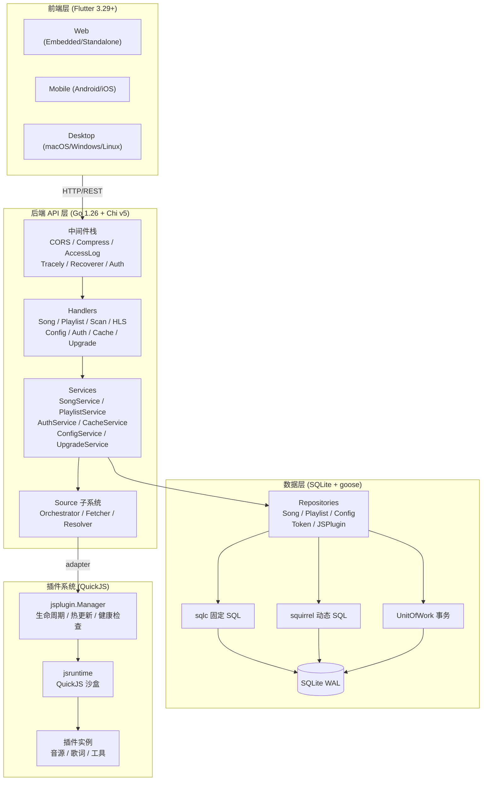
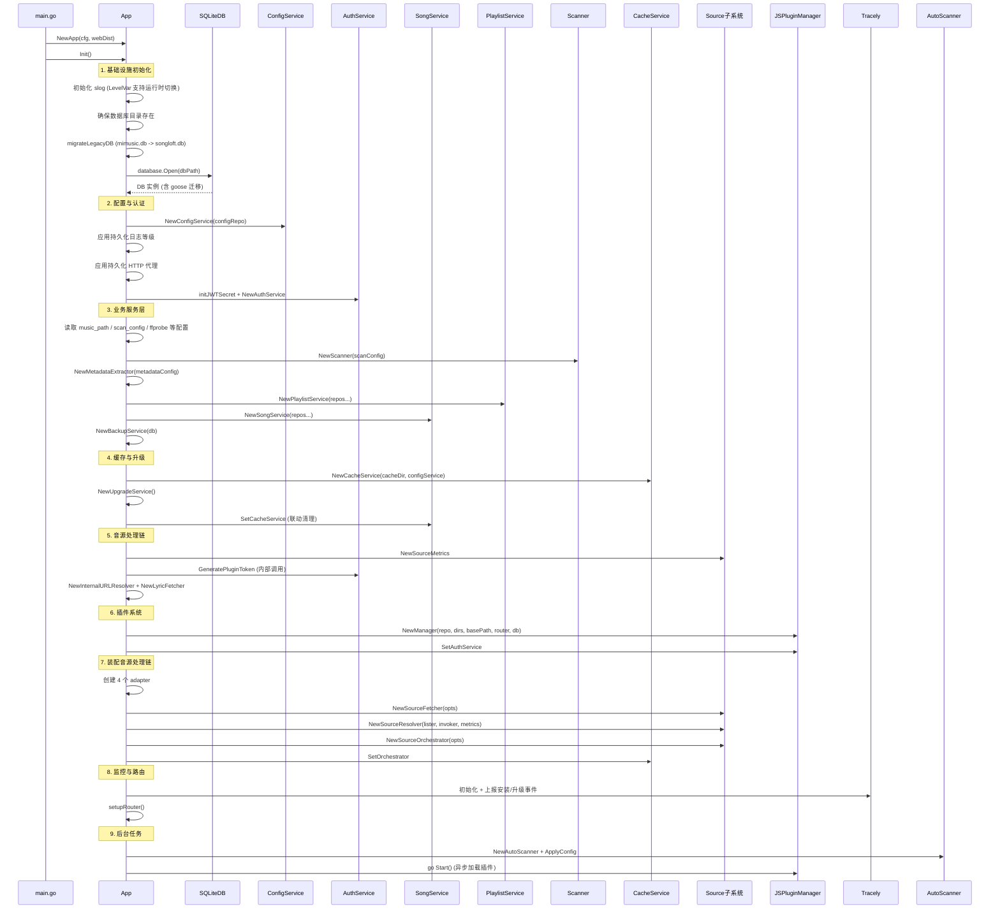
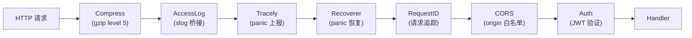
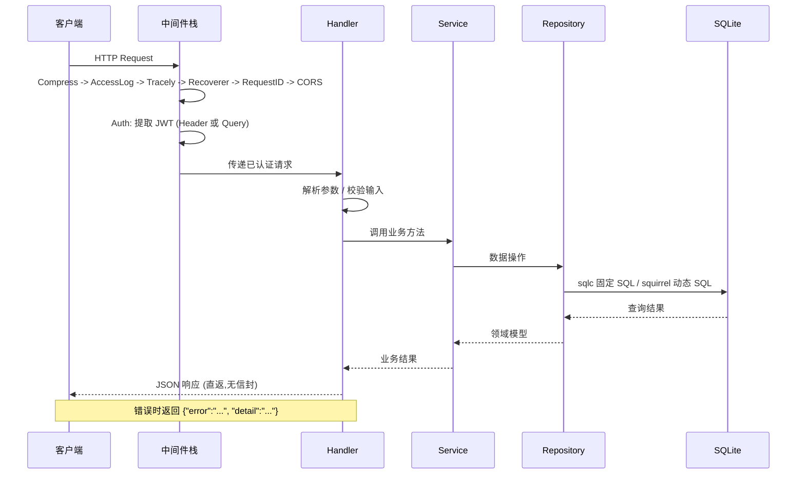
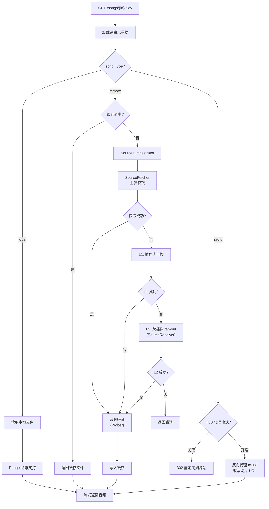
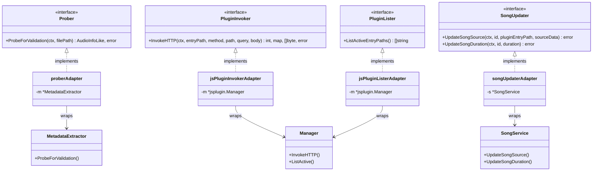
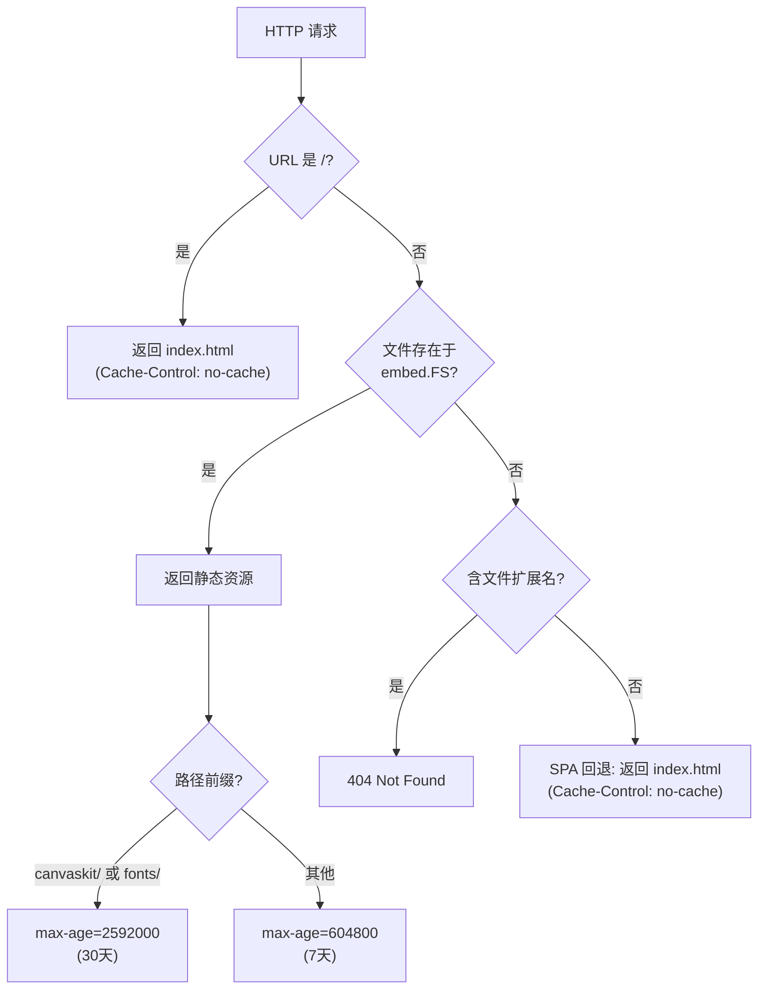
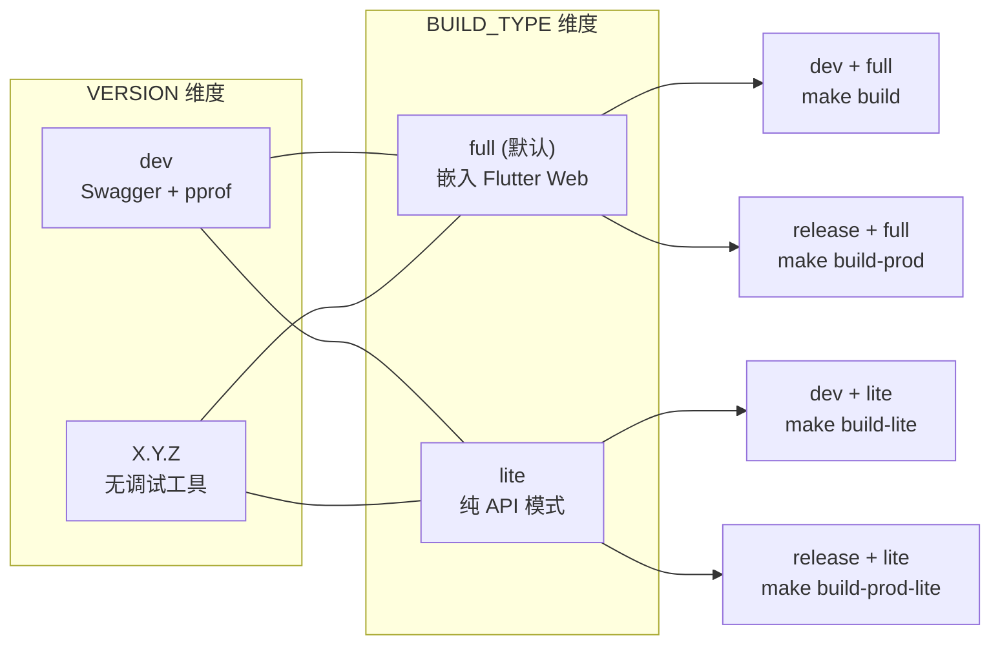

# 系统架构设计

本文档基于以下源文件编写：

- `internal/app/app.go` -- 应用主结构与 Init 启动链
- `internal/app/routers.go` -- 路由注册与中间件栈
- `internal/app/source_adapters.go` -- adapter pattern 实现
- `internal/app/embed.go` -- SPA 静态文件服务与预压缩
- `internal/app/compress.go` -- Brotli/Gzip 预压缩文件系统
- `internal/app/access_log.go` -- slog 访问日志桥接
- `internal/app/db_migration.go` -- 旧版数据库迁移
- `internal/app/router_dev.go` -- dev 构建条件编译（Swagger）
- `internal/app/router_prod.go` -- prod 构建空实现
- `internal/app/pprof_dev.go` -- dev 构建 pprof 服务
- `internal/database/database.go` -- DB 接口定义
- `internal/database/sqlite.go` -- SQLite 实现与 goose 迁移
- `internal/database/unit_of_work.go` -- UnitOfWork 事务模式
- `internal/middleware/auth.go` -- JWT 认证中间件
- `internal/services/source/fetcher.go` -- 音源获取器接口
- `internal/services/source/resolver.go` -- 跨插件音源解析器
- `internal/services/source/orchestrator.go` -- 音源编排器
- `web_embed.go` -- 完整版前端嵌入
- `web_embed_lite.go` -- 精简版空嵌入
- `Makefile` -- 构建系统

## 目录

1. [简介](#1-简介)
2. [整体架构概览](#2-整体架构概览)
3. [技术架构详解](#3-技术架构详解)
4. [应用启动流程](#4-应用启动流程)
5. [路由架构](#5-路由架构)
6. [数据流设计](#6-数据流设计)
7. [适配器模式](#7-适配器模式)
8. [静态文件服务](#8-静态文件服务)
9. [构建变体](#9-构建变体)
10. [扩展性设计](#10-扩展性设计)
11. [依赖分析](#11-依赖分析)
12. [性能考虑](#12-性能考虑)
13. [结论](#13-结论)

---

## 1. 简介

Songloft 是自托管本地音乐服务器，采用 Go 1.26 + Chi v5 + SQLite 后端、Flutter 跨平台前端、QuickJS 插件系统的技术栈。系统设计遵循分层架构原则，通过 Handler -> Service -> Repository/Database 的三层结构实现关注点分离，通过 adapter pattern 在模块间建立清晰的依赖边界。

本文档聚焦后端系统架构，涵盖启动流程、路由设计、数据流、构建变体和扩展机制等核心设计决策。

**章节来源**: `AGENTS.md`（项目概述）、`internal/app/app.go`（App 结构定义）

---

## 2. 整体架构概览

Songloft 采用经典的三层架构，辅以插件系统实现运行时扩展。



**图表来源**: `internal/app/app.go`（App 结构体字段列表）、`internal/app/routers.go`（路由分组）、`internal/database/database.go`（DB 接口）

**章节来源**: `internal/app/app.go:35-58`（App struct 定义了所有核心依赖）、`internal/app/routers.go:37-235`（路由注册体现三层调用关系）

---

## 3. 技术架构详解

### 3.1 Go 标准 Layout

项目遵循 Go 标准目录布局，核心业务逻辑全部位于 `internal/` 下：

| 目录 | 职责 |
|------|------|
| `internal/app` | 应用组装层（Init/路由/中间件/adapter） |
| `internal/config` | 启动配置（AppConfig） |
| `internal/database` | 数据访问层（DB 接口/Repository/sqlc/squirrel/migrations） |
| `internal/handlers` | HTTP Handler 层 |
| `internal/services` | 业务逻辑层（含 `source/` 音源子系统、`playactivity/` 播放跟踪） |
| `internal/jsplugin` | JS 插件管理器 |
| `internal/jsruntime` | QuickJS 运行时封装 |
| `internal/middleware` | Chi 中间件（Auth） |
| `internal/models` | 领域模型 |
| `internal/httputil` | HTTP 工具（代理、共享 Transport） |
| `pkg/tag` | 音频元数据读写库（可外部引用） |
| `web_embed.go` / `web_embed_lite.go` | 前端嵌入切换（build tag 控制） |

### 3.2 internal/ 包结构与依赖规则

包之间的依赖遵循严格的单向规则：

- `handlers` -> `services` -> `database`（标准三层）
- `app` 作为组装层，是唯一允许同时引用 `handlers`、`services`、`jsplugin` 的包
- `services/source` 通过接口（`Prober`、`PluginInvoker`、`PluginLister`、`SongUpdater`）与 `services`、`jsplugin` 解耦
- `database` 包只依赖 `models` 和数据库驱动，不依赖任何业务包

### 3.3 构建约束

- **CGO_ENABLED=0**：全静态编译，Makefile 中 `GO=CGO_ENABLED=0 GOAMD64=v1 go`，SQLite 使用纯 Go 实现 `modernc.org/sqlite`
- **Build Tags**：`dev`（开发工具）和 `lite`（精简构建）两个正交维度
- **ldflags 注入**：Version、GitCommit、BuildTime、BuildType、Tracely 配置均通过 `-X` 在编译时写入

**章节来源**: `Makefile:3`（CGO_ENABLED=0）、`internal/app/source_adapters.go:1-16`（adapter 注释说明依赖规则）、`Makefile:28-37`（build tags 说明）

---

## 4. 应用启动流程

`App.Init()` 方法实现了完整的依赖注入链，按依赖顺序创建所有服务组件。



**图表来源**: `internal/app/app.go:87-392`（Init 方法完整流程）

关键设计决策：严格按依赖关系初始化（DB 最先、路由最后）；所有持久化配置在启动时从 config 表恢复；JS 插件管理器 `go Start()` 异步加载避免阻塞；`migrateLegacyDB` 处理 v1.x 到 v2.0 的一次性数据库重命名。

**章节来源**: `internal/app/app.go:87-392`（Init 方法）、`internal/app/db_migration.go:22-45`（migrateLegacyDB）

---

## 5. 路由架构

### 5.1 中间件栈

`setupBaseRouter()` 注册全局中间件，执行顺序从外到内：



**图表来源**: `internal/app/routers.go:237-349`（setupBaseRouter 中间件注册顺序）

各中间件职责：Compress 对 JS/CSS/JSON/WASM 等资源 gzip level 5 压缩；AccessLog 桥接到 slog 受日志等级控制；Tracely 捕获 panic 上报后重新 panic；Recoverer 捕获 panic 返回 500；RequestID 生成请求唯一 ID；CORS 白名单 localhost/局域网/hanxi.cc 子域名；Auth 验证 JWT Bearer Token（支持 query parameter 回退）。

### 5.2 路由树结构

```
/                               # SPA 静态文件 (embed.go)
/swagger/*                      # Swagger UI (仅 dev build)
/api/v1/
├── auth/{login,refresh}        # 公开端点（无需认证）
├── version                     # 公开端点
├── health                      # 公开端点
└── [认证保护组]
    ├── auth/{logout,tokens}
    ├── songs/*                 # 歌曲 CRUD + 播放 + 封面 + 歌词
    ├── playlists/*             # 歌单 CRUD + 歌曲操作 + 导入导出
    ├── settings/*              # 业务配置端点（强类型）
    ├── configs/*               # 通用 KV 配置（admin）
    ├── scan/*                  # 扫描管理
    ├── proxy                   # CORS 资源代理
    ├── cache-manage/*          # 缓存管理
    ├── upgrade/*               # 升级管理
    └── jsplugins/*             # 插件管理
/api/v1/jsplugin/{entry}/*      # 插件 API 转发（动态路由）
/api/v1/jsplugin-assets/*       # 插件公共资源（CSS/JS/字体）
```

### 5.3 认证分层

三级策略：公开端点（login/refresh/version/health）不经 Auth 中间件；标准认证路由通过 `AuthMiddleware(authService)` 保护；插件路由通过 `AuthMiddleware(authService, jsPluginManager)` 保护，`jsPluginManager` 实现 `PublicPathChecker` 接口允许插件声明的 publicPaths 免认证。

**章节来源**: `internal/app/routers.go:20-35`（setupRouter）、`internal/app/routers.go:237-349`（setupBaseRouter）、`internal/middleware/auth.go:28-88`（AuthMiddleware 含 PublicPathChecker）

---

## 6. 数据流设计

### 6.1 请求生命周期



**图表来源**: `internal/app/routers.go:237-349`（中间件注册）、`internal/middleware/auth.go:28-88`（认证流程）

### 6.2 歌曲播放流

歌曲播放是系统最复杂的数据流之一，根据歌曲类型（local/remote/radio）分三条路径：



**图表来源**: `internal/app/routers.go:194-207`（播放端点注册）、`internal/services/source/orchestrator.go:12-50`（FetchMode 与 fallback 策略）、`internal/services/source/fetcher.go:46-53`（FetchResult 结构）

**章节来源**: `internal/app/routers.go:194-227`（播放与 HLS 端点）、`internal/services/source/orchestrator.go`（编排逻辑）、`internal/services/source/resolver.go:54-60`（跨插件搜索）

---

## 7. 适配器模式

`source_adapters.go` 是系统解耦设计的核心体现。`services/source` 包定义了 4 个接口，`app` 包在组装阶段通过 adapter 将具体实现注入，避免 source 包反向依赖 `services` 或 `jsplugin`。



**图表来源**: `internal/app/source_adapters.go:17-98`（4 个 adapter 定义）、`internal/services/source/fetcher.go:18-31`（Prober/PluginInvoker 接口）、`internal/services/source/resolver.go:48-52`（PluginLister 接口）、`internal/services/source/orchestrator.go:27-30`（SongUpdater 接口）

此外 `reassignAdapter`（为 cache handler 包装 `AsyncReassign`）和 `playActivityReassignTracker`（让 source 包不直接依赖 playactivity）提供辅助适配。

adapter pattern 的设计意图是：**`services/source` 包只依赖自己定义的接口，不知道 `jsplugin.Manager`、`services.MetadataExtractor`、`services.SongService` 的存在**。这使得 source 子系统可以独立测试，也允许未来替换具体实现。

**章节来源**: `internal/app/source_adapters.go:1-16`（文件头注释）、`internal/app/source_adapters.go:76-112`（reassignAdapter 和 playActivityReassignTracker）

---

## 8. 静态文件服务

### 8.1 SPA 回退机制

`embed.go` 中的 `registerWebStatic()` 实现了完整的 SPA 静态文件服务：



**图表来源**: `internal/app/embed.go:57-98`（registerWebStatic 路由逻辑）

### 8.2 Base Path 处理

子路径部署时（如 `/songloft`），`App.Start()` 使用 `http.StripPrefix` 剥离前缀，`embed.go` 运行时将 `<base href="/">` 替换为 `<base href="/songloft/">`，`compress.go` 的 `addCustomEntry` 对修改后的 index.html 重新生成 Brotli/Gzip 压缩版本。

### 8.3 预压缩与精简版

`compress.go` 实现 `precompressedFS`，启动时从 embed.FS 加载构建时生成的 `.br`/`.gz` 预压缩文件，优先 Brotli、次选 Gzip、最后回退原始文件。支持 ETag 条件请求。未预压缩时所有请求 fallback 到 `chi/middleware.Compress` 实时压缩。

精简版（`lite` build tag）下 `web_embed_lite.go` 提供空 `embed.FS`，`registerWebStatic` 仅在根路径挂载提示页面。

**章节来源**: `internal/app/embed.go:17-98`（registerWebStatic）、`internal/app/compress.go:31-78`（newPrecompressedFS）、`internal/app/embed.go:100-139`（serveLitePage）、`internal/app/app.go:472-483`（Start 中 BasePath 处理）、`web_embed_lite.go`（空 embed.FS）

---

## 9. 构建变体

### 9.1 双维度矩阵

Songloft 的构建由两个正交维度控制：

| 维度 | 取值 | 含义 |
|------|------|------|
| **VERSION** | `dev` / `X.Y.Z` | 是否为开发版，`dev` 自动启用 `-tags dev` |
| **BUILD_TYPE** | `lite` / 空 (full) | 是否嵌入前端资源 |

组合产出 4 种变体：



**图表来源**: `Makefile:28-37`（build tags 说明）、`Makefile:97-134`（4 种 build target）

### 9.2 条件编译文件

| 文件 | Build Tag | 内容 |
|------|-----------|------|
| `router_dev.go` | `//go:build dev` | 注册 Swagger UI 路由 (`/swagger/*`) |
| `router_prod.go` | `//go:build !dev` | `registerSwagger()` 空实现 |
| `pprof_dev.go` | `//go:build dev` | 启动 pprof HTTP 服务 (`:13060`) |
| `web_embed.go` | `//go:build !lite` | `//go:embed all:songloft-player-build/web-embedded` |
| `web_embed_lite.go` | `//go:build lite` | 空 `embed.FS` |

### 9.3 版本信息注入

`Makefile` 通过 `-ldflags -X` 在编译时注入 Version、GitCommit、BuildTime、BuildType 以及 Tracely 监控配置（AppID/AppSecret/Host）。Tracely 配置仅在私有构建时注入，开源构建默认为空，运行时不会初始化客户端。

**章节来源**: `internal/app/router_dev.go`（Swagger 条件编译）、`internal/app/router_prod.go`（空实现）、`internal/app/pprof_dev.go`（pprof 服务）、`web_embed.go` / `web_embed_lite.go`（前端嵌入切换）、`Makefile:18-26`（ldflags 定义）

---

## 10. 扩展性设计

### 10.1 JS 插件系统

Songloft 通过 QuickJS 沙盒实现运行时插件扩展，插件系统的架构层次：

```
jsplugin.Manager (生命周期管理)
├── 插件加载：从 jsplugins/ 目录扫描 manifest
├── 健康检查：定期探活，标记 Red/Yellow/Green 状态
├── 热更新：文件指纹变化时自动重载
├── 路由注册：RegisterStaticRoutes + RegisterAPIRoutes
└── jsruntime (QuickJS 封装)
    ├── host 桥接：http.fetch / storage / logger
    └── 权限校验：按 manifest permissions 字段控制
```

### 10.2 Config-in-DB 运行时配置

系统采用 SQLite config 表存储所有运行时配置，支持不重启生效：

- **日志等级**：通过 `slog.LevelVar` 动态切换，`PUT /settings/log-level` 即时生效
- **HTTP 代理**：通过 `httputil.SetGlobalProxy` 即时更新共享 Transport
- **音乐路径**：变更后触发 `onMusicPathConfigChanged` 回调，重建 Scanner 并异步清理无效歌曲
- **自动扫描**：变更后通过 `autoScanner.ApplyConfig` 重新调度
- **通用 KV 回调**：`configHandler.SetOnConfigChanged` 注册 key 级别的变更回调（如 `music_path`、`auto_scan`），保持 `/configs/{key}` 通用入口与业务端点副作用一致

**章节来源**: `internal/app/app.go:88-92`（LevelVar 初始化）、`internal/app/app.go:128-138`（HTTP 代理恢复）、`internal/app/app.go:394-456`（onMusicPathConfigChanged）、`internal/app/routers.go:63-71`（SetOnConfigChanged 回调）

---

## 11. 依赖分析

### 11.1 核心外部依赖

| 依赖 | 用途 |
|------|------|
| `go-chi/chi/v5` + `go-chi/cors` | HTTP 路由框架 + CORS 中间件 |
| `modernc.org/sqlite` | 纯 Go SQLite 实现，无需 CGO |
| `pressly/goose/v3` | 数据库迁移工具，embed SQL 文件 |
| `Masterminds/squirrel` | 动态 SQL 构建器（变长 WHERE/SET） |
| `swaggo/swag` | Swagger 文档生成（仅 dev build） |
| `andybalholm/brotli` | Brotli 压缩，用于运行时重压缩 index.html |
| `hanxi/tracely` | 应用监控（安装/升级/错误上报） |

### 11.2 依赖流向

`main.go` -> `internal/app`（组装层）分别引用 `handlers` -> `services` -> `database` -> `models` 的标准三层，以及 `jsplugin` -> `jsruntime`、`middleware`、`httputil`。`services/source` 仅依赖自身定义的接口，与 `jsplugin`、`services` 主包之间不直接依赖，全部通过 `app` 包的 adapter 连接。

**章节来源**: `internal/app/app.go:3-31`（import 列表）、`internal/app/source_adapters.go:1-16`（包注释）、`internal/database/sqlite.go:1-14`（database import）

---

## 12. 性能考虑

### 12.1 数据库优化

SQLite 连接通过 DSN pragma 参数优化：WAL 模式（读写并发）、busy_timeout 10s（避免 SQLITE_BUSY）、synchronous NORMAL、cache_size 10000（~40MB 页缓存）、foreign_keys 启用。连接池配置：最大 10 个连接、5 个空闲、30 分钟生命周期。

### 12.2 静态资源优化

构建时生成 Brotli/Gzip 预压缩文件（运行时零 CPU 开销），分级缓存策略（canvaskit/fonts 30 天、其他 7 天），基于 CRC32 的 ETag 支持 304 响应，未命中时 fallback 到 chi gzip level 5。

### 12.3 并发控制

UnitOfWork 事务（`RunInTx` 同一 `*sql.Tx`，避免 SQLITE_BUSY）、`playactivity.Registry`（快速切歌时旧请求让位）、缓存 inflight 去重（同 songID 只下载一次）、Source fan-out 超时（单插件 5s、全局 8s）。

### 12.4 构建产物优化

CGO_ENABLED=0 纯静态链接、`-s -w` ldflags 剥离符号表、生产构建自动 UPX `-9` 压缩。

**章节来源**: `internal/database/sqlite.go:28-55`（Open 方法 DSN 配置）、`internal/app/compress.go:32-78`（预压缩加载）、`internal/app/embed.go:84-97`（分级缓存策略）、`Makefile:3`（CGO_ENABLED=0）、`Makefile:113-119`（UPX 压缩）

---

## 13. 结论

Songloft 的系统架构围绕以下核心设计原则构建：

1. **分层清晰**：Handler -> Service -> Repository 严格单向依赖，`internal/` 包隔离防止泄漏
2. **接口解耦**：`services/source` 包通过 4 个接口与外部系统交互，`app` 包作为唯一的组装层提供 adapter 实现
3. **配置即数据**：所有运行时配置存储在 SQLite config 表，支持不重启热生效
4. **构建灵活**：`dev`/`lite` 两个正交 build tag 组合出 4 种变体，满足开发调试到生产部署的全场景
5. **渐进扩展**：QuickJS 插件系统通过沙盒隔离和 adapter 注入，在不修改核心代码的前提下扩展音源、歌词等能力
6. **性能务实**：WAL 模式 SQLite、预压缩静态资源、inflight 去重、UPX 压缩等手段在实用性和复杂度之间取得平衡

**章节来源**: 综合全文分析