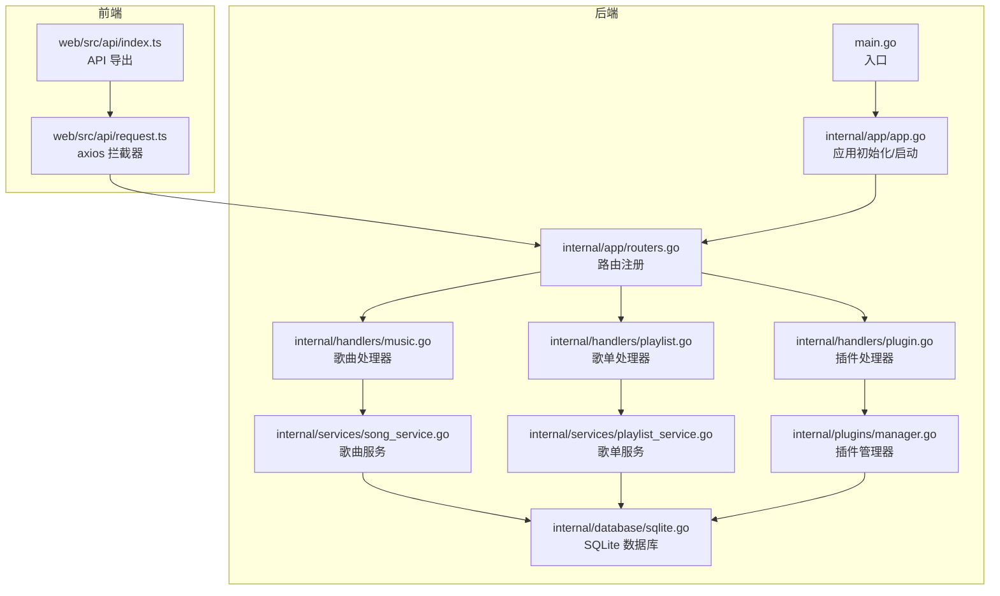
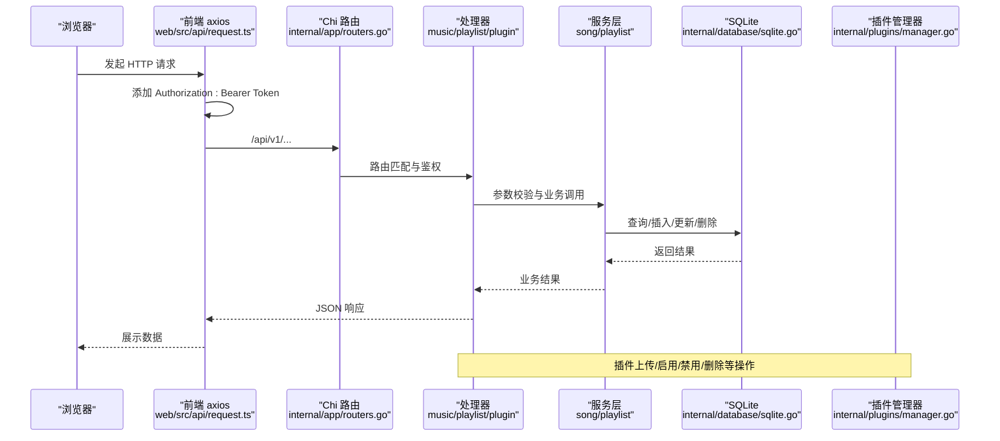
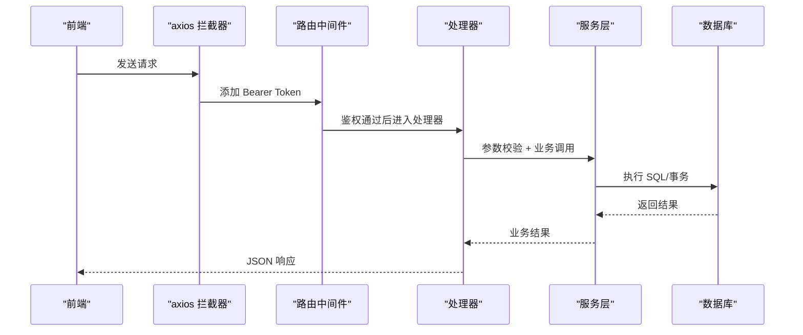
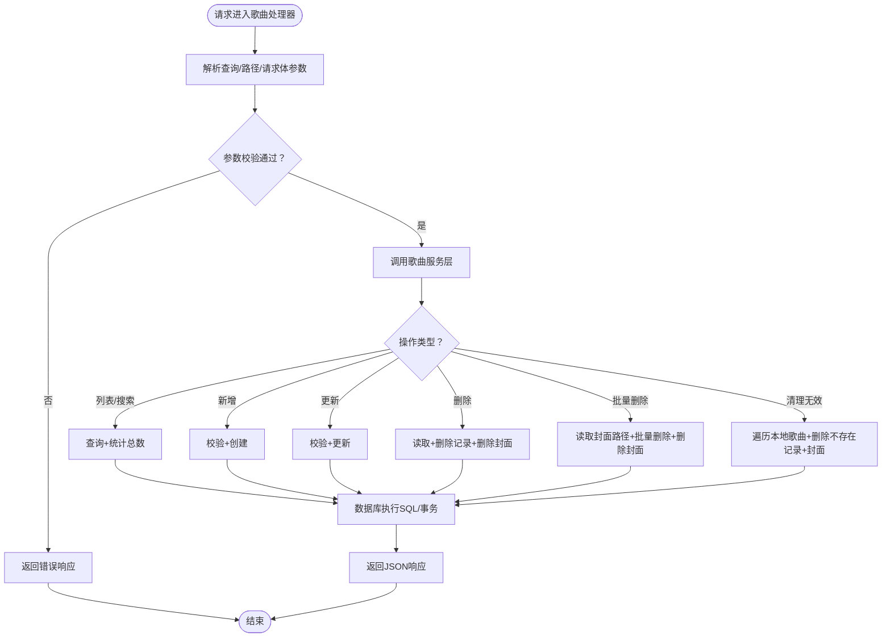
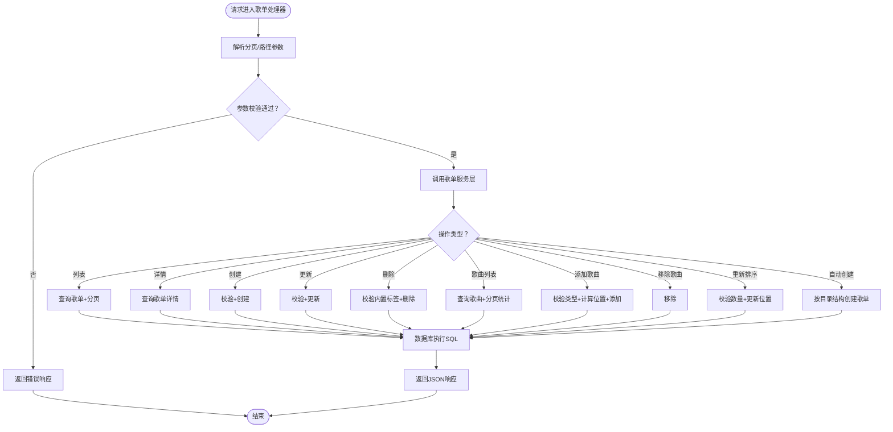
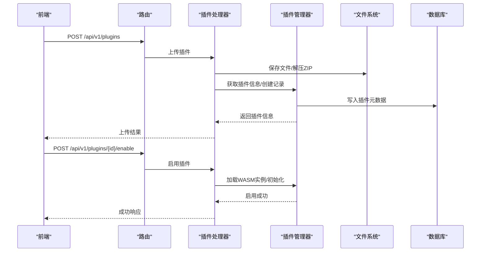
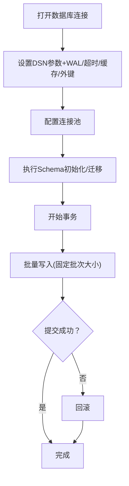
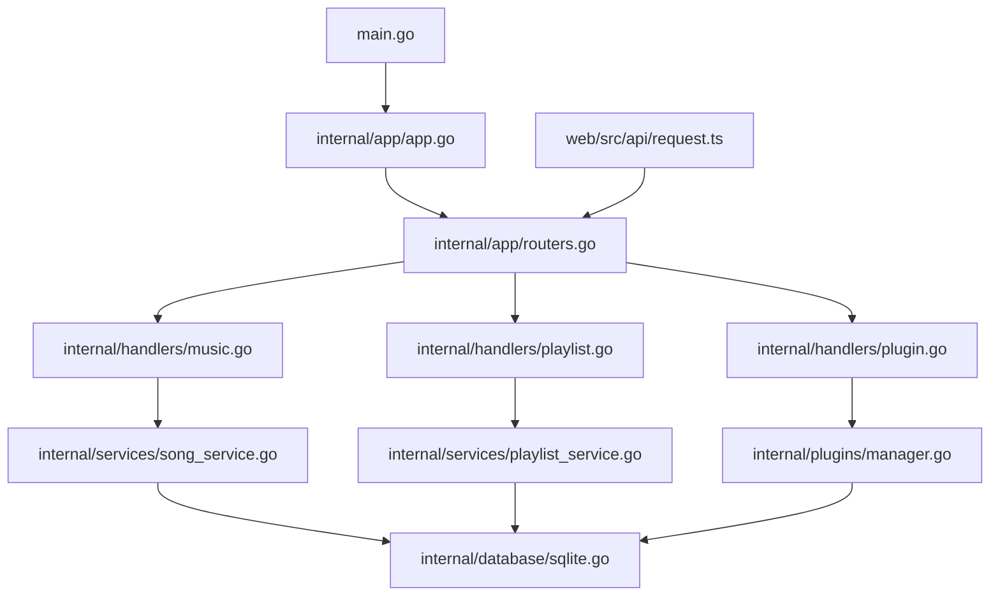

# 数据流设计

<cite>
**本文引用的文件**
- [main.go](file://main.go)
- [app.go](file://internal/app/app.go)
- [routers.go](file://internal/app/routers.go)
- [music.go](file://internal/handlers/music.go)
- [playlist.go](file://internal/handlers/playlist.go)
- [plugin.go](file://internal/handlers/plugin.go)
- [sqlite.go](file://internal/database/sqlite.go)
- [song_service.go](file://internal/services/song_service.go)
- [playlist_service.go](file://internal/services/playlist_service.go)
- [manager.go](file://internal/plugins/manager.go)
- [models.go](file://internal/models/models.go)
- [types.go](file://internal/config/types.go)
- [request.ts](file://web/src/api/request.ts)
- [index.ts](file://web/src/api/index.ts)
</cite>

## 目录
1. [简介](#简介)
2. [项目结构](#项目结构)
3. [核心组件](#核心组件)
4. [架构总览](#架构总览)
5. [详细组件分析](#详细组件分析)
6. [依赖关系分析](#依赖关系分析)
7. [性能考量](#性能考量)
8. [故障排查指南](#故障排查指南)
9. [结论](#结论)
10. [附录](#附录)

## 简介
本文件面向 MiMusic 项目的开发者与运维人员，系统性梳理从前端请求到数据库操作的完整数据流路径，覆盖 HTTP 请求处理、业务逻辑执行、数据持久化、插件系统交互、缓存策略与数据一致性保障，并提供关键流程的时序图与数据流图，帮助读者快速理解系统在各层之间的数据传递方式与控制流。

## 项目结构
MiMusic 采用典型的 Go 服务端 + Vue 前端架构：
- 后端：Go 语言实现，基于 Chi 路由框架，提供 REST API；内部包含数据库层、服务层、处理器层、插件管理器等。
- 前端：Vue 3 + Vite，通过 axios 发起请求，统一拦截器处理鉴权与错误。

图表来源
- [main.go:30-63](file://main.go#L30-L63)
- [app.go:64-227](file://internal/app/app.go#L64-L227)
- [routers.go:28-116](file://internal/app/routers.go#L28-L116)
- [music.go:29-102](file://internal/handlers/music.go#L29-L102)
- [playlist.go:27-81](file://internal/handlers/playlist.go#L27-L81)
- [plugin.go:35-57](file://internal/handlers/plugin.go#L35-L57)
- [sqlite.go:22-53](file://internal/database/sqlite.go#L22-L53)
- [song_service.go:44-82](file://internal/services/song_service.go#L44-L82)
- [playlist_service.go:23-36](file://internal/services/playlist_service.go#L23-L36)
- [manager.go:149-168](file://internal/plugins/manager.go#L149-L168)

章节来源
- [main.go:30-63](file://main.go#L30-L63)
- [app.go:64-227](file://internal/app/app.go#L64-L227)
- [routers.go:28-116](file://internal/app/routers.go#L28-L116)

## 核心组件
- 应用入口与初始化：负责解析配置、初始化数据库、服务层、插件管理器、路由注册与启动。
- 路由与中间件：统一处理跨域、压缩、日志、恢复、鉴权等。
- 处理器层：面向具体业务的 HTTP 处理器，负责参数解析、请求校验、调用服务层并返回响应。
- 服务层：封装业务规则、数据校验、事务与批处理、并发扫描与导入等。
- 数据库层：SQLite 抽象，提供事务、连接池、Schema 初始化与迁移。
- 插件管理器：WASM 插件生命周期管理、路由注册、定时器、JS 运行时、超时与健康检查。
- 前端请求：axios 统一拦截器，自动携带 Bearer Token，处理 401 刷新与重试。

章节来源
- [app.go:64-227](file://internal/app/app.go#L64-L227)
- [routers.go:136-248](file://internal/app/routers.go#L136-L248)
- [music.go:29-102](file://internal/handlers/music.go#L29-L102)
- [playlist.go:27-81](file://internal/handlers/playlist.go#L27-L81)
- [plugin.go:35-57](file://internal/handlers/plugin.go#L35-L57)
- [sqlite.go:22-53](file://internal/database/sqlite.go#L22-L53)
- [song_service.go:44-82](file://internal/services/song_service.go#L44-L82)
- [playlist_service.go:23-36](file://internal/services/playlist_service.go#L23-L36)
- [manager.go:149-168](file://internal/plugins/manager.go#L149-L168)
- [request.ts:31-103](file://web/src/api/request.ts#L31-L103)

## 架构总览
下图展示从浏览器到数据库的端到端数据流，以及鉴权、缓存与插件交互的关键节点。

图表来源
- [routers.go:40-116](file://internal/app/routers.go#L40-L116)
- [music.go:29-102](file://internal/handlers/music.go#L29-L102)
- [playlist.go:27-81](file://internal/handlers/playlist.go#L27-L81)
- [plugin.go:35-57](file://internal/handlers/plugin.go#L35-L57)
- [sqlite.go:22-53](file://internal/database/sqlite.go#L22-L53)
- [manager.go:149-168](file://internal/plugins/manager.go#L149-L168)

## 详细组件分析

### HTTP 请求处理与鉴权流程
- 前端通过 axios 发送请求，自动附加 Authorization 头。
- 路由层对 /api/v1 下的受保护接口应用鉴权中间件。
- 处理器层解析查询参数、路径参数与请求体，进行基本校验后调用服务层。
- 服务层执行业务规则与数据校验，必要时开启事务或批量写入。
- 数据库层执行 SQL 操作，返回结果给服务层，最终由处理器序列化为 JSON 响应。

图表来源
- [request.ts:31-103](file://web/src/api/request.ts#L31-L103)
- [routers.go:52-116](file://internal/app/routers.go#L52-L116)
- [music.go:43-102](file://internal/handlers/music.go#L43-L102)
- [playlist.go:40-81](file://internal/handlers/playlist.go#L40-L81)
- [sqlite.go:22-53](file://internal/database/sqlite.go#L22-L53)

章节来源
- [request.ts:31-103](file://web/src/api/request.ts#L31-L103)
- [routers.go:52-116](file://internal/app/routers.go#L52-L116)

### 歌曲管理数据流
- 列表/搜索：解析分页与过滤参数，调用服务层查询并统计总数，返回分页结果。
- 新增/更新/删除：服务层进行数据校验与业务规则判断，必要时删除封面文件；数据库层执行 CRUD。
- 批量删除：先读取待删歌曲封面路径，批量删除记录后再统一删除封面文件。
- 清理无效本地歌曲：遍历本地歌曲，检查文件是否存在，不存在则删除记录与封面。

图表来源
- [music.go:29-102](file://internal/handlers/music.go#L29-L102)
- [music.go:179-202](file://internal/handlers/music.go#L179-L202)
- [music.go:426-450](file://internal/handlers/music.go#L426-L450)
- [song_service.go:44-82](file://internal/services/song_service.go#L44-L82)
- [song_service.go:111-145](file://internal/services/song_service.go#L111-L145)
- [song_service.go:526-551](file://internal/services/song_service.go#L526-L551)

章节来源
- [music.go:29-102](file://internal/handlers/music.go#L29-L102)
- [music.go:179-202](file://internal/handlers/music.go#L179-L202)
- [music.go:426-450](file://internal/handlers/music.go#L426-L450)
- [song_service.go:44-82](file://internal/services/song_service.go#L44-L82)
- [song_service.go:111-145](file://internal/services/song_service.go#L111-L145)
- [song_service.go:526-551](file://internal/services/song_service.go#L526-L551)

### 歌单管理数据流
- 列表/详情：解析分页与过滤参数，调用服务层查询歌单与歌曲，支持分页统计。
- 创建/更新/删除：服务层进行数据校验与类型约束检查；删除内置歌单会拒绝。
- 歌单内歌曲：支持添加/移除/重新排序；添加时检查类型约束并计算位置。
- 自动创建歌单：根据目录结构批量创建歌单并统计歌曲数量。

图表来源
- [playlist.go:27-81](file://internal/handlers/playlist.go#L27-L81)
- [playlist.go:114-181](file://internal/handlers/playlist.go#L114-L181)
- [playlist.go:246-309](file://internal/handlers/playlist.go#L246-L309)
- [playlist.go:311-400](file://internal/handlers/playlist.go#L311-L400)
- [playlist.go:401-441](file://internal/handlers/playlist.go#L401-L441)
- [playlist.go:443-473](file://internal/handlers/playlist.go#L443-L473)
- [playlist_service.go:23-36](file://internal/services/playlist_service.go#L23-L36)
- [playlist_service.go:71-92](file://internal/services/playlist_service.go#L71-L92)
- [playlist_service.go:104-137](file://internal/services/playlist_service.go#L104-L137)
- [playlist_service.go:151-158](file://internal/services/playlist_service.go#L151-L158)
- [playlist_service.go:180-201](file://internal/services/playlist_service.go#L180-L201)
- [playlist_service.go:203-212](file://internal/services/playlist_service.go#L203-L212)

章节来源
- [playlist.go:27-81](file://internal/handlers/playlist.go#L27-L81)
- [playlist.go:114-181](file://internal/handlers/playlist.go#L114-L181)
- [playlist.go:246-309](file://internal/handlers/playlist.go#L246-L309)
- [playlist.go:311-400](file://internal/handlers/playlist.go#L311-L400)
- [playlist.go:401-441](file://internal/handlers/playlist.go#L401-L441)
- [playlist.go:443-473](file://internal/handlers/playlist.go#L443-L473)
- [playlist_service.go:23-36](file://internal/services/playlist_service.go#L23-L36)
- [playlist_service.go:71-92](file://internal/services/playlist_service.go#L71-L92)
- [playlist_service.go:104-137](file://internal/services/playlist_service.go#L104-L137)
- [playlist_service.go:151-158](file://internal/services/playlist_service.go#L151-L158)
- [playlist_service.go:180-201](file://internal/services/playlist_service.go#L180-L201)
- [playlist_service.go:203-212](file://internal/services/playlist_service.go#L203-L212)

### 插件系统数据交互
- 插件上传：支持单个 .wasm 文件或 .zip 压缩包批量导入；解压后递归查找 .wasm 文件并逐一导入。
- 插件启用/禁用/删除：管理器维护插件实例（WASM），带超时保护与健康检查；禁用不健康插件并回滚状态。
- 插件路由注册：通过 HostFunctions 将插件注册到宿主路由树，实现插件与宿主系统的数据交换。
- 插件 JWT：宿主为插件生成专用 JWT Token，用于插件内部调用宿主 API。

图表来源
- [plugin.go:92-134](file://internal/handlers/plugin.go#L92-L134)
- [plugin.go:136-217](file://internal/handlers/plugin.go#L136-L217)
- [plugin.go:219-289](file://internal/handlers/plugin.go#L219-L289)
- [manager.go:149-168](file://internal/plugins/manager.go#L149-L168)
- [manager.go:203-225](file://internal/plugins/manager.go#L203-L225)
- [manager.go:379-401](file://internal/plugins/manager.go#L379-L401)
- [manager.go:500-523](file://internal/plugins/manager.go#L500-L523)

章节来源
- [plugin.go:92-134](file://internal/handlers/plugin.go#L92-L134)
- [plugin.go:136-217](file://internal/handlers/plugin.go#L136-L217)
- [plugin.go:219-289](file://internal/handlers/plugin.go#L219-L289)
- [manager.go:149-168](file://internal/plugins/manager.go#L149-L168)
- [manager.go:203-225](file://internal/plugins/manager.go#L203-L225)
- [manager.go:379-401](file://internal/plugins/manager.go#L379-L401)
- [manager.go:500-523](file://internal/plugins/manager.go#L500-L523)

### 数据持久化与事务
- SQLite 连接配置：启用 WAL 模式、busy_timeout、synchronous、cache_size、外键约束，设置连接池参数。
- 事务与批处理：服务层在批量导入时开启事务，批量提交以减少磁盘 IO 与锁竞争。
- 扫描与导入：并发提取元数据 + 流式批量写入，提升大规模扫描效率。

图表来源
- [sqlite.go:22-53](file://internal/database/sqlite.go#L22-L53)
- [song_service.go:378-485](file://internal/services/song_service.go#L378-L485)

章节来源
- [sqlite.go:22-53](file://internal/database/sqlite.go#L22-L53)
- [song_service.go:378-485](file://internal/services/song_service.go#L378-L485)

### 缓存策略与数据一致性
- 前端缓存：歌曲封面图片响应设置了较长的缓存时间，降低重复请求与带宽消耗。
- 服务器端缓存：未见显式的内存缓存层；通过数据库连接池与 WAL 模式优化并发读写。
- 数据一致性：事务与批处理保证批量导入的一致性；扫描过程中支持取消与进度跟踪，避免长时间锁持有。

章节来源
- [music.go:419-424](file://internal/handlers/music.go#L419-L424)
- [sqlite.go:22-53](file://internal/database/sqlite.go#L22-L53)
- [song_service.go:215-376](file://internal/services/song_service.go#L215-L376)

### 数据安全与隐私保护
- 鉴权：所有受保护接口均需 Bearer Token；前端拦截器自动附加 Authorization 头。
- CORS：严格控制来源白名单，支持 localhost/127.0.0.1、局域网段与特定域名。
- 压缩：启用 gzip 压缩，减少传输体积，间接降低敏感数据在网络中的暴露时间窗口。
- 插件安全：WASM 实例隔离、超时保护、健康检查与自动禁用，防止插件异常影响宿主稳定性。

章节来源
- [request.ts:31-103](file://web/src/api/request.ts#L31-L103)
- [routers.go:177-236](file://internal/app/routers.go#L177-L236)
- [manager.go:26-32](file://internal/plugins/manager.go#L26-L32)

## 依赖关系分析

图表来源
- [main.go:30-63](file://main.go#L30-L63)
- [app.go:64-227](file://internal/app/app.go#L64-L227)
- [routers.go:28-116](file://internal/app/routers.go#L28-L116)
- [music.go:29-102](file://internal/handlers/music.go#L29-L102)
- [playlist.go:27-81](file://internal/handlers/playlist.go#L27-L81)
- [plugin.go:35-57](file://internal/handlers/plugin.go#L35-L57)
- [sqlite.go:22-53](file://internal/database/sqlite.go#L22-L53)
- [song_service.go:44-82](file://internal/services/song_service.go#L44-L82)
- [playlist_service.go:23-36](file://internal/services/playlist_service.go#L23-L36)
- [manager.go:149-168](file://internal/plugins/manager.go#L149-L168)
- [request.ts:31-103](file://web/src/api/request.ts#L31-L103)

章节来源
- [main.go:30-63](file://main.go#L30-L63)
- [app.go:64-227](file://internal/app/app.go#L64-L227)
- [routers.go:28-116](file://internal/app/routers.go#L28-L116)

## 性能考量
- 数据库优化：WAL 模式提升并发读性能；合理设置 busy_timeout 与 synchronous；连接池大小适中避免写锁竞争。
- 扫描与导入：并发元数据提取 + 批量事务写入，显著降低大规模扫描耗时。
- 前端缓存：封面图片设置长期缓存，减少重复请求。
- 压缩：gzip 压缩静态资源与 JSON，降低带宽占用。

章节来源
- [sqlite.go:22-53](file://internal/database/sqlite.go#L22-L53)
- [song_service.go:215-376](file://internal/services/song_service.go#L215-L376)
- [music.go:419-424](file://internal/handlers/music.go#L419-L424)
- [routers.go:137-148](file://internal/app/routers.go#L137-L148)

## 故障排查指南
- 401 未授权：前端拦截器自动尝试刷新 Token，若失败则清空登录状态并跳转登录页。
- 插件超时/异常：管理器检测到超时会自动禁用插件并回滚状态，避免影响宿主稳定性。
- 数据库连接失败：检查 DSN 参数、WAL 模式与外键约束；确认数据库文件路径与权限。
- 扫描卡住：通过取消接口终止扫描，查看进度与错误日志。

章节来源
- [request.ts:66-103](file://web/src/api/request.ts#L66-L103)
- [manager.go:137-147](file://internal/plugins/manager.go#L137-L147)
- [sqlite.go:22-53](file://internal/database/sqlite.go#L22-L53)

## 结论
MiMusic 的数据流设计遵循清晰的分层架构：前端通过 axios 统一发起请求，Chi 路由与中间件负责鉴权与跨域，处理器层进行参数解析与校验，服务层承载业务规则与事务批处理，数据库层提供高性能的 SQLite 存储。插件系统通过 WASM 实现与宿主的安全隔离与高效交互。整体方案在性能、可维护性与安全性之间取得良好平衡。

## 附录
- 配置结构：应用配置包含端口、数据库路径、管理员用户名与密码。
- 模型定义：涵盖歌曲、歌单、插件、配置、令牌等核心实体及其校验规则。

章节来源
- [types.go:3-9](file://internal/config/types.go#L3-L9)
- [models.go:64-174](file://internal/models/models.go#L64-L174)
- [models.go:218-242](file://internal/models/models.go#L218-L242)
- [models.go:199-216](file://internal/models/models.go#L199-L216)