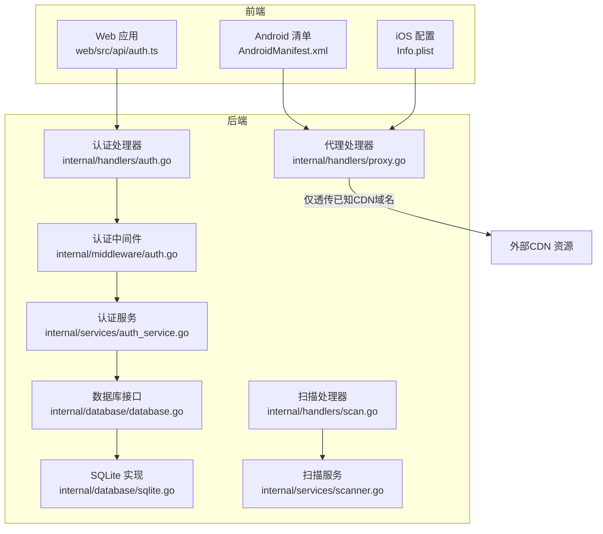
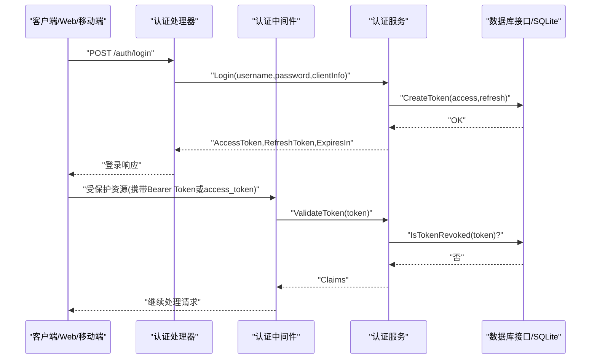
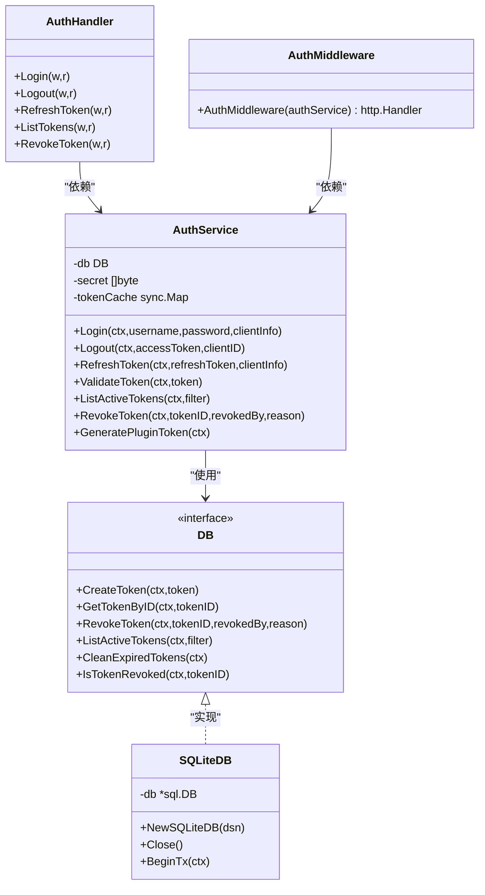
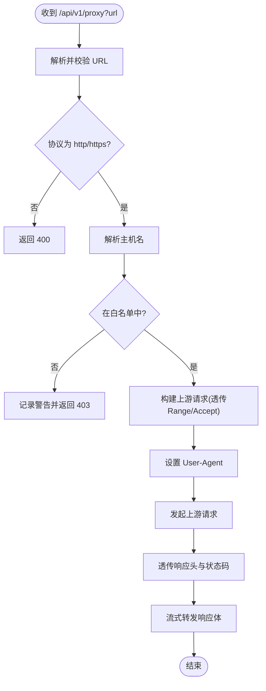
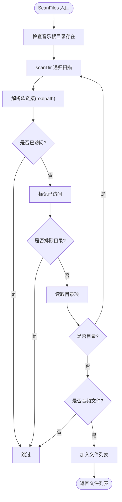
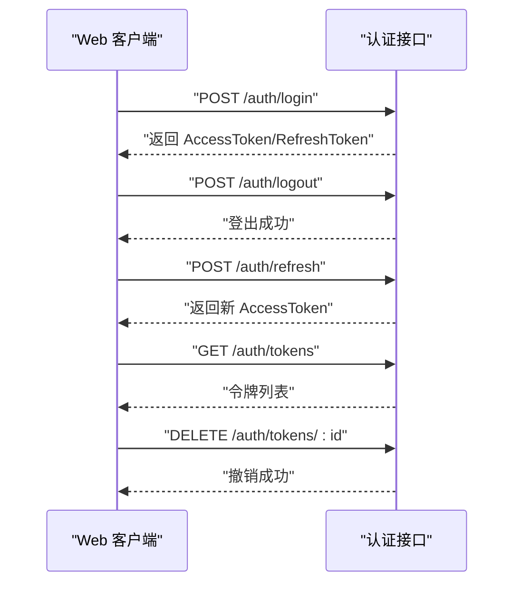
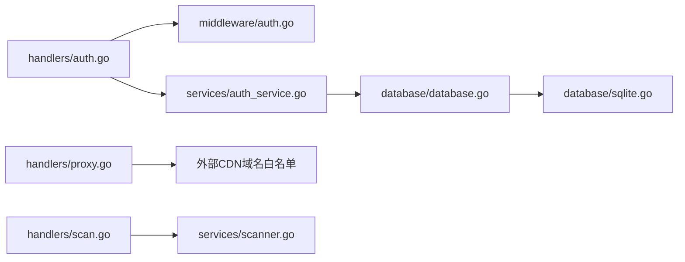

# 安全审计与合规

<cite>
**本文引用的文件**
- [security.yml](file://.github/workflows/security.yml)
- [auth.go](file://internal/handlers/auth.go)
- [auth.go](file://internal/middleware/auth.go)
- [auth_service.go](file://internal/services/auth_service.go)
- [database.go](file://internal/database/database.go)
- [sqlite.go](file://internal/database/sqlite.go)
- [models.go](file://internal/models/models.go)
- [proxy.go](file://internal/handlers/proxy.go)
- [scan.go](file://internal/handlers/scan.go)
- [scanner.go](file://internal/services/scanner.go)
- [auth.ts](file://web/src/api/auth.ts)
- [AndroidManifest.xml](file://frontend/android/app/src/main/AndroidManifest.xml)
- [Info.plist](file://frontend/ios/Runner/Info.plist)
- [health.go](file://internal/handlers/health.go)
</cite>

## 目录
1. [引言](#引言)
2. [项目结构](#项目结构)
3. [核心组件](#核心组件)
4. [架构总览](#架构总览)
5. [详细组件分析](#详细组件分析)
6. [依赖关系分析](#依赖关系分析)
7. [性能考量](#性能考量)
8. [故障排查指南](#故障排查指南)
9. [结论](#结论)
10. [附录](#附录)

## 引言
本实施指南面向 MiMusic 的安全审计与合规性检查，围绕以下目标展开：
- 安全漏洞扫描流程：静态代码分析、依赖项安全检查、运行时漏洞检测与渗透测试计划
- 安全日志分析机制：访问日志记录、异常行为检测、安全事件关联分析与日志保留策略
- 合规性要求：数据保护法规遵循、隐私政策实施、用户同意管理与数据主体权利保障
- 安全事件响应流程：事件分类、应急响应团队、影响评估与恢复计划
- 定期安全评估、第三方安全审计与安全培训的实施方案

## 项目结构
MiMusic 采用前后端分离与模块化设计，后端以 Go 语言实现，前端包含 Web、iOS、Android 等多端入口。安全相关的关键位置包括：
- 后端安全与认证：认证处理器、认证中间件、认证服务、数据库接口与 SQLite 实现
- 前端接入与平台配置：Web API 客户端、Android/iOS 平台清单与网络配置
- 运行时安全：代理处理器（资源代理与域名白名单）、扫描器（本地文件扫描）

**图示来源**
- [auth.go:1-254](file://internal/handlers/auth.go#L1-L254)
- [auth.go:1-52](file://internal/middleware/auth.go#L1-L52)
- [auth_service.go:1-461](file://internal/services/auth_service.go#L1-L461)
- [database.go:1-118](file://internal/database/database.go#L1-L118)
- [sqlite.go:1-80](file://internal/database/sqlite.go#L1-L80)
- [proxy.go:1-192](file://internal/handlers/proxy.go#L1-L192)
- [scan.go:1-94](file://internal/handlers/scan.go#L1-L94)
- [scanner.go:1-177](file://internal/services/scanner.go#L1-L177)
- [auth.ts:1-45](file://web/src/api/auth.ts#L1-L45)
- [AndroidManifest.xml:1-80](file://frontend/android/app/src/main/AndroidManifest.xml#L1-L80)
- [Info.plist:1-80](file://frontend/ios/Runner/Info.plist#L1-L80)

**章节来源**
- [auth.go:1-254](file://internal/handlers/auth.go#L1-L254)
- [auth.go:1-52](file://internal/middleware/auth.go#L1-L52)
- [auth_service.go:1-461](file://internal/services/auth_service.go#L1-L461)
- [database.go:1-118](file://internal/database/database.go#L1-L118)
- [sqlite.go:1-80](file://internal/database/sqlite.go#L1-L80)
- [proxy.go:1-192](file://internal/handlers/proxy.go#L1-L192)
- [scan.go:1-94](file://internal/handlers/scan.go#L1-L94)
- [scanner.go:1-177](file://internal/services/scanner.go#L1-L177)
- [auth.ts:1-45](file://web/src/api/auth.ts#L1-L45)
- [AndroidManifest.xml:1-80](file://frontend/android/app/src/main/AndroidManifest.xml#L1-L80)
- [Info.plist:1-80](file://frontend/ios/Runner/Info.plist#L1-L80)

## 核心组件
- 认证与令牌管理：基于 JWT 的登录、刷新、登出与令牌撤销，支持内存缓存与数据库持久化
- 认证中间件：统一从 Authorization 头或 URL 查询参数提取并验证令牌
- 数据库层：抽象接口与 SQLite 实现，提供令牌持久化与清理能力
- 资源代理：仅允许已知音乐类 CDN 域名，防止开放代理滥用
- 本地扫描：递归扫描本地音乐目录，支持排除目录与格式过滤
- 健康检查：基础可用性探针

**章节来源**
- [auth.go:1-254](file://internal/handlers/auth.go#L1-L254)
- [auth.go:1-52](file://internal/middleware/auth.go#L1-L52)
- [auth_service.go:1-461](file://internal/services/auth_service.go#L1-L461)
- [database.go:1-118](file://internal/database/database.go#L1-L118)
- [sqlite.go:1-80](file://internal/database/sqlite.go#L1-L80)
- [proxy.go:1-192](file://internal/handlers/proxy.go#L1-L192)
- [scan.go:1-94](file://internal/handlers/scan.go#L1-L94)
- [scanner.go:1-177](file://internal/services/scanner.go#L1-L177)
- [health.go:1-28](file://internal/handlers/health.go#L1-L28)

## 架构总览
下图展示安全相关组件之间的交互关系与数据流向。

**图示来源**
- [auth.go:27-134](file://internal/handlers/auth.go#L27-L134)
- [auth.go:12-51](file://internal/middleware/auth.go#L12-L51)
- [auth_service.go:94-164](file://internal/services/auth_service.go#L94-L164)
- [database.go:46-52](file://internal/database/database.go#L46-L52)
- [sqlite.go:22-53](file://internal/database/sqlite.go#L22-L53)

## 详细组件分析

### 组件一：认证与令牌管理
- 登录：生成访问令牌与刷新令牌，记录客户端信息，清理过期令牌
- 刷新：验证刷新令牌有效性，撤销旧令牌并发放新令牌
- 登出：撤销访问令牌及同客户端下的刷新令牌，并清理缓存
- 令牌撤销：按令牌 ID 撤销并同步缓存
- 中间件：优先从 Authorization 头提取 Bearer Token，其次从 URL 查询参数 access_token；验证失败直接返回未授权
- 令牌缓存：内存缓存提升验证性能，定时清理过期条目；插件系统专用永久令牌不持久化

**图示来源**
- [auth.go:15-254](file://internal/handlers/auth.go#L15-L254)
- [auth.go:11-51](file://internal/middleware/auth.go#L11-L51)
- [auth_service.go:24-461](file://internal/services/auth_service.go#L24-L461)
- [database.go:8-76](file://internal/database/database.go#L8-L76)
- [sqlite.go:12-80](file://internal/database/sqlite.go#L12-L80)

**章节来源**
- [auth.go:27-236](file://internal/handlers/auth.go#L27-L236)
- [auth.go:12-51](file://internal/middleware/auth.go#L12-L51)
- [auth_service.go:94-423](file://internal/services/auth_service.go#L94-L423)
- [database.go:46-52](file://internal/database/database.go#L46-L52)
- [sqlite.go:22-53](file://internal/database/sqlite.go#L22-L53)
- [models.go:368-402](file://internal/models/models.go#L368-L402)

### 组件二：资源代理与访问控制
- 仅允许已知音乐类 CDN 域名（如 QQ 音乐、网易云音乐、小米音乐等）进行代理
- 透传 Range 请求头以支持音频播放 seek
- 透传关键响应头并设置图片资源缓存策略
- 对非白名单域名拒绝代理请求并在日志中记录警告

**图示来源**
- [proxy.go:72-145](file://internal/handlers/proxy.go#L72-L145)

**章节来源**
- [proxy.go:37-192](file://internal/handlers/proxy.go#L37-L192)

### 组件三：本地音乐扫描与文件访问
- 递归扫描音乐目录，解析软链接并防止循环
- 支持排除目录与音频格式过滤
- 提供扫描进度查询与取消能力

**图示来源**
- [scanner.go:30-151](file://internal/services/scanner.go#L30-L151)

**章节来源**
- [scan.go:27-94](file://internal/handlers/scan.go#L27-L94)
- [scanner.go:30-177](file://internal/services/scanner.go#L30-L177)

### 组件四：前端接入与平台安全配置
- Web 端通过 API 客户端调用认证接口，支持登录、登出、刷新令牌、令牌列表与撤销
- Android 清单启用网络权限与前台服务权限，配置网络明文流量开关
- iOS Info.plist 允许任意网络加载，便于开发调试；生产部署建议收紧 ATS 策略

**图示来源**
- [auth.ts:12-44](file://web/src/api/auth.ts#L12-L44)
- [auth.go:27-236](file://internal/handlers/auth.go#L27-L236)

**章节来源**
- [auth.ts:1-45](file://web/src/api/auth.ts#L1-L45)
- [AndroidManifest.xml:6-18](file://frontend/android/app/src/main/AndroidManifest.xml#L6-L18)
- [Info.plist:29-33](file://frontend/ios/Runner/Info.plist#L29-L33)

## 依赖关系分析
- 认证链路：Handlers -> Middleware -> Services -> DB 接口 -> SQLite 实现
- 代理链路：Handlers -> 外部 CDN（白名单域名）
- 扫描链路：Handlers -> Services -> 文件系统

**图示来源**
- [auth.go:1-254](file://internal/handlers/auth.go#L1-L254)
- [auth.go:1-52](file://internal/middleware/auth.go#L1-L52)
- [auth_service.go:1-461](file://internal/services/auth_service.go#L1-L461)
- [database.go:1-118](file://internal/database/database.go#L1-L118)
- [sqlite.go:1-80](file://internal/database/sqlite.go#L1-L80)
- [proxy.go:1-192](file://internal/handlers/proxy.go#L1-L192)
- [scan.go:1-94](file://internal/handlers/scan.go#L1-L94)
- [scanner.go:1-177](file://internal/services/scanner.go#L1-L177)

**章节来源**
- [auth.go:1-254](file://internal/handlers/auth.go#L1-L254)
- [auth.go:1-52](file://internal/middleware/auth.go#L1-L52)
- [auth_service.go:1-461](file://internal/services/auth_service.go#L1-L461)
- [database.go:1-118](file://internal/database/database.go#L1-L118)
- [sqlite.go:1-80](file://internal/database/sqlite.go#L1-L80)
- [proxy.go:1-192](file://internal/handlers/proxy.go#L1-L192)
- [scan.go:1-94](file://internal/handlers/scan.go#L1-L94)
- [scanner.go:1-177](file://internal/services/scanner.go#L1-L177)

## 性能考量
- 认证缓存：内存缓存提升令牌验证吞吐，定时清理降低内存占用
- 数据库优化：WAL 模式、连接池与超时配置提升并发与稳定性
- 代理性能：流式转发与关键响应头透传，避免不必要的复制与转换
- 扫描性能：软链接解析与循环防护、按格式过滤减少无效 I/O

[本节为通用指导，无需具体文件来源]

## 故障排查指南
- 认证失败
  - 检查中间件是否正确提取 Token（Authorization 头或 URL 查询参数）
  - 核对服务端是否返回“无效的 token”或“缺少认证信息”
  - 确认数据库中令牌未被撤销且未过期
- 代理被拒绝
  - 确认目标域名在白名单中（精确匹配或子域名匹配）
  - 检查日志中是否有“域名不在白名单中”的警告
- 扫描异常
  - 检查音乐目录是否存在与权限
  - 确认排除目录与格式配置正确
  - 如扫描卡住，尝试取消并重试

**章节来源**
- [auth.go:12-51](file://internal/middleware/auth.go#L12-L51)
- [auth_service.go:326-371](file://internal/services/auth_service.go#L326-L371)
- [proxy.go:100-106](file://internal/handlers/proxy.go#L100-L106)
- [scan.go:39-94](file://internal/handlers/scan.go#L39-L94)

## 结论
本指南梳理了 MiMusic 的安全与合规关键点：认证与令牌管理、资源代理白名单、本地扫描与文件访问、以及前端平台配置。结合现有工作流与代码实现，建议在现有基础上补充运行时日志采集与分析、渗透测试与第三方审计，并完善隐私政策与用户同意流程，以满足持续演进的安全与合规需求。

[本节为总结性内容，无需具体文件来源]

## 附录

### 安全漏洞扫描流程实施要点
- 静态代码分析
  - 使用 GitHub Actions 中的 Gosec 与 govulncheck，确保每次提交与 PR 触发
  - 结合代码质量规则与依赖漏洞扫描，输出 SARIF 报告并上传至平台
- 依赖项安全检查
  - 使用依赖审查动作，仅在拉取请求场景启用，阻止高危依赖引入
- 运行时漏洞检测
  - 在代理层增加更细粒度的访问日志与异常检测（见下一节）
- 渗透测试计划
  - 制定范围：认证接口、代理接口、扫描接口、配置接口
  - 方法：黑盒/灰盒测试、令牌绕过、CORS/代理滥用、目录遍历与越权
  - 频率：上线前、重大变更后、季度回归

**章节来源**
- [.github/workflows/security.yml:1-70](file://.github/workflows/security.yml#L1-L70)

### 安全日志分析机制
- 访问日志记录
  - 认证接口：记录登录、刷新、登出、令牌列表与撤销的请求与响应摘要
  - 代理接口：记录被拒绝的域名、上游请求失败与状态码
  - 扫描接口：记录扫描启动、进度、取消与错误
- 异常行为检测
  - 高频失败登录、短时间大量登出、频繁撤销令牌
  - 代理请求异常（非白名单域名、异常 User-Agent）
- 安全事件关联分析
  - 将认证失败与代理拒绝、扫描异常进行时间窗口关联
  - 识别批量失败与跨接口联动攻击模式
- 日志保留策略
  - 认证与代理日志保留 90 天，扫描日志保留 30 天
  - 日志脱敏：隐藏令牌、敏感参数与用户标识

[本节为通用指导，无需具体文件来源]

### 合规性要求
- 数据保护法规遵循
  - 明确最小化收集原则，仅存储必要的令牌与客户端信息
  - 提供数据删除与导出能力（参考令牌列表与撤销接口）
- 隐私政策实施
  - 在前端与平台入口明确隐私政策链接与数据用途
- 用户同意管理
  - 对代理外部资源的行为进行最小必要提示
- 数据主体权利保障
  - 提供令牌撤销与历史记录查询，支持用户主动控制

**章节来源**
- [auth.go:136-236](file://internal/handlers/auth.go#L136-L236)
- [auth_service.go:373-386](file://internal/services/auth_service.go#L373-L386)

### 安全事件响应流程
- 事件分类
  - 低风险：代理被拒绝、扫描冲突
  - 中风险：认证失败、令牌异常撤销
  - 高风险：代理滥用、大规模认证失败
- 应急响应团队
  - 开发、运维与安全联络人职责分工
- 影响评估
  - 评估范围：受影响用户数、数据暴露面、业务中断时长
- 恢复计划
  - 临时封禁策略（如临时收紧代理白名单）、回滚与修复发布

[本节为通用指导，无需具体文件来源]

### 定期安全评估与培训
- 定期安全评估
  - 每季度执行静态与动态扫描，结合渗透测试
- 第三方安全审计
  - 年度外部审计，覆盖认证、代理、扫描与前端平台
- 安全培训
  - 开发与运维人员的安全意识与最佳实践培训

[本节为通用指导，无需具体文件来源]