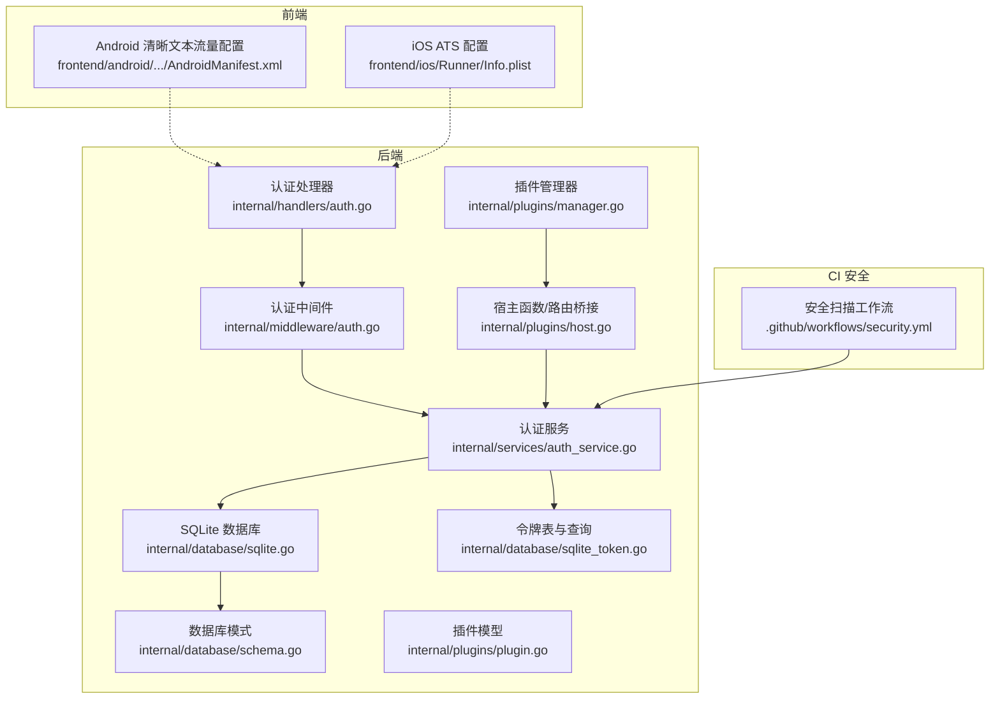
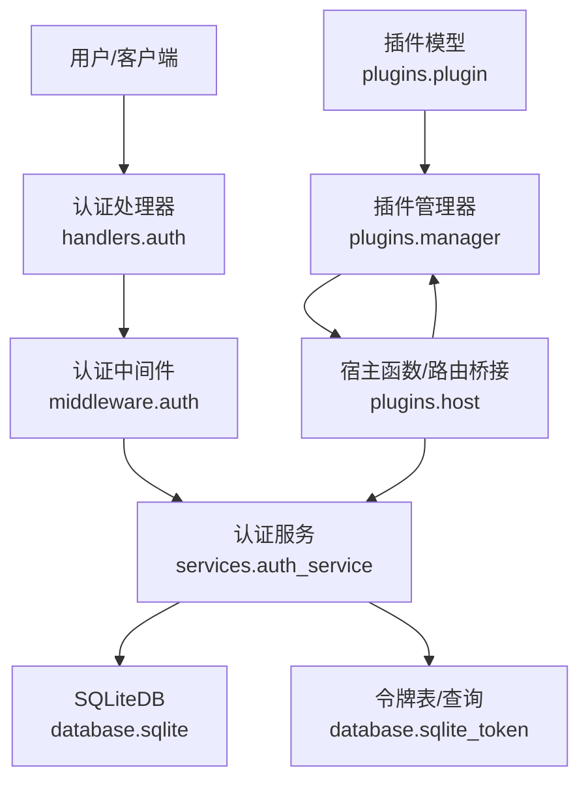
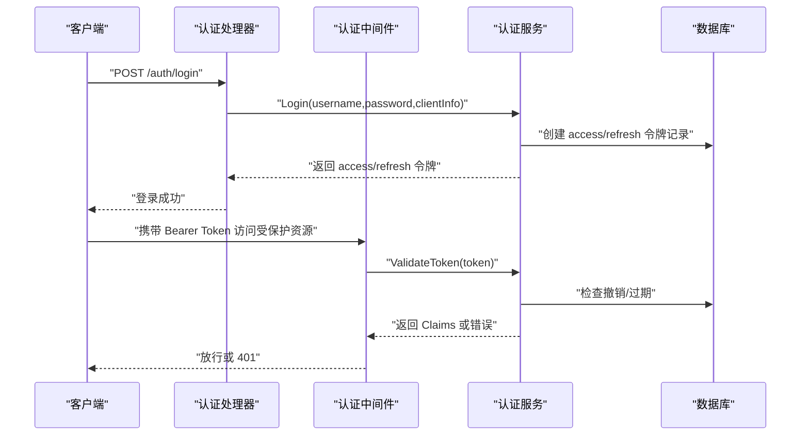
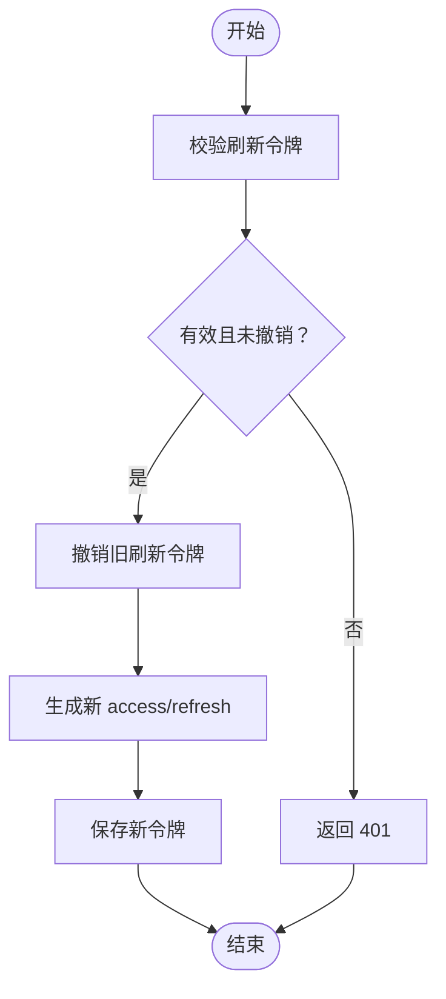
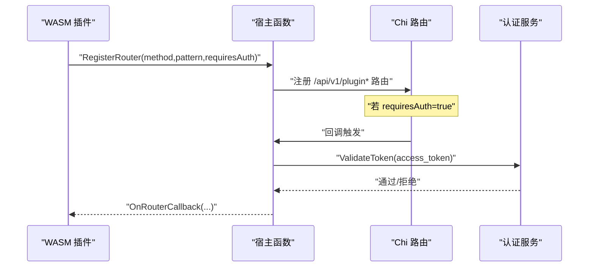
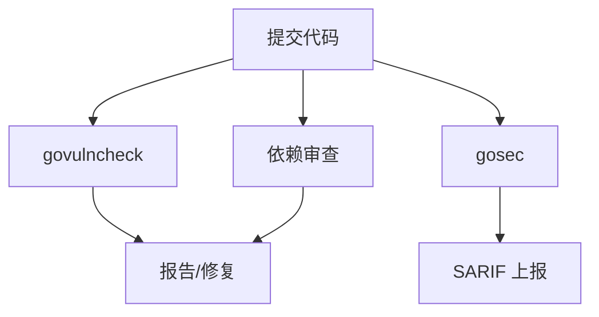
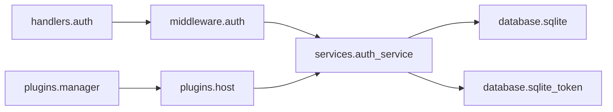

# 安全考虑

<cite>
**本文引用的文件**
- [internal/handlers/auth.go](file://internal/handlers/auth.go)
- [internal/middleware/auth.go](file://internal/middleware/auth.go)
- [internal/services/auth_service.go](file://internal/services/auth_service.go)
- [internal/database/sqlite.go](file://internal/database/sqlite.go)
- [internal/database/sqlite_token.go](file://internal/database/sqlite_token.go)
- [internal/database/schema.go](file://internal/database/schema.go)
- [internal/plugins/manager.go](file://internal/plugins/manager.go)
- [internal/plugins/host.go](file://internal/plugins/host.go)
- [internal/plugins/plugin.go](file://internal/plugins/plugin.go)
- [frontend/android/app/src/main/AndroidManifest.xml](file://frontend/android/app/src/main/AndroidManifest.xml)
- [frontend/ios/Runner/Info.plist](file://frontend/ios/Runner/Info.plist)
- [.github/workflows/security.yml](file://.github/workflows/security.yml)
- [internal/models/models.go](file://internal/models/models.go)
</cite>

## 目录
1. [简介](#简介)
2. [项目结构](#项目结构)
3. [核心组件](#核心组件)
4. [架构总览](#架构总览)
5. [详细组件分析](#详细组件分析)
6. [依赖分析](#依赖分析)
7. [性能与安全权衡](#性能与安全权衡)
8. [故障排查指南](#故障排查指南)
9. [结论](#结论)
10. [附录](#附录)

## 简介
本指南面向 MiMusic 的安全设计与落地实践，围绕认证与会话、数据与传输、网络安全、插件沙箱与权限、安全审计与合规、事件响应与更新管理等方面，结合代码库现状进行系统化梳理与建议。文档同时提供可视化图示帮助理解关键流程，并给出可操作的最佳实践。

## 项目结构
从安全视角看，MiMusic 的后端采用 Go 语言实现，前端包含 Android/iOS 应用与 Web 前端。认证与会话、数据库与令牌存储、插件系统（WASM）与宿主交互、以及 CI 安全扫描工作流构成了安全基座。

**图表来源**
- [internal/handlers/auth.go:1-254](file://internal/handlers/auth.go#L1-L254)
- [internal/middleware/auth.go:1-52](file://internal/middleware/auth.go#L1-L52)
- [internal/services/auth_service.go:1-461](file://internal/services/auth_service.go#L1-L461)
- [internal/database/sqlite.go:1-80](file://internal/database/sqlite.go#L1-L80)
- [internal/database/sqlite_token.go:1-203](file://internal/database/sqlite_token.go#L1-L203)
- [internal/database/schema.go:1-149](file://internal/database/schema.go#L1-L149)
- [internal/plugins/manager.go:1-586](file://internal/plugins/manager.go#L1-L586)
- [internal/plugins/host.go:1-597](file://internal/plugins/host.go#L1-L597)
- [internal/plugins/plugin.go:1-51](file://internal/plugins/plugin.go#L1-L51)
- [frontend/android/app/src/main/AndroidManifest.xml:1-80](file://frontend/android/app/src/main/AndroidManifest.xml#L1-L80)
- [frontend/ios/Runner/Info.plist:1-80](file://frontend/ios/Runner/Info.plist#L1-L80)
- [.github/workflows/security.yml:1-70](file://.github/workflows/security.yml#L1-L70)

**章节来源**
- [internal/handlers/auth.go:1-254](file://internal/handlers/auth.go#L1-L254)
- [internal/middleware/auth.go:1-52](file://internal/middleware/auth.go#L1-L52)
- [internal/services/auth_service.go:1-461](file://internal/services/auth_service.go#L1-L461)
- [internal/database/sqlite.go:1-80](file://internal/database/sqlite.go#L1-L80)
- [internal/database/sqlite_token.go:1-203](file://internal/database/sqlite_token.go#L1-L203)
- [internal/database/schema.go:1-149](file://internal/database/schema.go#L1-L149)
- [internal/plugins/manager.go:1-586](file://internal/plugins/manager.go#L1-L586)
- [internal/plugins/host.go:1-597](file://internal/plugins/host.go#L1-L597)
- [internal/plugins/plugin.go:1-51](file://internal/plugins/plugin.go#L1-L51)
- [frontend/android/app/src/main/AndroidManifest.xml:1-80](file://frontend/android/app/src/main/AndroidManifest.xml#L1-L80)
- [frontend/ios/Runner/Info.plist:1-80](file://frontend/ios/Runner/Info.plist#L1-L80)
- [.github/workflows/security.yml:1-70](file://.github/workflows/security.yml#L1-L70)

## 核心组件
- 认证与会话
  - 基于 JWT 的双 Token 机制：访问令牌（Access Token）与刷新令牌（Refresh Token），分别用于短期访问与长期续期。
  - 中间件负责提取与校验令牌，支持从 Authorization 头或 URL 查询参数（用于静态资源场景）。
  - 令牌撤销与过期清理：数据库记录撤销状态与过期时间，服务层缓存加速校验并定期清理。
- 数据与传输
  - SQLite 数据库存储令牌与配置，WAL 模式提升并发读写性能；索引覆盖常用查询。
  - JWT 密钥在首次启动时初始化，确保密钥持久化与跨进程一致性。
- 插件系统
  - WASM 插件在独立运行时中执行，宿主通过沙箱注入 HTTP 库与路由桥接，严格超时控制与实例健康检查。
  - 插件通过专用 JWT Token 访问宿主 API，避免暴露用户态令牌。
- 前端与网络
  - Android 明确允许明文流量（cleartextTraffic），iOS ATS 允许任意加载，需结合部署环境评估风险。
- 安全审计
  - GitHub Actions 提供漏洞扫描、安全扫描与依赖审查工作流，输出 SARIF 报告。

**章节来源**
- [internal/services/auth_service.go:1-461](file://internal/services/auth_service.go#L1-L461)
- [internal/middleware/auth.go:1-52](file://internal/middleware/auth.go#L1-L52)
- [internal/database/sqlite.go:1-80](file://internal/database/sqlite.go#L1-L80)
- [internal/database/sqlite_token.go:1-203](file://internal/database/sqlite_token.go#L1-L203)
- [internal/database/schema.go:1-149](file://internal/database/schema.go#L1-L149)
- [internal/plugins/manager.go:1-586](file://internal/plugins/manager.go#L1-L586)
- [internal/plugins/host.go:1-597](file://internal/plugins/host.go#L1-L597)
- [frontend/android/app/src/main/AndroidManifest.xml:1-80](file://frontend/android/app/src/main/AndroidManifest.xml#L1-L80)
- [frontend/ios/Runner/Info.plist:1-80](file://frontend/ios/Runner/Info.plist#L1-L80)
- [.github/workflows/security.yml:1-70](file://.github/workflows/security.yml#L1-L70)

## 架构总览
下图展示认证与插件两大安全域的交互关系与关键控制点。

**图表来源**
- [internal/handlers/auth.go:1-254](file://internal/handlers/auth.go#L1-L254)
- [internal/middleware/auth.go:1-52](file://internal/middleware/auth.go#L1-L52)
- [internal/services/auth_service.go:1-461](file://internal/services/auth_service.go#L1-L461)
- [internal/database/sqlite.go:1-80](file://internal/database/sqlite.go#L1-L80)
- [internal/database/sqlite_token.go:1-203](file://internal/database/sqlite_token.go#L1-L203)
- [internal/plugins/manager.go:1-586](file://internal/plugins/manager.go#L1-L586)
- [internal/plugins/host.go:1-597](file://internal/plugins/host.go#L1-L597)
- [internal/plugins/plugin.go:1-51](file://internal/plugins/plugin.go#L1-L51)

## 详细组件分析

### 认证与会话安全（JWT 双 Token 机制）
- 令牌类型与生命周期
  - 访问令牌：短期（示例为 7 天），用于日常 API 访问。
  - 刷新令牌：长期（示例为 30 天），用于换取新的访问令牌。
- 令牌生成与签名校验
  - 使用 HS256 签名，密钥来自数据库配置项（首次启动自动生成）。
  - 插件专用永久令牌（近似永久）用于宿主与插件内部通信，不入库，仅内存使用。
- 令牌撤销与缓存
  - 服务层维护内存缓存，命中即快速返回；对普通用户令牌额外检查数据库撤销状态。
  - 登出与刷新时撤销旧令牌并清理缓存；后台定时清理过期缓存。
- 中间件与处理器
  - 中间件优先从 Authorization 头提取令牌，其次从 URL 查询参数（兼容静态资源）。
  - 处理器提供登录、登出、刷新、列出与撤销令牌等接口，并记录客户端信息用于审计。

**图表来源**
- [internal/handlers/auth.go:27-134](file://internal/handlers/auth.go#L27-L134)
- [internal/middleware/auth.go:11-52](file://internal/middleware/auth.go#L11-L52)
- [internal/services/auth_service.go:94-164](file://internal/services/auth_service.go#L94-L164)
- [internal/database/sqlite_token.go:14-97](file://internal/database/sqlite_token.go#L14-L97)

**章节来源**
- [internal/handlers/auth.go:27-134](file://internal/handlers/auth.go#L27-L134)
- [internal/middleware/auth.go:11-52](file://internal/middleware/auth.go#L11-L52)
- [internal/services/auth_service.go:94-164](file://internal/services/auth_service.go#L94-L164)
- [internal/database/sqlite_token.go:14-97](file://internal/database/sqlite_token.go#L14-L97)
- [internal/database/schema.go:61-72](file://internal/database/schema.go#L61-L72)
- [internal/models/models.go:390-402](file://internal/models/models.go#L390-L402)

### 令牌刷新策略与会话管理
- 刷新流程
  - 使用刷新令牌换取新的访问令牌与刷新令牌，旧刷新令牌被撤销。
  - 刷新时检查令牌类型与过期状态，确保仅对有效刷新令牌进行续期。
- 会话管理
  - 登出时撤销访问令牌及其对应刷新令牌，并清理缓存。
  - 定期清理过期令牌，降低数据库膨胀与潜在滥用风险。

**图表来源**
- [internal/services/auth_service.go:245-324](file://internal/services/auth_service.go#L245-L324)
- [internal/database/sqlite_token.go:75-97](file://internal/database/sqlite_token.go#L75-L97)

**章节来源**
- [internal/services/auth_service.go:212-243](file://internal/services/auth_service.go#L212-L243)
- [internal/services/auth_service.go:245-324](file://internal/services/auth_service.go#L245-L324)
- [internal/database/sqlite_token.go:75-97](file://internal/database/sqlite_token.go#L75-L97)

### 数据安全保护
- 数据库加密
  - 仓库未见数据库文件级加密（如 SQLCipher）。建议在生产环境启用透明数据加密（TDE）或应用侧加密。
- 敏感数据脱敏
  - 令牌 ID 与类型等字段按最小化原则存储；日志中避免打印完整令牌。
- 传输加密
  - 前端清单显示允许明文流量与任意加载，建议在生产环境强制 HTTPS/TLS。
- 备份安全
  - 备份 SQLite 文件需加密存储与传输，访问控制最小化。

**章节来源**
- [internal/database/sqlite.go:22-53](file://internal/database/sqlite.go#L22-L53)
- [internal/database/schema.go:61-72](file://internal/database/schema.go#L61-L72)
- [frontend/android/app/src/main/AndroidManifest.xml:17-18](file://frontend/android/app/src/main/AndroidManifest.xml#L17-L18)
- [frontend/ios/Runner/Info.plist:29-33](file://frontend/ios/Runner/Info.plist#L29-L33)

### 网络安全策略
- 防火墙与端口
  - 插件宿主通过本地回环端口提供服务，建议仅监听 127.0.0.1 并配合反向代理或防火墙限制外网访问。
- IP 白名单与网络隔离
  - 建议在反向代理层实施源 IP 限制与速率限制，容器/主机层面启用防火墙规则。
- 传输安全
  - 强制 TLS 终止，禁用明文流量；对移动端 ATS/网络安全配置进行审慎评估。

**章节来源**
- [internal/plugins/host.go:140-154](file://internal/plugins/host.go#L140-L154)
- [frontend/android/app/src/main/AndroidManifest.xml:17-18](file://frontend/android/app/src/main/AndroidManifest.xml#L17-L18)
- [frontend/ios/Runner/Info.plist:29-33](file://frontend/ios/Runner/Info.plist#L29-L33)

### 插件安全机制（WASM 沙箱与权限）
- 沙箱执行
  - 使用 wazero 运行时，启用 CloseOnContextDone，在超时时自动中断执行。
  - 通过 FSConfig 限制文件系统访问，仅挂载插件数据目录。
- 权限控制
  - 插件通过专用 JWT Token 访问宿主 API，避免直接持有用户令牌。
  - 路由注册支持“是否需要认证”开关，宿主中间件再次校验令牌。
- 代码签名与恶意插件检测
  - 仓库未见签名与完整性校验机制。建议引入插件签名、哈希校验与白名单策略。
- 超时与健康检查
  - 初始化、回调、定时器均设置超时；检测到超时将标记实例不健康并禁用插件。

**图表来源**
- [internal/plugins/host.go:156-197](file://internal/plugins/host.go#L156-L197)
- [internal/plugins/host.go:217-317](file://internal/plugins/host.go#L217-L317)
- [internal/plugins/manager.go:170-201](file://internal/plugins/manager.go#L170-L201)

**章节来源**
- [internal/plugins/manager.go:26-32](file://internal/plugins/manager.go#L26-L32)
- [internal/plugins/manager.go:170-201](file://internal/plugins/manager.go#L170-L201)
- [internal/plugins/host.go:40-138](file://internal/plugins/host.go#L40-L138)
- [internal/plugins/host.go:156-197](file://internal/plugins/host.go#L156-L197)
- [internal/plugins/host.go:217-317](file://internal/plugins/host.go#L217-L317)

### 安全审计与合规
- 漏洞扫描与安全扫描
  - 使用 govulncheck 与 gosec，输出 SARIF 报告，便于持续集成与合规追踪。
- 依赖审查
  - 依赖审查工作流在拉取请求阶段进行，降低供应链风险。

**图表来源**
- [.github/workflows/security.yml:10-70](file://.github/workflows/security.yml#L10-L70)

**章节来源**
- [.github/workflows/security.yml:1-70](file://.github/workflows/security.yml#L1-L70)

## 依赖分析
- 认证链路
  - 处理器 -> 中间件 -> 服务 -> 数据库
  - 服务 -> 数据库（令牌 CRUD、撤销、过期清理）
- 插件链路
  - 管理器 -> 宿主函数 -> 路由 -> 插件回调
  - 宿主函数 -> 认证服务（插件访问受保护资源时）

**图表来源**
- [internal/handlers/auth.go:1-254](file://internal/handlers/auth.go#L1-L254)
- [internal/middleware/auth.go:1-52](file://internal/middleware/auth.go#L1-L52)
- [internal/services/auth_service.go:1-461](file://internal/services/auth_service.go#L1-L461)
- [internal/database/sqlite.go:1-80](file://internal/database/sqlite.go#L1-L80)
- [internal/database/sqlite_token.go:1-203](file://internal/database/sqlite_token.go#L1-L203)
- [internal/plugins/manager.go:1-586](file://internal/plugins/manager.go#L1-L586)
- [internal/plugins/host.go:1-597](file://internal/plugins/host.go#L1-L597)

**章节来源**
- [internal/handlers/auth.go:1-254](file://internal/handlers/auth.go#L1-L254)
- [internal/middleware/auth.go:1-52](file://internal/middleware/auth.go#L1-L52)
- [internal/services/auth_service.go:1-461](file://internal/services/auth_service.go#L1-L461)
- [internal/database/sqlite.go:1-80](file://internal/database/sqlite.go#L1-L80)
- [internal/database/sqlite_token.go:1-203](file://internal/database/sqlite_token.go#L1-L203)
- [internal/plugins/manager.go:1-586](file://internal/plugins/manager.go#L1-L586)
- [internal/plugins/host.go:1-597](file://internal/plugins/host.go#L1-L597)

## 性能与安全权衡
- 令牌缓存
  - 内存缓存显著降低数据库压力，但需注意撤销状态与过期时间的同步。
- SQLite WAL
  - 提升并发读写性能，但仍需合理设置连接池与超时，避免写放大。
- 插件超时
  - 严格的超时与健康检查保障宿主稳定性，避免插件死循环影响整体服务。

[本节为通用指导，无需特定文件来源]

## 故障排查指南
- 登录失败
  - 检查用户名/密码是否正确；确认 JWT 密钥配置是否存在且可解码。
- 401 未授权
  - 确认请求头 Authorization 是否包含 Bearer Token；对于静态资源可使用 access_token 查询参数。
- 刷新失败
  - 检查刷新令牌是否已撤销或过期；查看数据库中对应记录状态。
- 插件回调超时
  - 查看宿主日志中“插件路由回调超时”提示；插件实例将被标记不健康并禁用。
- Android/iOS 明文流量问题
  - 生产环境应禁用明文流量与任意加载，确保 TLS 终止与证书校验。

**章节来源**
- [internal/middleware/auth.go:11-52](file://internal/middleware/auth.go#L11-L52)
- [internal/services/auth_service.go:245-324](file://internal/services/auth_service.go#L245-L324)
- [internal/plugins/host.go:294-304](file://internal/plugins/host.go#L294-L304)
- [frontend/android/app/src/main/AndroidManifest.xml:17-18](file://frontend/android/app/src/main/AndroidManifest.xml#L17-L18)
- [frontend/ios/Runner/Info.plist:29-33](file://frontend/ios/Runner/Info.plist#L29-L33)

## 结论
MiMusic 在认证与插件安全方面具备清晰的边界与控制点：JWT 双 Token 机制、中间件校验、数据库撤销与缓存、WASM 沙箱与超时控制。建议在生产环境中补齐传输加密、数据库加密、插件签名与白名单、以及更完善的日志与审计能力，以满足更高安全等级要求。

[本节为总结，无需特定文件来源]

## 附录
- 最佳实践清单
  - 传输加密：强制 HTTPS/TLS，禁用明文流量。
  - 数据加密：启用数据库文件级加密与备份加密。
  - 令牌安全：缩短访问令牌有效期、定期轮换密钥、严格撤销策略。
  - 插件安全：引入签名与哈希校验、白名单、最小权限 API 暴露。
  - 审计合规：持续集成安全扫描、SARIF 报告归档、定期渗透测试。
  - 事件响应：建立告警阈值、自动化处置流程与回滚预案。

[本节为通用指导，无需特定文件来源]