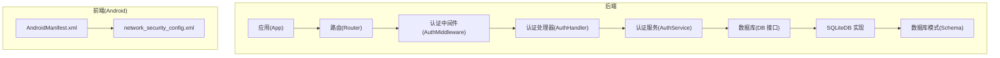
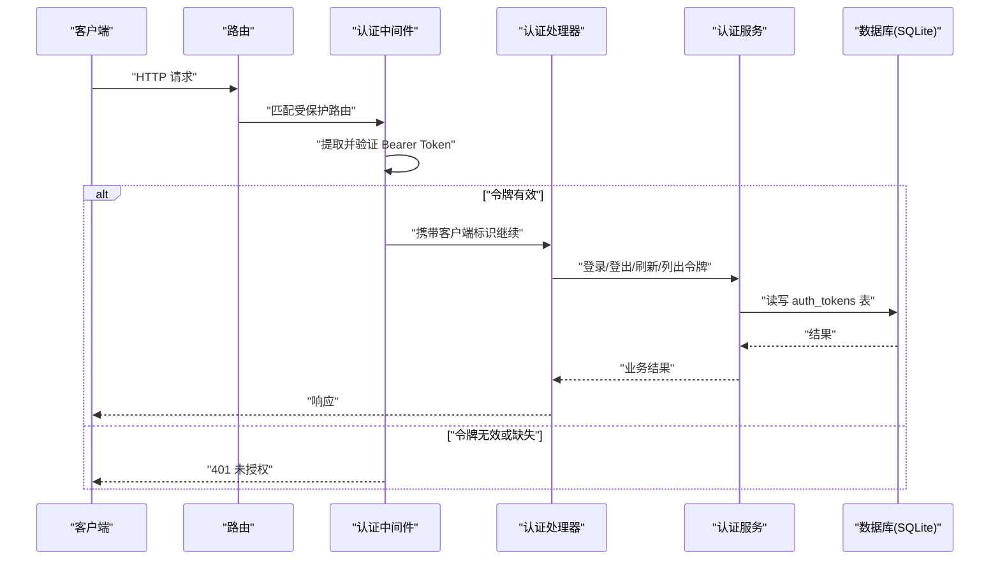
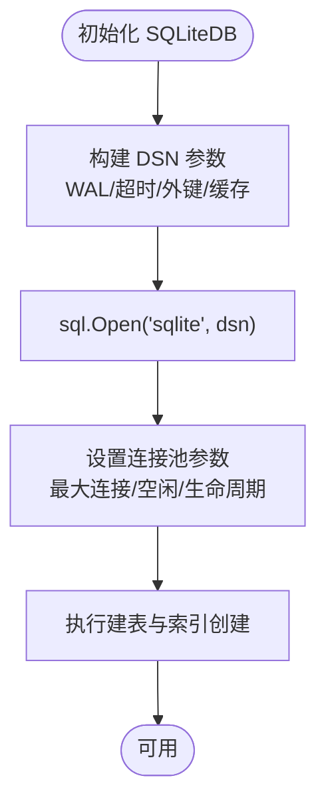
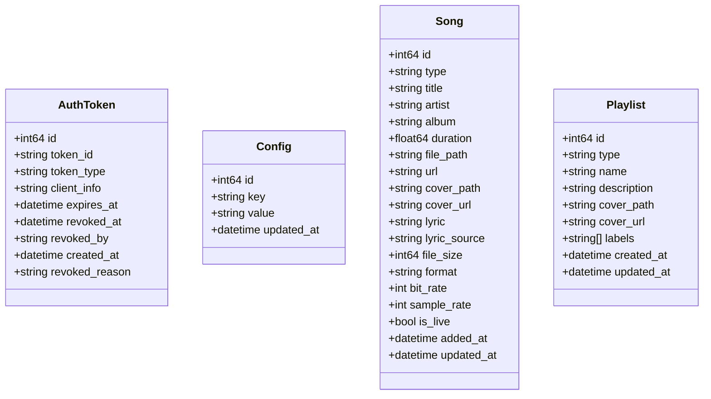
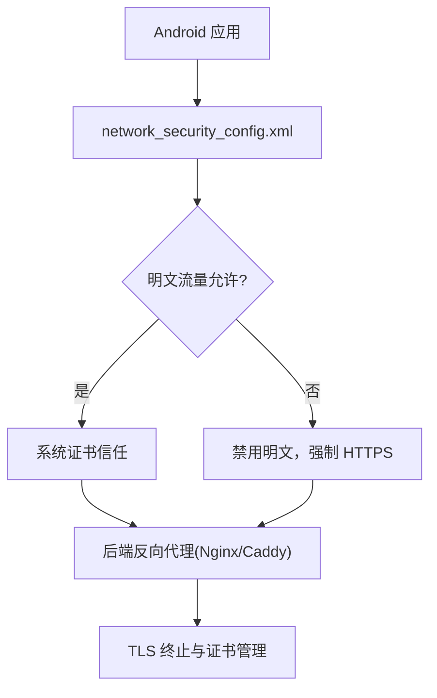
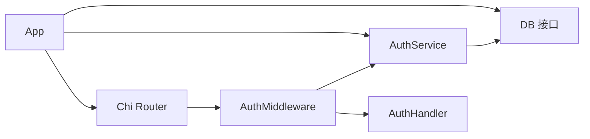

# 数据安全

<cite>
**本文引用的文件**
- [internal/database/database.go](file://internal/database/database.go)
- [internal/database/sqlite.go](file://internal/database/sqlite.go)
- [internal/database/schema.go](file://internal/database/schema.go)
- [internal/database/sqlite_song.go](file://internal/database/sqlite_song.go)
- [internal/database/sqlite_playlist.go](file://internal/database/sqlite_playlist.go)
- [internal/database/sqlite_config.go](file://internal/database/sqlite_config.go)
- [internal/database/sqlite_token.go](file://internal/database/sqlite_token.go)
- [internal/models/models.go](file://internal/models/models.go)
- [internal/services/auth_service.go](file://internal/services/auth_service.go)
- [internal/middleware/auth.go](file://internal/middleware/auth.go)
- [internal/handlers/auth.go](file://internal/handlers/auth.go)
- [internal/app/app.go](file://internal/app/app.go)
- [frontend/android/app/src/main/AndroidManifest.xml](file://frontend/android/app/src/main/AndroidManifest.xml)
- [frontend/android/app/src/main/res/xml/network_security_config.xml](file://frontend/android/app/src/main/res/xml/network_security_config.xml)
</cite>

## 目录
1. [简介](#简介)
2. [项目结构](#项目结构)
3. [核心组件](#核心组件)
4. [架构总览](#架构总览)
5. [详细组件分析](#详细组件分析)
6. [依赖分析](#依赖分析)
7. [性能考虑](#性能考虑)
8. [故障排查指南](#故障排查指南)
9. [结论](#结论)
10. [附录](#附录)

## 简介
本文件面向 MiMusic 的数据安全保护机制，围绕数据库安全、敏感数据保护、数据传输安全、数据备份安全以及数据访问审计与异常检测展开，结合代码库中的实现进行系统性说明，并提供可视化图示帮助理解。

## 项目结构
- 后端采用 Go 语言，数据库层基于 SQLite，通过统一的 DB 接口抽象实现具体操作。
- 认证与授权通过 JWT 实现，配合数据库中的 auth_tokens 表进行令牌生命周期管理。
- 前端 Android 应用通过网络配置文件对明文流量与系统证书信任进行控制，便于在受控环境下运行。

**图表来源**
- [internal/app/app.go:242-241](file://internal/app/app.go#L242-L241)
- [internal/middleware/auth.go:11-51](file://internal/middleware/auth.go#L11-L51)
- [internal/handlers/auth.go:15-254](file://internal/handlers/auth.go#L15-L254)
- [internal/services/auth_service.go:24-461](file://internal/services/auth_service.go#L24-L461)
- [internal/database/database.go:8-118](file://internal/database/database.go#L8-L118)
- [internal/database/sqlite.go:12-80](file://internal/database/sqlite.go#L12-L80)
- [internal/database/schema.go:3-149](file://internal/database/schema.go#L3-L149)
- [frontend/android/app/src/main/AndroidManifest.xml:12-18](file://frontend/android/app/src/main/AndroidManifest.xml#L12-L18)
- [frontend/android/app/src/main/res/xml/network_security_config.xml:1-9](file://frontend/android/app/src/main/res/xml/network_security_config.xml#L1-L9)

**章节来源**
- [internal/app/app.go:64-227](file://internal/app/app.go#L64-L227)
- [internal/database/database.go:8-118](file://internal/database/database.go#L8-L118)
- [internal/database/sqlite.go:22-53](file://internal/database/sqlite.go#L22-L53)
- [internal/database/schema.go:3-149](file://internal/database/schema.go#L3-L149)
- [frontend/android/app/src/main/AndroidManifest.xml:12-18](file://frontend/android/app/src/main/AndroidManifest.xml#L12-L18)
- [frontend/android/app/src/main/res/xml/network_security_config.xml:1-9](file://frontend/android/app/src/main/res/xml/network_security_config.xml#L1-L9)

## 核心组件
- 数据库接口与实现
  - DB 接口定义了歌曲、歌单、配置、令牌、插件等 CRUD 与事务能力。
  - SQLiteDB 实现通过 DSN 参数启用 WAL、超时、外键等安全与性能特性。
- 数据模型与约束
  - schema 中定义了各表的字段、CHECK 约束、UNIQUE、外键与索引，确保数据完整性。
- 认证与令牌管理
  - AuthService 基于 JWT，结合数据库 auth_tokens 表实现令牌签发、撤销、过期清理与内存缓存。
  - 中间件与处理器负责提取与验证令牌，保障受保护接口的安全访问。
- 前端网络配置
  - Android 应用通过 network_security_config.xml 控制明文流量与系统证书信任，便于在受控环境中运行。

**章节来源**
- [internal/database/database.go:8-118](file://internal/database/database.go#L8-L118)
- [internal/database/sqlite.go:22-53](file://internal/database/sqlite.go#L22-L53)
- [internal/database/schema.go:3-149](file://internal/database/schema.go#L3-L149)
- [internal/models/models.go:64-436](file://internal/models/models.go#L64-L436)
- [internal/services/auth_service.go:24-461](file://internal/services/auth_service.go#L24-L461)
- [internal/middleware/auth.go:11-51](file://internal/middleware/auth.go#L11-L51)
- [internal/handlers/auth.go:15-254](file://internal/handlers/auth.go#L15-L254)

## 架构总览
下图展示从请求进入、认证校验、数据库访问到响应返回的整体流程，以及关键安全控制点。

**图表来源**
- [internal/middleware/auth.go:11-51](file://internal/middleware/auth.go#L11-L51)
- [internal/handlers/auth.go:27-134](file://internal/handlers/auth.go#L27-L134)
- [internal/services/auth_service.go:94-164](file://internal/services/auth_service.go#L94-L164)
- [internal/database/sqlite_token.go:14-97](file://internal/database/sqlite_token.go#L14-L97)

**章节来源**
- [internal/middleware/auth.go:11-51](file://internal/middleware/auth.go#L11-L51)
- [internal/handlers/auth.go:27-134](file://internal/handlers/auth.go#L27-L134)
- [internal/services/auth_service.go:94-164](file://internal/services/auth_service.go#L94-L164)
- [internal/database/sqlite_token.go:14-97](file://internal/database/sqlite_token.go#L14-L97)

## 详细组件分析

### 数据库安全措施
- 访问控制与连接配置
  - 通过 DSN 参数启用 WAL 模式、busy_timeout、synchronous、cache_size 与外键约束，提升并发性能与数据一致性。
  - 连接池参数限制最大打开/空闲连接数与生命周期，降低锁竞争与资源泄漏风险。
- SQL 注入防护与参数化查询
  - 所有数据库操作均使用参数化查询（占位符与 ExecContext/QueryRowContext），避免字符串拼接引发注入。
- 数据完整性约束
  - schema 中定义了 CHECK 约束、UNIQUE、外键与触发器，确保类型合法、唯一性与级联删除等约束。
- 索引优化
  - 为高频查询字段建立索引，平衡查询性能与写入开销。

**图表来源**
- [internal/database/sqlite.go:22-53](file://internal/database/sqlite.go#L22-L53)
- [internal/database/schema.go:3-149](file://internal/database/schema.go#L3-L149)

**章节来源**
- [internal/database/sqlite.go:22-53](file://internal/database/sqlite.go#L22-L53)
- [internal/database/schema.go:3-149](file://internal/database/schema.go#L3-L149)
- [internal/database/sqlite_song.go:14-44](file://internal/database/sqlite_song.go#L14-L44)
- [internal/database/sqlite_playlist.go:17-47](file://internal/database/sqlite_playlist.go#L17-L47)
- [internal/database/sqlite_config.go:13-44](file://internal/database/sqlite_config.go#L13-L44)
- [internal/database/sqlite_token.go:14-44](file://internal/database/sqlite_token.go#L14-L44)

### 敏感数据保护策略
- 用户凭据与令牌
  - 管理员用户名与密码由外部参数注入，不存储明文；JWT 密钥以十六进制形式存储于数据库配置表中，启动时读取并解码。
  - 认证服务生成短期 Access Token 与长期 Refresh Token，均通过 HS256 签名，数据库记录类型、过期时间、撤销状态等。
- 令牌安全保存与撤销
  - 令牌表包含 token_id、token_type、expires_at、revoked_at、revoked_by、revoked_reason 等字段，支持按类型、过期状态与关键词检索。
  - 登出与刷新流程会撤销旧令牌并清理内存缓存，防止重放。
- 配置信息加密
  - 配置项以明文存储于 configs 表，建议在部署层面通过文件系统权限与容器安全策略实现最小暴露面；若需更高强度，可在应用层对敏感字段进行额外加解密（当前仓库未见此类实现）。
- 音乐元数据脱敏
  - 元数据字段（如歌词、封面路径/URL、文件路径等）按业务需要存储；若涉及隐私信息，建议在前端渲染层进行脱敏处理（当前仓库未见专门脱敏逻辑）。

**图表来源**
- [internal/models/models.go:64-436](file://internal/models/models.go#L64-L436)
- [internal/database/schema.go:53-87](file://internal/database/schema.go#L53-L87)

**章节来源**
- [internal/services/auth_service.go:48-73](file://internal/services/auth_service.go#L48-L73)
- [internal/app/app.go:243-267](file://internal/app/app.go#L243-L267)
- [internal/database/sqlite_token.go:14-97](file://internal/database/sqlite_token.go#L14-L97)
- [internal/models/models.go:368-379](file://internal/models/models.go#L368-L379)

### 数据传输安全
- HTTPS 与证书管理
  - 当前后端直接使用 http.ListenAndServe 启动，未显式启用 TLS。建议在生产环境通过反向代理（如 Nginx/Caddy）启用 HTTPS，并配置强密码套件与证书轮换。
- 明文流量与系统信任
  - Android 应用 network_security_config.xml 允许明文流量并信任系统证书，适用于受控内网环境；在公网暴露时应收紧策略，禁用明文并强制 HTTPS。
- 中间人攻击防护
  - 建议引入证书固定（Pinning）与严格传输安全（HSTS）策略，结合前端与后端的证书校验与过期监控。

**图表来源**
- [frontend/android/app/src/main/AndroidManifest.xml:12-18](file://frontend/android/app/src/main/AndroidManifest.xml#L12-L18)
- [frontend/android/app/src/main/res/xml/network_security_config.xml:1-9](file://frontend/android/app/src/main/res/xml/network_security_config.xml#L1-L9)
- [internal/app/app.go:230-241](file://internal/app/app.go#L230-L241)

**章节来源**
- [frontend/android/app/src/main/AndroidManifest.xml:12-18](file://frontend/android/app/src/main/AndroidManifest.xml#L12-L18)
- [frontend/android/app/src/main/res/xml/network_security_config.xml:1-9](file://frontend/android/app/src/main/res/xml/network_security_config.xml#L1-L9)
- [internal/app/app.go:230-241](file://internal/app/app.go#L230-L241)

### 数据备份安全
- 备份加密
  - 建议对 SQLite 数据库文件进行压缩加密打包；可结合操作系统级加密（如卷加密）或应用层加密（AES）实现。
- 访问权限控制
  - 通过文件系统权限限制备份文件读写；在容器环境中使用只读挂载与最小权限原则。
- 备份完整性验证
  - 生成并校验校验和（如 SHA-256），并在恢复后执行数据库一致性检查（PRAGMA integrity_check）。
- 灾难恢复安全
  - 定期演练恢复流程，确保备份链路与密钥管理安全；对密钥与恢复脚本进行物理隔离与访问审计。

[本节为通用实践指导，不直接分析具体文件]

### 数据访问审计、操作日志与异常检测
- 访问审计
  - 可在认证中间件与处理器中增加统一的日志记录，记录客户端 IP、User-Agent、令牌类型与操作结果。
- 操作日志
  - 对关键操作（登录、登出、令牌撤销、配置变更）记录到数据库或外部日志系统，保留至少 90 天。
- 异常访问检测
  - 基于日志统计异常模式（如短时间内大量失败、跨地域访问、高权限操作），结合告警系统触发人工复核。

[本节为通用实践指导，不直接分析具体文件]

## 依赖分析
- 组件耦合
  - App 初始化数据库、配置服务、认证服务与插件管理器；认证服务依赖数据库读取 JWT 密钥。
  - 认证中间件依赖 AuthService 验证 JWT；处理器依赖 AuthService 执行登录/登出/刷新等业务。
- 外部依赖
  - SQLite 驱动、JWT 库、Chi 路由框架；Android 端通过网络配置文件影响明文与证书策略。

**图表来源**
- [internal/app/app.go:64-227](file://internal/app/app.go#L64-L227)
- [internal/services/auth_service.go:24-73](file://internal/services/auth_service.go#L24-L73)
- [internal/middleware/auth.go:11-51](file://internal/middleware/auth.go#L11-L51)
- [internal/handlers/auth.go:15-254](file://internal/handlers/auth.go#L15-L254)

**章节来源**
- [internal/app/app.go:64-227](file://internal/app/app.go#L64-L227)
- [internal/services/auth_service.go:24-73](file://internal/services/auth_service.go#L24-L73)
- [internal/middleware/auth.go:11-51](file://internal/middleware/auth.go#L11-L51)
- [internal/handlers/auth.go:15-254](file://internal/handlers/auth.go#L15-L254)

## 性能考虑
- SQLite 优化
  - WAL 模式提升读并发；适度连接池避免写锁竞争；外键与索引平衡一致性与查询性能。
- 认证缓存
  - AuthService 使用内存缓存加速令牌校验，定期清理过期缓存，降低数据库压力。
- 批量操作
  - 自动创建歌单与批量删除歌曲采用事务与批量插入，减少往返次数与锁持有时间。

**章节来源**
- [internal/database/sqlite.go:22-53](file://internal/database/sqlite.go#L22-L53)
- [internal/services/auth_service.go:166-210](file://internal/services/auth_service.go#L166-L210)
- [internal/database/sqlite_playlist.go:300-463](file://internal/database/sqlite_playlist.go#L300-L463)
- [internal/database/sqlite_song.go:334-413](file://internal/database/sqlite_song.go#L334-L413)

## 故障排查指南
- 令牌相关问题
  - 检查 auth_tokens 表是否存在对应 token_id，确认是否过期或已被撤销；查看 AuthService 的缓存状态与清理周期。
- 数据库连接与建表
  - 确认 DSN 参数与连接池配置；检查 schema 初始化是否成功；关注 busy_timeout 与锁冲突日志。
- 前端网络问题
  - Android 明文流量策略与系统证书信任可能影响 HTTPS 访问；在公网部署时应收紧策略。

**章节来源**
- [internal/database/sqlite_token.go:169-184](file://internal/database/sqlite_token.go#L169-L184)
- [internal/services/auth_service.go:326-371](file://internal/services/auth_service.go#L326-L371)
- [internal/database/sqlite.go:22-53](file://internal/database/sqlite.go#L22-L53)
- [frontend/android/app/src/main/res/xml/network_security_config.xml:1-9](file://frontend/android/app/src/main/res/xml/network_security_config.xml#L1-L9)

## 结论
MiMusic 的数据安全在数据库层面通过 SQLite 的 WAL、外键与索引等机制保障一致性与性能；在认证层面通过 JWT 与数据库令牌表实现强约束的令牌生命周期管理。建议在生产环境中补充 HTTPS、证书固定与严格的访问控制策略，并完善备份加密、审计日志与异常检测体系，以满足更高等级的数据安全要求。

## 附录
- 关键实现参考路径
  - 数据库接口与实现：[internal/database/database.go:8-118](file://internal/database/database.go#L8-L118)，[internal/database/sqlite.go:22-53](file://internal/database/sqlite.go#L22-L53)
  - 数据模型与约束：[internal/models/models.go:64-436](file://internal/models/models.go#L64-L436)，[internal/database/schema.go:3-149](file://internal/database/schema.go#L3-L149)
  - 认证服务与中间件：[internal/services/auth_service.go:24-461](file://internal/services/auth_service.go#L24-L461)，[internal/middleware/auth.go:11-51](file://internal/middleware/auth.go#L11-51)，[internal/handlers/auth.go:15-254](file://internal/handlers/auth.go#L15-254)
  - 应用启动与网络：[internal/app/app.go:230-241](file://internal/app/app.go#L230-241)，[frontend/android/app/src/main/AndroidManifest.xml:12-18](file://frontend/android/app/src/main/AndroidManifest.xml#L12-L18)，[frontend/android/app/src/main/res/xml/network_security_config.xml:1-9](file://frontend/android/app/src/main/res/xml/network_security_config.xml#L1-L9)