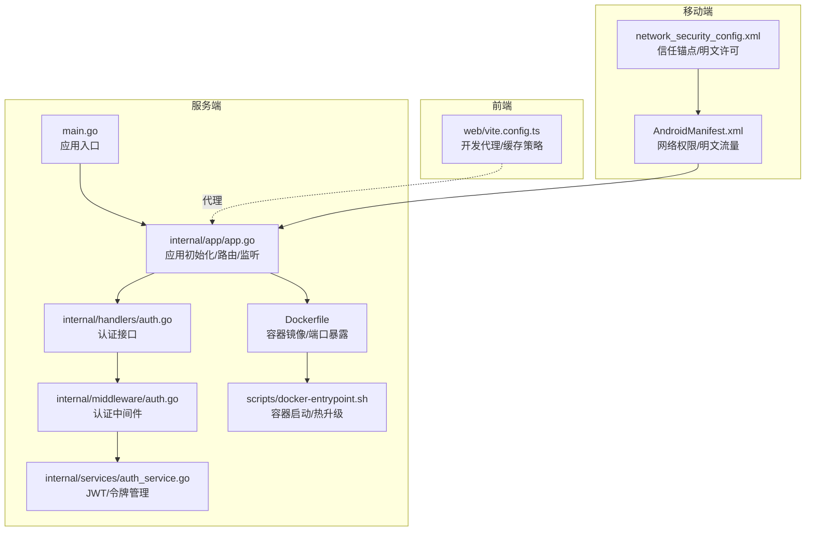
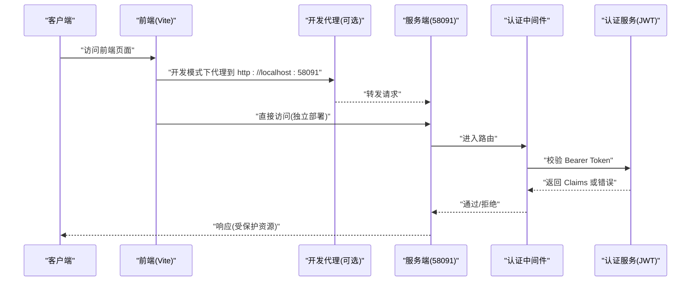
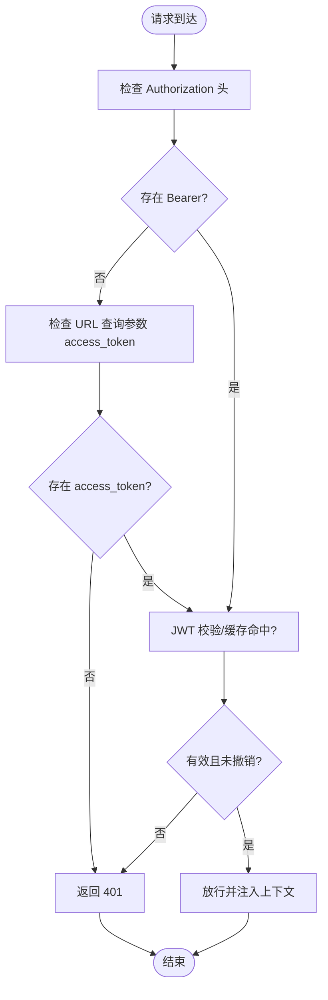
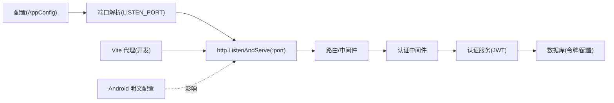

# 网络安全

<cite>
**本文引用的文件**
- [main.go](file://main.go)
- [internal/app/app.go](file://internal/app/app.go)
- [internal/config/types.go](file://internal/config/types.go)
- [Dockerfile](file://Dockerfile)
- [scripts/docker-entrypoint.sh](file://scripts/docker-entrypoint.sh)
- [internal/middleware/auth.go](file://internal/middleware/auth.go)
- [internal/handlers/auth.go](file://internal/handlers/auth.go)
- [internal/services/auth_service.go](file://internal/services/auth_service.go)
- [docs/swagger.yaml](file://docs/swagger.yaml)
- [web/vite.config.ts](file://web/vite.config.ts)
- [frontend/android/app/src/main/AndroidManifest.xml](file://frontend/android/app/src/main/AndroidManifest.xml)
- [frontend/android/app/src/main/res/xml/network_security_config.xml](file://frontend/android/app/src/main/res/xml/network_security_config.xml)
</cite>

## 目录
1. [简介](#简介)
2. [项目结构](#项目结构)
3. [核心组件](#核心组件)
4. [架构总览](#架构总览)
5. [详细组件分析](#详细组件分析)
6. [依赖分析](#依赖分析)
7. [性能考虑](#性能考虑)
8. [故障排查指南](#故障排查指南)
9. [结论](#结论)
10. [附录](#附录)

## 简介
本指南面向 MiMusic 的网络安全策略，围绕防火墙与端口管理、网络隔离、访问控制、认证与授权、CDN/代理安全、监控与响应等方面，结合代码库中的实际实现，给出可落地的配置建议与最佳实践。文档同时提供可视化图示，帮助不同技术背景的读者快速理解系统在网络层面的设计与风险控制点。

## 项目结构
从网络安全视角，MiMusic 的网络相关能力主要分布在以下层次：
- 服务端入口与监听：main.go、internal/app/app.go、Dockerfile
- 认证与授权：internal/middleware/auth.go、internal/handlers/auth.go、internal/services/auth_service.go
- 前端代理与缓存：web/vite.config.ts
- 移动端网络配置：frontend/android/app/src/main/AndroidManifest.xml、frontend/android/app/src/main/res/xml/network_security_config.xml
- API 文档与安全定义：docs/swagger.yaml

**图表来源**
- [main.go:30-63](file://main.go#L30-L63)
- [internal/app/app.go:191-241](file://internal/app/app.go#L191-L241)
- [internal/services/auth_service.go:48-73](file://internal/services/auth_service.go#L48-L73)
- [internal/middleware/auth.go:11-51](file://internal/middleware/auth.go#L11-L51)
- [internal/handlers/auth.go:27-62](file://internal/handlers/auth.go#L27-L62)
- [Dockerfile:64](file://Dockerfile#L64)
- [scripts/docker-entrypoint.sh:76-114](file://scripts/docker-entrypoint.sh#L76-L114)
- [web/vite.config.ts:163-182](file://web/vite.config.ts#L163-L182)
- [frontend/android/app/src/main/AndroidManifest.xml:6](file://frontend/android/app/src/main/AndroidManifest.xml#L6)
- [frontend/android/app/src/main/res/xml/network_security_config.xml:3](file://frontend/android/app/src/main/res/xml/network_security_config.xml#L3)

**章节来源**
- [main.go:30-63](file://main.go#L30-L63)
- [internal/app/app.go:191-241](file://internal/app/app.go#L191-L241)
- [Dockerfile:64](file://Dockerfile#L64)

## 核心组件
- 端口与监听
  - 默认监听端口：58091；可通过命令行参数或环境变量覆盖。
  - 容器镜像显式 EXPOSE 58091，并通过环境变量提供默认凭据。
- 认证与授权
  - 基于 Bearer JWT 的认证，支持 access/refresh 令牌，具备撤销与缓存机制。
  - 中间件优先从 Authorization 头提取 token，必要时回退到 URL 查询参数。
- 前端代理与缓存
  - 开发模式下通过 Vite 代理到本地 58091；生产缓存策略对 API/静态资源/媒体资源分别采用不同策略。
- 移动端网络
  - Android 允许明文流量，且配置了系统证书信任锚点；需结合部署环境评估风险。

**章节来源**
- [internal/app/app.go:287-352](file://internal/app/app.go#L287-L352)
- [Dockerfile:69-71](file://Dockerfile#L69-L71)
- [internal/middleware/auth.go:11-51](file://internal/middleware/auth.go#L11-L51)
- [internal/services/auth_service.go:48-73](file://internal/services/auth_service.go#L48-L73)
- [web/vite.config.ts:163-182](file://web/vite.config.ts#L163-L182)
- [frontend/android/app/src/main/AndroidManifest.xml:18](file://frontend/android/app/src/main/AndroidManifest.xml#L18)
- [frontend/android/app/src/main/res/xml/network_security_config.xml:3](file://frontend/android/app/src/main/res/xml/network_security_config.xml#L3)

## 架构总览
下图展示从客户端到服务端的关键网络交互路径，以及认证与授权流程。

**图表来源**
- [web/vite.config.ts:163-182](file://web/vite.config.ts#L163-L182)
- [internal/middleware/auth.go:11-51](file://internal/middleware/auth.go#L11-L51)
- [internal/services/auth_service.go:326-371](file://internal/services/auth_service.go#L326-L371)

## 详细组件分析

### 防火墙与端口管理
- 默认端口
  - 服务端默认监听端口为 58091；可通过命令行参数 -port 或环境变量 LISTEN_PORT 覆盖。
  - 容器镜像显式暴露 58091，便于外部映射。
- 端口暴露与访问控制
  - 建议仅在内网或受控网络暴露 58091；若必须公网暴露，务必配合反向代理（如 Nginx/Traefik）与 TLS 终止。
  - 在容器编排中，仅映射必要端口；避免使用 host 网络模式。
- 端口扫描防护
  - 建议在宿主机防火墙（iptables/nftables）上限制来源 IP、速率限制与 SYN 队列优化。
  - 结合进程级监听范围（仅监听 127.0.0.1 或内网接口），减少暴露面。
- 网络访问控制列表（ACL）
  - 在反向代理层配置基于 IP 的 ACL；对 /api/* 路径实施更严格策略。
  - 对 /music 与 /cover 等媒体资源，建议强制要求携带认证头，避免匿名直链。

**章节来源**
- [internal/app/app.go:287-352](file://internal/app/app.go#L287-L352)
- [Dockerfile:64](file://Dockerfile#L64)

### 认证与授权（JWT）
- 令牌类型与生命周期
  - access_token：短期（默认 7 天），refresh_token：长期（默认 30 天）。
  - refresh 接口支持在撤销/过期情况下生成新令牌。
- 令牌撤销与缓存
  - 服务端维护令牌撤销表；验证时先查内存缓存，再查数据库。
  - 登出/撤销后清除缓存，防止“幽灵令牌”。
- 中间件策略
  - 优先从 Authorization: Bearer 提取 token；对图片/音频等受限场景回退到 URL 查询参数 access_token。
- 安全建议
  - 强制 HTTPS 传输；禁止明文传输 token。
  - 对 refresh_token 存储与传输加强保护；定期轮换密钥。
  - 限制令牌粒度（最小权限原则），必要时引入 scopes。

**图表来源**
- [internal/middleware/auth.go:11-51](file://internal/middleware/auth.go#L11-L51)
- [internal/services/auth_service.go:326-371](file://internal/services/auth_service.go#L326-L371)

**章节来源**
- [internal/handlers/auth.go:27-62](file://internal/handlers/auth.go#L27-L62)
- [internal/services/auth_service.go:94-164](file://internal/services/auth_service.go#L94-L164)
- [internal/services/auth_service.go:212-243](file://internal/services/auth_service.go#L212-L243)
- [internal/services/auth_service.go:245-324](file://internal/services/auth_service.go#L245-L324)
- [internal/middleware/auth.go:11-51](file://internal/middleware/auth.go#L11-L51)

### 网络隔离策略
- 容器网络隔离
  - 使用独立的用户自定义桥接网络，限制容器间直接连通；仅开放必要端口。
- 服务间通信安全
  - 服务内通信建议走本地回环或命名管道；跨主机通信必须启用 mTLS 或同等强度的双向认证。
- API 网关安全
  - 在网关层统一接入认证、限流、审计与 WAF；对 /music 与 /cover 资源强制鉴权。
- 微服务通信加密
  - 服务间调用启用 TLS；对敏感数据（如令牌、密钥）进行端到端加密。

[本节为概念性说明，不直接分析具体文件]

### IP 白名单与访问控制
- 客户端 IP 验证
  - 可在反向代理层记录并校验 X-Forwarded-For/Real-IP，结合数据库白名单策略。
- 动态 IP 管理
  - 对频繁变化的 IP（移动/企业 NAT）建立宽限期与二次验证。
- 地理位置限制
  - 结合 GeoIP 数据库，对高风险地区实施更严格策略。
- 异常访问检测
  - 基于请求频率、路径分布、User-Agent 异常等指标，触发告警与临时封禁。

[本节为概念性说明，不直接分析具体文件]

### CDN 与代理安全
- 缓存安全
  - 对 /api/* 采用短 TTL 或 NetworkFirst，避免缓存敏感响应；静态资源采用强缓存但带版本号。
  - 对 /music 与 /cover 采用 NetworkOnly，确保始终携带认证头。
- 代理链路保护
  - 代理层开启 HSTS、CSP、X-Frame-Options 等安全响应头；限制上游转发。
- DDoS 防护与流量清洗
  - 使用云厂商或第三方服务进行 L3/4 防护；在边缘层做限速与黑白名单。
- 证书与 TLS
  - 强制 HTTPS；启用现代密码套件与 TLS 1.3；定期轮换证书。

**章节来源**
- [web/vite.config.ts:37-99](file://web/vite.config.ts#L37-L99)

### 移动端网络配置
- Android 明文流量
  - 当前配置允许明文流量（cleartextTrafficPermitted=true），在生产环境中应关闭并强制 HTTPS。
- 信任锚点
  - 仅信任系统证书，避免自签名或私有 CA，降低中间人攻击风险。
- 权限与用途
  - 仅授予必要网络权限；避免不必要的前台服务与唤醒锁滥用。

**章节来源**
- [frontend/android/app/src/main/AndroidManifest.xml:18](file://frontend/android/app/src/main/AndroidManifest.xml#L18)
- [frontend/android/app/src/main/res/xml/network_security_config.xml:3](file://frontend/android/app/src/main/res/xml/network_security_config.xml#L3)

### API 文档与安全定义
- Swagger/OpenAPI
  - 文档中定义了 BearerAuth 安全方案与主机地址 localhost:58091，便于集成安全测试工具。
- 建议
  - 在生产环境将 host 替换为域名；对敏感接口增加额外安全注解。

**章节来源**
- [docs/swagger.yaml:25](file://docs/swagger.yaml#L25)
- [docs/swagger.yaml:512](file://docs/swagger.yaml#L512)

## 依赖分析
- 端口与配置耦合
  - 端口来源于命令行与环境变量；容器镜像显式暴露端口，形成“配置—运行时—网络”的闭环。
- 认证链路
  - Handler -> Middleware -> Service；Service 依赖数据库与密钥存储，形成“认证—授权—审计”的闭环。
- 前端与后端
  - Vite 代理仅用于开发；生产环境由反向代理统一接入，避免直接暴露后端端口。

**图表来源**
- [internal/config/types.go:4-9](file://internal/config/types.go#L4-L9)
- [internal/app/app.go:287-352](file://internal/app/app.go#L287-L352)
- [internal/app/app.go:230-241](file://internal/app/app.go#L230-L241)
- [internal/middleware/auth.go:11-51](file://internal/middleware/auth.go#L11-L51)
- [internal/services/auth_service.go:48-73](file://internal/services/auth_service.go#L48-L73)
- [web/vite.config.ts:163-182](file://web/vite.config.ts#L163-L182)
- [frontend/android/app/src/main/AndroidManifest.xml:18](file://frontend/android/app/src/main/AndroidManifest.xml#L18)

**章节来源**
- [internal/config/types.go:4-9](file://internal/config/types.go#L4-L9)
- [internal/app/app.go:287-352](file://internal/app/app.go#L287-L352)
- [internal/app/app.go:230-241](file://internal/app/app.go#L230-L241)

## 性能考虑
- 令牌缓存
  - 内存缓存提升验证吞吐；定时清理过期条目，避免内存膨胀。
- 代理与缓存
  - 生产缓存策略平衡新鲜度与性能；媒体资源禁用缓存以避免泄露。
- 端口与监听
  - 仅监听必要接口；在高并发场景下优化 TCP 参数与连接池。

[本节为通用指导，不直接分析具体文件]

## 故障排查指南
- 无法访问后端
  - 检查 LISTEN_PORT 与容器端口映射；确认防火墙放行 58091。
- 401 未授权
  - 确认 Authorization 头格式为 Bearer；对图片/音频场景检查 access_token 查询参数。
  - 若近期登出/撤销，检查令牌是否仍在缓存中。
- 代理失效（开发）
  - 确认 Vite 代理 target 指向正确端口；独立部署时不要使用代理。
- Android 明文失败
  - 生产环境关闭明文流量；确保证书链完整与系统信任。

**章节来源**
- [internal/middleware/auth.go:11-51](file://internal/middleware/auth.go#L11-L51)
- [internal/services/auth_service.go:166-192](file://internal/services/auth_service.go#L166-L192)
- [web/vite.config.ts:163-182](file://web/vite.config.ts#L163-L182)
- [frontend/android/app/src/main/AndroidManifest.xml:18](file://frontend/android/app/src/main/AndroidManifest.xml#L18)

## 结论
MiMusic 的网络安全基础由“JWT 认证 + 中间件拦截 + 容器端口暴露 + 前端代理/缓存”构成。建议在生产环境中强化以下方面：关闭明文流量、启用 HTTPS 与 HSTS、在反向代理层实施严格的 ACL 与 WAF、对媒体资源强制鉴权、完善令牌撤销与审计、并结合 CDN/DDoS 防护与监控告警体系，形成纵深防御。

## 附录
- 快速检查清单
  - 端口：仅映射 58091；限制来源 IP。
  - 证书：启用 HTTPS；使用现代 TLS。
  - 代理：开发用 Vite 代理；生产统一经反向代理。
  - 令牌：短期 access + 长期 refresh；及时撤销与缓存清理。
  - 移动端：关闭明文；仅信任系统证书。

[本节为通用指导，不直接分析具体文件]