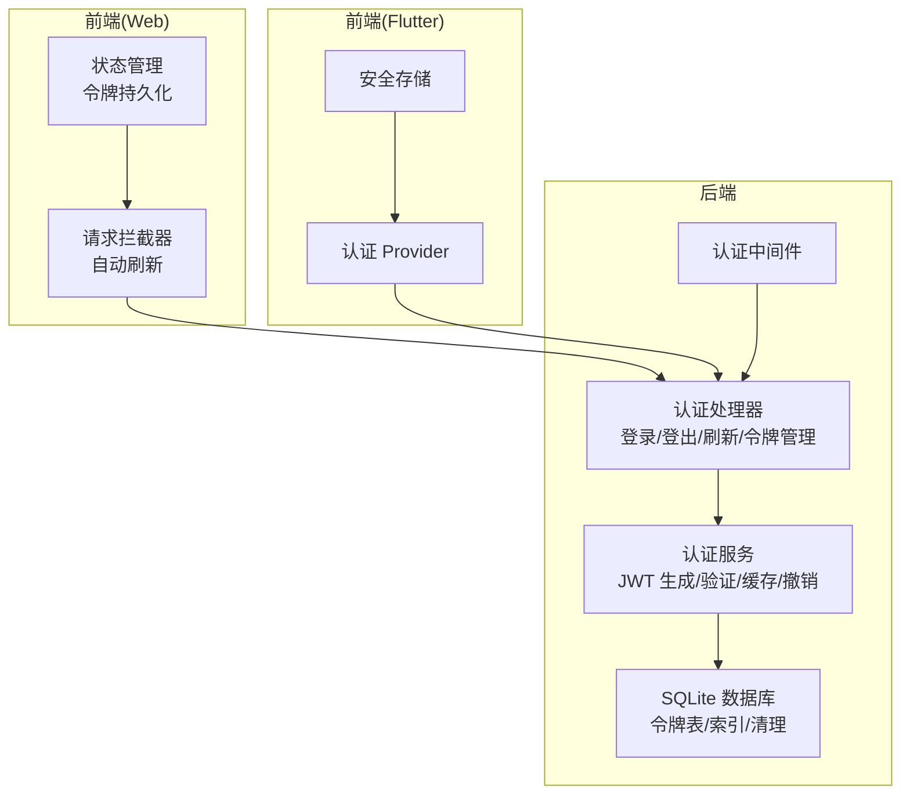
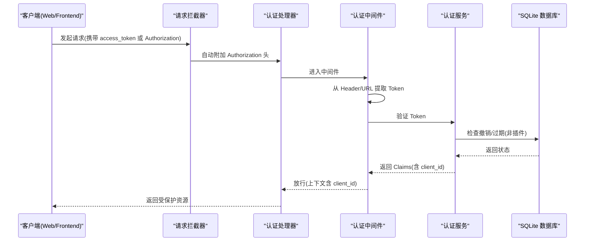
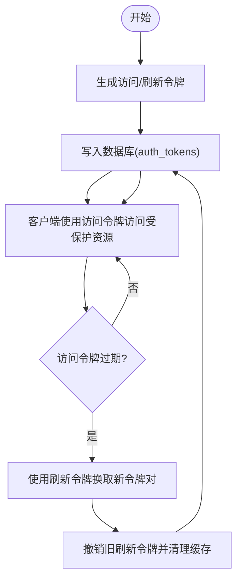
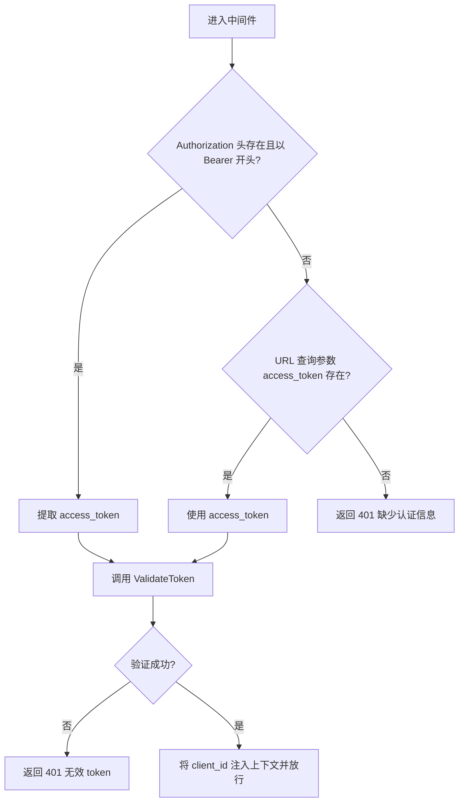
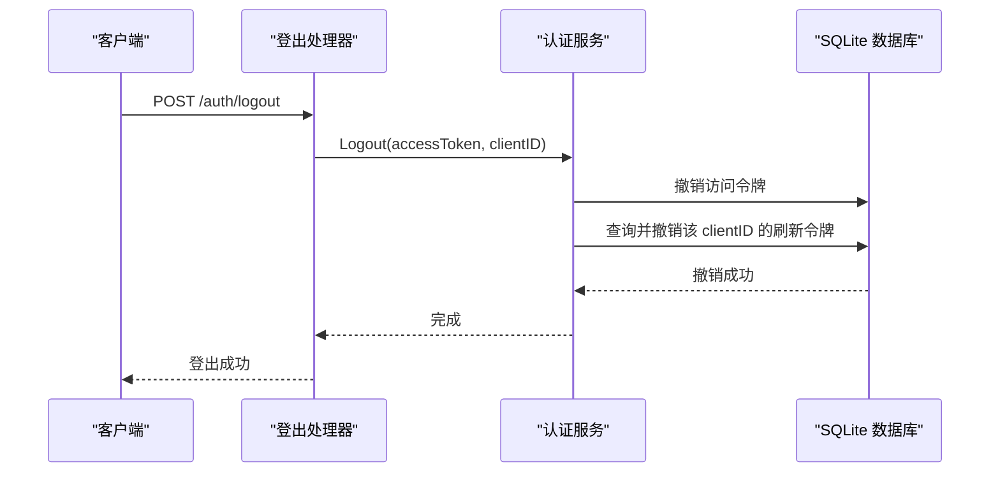
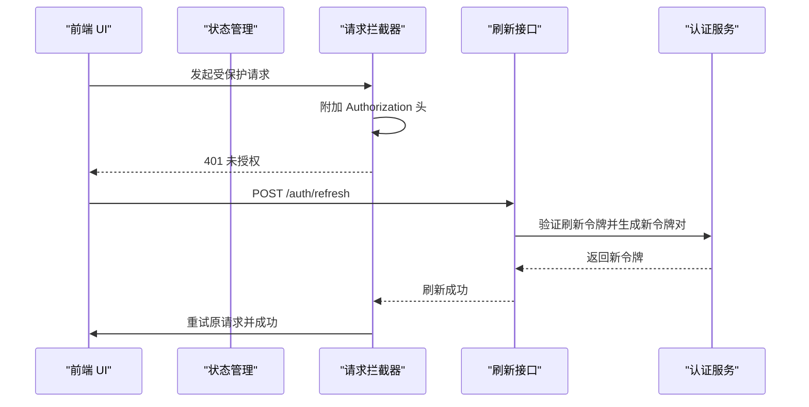
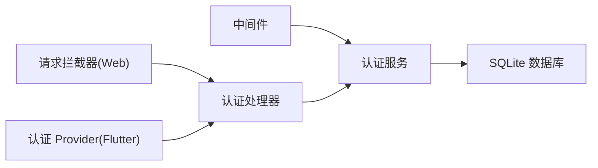

# 认证安全

<cite>
**本文引用的文件**
- [internal/middleware/auth.go](file://internal/middleware/auth.go)
- [internal/handlers/auth.go](file://internal/handlers/auth.go)
- [internal/services/auth_service.go](file://internal/services/auth_service.go)
- [internal/database/sqlite_token.go](file://internal/database/sqlite_token.go)
- [internal/database/schema.go](file://internal/database/schema.go)
- [internal/models/models.go](file://internal/models/models.go)
- [web/src/api/request.ts](file://web/src/api/request.ts)
- [web/src/api/auth.ts](file://web/src/api/auth.ts)
- [web/src/stores/auth.ts](file://web/src/stores/auth.ts)
- [frontend/lib/features/auth/presentation/providers/auth_provider.dart](file://frontend/lib/features/auth/presentation/providers/auth_provider.dart)
- [frontend/lib/core/storage/secure_storage.dart](file://frontend/lib/core/storage/secure_storage.dart)
</cite>

## 目录
1. [简介](#简介)
2. [项目结构](#项目结构)
3. [核心组件](#核心组件)
4. [架构总览](#架构总览)
5. [组件详解](#组件详解)
6. [依赖关系分析](#依赖关系分析)
7. [性能考量](#性能考量)
8. [故障排查指南](#故障排查指南)
9. [结论](#结论)
10. [附录](#附录)

## 简介
本文件系统性梳理 MiMusic 的认证安全机制，重点覆盖：
- JWT 双 Token 设计与实现：访问令牌与刷新令牌的生成、过期时间管理与自动刷新。
- 认证中间件：Bearer Token 提取、URL 参数回退、令牌验证与上下文传递。
- 会话管理：客户端 ID 关联、并发会话控制与会话劫持防护。
- CSRF 防护：同源策略、安全头与令牌绑定建议。
- 失败处理、重放攻击防护与安全日志最佳实践。

## 项目结构
围绕认证安全的关键代码分布如下：
- 后端中间件与处理器：负责提取与验证令牌、暴露登录/登出/刷新/令牌列表等接口。
- 认证服务：封装 JWT 生成与验证、令牌缓存、撤销与清理逻辑。
- 数据层：SQLite 存储令牌元数据，支持撤销、过期清理与查询。
- 前端 Web：统一请求拦截器、自动刷新、令牌持久化与状态管理。
- 前端 Flutter：安全存储、认证状态与登录/登出流程。

**图表来源**
- [internal/middleware/auth.go:11-51](file://internal/middleware/auth.go#L11-L51)
- [internal/handlers/auth.go:15-254](file://internal/handlers/auth.go#L15-L254)
- [internal/services/auth_service.go:24-461](file://internal/services/auth_service.go#L24-L461)
- [internal/database/sqlite_token.go:14-203](file://internal/database/sqlite_token.go#L14-L203)
- [web/src/api/request.ts:30-103](file://web/src/api/request.ts#L30-L103)

**章节来源**
- [internal/middleware/auth.go:11-51](file://internal/middleware/auth.go#L11-L51)
- [internal/handlers/auth.go:15-254](file://internal/handlers/auth.go#L15-L254)
- [internal/services/auth_service.go:24-461](file://internal/services/auth_service.go#L24-L461)
- [internal/database/sqlite_token.go:14-203](file://internal/database/sqlite_token.go#L14-L203)
- [web/src/api/request.ts:30-103](file://web/src/api/request.ts#L30-L103)

## 核心组件
- 认证中间件：从 Authorization 头提取 Bearer Token；若为空则回退至 URL 查询参数 access_token；随后调用认证服务验证并把 client_id 注入请求上下文。
- 认证处理器：提供登录、登出、刷新令牌、列出活跃令牌等接口，并对敏感接口进行 Bearer 认证保护。
- 认证服务：负责生成访问/刷新令牌、验证 JWT、维护内存缓存、撤销与清理过期令牌、生成插件专用永久令牌。
- 数据层：SQLite 表 auth_tokens 存储令牌元数据，支持按类型、过期与撤销状态查询，以及定期清理。
- 前端 Web：统一请求拦截器自动附加 Authorization 头，401 时尝试使用刷新令牌自动重试。
- 前端 Flutter：安全存储 Token，提供认证状态检查与登录/登出流程。

**章节来源**
- [internal/middleware/auth.go:11-51](file://internal/middleware/auth.go#L11-L51)
- [internal/handlers/auth.go:27-254](file://internal/handlers/auth.go#L27-L254)
- [internal/services/auth_service.go:94-461](file://internal/services/auth_service.go#L94-L461)
- [internal/database/sqlite_token.go:14-203](file://internal/database/sqlite_token.go#L14-L203)
- [web/src/api/request.ts:30-103](file://web/src/api/request.ts#L30-L103)
- [frontend/lib/core/storage/secure_storage.dart:11-157](file://frontend/lib/core/storage/secure_storage.dart#L11-L157)

## 架构总览
下面以序列图展示一次典型请求的认证流程，从浏览器到后端中间件与服务：

**图表来源**
- [internal/middleware/auth.go:17-49](file://internal/middleware/auth.go#L17-L49)
- [internal/handlers/auth.go:75-97](file://internal/handlers/auth.go#L75-L97)
- [internal/services/auth_service.go:326-371](file://internal/services/auth_service.go#L326-L371)
- [internal/database/sqlite_token.go:186-202](file://internal/database/sqlite_token.go#L186-L202)

## 组件详解

### JWT 双 Token 机制与令牌生命周期
- 令牌类型与过期时间
  - 访问令牌：7 天过期，用于日常 API 访问。
  - 刷新令牌：30 天过期，用于换取新的访问令牌。
- 令牌生成
  - 使用 HS256 签名，Claims 中包含 client_id、iat、exp 与随机 Token ID。
  - 插件专用永久令牌（“plugin-system”）不入库，仅内存使用。
- 令牌验证
  - 先查内存缓存；缓存未命中则解析 JWT 并校验签名。
  - 普通用户令牌额外检查撤销状态与过期；插件令牌跳过数据库检查但同样缓存。
- 缓存与清理
  - 内存缓存条目包含 Claims、过期时间与撤销标记；每分钟清理过期/撤销项。
- 刷新流程
  - 使用刷新令牌换取新的访问/刷新令牌对；旧刷新令牌被撤销并清理缓存；新令牌入库。

**图表来源**
- [internal/services/auth_service.go:117-164](file://internal/services/auth_service.go#L117-L164)
- [internal/services/auth_service.go:245-324](file://internal/services/auth_service.go#L245-L324)
- [internal/database/sqlite_token.go:14-44](file://internal/database/sqlite_token.go#L14-L44)

**章节来源**
- [internal/services/auth_service.go:94-164](file://internal/services/auth_service.go#L94-L164)
- [internal/services/auth_service.go:245-324](file://internal/services/auth_service.go#L245-L324)
- [internal/services/auth_service.go:326-371](file://internal/services/auth_service.go#L326-L371)
- [internal/database/sqlite_token.go:14-44](file://internal/database/sqlite_token.go#L14-L44)

### 认证中间件实现
- Bearer Token 提取
  - 优先从 Authorization 头提取 Bearer Token。
  - 若为空，回退到 URL 查询参数 access_token（适配图片/音频等无法自定义 Header 的场景）。
- 令牌验证与上下文传递
  - 调用认证服务 ValidateToken；若失败返回 401。
  - 成功后将 client_id 注入请求上下文，供后续处理器使用。

**图表来源**
- [internal/middleware/auth.go:17-49](file://internal/middleware/auth.go#L17-L49)

**章节来源**
- [internal/middleware/auth.go:11-51](file://internal/middleware/auth.go#L11-L51)

### 会话管理策略
- 客户端 ID 关联
  - 每个令牌包含 client_id，登录时生成；验证时通过 Claims 获取。
  - 登出时结合 client_id 撤销对应访问/刷新令牌对。
- 并发会话控制
  - 通过 client_id 关联同一客户端的多个令牌；登出时一并撤销。
- 会话劫持防护
  - 令牌撤销与过期检查：数据库中记录撤销/过期时间；内存缓存同步状态。
  - 插件专用令牌不入库，避免被常规撤销流程影响。

**图表来源**
- [internal/handlers/auth.go:75-97](file://internal/handlers/auth.go#L75-L97)
- [internal/services/auth_service.go:212-243](file://internal/services/auth_service.go#L212-L243)
- [internal/database/sqlite_token.go:75-97](file://internal/database/sqlite_token.go#L75-L97)

**章节来源**
- [internal/handlers/auth.go:64-97](file://internal/handlers/auth.go#L64-L97)
- [internal/services/auth_service.go:212-243](file://internal/services/auth_service.go#L212-L243)

### CSRF 防护与安全头
- 同源策略验证
  - 建议后端对关键写操作启用 SameSite Cookie、CSRF Token 或 Origin/Referer 校验。
- 安全头设置
  - 建议设置 Content-Security-Policy、Strict-Transport-Security、X-Content-Type-Options、X-Frame-Options 等。
- 令牌绑定
  - 建议将访问令牌与用户代理、IP（可选）绑定并在服务端校验；当前实现通过 client_id 与数据库状态配合实现一定防护。

注：以上为通用安全建议，具体实现需结合后端框架与部署环境进行配置。

### 前端自动刷新与令牌持久化
- Web 前端
  - 请求拦截器统一附加 Authorization 头。
  - 401 时自动调用刷新接口，成功后重试原请求；失败则清空本地状态并跳转登录。
- Flutter 前端
  - 安全存储 Token，区分原生与 Web 平台行为；提供认证状态检查与登录/登出流程。

**图表来源**
- [web/src/api/request.ts:57-103](file://web/src/api/request.ts#L57-L103)
- [web/src/api/auth.ts:22-25](file://web/src/api/auth.ts#L22-L25)
- [internal/handlers/auth.go:99-134](file://internal/handlers/auth.go#L99-L134)
- [internal/services/auth_service.go:245-324](file://internal/services/auth_service.go#L245-L324)

**章节来源**
- [web/src/api/request.ts:30-103](file://web/src/api/request.ts#L30-L103)
- [web/src/api/auth.ts:12-44](file://web/src/api/auth.ts#L12-L44)
- [web/src/stores/auth.ts:1-61](file://web/src/stores/auth.ts#L1-L61)
- [frontend/lib/features/auth/presentation/providers/auth_provider.dart:72-138](file://frontend/lib/features/auth/presentation/providers/auth_provider.dart#L72-L138)
- [frontend/lib/core/storage/secure_storage.dart:86-157](file://frontend/lib/core/storage/secure_storage.dart#L86-L157)

## 依赖关系分析
- 中间件依赖认证服务进行令牌验证。
- 处理器依赖认证服务执行登录、登出、刷新与令牌管理。
- 认证服务依赖数据库层进行令牌持久化、撤销与清理。
- 前端请求拦截器依赖状态管理与认证 API。

**图表来源**
- [internal/middleware/auth.go:12-51](file://internal/middleware/auth.go#L12-L51)
- [internal/handlers/auth.go:15-25](file://internal/handlers/auth.go#L15-L25)
- [internal/services/auth_service.go:24-73](file://internal/services/auth_service.go#L24-L73)
- [internal/database/sqlite_token.go:14-44](file://internal/database/sqlite_token.go#L14-L44)
- [web/src/api/request.ts:30-55](file://web/src/api/request.ts#L30-L55)

**章节来源**
- [internal/middleware/auth.go:11-51](file://internal/middleware/auth.go#L11-L51)
- [internal/handlers/auth.go:15-25](file://internal/handlers/auth.go#L15-L25)
- [internal/services/auth_service.go:24-73](file://internal/services/auth_service.go#L24-L73)
- [internal/database/sqlite_token.go:14-44](file://internal/database/sqlite_token.go#L14-L44)
- [web/src/api/request.ts:30-55](file://web/src/api/request.ts#L30-L55)

## 性能考量
- 内存缓存：认证服务对令牌进行内存缓存，减少重复解析与数据库查询，定时清理过期/撤销项。
- 数据库索引：auth_tokens 表建立多索引，优化按类型、过期与撤销状态的查询。
- 刷新频率：合理设置访问令牌过期时间与刷新阈值，避免频繁刷新带来的开销。

**章节来源**
- [internal/services/auth_service.go:166-210](file://internal/services/auth_service.go#L166-L210)
- [internal/database/schema.go:89-103](file://internal/database/schema.go#L89-L103)

## 故障排查指南
- 401 未授权
  - 检查前端是否正确附加 Authorization 头或 URL 参数 access_token。
  - 确认访问令牌未过期或未被撤销。
- 刷新失败
  - 检查刷新令牌是否有效、未过期且未被撤销。
  - 确认服务端 JWT 密钥一致且未变更。
- 登出后仍可访问
  - 确认服务端已撤销访问/刷新令牌并对缓存进行清理。
  - 检查前端是否仍使用旧令牌。
- CSRF 风险
  - 对关键写操作启用 CSRF 校验与安全头，避免跨站请求伪造。

**章节来源**
- [internal/middleware/auth.go:32-42](file://internal/middleware/auth.go#L32-L42)
- [internal/services/auth_service.go:245-324](file://internal/services/auth_service.go#L245-L324)
- [internal/database/sqlite_token.go:75-97](file://internal/database/sqlite_token.go#L75-L97)
- [web/src/api/request.ts:66-99](file://web/src/api/request.ts#L66-L99)

## 结论
MiMusic 的认证安全机制采用 JWT 双 Token 模式，结合内存缓存与 SQLite 撤销/过期检查，实现了访问令牌的短期高可用与刷新令牌的长期可控。前端通过统一拦截器与自动刷新提升用户体验，后端中间件与处理器确保请求链路的严格认证。建议进一步完善 CSRF 防护与安全头配置，以增强整体安全性。

## 附录
- 数据模型与常量
  - 认证相关常量与错误定义、令牌结构体与请求/响应结构体。
- 数据库模式
  - auth_tokens 表结构、索引与初始化默认配置（含 jwt_secret）。

**章节来源**
- [internal/models/models.go:49-62](file://internal/models/models.go#L49-L62)
- [internal/models/models.go:368-402](file://internal/models/models.go#L368-L402)
- [internal/database/schema.go:61-72](file://internal/database/schema.go#L61-L72)
- [internal/database/schema.go:140-148](file://internal/database/schema.go#L140-L148)