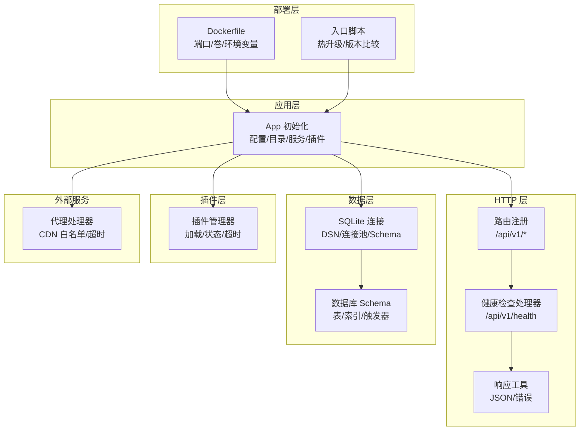
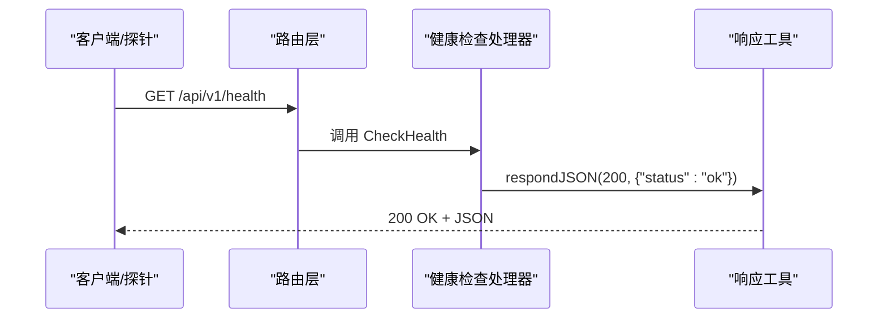
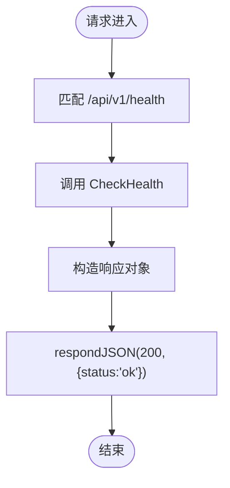
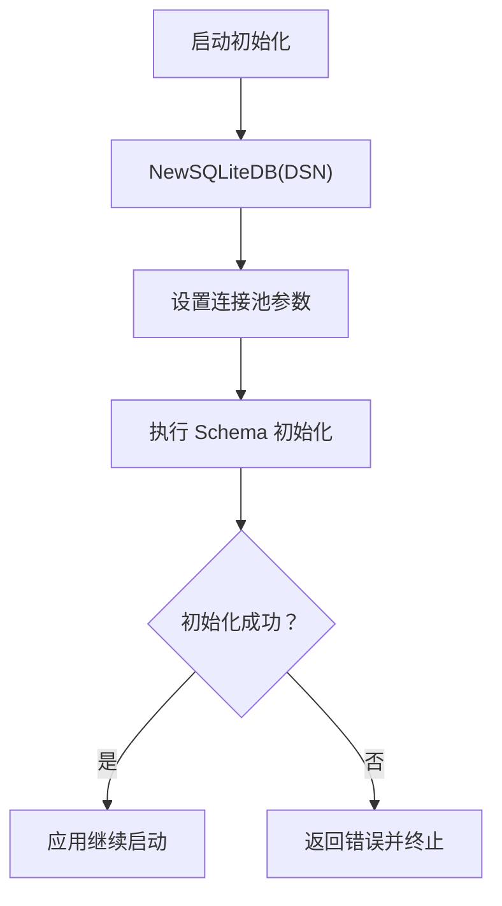
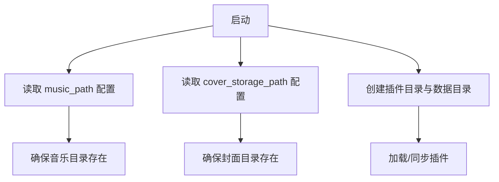
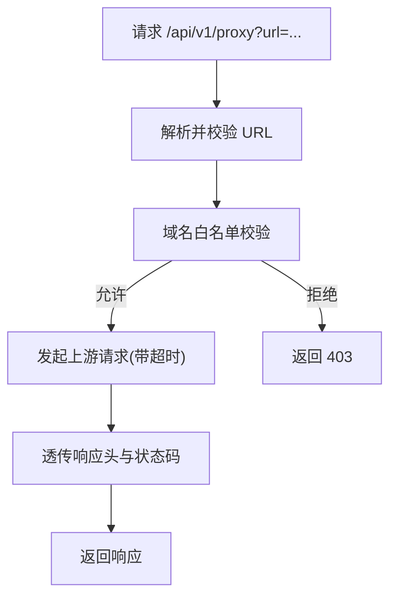
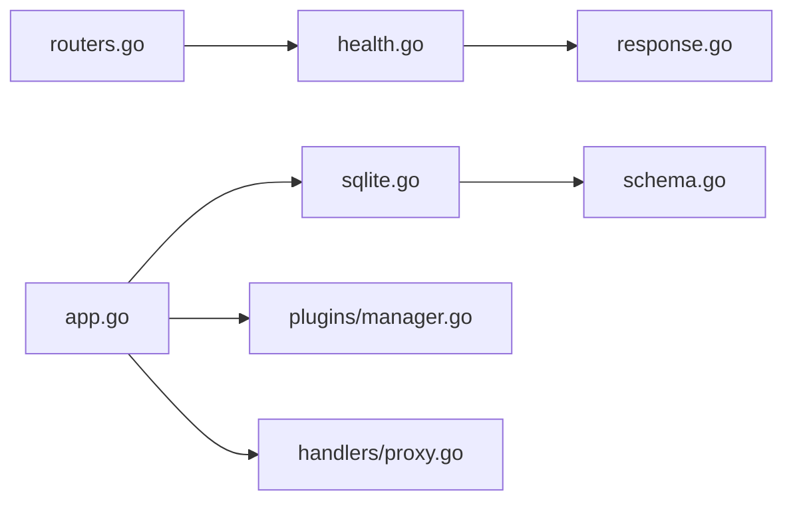

# 健康检查

<cite>
**本文引用的文件**
- [internal/handlers/health.go](file://internal/handlers/health.go)
- [internal/handlers/response.go](file://internal/handlers/response.go)
- [internal/app/routers.go](file://internal/app/routers.go)
- [internal/app/app.go](file://internal/app/app.go)
- [internal/database/sqlite.go](file://internal/database/sqlite.go)
- [internal/database/schema.go](file://internal/database/schema.go)
- [internal/services/config_service.go](file://internal/services/config_service.go)
- [internal/plugins/manager.go](file://internal/plugins/manager.go)
- [internal/handlers/proxy.go](file://internal/handlers/proxy.go)
- [Dockerfile](file://Dockerfile)
- [scripts/docker-entrypoint.sh](file://scripts/docker-entrypoint.sh)
</cite>

## 目录
1. [简介](#简介)
2. [项目结构](#项目结构)
3. [核心组件](#核心组件)
4. [架构总览](#架构总览)
5. [详细组件分析](#详细组件分析)
6. [依赖分析](#依赖分析)
7. [性能考虑](#性能考虑)
8. [故障排查指南](#故障排查指南)
9. [结论](#结论)
10. [附录](#附录)

## 简介
本指南面向运维与开发人员，提供 MiMusic 健康检查机制的完整配置与使用说明。当前系统提供一个轻量级的 /health 健康端点，返回应用基本运行状态；同时结合数据库、文件系统、插件与代理等关键能力，给出可落地的健康检查实践建议与集成方式。

## 项目结构
与健康检查直接相关的代码主要分布在以下模块：
- HTTP 路由与处理器：/internal/app/routers.go、/internal/handlers/health.go、/internal/handlers/response.go
- 应用初始化与配置：/internal/app/app.go、/internal/services/config_service.go
- 数据库与表结构：/internal/database/sqlite.go、/internal/database/schema.go
- 插件管理：/internal/plugins/manager.go
- 代理与外部服务：/internal/handlers/proxy.go
- 容器与部署：Dockerfile、scripts/docker-entrypoint.sh

图表来源
- [internal/app/routers.go:20-116](file://internal/app/routers.go#L20-L116)
- [internal/handlers/health.go:15-27](file://internal/handlers/health.go#L15-L27)
- [internal/handlers/response.go:8-24](file://internal/handlers/response.go#L8-L24)
- [internal/database/sqlite.go:22-53](file://internal/database/sqlite.go#L22-L53)
- [internal/database/schema.go:3-149](file://internal/database/schema.go#L3-L149)
- [internal/plugins/manager.go:137-156](file://internal/plugins/manager.go#L137-L156)
- [internal/handlers/proxy.go:20-35](file://internal/handlers/proxy.go#L20-L35)
- [Dockerfile:52-77](file://Dockerfile#L52-L77)
- [scripts/docker-entrypoint.sh:66-127](file://scripts/docker-entrypoint.sh#L66-L127)

章节来源
- [internal/app/routers.go:20-116](file://internal/app/routers.go#L20-L116)
- [internal/handlers/health.go:15-27](file://internal/handlers/health.go#L15-L27)
- [internal/handlers/response.go:8-24](file://internal/handlers/response.go#L8-L24)
- [internal/database/sqlite.go:22-53](file://internal/database/sqlite.go#L22-L53)
- [internal/database/schema.go:3-149](file://internal/database/schema.go#L3-L149)
- [internal/plugins/manager.go:137-156](file://internal/plugins/manager.go#L137-L156)
- [internal/handlers/proxy.go:20-35](file://internal/handlers/proxy.go#L20-L35)
- [Dockerfile:52-77](file://Dockerfile#L52-L77)
- [scripts/docker-entrypoint.sh:66-127](file://scripts/docker-entrypoint.sh#L66-L127)

## 核心组件
- 健康检查端点
  - 路由：/api/v1/health（GET）
  - 响应：JSON 对象，包含状态字段
  - 成功状态码：200
- 数据库连接健康检查
  - SQLite 连接建立、连接池配置、Schema 初始化
  - 表结构完整性依赖初始化脚本与迁移逻辑
- 文件系统健康检查
  - 音乐目录、封面存储目录、插件目录的可访问性与权限
- 外部服务可用性检查
  - 代理服务对 CDN 的连通性与白名单控制
- 定时任务与检查间隔
  - 当前仓库未提供内置定时健康检查任务，建议通过外部调度器或探针实现
- 集成到容器编排
  - Dockerfile 暴露端口与卷，入口脚本支持热升级

章节来源
- [internal/handlers/health.go:15-27](file://internal/handlers/health.go#L15-L27)
- [internal/app/routers.go:48-49](file://internal/app/routers.go#L48-L49)
- [internal/database/sqlite.go:22-53](file://internal/database/sqlite.go#L22-L53)
- [internal/database/schema.go:3-149](file://internal/database/schema.go#L3-L149)
- [internal/app/app.go:69-196](file://internal/app/app.go#L69-L196)
- [internal/handlers/proxy.go:37-70](file://internal/handlers/proxy.go#L37-L70)
- [Dockerfile:52-77](file://Dockerfile#L52-L77)
- [scripts/docker-entrypoint.sh:66-127](file://scripts/docker-entrypoint.sh#L66-L127)

## 架构总览
健康检查在 MiMusic 中以“轻量端点 + 关键资源校验”的方式实现。应用启动时完成数据库、目录与插件初始化；/health 端点仅返回应用层健康状态（当前为固定成功）。实际生产中建议扩展为多维度检查并结合外部探针。

图表来源
- [internal/app/routers.go:48-49](file://internal/app/routers.go#L48-L49)
- [internal/handlers/health.go:23-27](file://internal/handlers/health.go#L23-L27)
- [internal/handlers/response.go:8-13](file://internal/handlers/response.go#L8-L13)

## 详细组件分析

### 健康检查端点与响应格式
- 端点定义
  - 方法：GET
  - 路由：/api/v1/health
  - 处理器：HealthHandler.CheckHealth
- 响应格式
  - 成功：200 OK，JSON 对象包含状态字段
  - 错误：通过统一响应工具返回错误对象（包含错误消息与可选详情）
- 状态码
  - 成功：200
  - 错误：依据具体错误场景（如参数缺失、上游失败等）

图表来源
- [internal/app/routers.go:48-49](file://internal/app/routers.go#L48-L49)
- [internal/handlers/health.go:23-27](file://internal/handlers/health.go#L23-L27)
- [internal/handlers/response.go:8-13](file://internal/handlers/response.go#L8-L13)

章节来源
- [internal/handlers/health.go:15-27](file://internal/handlers/health.go#L15-L27)
- [internal/handlers/response.go:8-24](file://internal/handlers/response.go#L8-L24)
- [internal/app/routers.go:48-49](file://internal/app/routers.go#L48-L49)

### 数据库连接健康检查
- 连接建立
  - 通过 SQLite 驱动建立连接，设置 DSN 参数启用 WAL、busy_timeout、synchronous、cache_size、foreign_keys 等优化
  - 设置连接池：最大打开连接数、空闲连接数、连接最大生命周期
- Schema 初始化
  - 启动时执行建表与索引创建；包含内置歌单与默认配置的初始化
  - 对已存在 playlists 表执行迁移（添加 cover_path 字段）
- 健康检查建议
  - 可扩展：执行一次 SELECT 1 或查询关键表元数据，验证连接可用与表结构存在
  - 注意：当前 /health 未做数据库校验，建议在生产环境增加数据库连通性检查

图表来源
- [internal/database/sqlite.go:22-53](file://internal/database/sqlite.go#L22-L53)
- [internal/database/schema.go:3-149](file://internal/database/schema.go#L3-L149)

章节来源
- [internal/database/sqlite.go:22-53](file://internal/database/sqlite.go#L22-L53)
- [internal/database/schema.go:3-149](file://internal/database/schema.go#L3-L149)
- [internal/app/app.go:69-81](file://internal/app/app.go#L69-L81)

### 文件系统健康检查
- 音乐目录
  - 从配置服务读取音乐路径配置，若不存在则使用默认值
  - 启动时确保目录存在
- 封面存储目录
  - 从配置服务读取封面存储路径，支持相对路径转绝对路径
  - 启动时确保目录存在
- 插件目录
  - 插件目录与数据目录在应用启动时创建
  - 插件管理器负责插件同步、加载与状态维护

图表来源
- [internal/app/app.go:91-144](file://internal/app/app.go#L91-L144)
- [internal/services/config_service.go:83-112](file://internal/services/config_service.go#L83-L112)
- [internal/plugins/manager.go:215-269](file://internal/plugins/manager.go#L215-L269)

章节来源
- [internal/app/app.go:91-144](file://internal/app/app.go#L91-L144)
- [internal/services/config_service.go:83-112](file://internal/services/config_service.go#L83-L112)
- [internal/plugins/manager.go:215-269](file://internal/plugins/manager.go#L215-L269)

### 外部服务可用性检查
- 代理服务
  - 仅允许预置的音乐相关 CDN 域名白名单
  - 支持 Range 请求、流式转发、合理 User-Agent 与缓存头透传
  - 超时与错误处理明确，便于作为外部服务连通性检查的参考
- 第三方 API 与 CDN
  - 通过代理白名单与超时策略保障外部资源访问稳定性
  - 建议在生产环境中对关键 CDN 做独立探针监控

图表来源
- [internal/handlers/proxy.go:72-145](file://internal/handlers/proxy.go#L72-L145)

章节来源
- [internal/handlers/proxy.go:37-70](file://internal/handlers/proxy.go#L37-L70)
- [internal/handlers/proxy.go:72-145](file://internal/handlers/proxy.go#L72-L145)

### 定时任务与检查间隔
- 当前仓库未提供内置定时健康检查任务
- 建议方案
  - 使用外部探针（如 Prometheus Probe、Kubernetes Liveness/Readiness 探针）定期访问 /health
  - 自定义定时任务轮询数据库、文件系统与代理服务状态
  - 检查间隔建议：生产环境 30s~5m，根据业务 SLA 调整

[本节为通用实践说明，不直接分析特定文件]

### 集成到 Kubernetes 或 Docker Compose
- Kubernetes
  - 使用 livenessProbe/readinessProbe 指向 /health
  - 建议将探针超时与周期与应用超时策略一致
- Docker Compose
  - 通过 healthcheck 指令轮询 /health
  - 结合卷挂载与环境变量配置应用运行参数

章节来源
- [Dockerfile:52-77](file://Dockerfile#L52-L77)
- [scripts/docker-entrypoint.sh:66-127](file://scripts/docker-entrypoint.sh#L66-L127)

## 依赖分析
- 路由到处理器
  - /api/v1/health -> HealthHandler.CheckHealth
- 处理器到响应工具
  - CheckHealth -> respondJSON
- 应用初始化对数据库、目录与插件的影响
  - 数据库连接与 Schema 初始化
  - 音乐/封面/插件目录创建
  - 插件加载与状态管理

图表来源
- [internal/app/routers.go:48-49](file://internal/app/routers.go#L48-L49)
- [internal/handlers/health.go:23-27](file://internal/handlers/health.go#L23-L27)
- [internal/handlers/response.go:8-13](file://internal/handlers/response.go#L8-L13)
- [internal/app/app.go:69-81](file://internal/app/app.go#L69-L81)
- [internal/database/sqlite.go:22-53](file://internal/database/sqlite.go#L22-L53)
- [internal/database/schema.go:3-149](file://internal/database/schema.go#L3-L149)
- [internal/plugins/manager.go:367-389](file://internal/plugins/manager.go#L367-L389)
- [internal/handlers/proxy.go:72-145](file://internal/handlers/proxy.go#L72-L145)

章节来源
- [internal/app/routers.go:48-49](file://internal/app/routers.go#L48-L49)
- [internal/handlers/health.go:23-27](file://internal/handlers/health.go#L23-L27)
- [internal/handlers/response.go:8-13](file://internal/handlers/response.go#L8-L13)
- [internal/app/app.go:69-81](file://internal/app/app.go#L69-L81)
- [internal/database/sqlite.go:22-53](file://internal/database/sqlite.go#L22-L53)
- [internal/database/schema.go:3-149](file://internal/database/schema.go#L3-L149)
- [internal/plugins/manager.go:367-389](file://internal/plugins/manager.go#L367-L389)
- [internal/handlers/proxy.go:72-145](file://internal/handlers/proxy.go#L72-L145)

## 性能考虑
- 健康端点应尽量轻量，避免执行昂贵操作
- 数据库连接池参数已在 SQLite 初始化中设置，建议结合实际负载调整
- 代理服务超时与流式转发有助于提升外部资源访问性能与稳定性

[本节为通用指导，不直接分析特定文件]

## 故障排查指南
- /health 返回非 200
  - 检查路由注册是否正确
  - 查看应用日志确认初始化阶段是否有错误
- 数据库无法连接
  - 检查数据库文件路径与权限
  - 确认 DSN 参数与连接池配置
- 目录不可访问
  - 确认音乐目录、封面目录、插件目录存在且具备读写权限
- 代理请求失败
  - 检查目标域名是否在白名单中
  - 查看代理超时与上游错误日志

章节来源
- [internal/app/routers.go:48-49](file://internal/app/routers.go#L48-L49)
- [internal/database/sqlite.go:22-53](file://internal/database/sqlite.go#L22-L53)
- [internal/app/app.go:69-196](file://internal/app/app.go#L69-L196)
- [internal/handlers/proxy.go:72-145](file://internal/handlers/proxy.go#L72-L145)

## 结论
MiMusic 当前提供了一个简洁的 /health 健康端点与完善的基础设施（数据库、文件系统、插件与代理）。建议在生产环境中扩展数据库与文件系统连通性检查，并通过外部探针实现定时健康监测与告警，以满足更高的可靠性要求。

[本节为总结性内容，不直接分析特定文件]

## 附录

### 健康检查端点定义
- 路径：/api/v1/health
- 方法：GET
- 成功响应：200 OK，JSON 对象包含状态字段
- 错误响应：通过统一响应工具返回错误对象

章节来源
- [internal/app/routers.go:48-49](file://internal/app/routers.go#L48-L49)
- [internal/handlers/health.go:15-27](file://internal/handlers/health.go#L15-L27)
- [internal/handlers/response.go:8-24](file://internal/handlers/response.go#L8-L24)

### 数据库健康检查要点
- 连接建立与优化参数
- 连接池配置
- Schema 初始化与迁移
- 建议增加 SELECT 1 或关键表元数据查询

章节来源
- [internal/database/sqlite.go:22-53](file://internal/database/sqlite.go#L22-L53)
- [internal/database/schema.go:3-149](file://internal/database/schema.go#L3-L149)

### 文件系统健康检查要点
- 音乐目录与封面目录存在性与权限
- 插件目录与数据目录创建
- 相对路径转绝对路径处理

章节来源
- [internal/app/app.go:91-144](file://internal/app/app.go#L91-L144)
- [internal/services/config_service.go:83-112](file://internal/services/config_service.go#L83-L112)
- [internal/plugins/manager.go:215-269](file://internal/plugins/manager.go#L215-L269)

### 外部服务可用性检查要点
- 代理白名单域名
- 超时与错误处理
- 流式转发与 Range 支持

章节来源
- [internal/handlers/proxy.go:37-70](file://internal/handlers/proxy.go#L37-L70)
- [internal/handlers/proxy.go:72-145](file://internal/handlers/proxy.go#L72-L145)

### 容器与部署要点
- Dockerfile 暴露端口与卷
- 入口脚本热升级与版本比较

章节来源
- [Dockerfile:52-77](file://Dockerfile#L52-L77)
- [scripts/docker-entrypoint.sh:66-127](file://scripts/docker-entrypoint.sh#L66-L127)