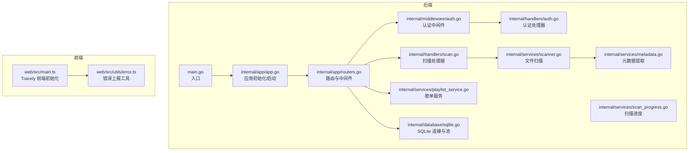
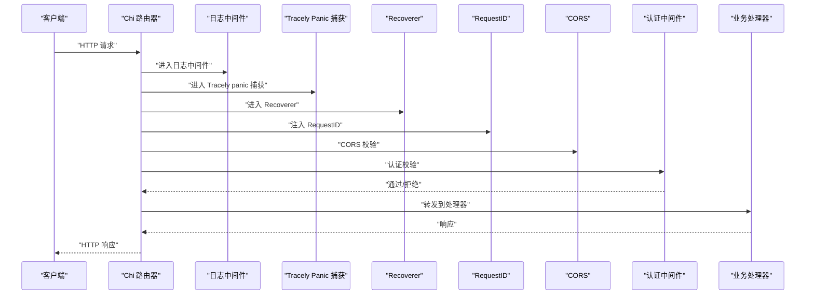
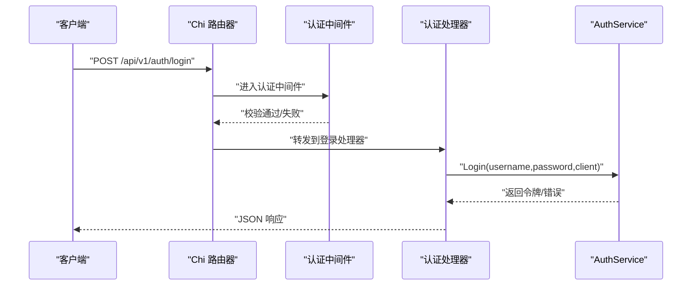
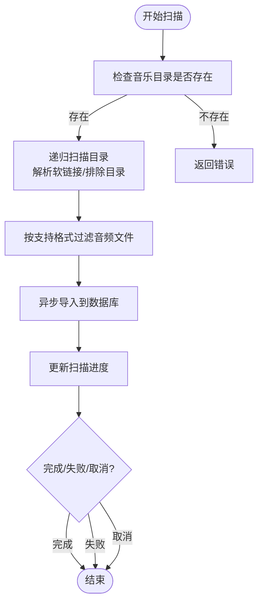
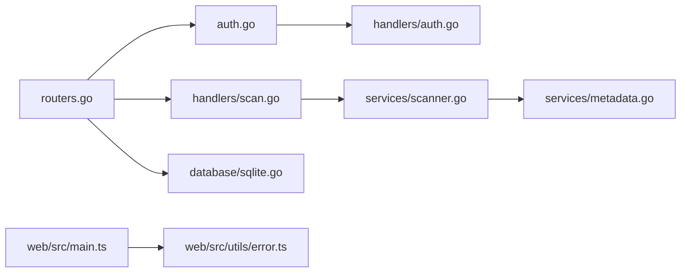

# 应用性能监控

<cite>
**本文引用的文件**
- [main.go](file://main.go)
- [internal/app/app.go](file://internal/app/app.go)
- [internal/app/routers.go](file://internal/app/routers.go)
- [internal/middleware/auth.go](file://internal/middleware/auth.go)
- [internal/handlers/auth.go](file://internal/handlers/auth.go)
- [internal/handlers/scan.go](file://internal/handlers/scan.go)
- [internal/services/scanner.go](file://internal/services/scanner.go)
- [internal/services/metadata.go](file://internal/services/metadata.go)
- [internal/services/playlist_service.go](file://internal/services/playlist_service.go)
- [internal/services/scan_progress.go](file://internal/services/scan_progress.go)
- [internal/database/sqlite.go](file://internal/database/sqlite.go)
- [web/src/main.ts](file://web/src/main.ts)
- [web/src/utils/error.ts](file://web/src/utils/error.ts)
</cite>

## 目录
1. [简介](#简介)
2. [项目结构](#项目结构)
3. [核心组件](#核心组件)
4. [架构总览](#架构总览)
5. [详细组件分析](#详细组件分析)
6. [依赖分析](#依赖分析)
7. [性能考量](#性能考量)
8. [故障排查指南](#故障排查指南)
9. [结论](#结论)
10. [附录](#附录)

## 简介
本指南面向 MiMusic 后端与前端，提供一套系统化的应用性能监控方案。重点覆盖以下方面：
- HTTP 请求响应时间、并发连接数、API 端点性能指标与数据库查询性能监控
- 在 Chi 路由器中集成性能中间件，记录请求处理时间与错误率
- 关键业务操作的性能观测：音乐扫描、元数据提取、歌单操作、认证流程
- 性能阈值与告警机制建议
- 使用 Tracely SDK 进行远程性能数据收集与错误上报
- 监控指标定义与数据采集方法，含自定义指标与现有指标解读

## 项目结构
MiMusic 采用 Go 编写的后端服务，基于 Chi 路由器提供 REST API，并通过 SQLite 存储数据；前端使用 Vue 3 + Tracely SDK 进行前端错误与性能上报。

图表来源
- [main.go:30-63](file://main.go#L30-L63)
- [internal/app/app.go:64-227](file://internal/app/app.go#L64-L227)
- [internal/app/routers.go:20-116](file://internal/app/routers.go#L20-L116)
- [internal/middleware/auth.go:12-51](file://internal/middleware/auth.go#L12-L51)
- [internal/handlers/auth.go:39-134](file://internal/handlers/auth.go#L39-L134)
- [internal/handlers/scan.go:39-93](file://internal/handlers/scan.go#L39-L93)
- [internal/services/scanner.go:31-114](file://internal/services/scanner.go#L31-L114)
- [internal/services/metadata.go:77-184](file://internal/services/metadata.go#L77-L184)
- [internal/services/playlist_service.go:24-92](file://internal/services/playlist_service.go#L24-L92)
- [internal/services/scan_progress.go:75-99](file://internal/services/scan_progress.go#L75-L99)
- [internal/database/sqlite.go:23-53](file://internal/database/sqlite.go#L23-L53)
- [web/src/main.ts:30-41](file://web/src/main.ts#L30-L41)
- [web/src/utils/error.ts:6-41](file://web/src/utils/error.ts#L6-L41)

章节来源
- [main.go:30-63](file://main.go#L30-L63)
- [internal/app/app.go:64-227](file://internal/app/app.go#L64-L227)
- [internal/app/routers.go:20-116](file://internal/app/routers.go#L20-L116)

## 核心组件
- 应用初始化与启动：负责配置解析、数据库初始化、服务层装配、插件管理、Tracely 客户端初始化与路由注册。
- Chi 路由与中间件：统一日志、恢复、CORS、请求 ID、Tracely panic 捕获中间件链路。
- 认证与鉴权：基于 JWT 的认证中间件与处理器，支持登录、刷新、登出、令牌列表与撤销。
- 扫描与元数据：异步扫描本地音乐文件，提取元数据与封面，支持进度跟踪。
- 歌单服务：提供歌单 CRUD、歌曲增删改查、排序与自动创建。
- 数据库：SQLite 连接池与 WAL 模式优化，限制最大连接数，降低锁竞争。
- 前端监控：Tracely SDK 初始化与错误上报工具封装。

章节来源
- [internal/app/app.go:64-227](file://internal/app/app.go#L64-L227)
- [internal/app/routers.go:136-249](file://internal/app/routers.go#L136-L249)
- [internal/middleware/auth.go:12-51](file://internal/middleware/auth.go#L12-L51)
- [internal/handlers/auth.go:39-134](file://internal/handlers/auth.go#L39-L134)
- [internal/handlers/scan.go:39-93](file://internal/handlers/scan.go#L39-L93)
- [internal/services/scanner.go:31-114](file://internal/services/scanner.go#L31-L114)
- [internal/services/metadata.go:77-184](file://internal/services/metadata.go#L77-L184)
- [internal/services/playlist_service.go:24-92](file://internal/services/playlist_service.go#L24-L92)
- [internal/database/sqlite.go:23-53](file://internal/database/sqlite.go#L23-L53)
- [web/src/main.ts:30-41](file://web/src/main.ts#L30-L41)
- [web/src/utils/error.ts:6-41](file://web/src/utils/error.ts#L6-L41)

## 架构总览
下图展示请求在 Chi 路由器中的处理流程，以及与 Tracely 的集成点。

图表来源
- [internal/app/routers.go:150-175](file://internal/app/routers.go#L150-L175)
- [internal/middleware/auth.go:12-51](file://internal/middleware/auth.go#L12-L51)

## 详细组件分析

### Chi 路由与性能中间件集成
- 日志中间件：可选择性跳过特定路径的日志输出，降低高频接口的开销。
- Tracely panic 捕获中间件：在 Recoverer 之前捕获 panic，上报错误与堆栈，再重新 panic 交由 Recoverer 处理。
- Recoverer：兜底异常处理。
- RequestID：为每次请求注入唯一标识，便于关联日志与追踪。
- CORS：灵活的来源白名单策略，支持本地与局域网访问。

章节来源
- [internal/app/routers.go:118-134](file://internal/app/routers.go#L118-L134)
- [internal/app/routers.go:150-175](file://internal/app/routers.go#L150-L175)
- [internal/app/routers.go:177-236](file://internal/app/routers.go#L177-L236)

### 认证流程性能监控
- 登录/刷新令牌：在处理器中记录客户端信息（UA 或远端地址），便于后续按客户端维度统计。
- 认证中间件：从 Authorization 头或 URL 查询参数中提取 token，校验失败直接返回 401，避免无效请求进入业务逻辑。
- 令牌管理：列出活跃令牌、撤销令牌，便于审计与异常处置。

图表来源
- [internal/handlers/auth.go:39-62](file://internal/handlers/auth.go#L39-L62)
- [internal/middleware/auth.go:12-51](file://internal/middleware/auth.go#L12-L51)

章节来源
- [internal/handlers/auth.go:39-134](file://internal/handlers/auth.go#L39-L134)
- [internal/middleware/auth.go:12-51](file://internal/middleware/auth.go#L12-L51)

### 音乐扫描与元数据提取性能监控
- 扫描：异步触发扫描任务，支持取消与进度查询；扫描过程中对目录进行递归遍历，跳过软链接循环，按支持格式过滤。
- 元数据：优先使用 tag 库提取基础元数据与封面，再使用 ffprobe 补充技术参数（时长、比特率、采样率）。
- 进度：通过 ScanProgressManager 维护状态机与实时进度，支持导入阶段的文件计数与错误统计。

图表来源
- [internal/services/scanner.go:31-114](file://internal/services/scanner.go#L31-L114)
- [internal/services/metadata.go:77-184](file://internal/services/metadata.go#L77-L184)
- [internal/services/scan_progress.go:75-99](file://internal/services/scan_progress.go#L75-L99)
- [internal/handlers/scan.go:39-93](file://internal/handlers/scan.go#L39-L93)

章节来源
- [internal/services/scanner.go:31-114](file://internal/services/scanner.go#L31-L114)
- [internal/services/metadata.go:77-184](file://internal/services/metadata.go#L77-L184)
- [internal/services/scan_progress.go:75-99](file://internal/services/scan_progress.go#L75-L99)
- [internal/handlers/scan.go:39-93](file://internal/handlers/scan.go#L39-L93)

### 歌单操作性能监控
- 歌单 CRUD：创建、更新、删除、列出、按分页获取歌曲、统计歌曲数量、重新排序。
- 类型约束：添加歌曲时校验类型是否允许加入对应类型的歌单。
- 自动创建歌单：根据目录结构批量创建歌单，便于大规模库的组织。

章节来源
- [internal/services/playlist_service.go:24-92](file://internal/services/playlist_service.go#L24-L92)
- [internal/services/playlist_service.go:104-137](file://internal/services/playlist_service.go#L104-L137)
- [internal/services/playlist_service.go:181-201](file://internal/services/playlist_service.go#L181-L201)
- [internal/services/playlist_service.go:204-212](file://internal/services/playlist_service.go#L204-L212)

### 数据库查询性能
- 连接池：最大打开连接数限制为 10，空闲连接 5，连接最大生命周期 30 分钟，WAL 模式下读写并发提升。
- 优化参数：启用 WAL、busy_timeout、synchronous、cache_size、foreign_keys 等参数，降低锁竞争与 IO 压力。
- 事务：BeginTx/Commit/Rollback 提供显式事务控制，减少长事务带来的锁持有时间。

章节来源
- [internal/database/sqlite.go:23-53](file://internal/database/sqlite.go#L23-L53)
- [internal/database/sqlite.go:60-79](file://internal/database/sqlite.go#L60-L79)

### Tracely 远程性能数据收集
- 后端：应用初始化时创建 Tracely 客户端，配置 AppID、Secret、Host、心跳与标签；在 panic 捕获中间件中上报错误与堆栈。
- 前端：初始化 Tracely SDK，挂载到全局 window，提供错误上报与包装异步函数的工具，便于业务侧快速接入。

章节来源
- [internal/app/app.go:206-217](file://internal/app/app.go#L206-L217)
- [internal/app/routers.go:155-172](file://internal/app/routers.go#L155-L172)
- [web/src/main.ts:30-41](file://web/src/main.ts#L30-L41)
- [web/src/utils/error.ts:6-41](file://web/src/utils/error.ts#L6-L41)

## 依赖分析
- Chi 路由器中间件链：日志 → Tracely panic 捕获 → Recoverer → RequestID → CORS → 认证中间件 → 业务处理器
- 认证中间件依赖 AuthService，处理器依赖服务层执行具体业务
- 扫描与元数据依赖外部工具 ffprobe（可配置路径），并使用 tag 库读取标签
- 数据库层基于 SQLite，连接池参数与 WAL 模式优化
- 前端依赖 @imhanxi/tracely-sdk，提供全局上报能力

图表来源
- [internal/app/routers.go:20-116](file://internal/app/routers.go#L20-L116)
- [internal/middleware/auth.go:12-51](file://internal/middleware/auth.go#L12-L51)
- [internal/handlers/auth.go:39-134](file://internal/handlers/auth.go#L39-L134)
- [internal/handlers/scan.go:39-93](file://internal/handlers/scan.go#L39-L93)
- [internal/services/scanner.go:31-114](file://internal/services/scanner.go#L31-L114)
- [internal/services/metadata.go:77-184](file://internal/services/metadata.go#L77-L184)
- [internal/database/sqlite.go:23-53](file://internal/database/sqlite.go#L23-L53)
- [web/src/main.ts:30-41](file://web/src/main.ts#L30-L41)
- [web/src/utils/error.ts:6-41](file://web/src/utils/error.ts#L6-L41)

## 性能考量
- HTTP 请求响应时间
  - 使用 Chi 中间件链记录请求处理耗时（结合 RequestID 与日志），对高频接口可选择性跳过日志以降低开销。
  - 对静态资源启用 gzip 压缩，减少传输体积。
- 并发连接数
  - SQLite 连接池最大打开连接数限制为 10，避免写操作串行化带来的瓶颈；在高并发读场景下可考虑读写分离或只读副本。
- API 端点性能指标
  - 按端点统计成功率、错误率、P50/P95/P99 响应时间；对扫描类接口增加“扫描速率（文件/秒）”指标。
- 数据库查询性能
  - WAL 模式提升读写并发；合理使用事务批量插入；对大表查询增加索引（如按类型、创建时间等）。
- 关键业务操作
  - 音乐扫描：记录扫描总耗时、平均导入耗时、失败率；对大库建议分批导入与进度持久化。
  - 元数据提取：记录 ffprobe 调用耗时与失败次数；对超时任务进行重试与降级。
  - 歌单操作：统计批量操作耗时与受影响行数；对排序与批量添加进行事务封装。
  - 认证过程：记录登录/刷新成功率与耗时，识别慢查询与频繁失败的客户端。

[本节为通用性能指导，不直接分析具体文件]

## 故障排查指南
- 后端 panic 上报
  - Tracely panic 捕获中间件会在 Recoverer 之前捕获 panic，上报错误与堆栈，随后重新 panic 交由 Recoverer 处理，保证错误可观测。
- 前端错误上报
  - 使用错误上报工具与包装函数，确保捕获的错误能够上报至 Tracely；对异步函数执行失败进行统一处理。
- 认证失败
  - 检查 Authorization 头或 URL 查询参数 access_token；确认 JWT 校验通过且未过期。
- 扫描卡住或失败
  - 检查扫描状态机与取消通道；查看进度接口返回的错误信息；确认 ffprobe 可用与路径正确。

章节来源
- [internal/app/routers.go:155-172](file://internal/app/routers.go#L155-L172)
- [web/src/utils/error.ts:6-41](file://web/src/utils/error.ts#L6-L41)
- [internal/middleware/auth.go:12-51](file://internal/middleware/auth.go#L12-L51)
- [internal/services/scan_progress.go:157-175](file://internal/services/scan_progress.go#L157-L175)

## 结论
通过 Chi 中间件链与 Tracely 的集成，MiMusic 在后端实现了统一的请求处理与错误观测；结合 SQLite 连接池优化与业务层的进度与状态管理，能够有效监控关键业务操作的性能。建议在生产环境中持续关注响应时间分布、错误率与数据库锁等待情况，并基于指标设定阈值与告警，保障系统稳定性与用户体验。

[本节为总结性内容，不直接分析具体文件]

## 附录

### 监控指标定义与采集方法
- HTTP 指标
  - 请求总量、成功/失败计数、错误率、P50/P95/P99 响应时间（按端点聚合）
  - 并发连接数（数据库连接池）、请求队列长度
  - 传输体积（压缩前后对比）
- 业务指标
  - 音乐扫描：扫描总耗时、平均导入耗时、扫描速率（文件/秒）、失败率
  - 元数据提取：ffprobe 调用耗时、失败次数、封面保存耗时
  - 歌单操作：批量添加/排序耗时、受影响行数、类型约束失败次数
  - 认证：登录/刷新成功率、耗时分布、令牌撤销次数
- 采集方法
  - 后端：在 Chi 中间件链中埋点记录请求开始与结束时间；对关键业务调用前后打点；Tracely 上报 panic 与错误
  - 前端：Tracely SDK 初始化后，使用错误上报工具与包装函数上报捕获的异常
  - 数据库：通过连接池状态与 SQL 执行时间（结合日志或 APM）统计

[本节为通用指标说明，不直接分析具体文件]