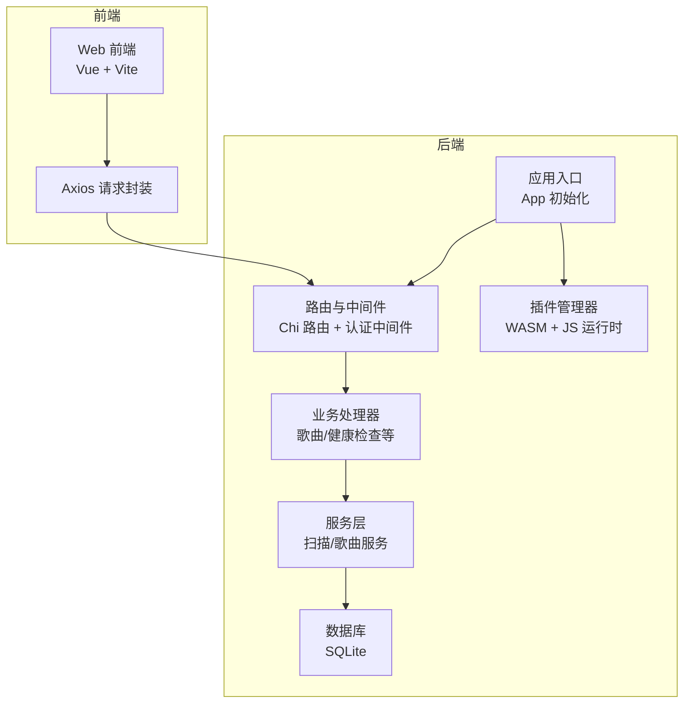
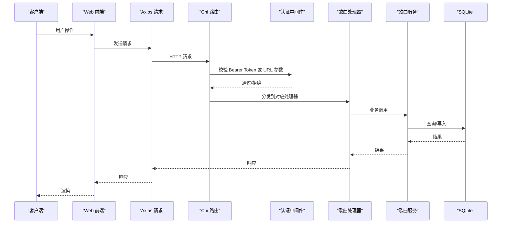
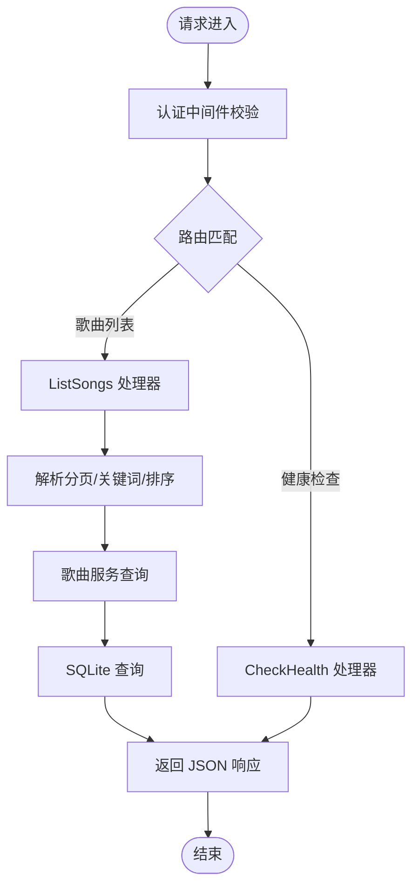
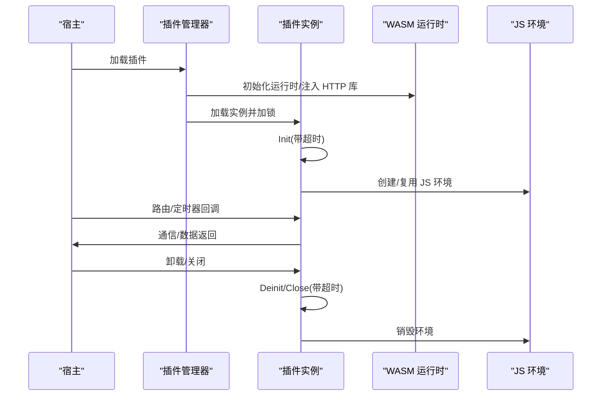
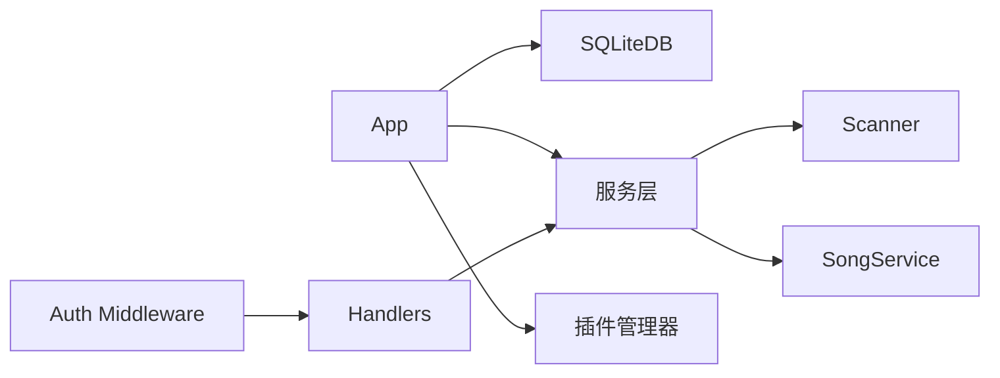

# 性能监控

<cite>
**本文引用的文件**
- [benchmark.yml](file://.github/workflows/benchmark.yml)
- [app.go](file://internal/app/app.go)
- [sqlite.go](file://internal/database/sqlite.go)
- [schema.go](file://internal/database/schema.go)
- [manager.go](file://internal/plugins/manager.go)
- [music.go](file://internal/handlers/music.go)
- [health.go](file://internal/handlers/health.go)
- [auth.go](file://internal/middleware/auth.go)
- [scanner.go](file://internal/services/scanner.go)
- [song_service.go](file://internal/services/song_service.go)
- [request.ts](file://web/src/api/request.ts)
</cite>

## 目录
1. [简介](#简介)
2. [项目结构](#项目结构)
3. [核心组件](#核心组件)
4. [架构总览](#架构总览)
5. [详细组件分析](#详细组件分析)
6. [依赖分析](#依赖分析)
7. [性能考量](#性能考量)
8. [故障排查指南](#故障排查指南)
9. [结论](#结论)
10. [附录](#附录)

## 简介
本指南面向 MiMusic 的性能监控与优化，覆盖系统资源监控、应用性能监控（HTTP 响应时间、并发连接、API 端点性能、数据库查询）、插件性能监控（WASM 执行时间、内存与通信开销）、数据库性能配置（SQLite 查询优化、索引与慢查询分析）、性能基准与负载测试流程，以及如何使用 Tracely 进行远程性能数据采集与分析。

## 项目结构
- 后端采用 Go 语言，基于 Chi 路由与 SQLite 存储，提供音乐管理、播放列表、认证与插件体系。
- 前端使用 Vue + Vite，通过 Axios 发起 API 请求，并集成认证与错误上报。
- GitHub Actions 提供基准测试工作流，便于持续回归性能。

**图表来源**
- [app.go:44-227](file://internal/app/app.go#L44-L227)
- [music.go:29-102](file://internal/handlers/music.go#L29-L102)
- [auth.go:12-51](file://internal/middleware/auth.go#L12-L51)
- [sqlite.go:22-53](file://internal/database/sqlite.go#L22-L53)
- [manager.go:137-156](file://internal/plugins/manager.go#L137-L156)

**章节来源**
- [app.go:44-227](file://internal/app/app.go#L44-L227)
- [music.go:29-102](file://internal/handlers/music.go#L29-L102)
- [auth.go:12-51](file://internal/middleware/auth.go#L12-L51)
- [sqlite.go:22-53](file://internal/database/sqlite.go#L22-L53)
- [manager.go:137-156](file://internal/plugins/manager.go#L137-L156)

## 核心组件
- 应用初始化与监控客户端
  - 初始化 Tracely 客户端，配置 AppID、Secret、心跳与标签，用于远程性能数据采集。
  - 初始化数据库（SQLite），设置 WAL、busy_timeout、synchronous、cache_size、外键等参数，优化并发与 I/O。
  - 初始化服务层（扫描、元数据提取、歌曲/播放列表服务），并加载插件管理器。
- HTTP 层
  - 认证中间件：支持 Authorization 头与 URL 查询参数 access_token，保障静态资源访问场景。
  - 业务处理器：歌曲列表/详情/删除/批量删除/更新/远程添加/电台添加/封面获取/无效歌曲清理等。
- 服务层
  - 扫描器：递归扫描音乐目录，支持软链接与排除目录，按格式过滤。
  - 歌曲服务：扫描与导入管线（预过滤 + 并发元数据提取 + 批量事务写入），支持取消与进度管理。
- 插件管理器
  - WASM 实例生命周期管理（初始化/反初始化/关闭），超时控制，JS 环境管理，路由与定时器管理。
- 数据库
  - Schema 包含歌曲、歌单、配置、认证 Token、插件表及多处索引；迁移逻辑补充列并插入内置歌单与默认配置。

**章节来源**
- [app.go:206-217](file://internal/app/app.go#L206-L217)
- [sqlite.go:22-53](file://internal/database/sqlite.go#L22-L53)
- [scanner.go:31-151](file://internal/services/scanner.go#L31-L151)
- [song_service.go:215-376](file://internal/services/song_service.go#L215-L376)
- [manager.go:392-451](file://internal/plugins/manager.go#L392-L451)
- [schema.go:4-149](file://internal/database/schema.go#L4-L149)

## 架构总览
以下序列图展示一次典型 HTTP 请求从浏览器到数据库的全链路，以及认证与监控的关键节点。

**图表来源**
- [music.go:29-102](file://internal/handlers/music.go#L29-L102)
- [auth.go:12-51](file://internal/middleware/auth.go#L12-L51)
- [sqlite.go:22-53](file://internal/database/sqlite.go#L22-L53)

## 详细组件分析

### 系统资源监控
- CPU 使用率
  - 建议使用系统级工具（如 top、htop、pidstat）观察后端进程 CPU 占用，关注扫描与元数据提取阶段的峰值。
  - 优化点：并发元数据提取 worker 数量与批量大小已在服务层内核化，避免过度并发导致上下文切换开销。
- 内存占用
  - SQLite 连接池与缓存：连接池上限、空闲连接数、页缓存大小已在数据库初始化中设置，有助于降低频繁分配与 GC 压力。
  - WASM 实例非线程安全且需显式关闭，插件管理器在卸载时进行 Deinit/Close，避免内存泄漏。
- 磁盘 I/O
  - WAL 模式提升读写并发；批量事务写入减少 fsync 次数；扫描阶段对文件系统遍历与软链接处理已做防环与去重。
- 网络带宽
  - 远程歌曲与封面下载由前端负责，建议在代理层或 CDN 层面观测带宽与延迟；后端提供健康检查接口便于存活探测。

**章节来源**
- [sqlite.go:22-53](file://internal/database/sqlite.go#L22-L53)
- [manager.go:86-135](file://internal/plugins/manager.go#L86-L135)
- [scanner.go:31-151](file://internal/services/scanner.go#L31-L151)

### 应用性能监控（HTTP）
- 响应时间
  - 前端 Axios 默认超时 30 秒，可在独立部署模式下动态调整 baseURL，确保与后端端口一致。
  - 认证中间件支持 URL 查询参数 access_token，便于静态资源场景下的鉴权与缓存。
- 并发连接数
  - SQLite 连接池上限设置为 10，空闲 5，连接最长存活 30 分钟，平衡吞吐与资源占用。
- API 端点性能
  - 歌曲列表接口支持分页与关键词过滤，服务层限制最大分页大小，防止大分页导致查询膨胀。
  - 健康检查端点用于存活探针与负载均衡健康检查。
- 数据库查询性能
  - Schema 中包含多处索引（歌曲类型、标题、艺术家、添加时间、歌单类型、标签、歌单歌曲组合索引等），配合 WAL 模式与批量事务写入，降低查询与写入延迟。

**图表来源**
- [music.go:29-102](file://internal/handlers/music.go#L29-L102)
- [health.go:15-27](file://internal/handlers/health.go#L15-L27)
- [auth.go:12-51](file://internal/middleware/auth.go#L12-L51)
- [schema.go:89-104](file://internal/database/schema.go#L89-L104)

**章节来源**
- [request.ts:21-28](file://web/src/api/request.ts#L21-L28)
- [request.ts:30-55](file://web/src/api/request.ts#L30-L55)
- [music.go:29-102](file://internal/handlers/music.go#L29-L102)
- [health.go:15-27](file://internal/handlers/health.go#L15-L27)
- [auth.go:12-51](file://internal/middleware/auth.go#L12-L51)
- [sqlite.go:36-40](file://internal/database/sqlite.go#L36-L40)
- [schema.go:89-104](file://internal/database/schema.go#L89-L104)

### 插件性能监控
- WASM 执行时间与内存
  - 插件管理器为每个实例维护互斥锁与健康状态标记，初始化/反初始化/关闭均设置超时，避免阻塞与资源泄漏。
  - JS 环境管理器按插件维度销毁，减少跨插件干扰。
- 插件间通信开销
  - 插件通过 Host 函数与后端交互，路由与定时器由管理器集中管理，避免重复注册与冲突。
- 监控建议
  - 在插件生命周期关键节点（Init/Deinit/Close）埋点，结合 Tracely 上报执行耗时与异常。
  - 对高频路由与定时器回调设置超时与重试策略，防止慢插件拖垮宿主。

**图表来源**
- [manager.go:137-156](file://internal/plugins/manager.go#L137-L156)
- [manager.go:392-451](file://internal/plugins/manager.go#L392-L451)
- [manager.go:86-135](file://internal/plugins/manager.go#L86-L135)

**章节来源**
- [manager.go:26-32](file://internal/plugins/manager.go#L26-L32)
- [manager.go:392-451](file://internal/plugins/manager.go#L392-L451)
- [manager.go:86-135](file://internal/plugins/manager.go#L86-L135)

### 数据库性能监控配置
- SQLite 查询优化
  - WAL 模式、busy_timeout、synchronous、cache_size、外键约束已启用；连接池上限/空闲/寿命合理配置。
  - 批量事务写入（flushScanBatch）显著降低磁盘写放大与锁竞争。
- 索引使用情况
  - 歌曲/歌单/关联表/配置/认证 Token/插件表均有针对性索引，加速常见查询。
- 慢查询日志分析
  - 建议在开发/测试环境启用 SQLite 慢查询日志（PRAGMA long_running_transaction_warning），定位热点查询与缺失索引。
  - 结合 Schema 中的索引设计评估命中率，必要时增加复合索引或调整查询条件。

**章节来源**
- [sqlite.go:22-53](file://internal/database/sqlite.go#L22-L53)
- [schema.go:89-104](file://internal/database/schema.go#L89-L104)
- [song_service.go:378-485](file://internal/services/song_service.go#L378-L485)

### 性能基准测试与负载测试
- 基准测试
  - GitHub Actions 工作流使用 go test -bench=. -benchmem -run=^$ ./... 生成基准结果并上传制品，便于回归对比。
- 负载测试
  - 建议使用 wrk/Artillery/JMeter 等工具对关键端点（如歌曲列表、封面获取）施压，观察响应时间与错误率。
  - 结合 Tracely 远程采集，对比不同配置（连接池、批量大小、并发 worker）下的吞吐与延迟。

**章节来源**
- [.github/workflows/benchmark.yml:38-46](file://.github/workflows/benchmark.yml#L38-L46)

### Tracely 远程性能数据采集与分析
- 客户端初始化
  - 应用启动时创建 Tracely 客户端，配置 AppID、Secret、心跳间隔与版本标签，自动上报运行状态。
- 埋点建议
  - 在关键路径（扫描/导入、插件生命周期、数据库事务、认证流程）埋点，上报耗时、错误码与上下文标签。
  - 结合前端 Axios 拦截器与后端处理器，标注请求来源、端点与用户标识，便于聚合分析。

**章节来源**
- [app.go:206-217](file://internal/app/app.go#L206-L217)

## 依赖分析
- 组件耦合
  - App 依赖数据库、服务层、插件管理器与路由；服务层依赖扫描器与元数据提取器；处理器依赖服务层；中间件依赖认证服务。
- 外部依赖
  - SQLite（modernc.org/sqlite）、Chi 路由、Wazero WASM、Tracely SDK。
- 循环依赖
  - 代码结构清晰，未见循环导入；插件管理器通过接口与回调与宿主解耦。

**图表来源**
- [app.go:44-227](file://internal/app/app.go#L44-L227)
- [song_service.go:24-32](file://internal/services/song_service.go#L24-L32)
- [scanner.go:23-28](file://internal/services/scanner.go#L23-L28)
- [music.go:17-27](file://internal/handlers/music.go#L17-L27)
- [auth.go:11-12](file://internal/middleware/auth.go#L11-L12)

**章节来源**
- [app.go:44-227](file://internal/app/app.go#L44-L227)
- [song_service.go:24-32](file://internal/services/song_service.go#L24-L32)
- [scanner.go:23-28](file://internal/services/scanner.go#L23-L28)
- [music.go:17-27](file://internal/handlers/music.go#L17-L27)
- [auth.go:11-12](file://internal/middleware/auth.go#L11-L12)

## 性能考量
- I/O 与并发
  - 使用 WAL 模式与批量事务写入，降低锁竞争与磁盘写放大；连接池上限适中，避免过多并发导致抖动。
- CPU 密集型任务
  - 扫描与元数据提取采用 worker 池与流水线模式，合理设置并发度与批大小，避免 CPU 与磁盘争用。
- 内存管理
  - 插件实例生命周期严格受控，超时与健康状态保障稳定性；JS 环境按插件维度销毁，减少碎片化。
- 网络与缓存
  - 前端 Axios 默认超时与重试策略需与后端限流/超时配合；静态资源（封面）可利用浏览器缓存与 CDN。

[本节为通用指导，无需列出具体文件来源]

## 故障排查指南
- 认证失败
  - 检查 Authorization 头或 URL 参数 access_token 是否正确传递；确认 JWT 有效与未过期。
- 健康检查失败
  - 使用 /health 端点验证服务存活；若失败，检查日志与 Tracely 上报状态。
- 扫描/导入卡顿
  - 查看扫描进度管理器状态与取消信号；检查磁盘 I/O 与文件系统权限；适当降低并发或增大批大小。
- 插件异常
  - 关注插件初始化/反初始化/关闭超时；查看实例健康状态与路由/定时器清理情况；必要时重启插件实例。
- 数据库性能问题
  - 检查索引使用情况与慢查询日志；评估查询计划与复合索引需求；确认事务批大小与 WAL 配置。

**章节来源**
- [auth.go:12-51](file://internal/middleware/auth.go#L12-L51)
- [health.go:15-27](file://internal/handlers/health.go#L15-L27)
- [song_service.go:378-485](file://internal/services/song_service.go#L378-L485)
- [manager.go:86-135](file://internal/plugins/manager.go#L86-L135)
- [sqlite.go:22-53](file://internal/database/sqlite.go#L22-L53)

## 结论
通过系统化的资源监控、HTTP 与数据库性能优化、插件生命周期治理与 Tracely 远程采集，MiMusic 能够在高并发与大规模媒体库场景下保持稳定与高效。建议持续运行基准测试与负载测试，结合索引与查询优化，逐步完善埋点与告警体系。

[本节为总结性内容，无需列出具体文件来源]

## 附录
- 前端请求配置要点
  - baseURL 动态切换（独立部署模式）；默认超时 30 秒；统一添加 Authorization 头；401 自动刷新与重试。
- 关键端点参考
  - 歌曲列表、歌曲详情、删除/批量删除、更新、远程添加、电台添加、封面获取、健康检查。

**章节来源**
- [request.ts:7-19](file://web/src/api/request.ts#L7-L19)
- [request.ts:21-28](file://web/src/api/request.ts#L21-L28)
- [request.ts:57-103](file://web/src/api/request.ts#L57-L103)
- [music.go:29-102](file://internal/handlers/music.go#L29-L102)
- [health.go:15-27](file://internal/handlers/health.go#L15-L27)