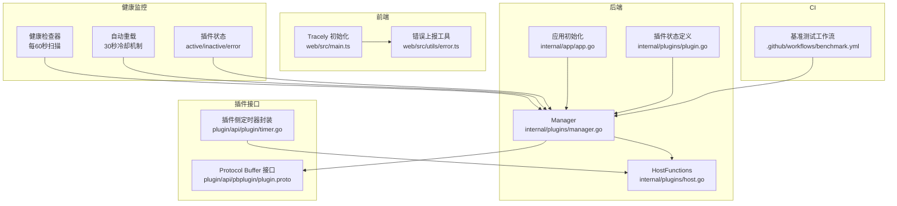
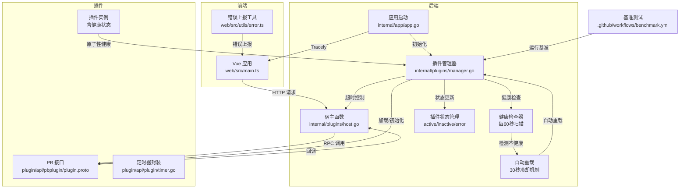
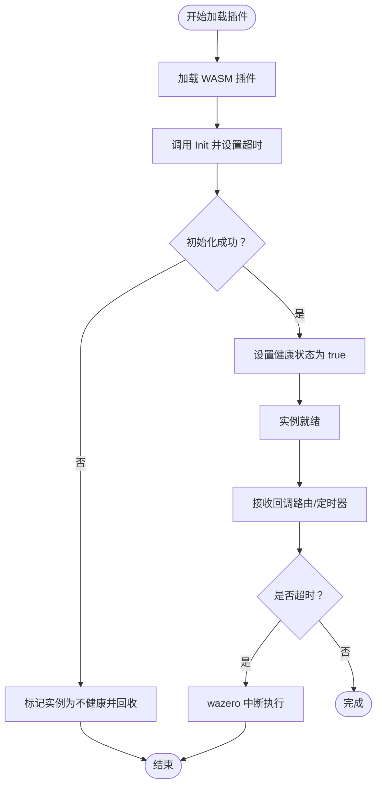
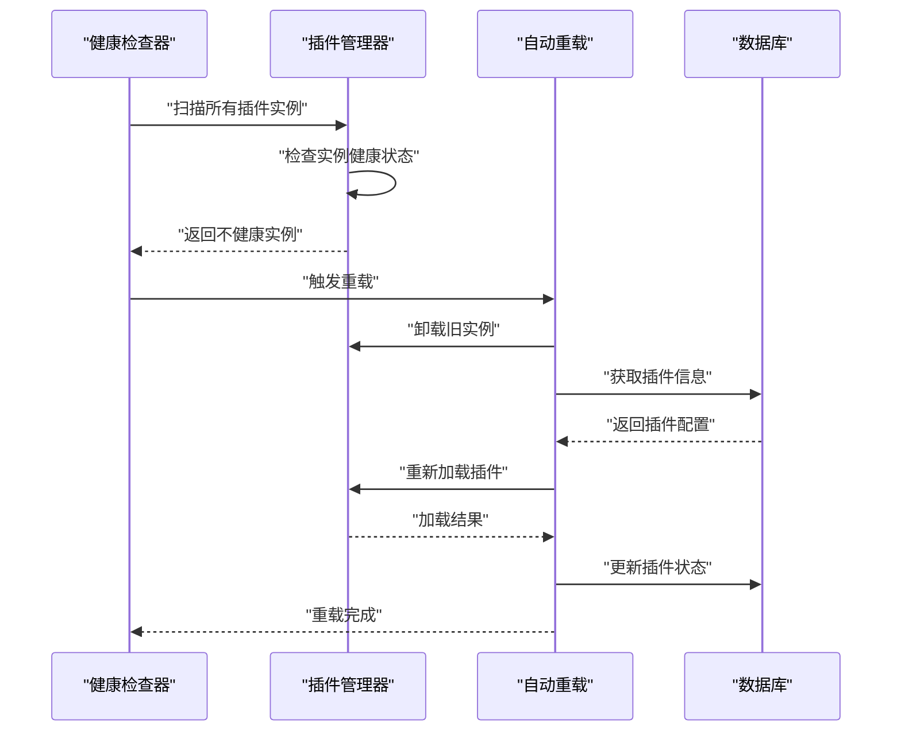
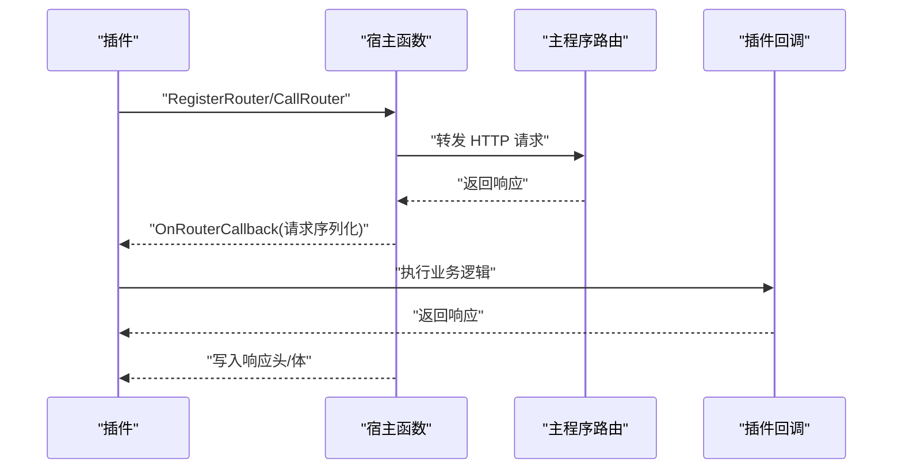
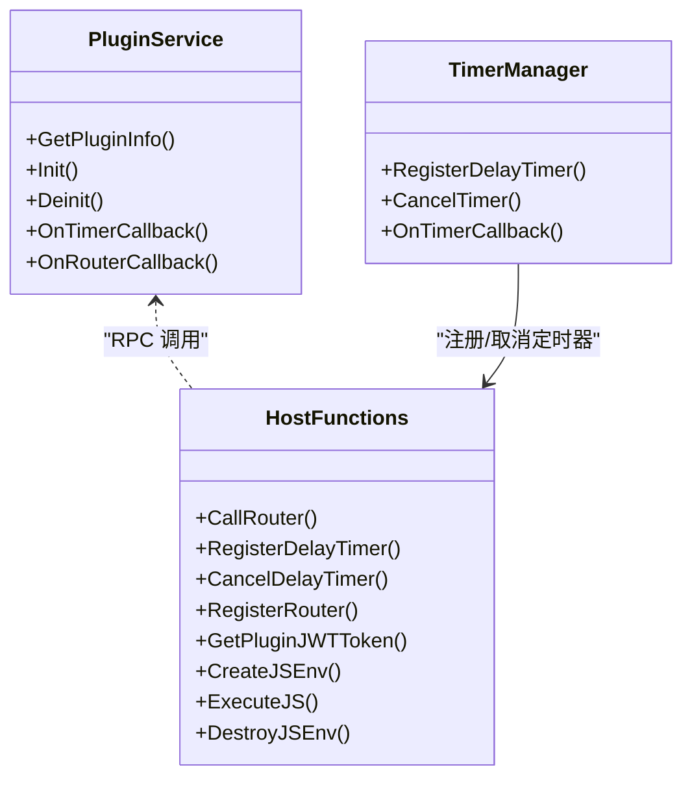
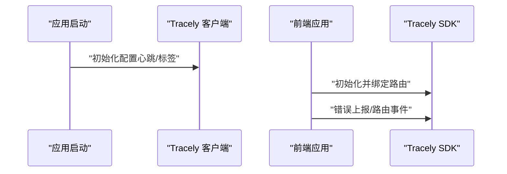
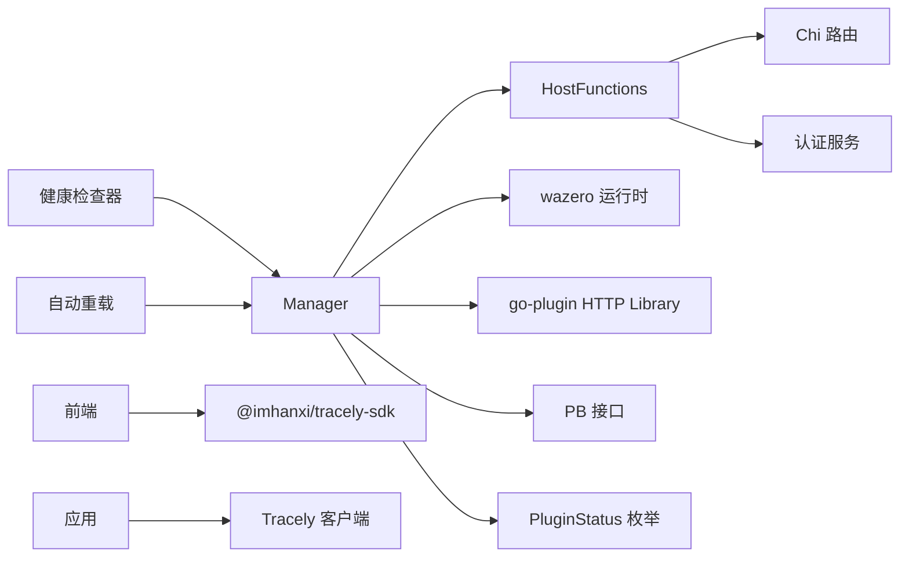

# 插件性能监控

<cite>
**本文引用的文件**   
- [internal/plugins/manager.go](file://internal/plugins/manager.go)
- [internal/plugins/host.go](file://internal/plugins/host.go)
- [plugin/api/pbplugin/plugin.proto](file://plugin/api/pbplugin/plugin.proto)
- [plugin/api/plugin/timer.go](file://plugin/api/plugin/timer.go)
- [internal/app/app.go](file://internal/app/app.go)
- [web/src/main.ts](file://web/src/main.ts)
- [web/src/utils/error.ts](file://web/src/utils/error.ts)
- [.github/workflows/benchmark.yml](file://.github/workflows/benchmark.yml)
- [internal/plugins/plugin.go](file://internal/plugins/plugin.go)
- [internal/plugins/manager_test.go](file://internal/plugins/manager_test.go)
</cite>

## 更新摘要
**变更内容**   
- 新增插件健康监控功能章节，包括后台健康检查器和自动重载机制
- 更新插件管理器架构图，添加健康检查和自动重载流程
- 新增插件实例健康状态监控和原子性管理说明
- 添加冷却机制和错误状态管理的详细说明
- 更新故障排查指南，包含健康检查相关的故障处理

## 目录
1. [简介](#简介)
2. [项目结构](#项目结构)
3. [核心组件](#核心组件)
4. [架构总览](#架构总览)
5. [详细组件分析](#详细组件分析)
6. [依赖分析](#依赖分析)
7. [性能考量](#性能考量)
8. [故障排查指南](#故障排查指南)
9. [结论](#结论)
10. [附录](#附录)

## 简介
本指南面向 MiMusic 插件生态的性能监控与优化，聚焦以下目标：
- 监控 WASM 插件的执行时间、内存使用与插件间通信开销
- 在插件管理器中集成性能监控，覆盖插件加载、初始化与运行时性能指标
- 监控插件资源消耗（CPU 时间分配与内存峰值）
- 设定插件性能基准测试流程，识别并隔离异常插件
- 提供监控数据采集方法与 Tracely 平台使用指南
- **新增**：实现插件健康监控与自动重载机制，确保系统稳定性

## 项目结构
围绕插件性能监控的关键位置如下：
- 后端插件管理与宿主函数：internal/plugins/manager.go、internal/plugins/host.go
- 插件接口定义：plugin/api/pbplugin/plugin.proto
- 插件侧定时器封装：plugin/api/plugin/timer.go
- 应用初始化与 Tracely 监控：internal/app/app.go
- 前端 Tracely 初始化与错误上报：web/src/main.ts、web/src/utils/error.ts
- 基准测试工作流：.github/workflows/benchmark.yml
- **新增**：插件状态定义：internal/plugins/plugin.go
- **新增**：健康监控测试：internal/plugins/manager_test.go

**图表来源**
- [internal/plugins/manager.go:1-790](file://internal/plugins/manager.go#L1-L790)
- [internal/plugins/host.go:1-583](file://internal/plugins/host.go#L1-L583)
- [plugin/api/pbplugin/plugin.proto:1-189](file://plugin/api/pbplugin/plugin.proto#L1-L189)
- [plugin/api/plugin/timer.go:1-104](file://plugin/api/plugin/timer.go#L1-L104)
- [internal/app/app.go:198-227](file://internal/app/app.go#L198-L227)
- [web/src/main.ts:1-45](file://web/src/main.ts#L1-L45)
- [web/src/utils/error.ts:1-41](file://web/src/utils/error.ts#L1-L41)
- [.github/workflows/benchmark.yml:1-62](file://.github/workflows/benchmark.yml#L1-L62)
- [internal/plugins/plugin.go:15-22](file://internal/plugins/plugin.go#L15-L22)
- [internal/plugins/manager_test.go:99-183](file://internal/plugins/manager_test.go#L99-L183)

**章节来源**
- [internal/plugins/manager.go:1-790](file://internal/plugins/manager.go#L1-L790)
- [internal/plugins/host.go:1-583](file://internal/plugins/host.go#L1-L583)
- [plugin/api/pbplugin/plugin.proto:1-189](file://plugin/api/pbplugin/plugin.proto#L1-L189)
- [plugin/api/plugin/timer.go:1-104](file://plugin/api/plugin/timer.go#L1-L104)
- [internal/app/app.go:198-227](file://internal/app/app.go#L198-L227)
- [web/src/main.ts:1-45](file://web/src/main.ts#L1-L45)
- [web/src/utils/error.ts:1-41](file://web/src/utils/error.ts#L1-L41)
- [.github/workflows/benchmark.yml:1-62](file://.github/workflows/benchmark.yml#L1-L62)
- [internal/plugins/plugin.go:15-22](file://internal/plugins/plugin.go#L15-L22)
- [internal/plugins/manager_test.go:99-183](file://internal/plugins/manager_test.go#L99-L183)

## 核心组件
- 插件管理器（Manager）：负责插件生命周期、加载、初始化、卸载与资源回收；内置超时控制与健康状态管理。
- 宿主函数（HostFunctions）：提供路由转发、定时器注册、JS 环境管理等能力，并对回调调用施加超时保护。
- 插件接口（PB 插件）：定义插件服务、宿主函数 RPC、路由回调、定时器回调等契约。
- 应用初始化（App）：在启动阶段初始化 Tracely 监控客户端，开启心跳与标签。
- 前端监控（Tracely SDK）：在浏览器端初始化监控 SDK，捕获错误与路由变化；提供错误上报工具。
- **新增**：健康检查器（Health Checker）：每60秒扫描所有插件实例，检测不健康插件并自动重载。
- **新增**：插件状态管理（Plugin Status）：支持 active、inactive、error 三种状态，配合健康监控使用。

**章节来源**
- [internal/plugins/manager.go:26-32](file://internal/plugins/manager.go#L26-L32)
- [internal/plugins/manager.go:35-71](file://internal/plugins/manager.go#L35-L71)
- [internal/plugins/host.go:23-30](file://internal/plugins/host.go#L23-L30)
- [plugin/api/pbplugin/plugin.proto:9-82](file://plugin/api/pbplugin/plugin.proto#L9-L82)
- [internal/app/app.go:206-217](file://internal/app/app.go#L206-L217)
- [web/src/main.ts:30-41](file://web/src/main.ts#L30-L41)
- [internal/plugins/plugin.go:15-22](file://internal/plugins/plugin.go#L15-L22)

## 架构总览
下图展示插件性能监控在系统中的位置与交互，包括新增的健康监控机制：

**图表来源**
- [internal/app/app.go:198-227](file://internal/app/app.go#L198-L227)
- [internal/plugins/manager.go:391-451](file://internal/plugins/manager.go#L391-L451)
- [internal/plugins/host.go:40-138](file://internal/plugins/host.go#L40-L138)
- [plugin/api/pbplugin/plugin.proto:9-82](file://plugin/api/pbplugin/plugin.proto#L9-L82)
- [plugin/api/plugin/timer.go:43-86](file://plugin/api/plugin/timer.go#L43-L86)
- [.github/workflows/benchmark.yml:38-46](file://.github/workflows/benchmark.yml#L38-L46)
- [web/src/main.ts:30-41](file://web/src/main.ts#L30-L41)
- [web/src/utils/error.ts:6-11](file://web/src/utils/error.ts#L6-L11)
- [internal/plugins/manager.go:737-762](file://internal/plugins/manager.go#L737-L762)
- [internal/plugins/manager.go:701-735](file://internal/plugins/manager.go#L701-L735)
- [internal/plugins/plugin.go:15-22](file://internal/plugins/plugin.go#L15-L22)

## 详细组件分析

### 插件管理器（性能监控集成点）
- 超时策略
  - 初始化超时：用于保护插件初始化过程，避免长时间阻塞。
  - 回调超时：用于保护路由/定时器回调，确保宿主可中断长时间运行的插件逻辑。
  - 反初始化与关闭超时：用于资源回收与关闭流程的兜底。
- 健康状态
  - 通过原子布尔值维护插件实例健康状态，异常时禁用实例并阻止后续回调。
  - **新增**：插件实例结构包含 `healthy atomic.Bool` 字段，确保线程安全的状态管理。
- 资源回收
  - 卸载时清理路由、销毁 JS 环境、调用 Deinit/Close 并停止定时器。
  - **新增**：不健康实例跳过 Deinit 调用，避免阻塞或未定义行为。
- 加载与初始化
  - 加载后立即调用 Init 并记录耗时；失败则标记错误并回收资源。
  - **新增**：初始化成功后将健康状态设置为 true。

**图表来源**
- [internal/plugins/manager.go:26-32](file://internal/plugins/manager.go#L26-L32)
- [internal/plugins/manager.go:429-450](file://internal/plugins/manager.go#L429-L450)
- [internal/plugins/host.go:284-297](file://internal/plugins/host.go#L284-297)
- [internal/plugins/manager.go:508-532](file://internal/plugins/manager.go#L508-L532)

**章节来源**
- [internal/plugins/manager.go:26-32](file://internal/plugins/manager.go#L26-L32)
- [internal/plugins/manager.go:86-135](file://internal/plugins/manager.go#L86-L135)
- [internal/plugins/manager.go:391-451](file://internal/plugins/manager.go#L391-L451)
- [internal/plugins/manager.go:508-532](file://internal/plugins/manager.go#L508-L532)

### 健康监控系统（新增）

#### 健康检查器
- **每60秒扫描机制**：启动后台 goroutine，使用 time.Ticker 每60秒扫描所有插件实例。
- **不健康检测**：检查每个插件实例的 `healthy` 状态，发现不健康实例时触发重载。
- **异步重载**：使用 go 关键字异步处理重载，避免阻塞健康检查循环。

#### 自动重载机制
- **冷却机制**：同一插件30秒内不重复重载，防止频繁重启导致的抖动。
- **重载流程**：卸载旧实例 → 从数据库获取插件信息 → 重新加载 → 更新状态。
- **错误处理**：重载失败时更新插件状态为 error，记录详细错误信息。

#### 插件状态管理
- **状态枚举**：支持 active、inactive、error 三种状态。
- **状态转换**：启用插件 → 加载成功 → active；加载失败 → error；手动禁用 → inactive。
- **状态持久化**：通过 Repository 接口与数据库交互，确保状态一致性。

**图表来源**
- [internal/plugins/manager.go:737-762](file://internal/plugins/manager.go#L737-L762)
- [internal/plugins/manager.go:701-735](file://internal/plugins/manager.go#L701-L735)
- [internal/plugins/plugin.go:15-22](file://internal/plugins/plugin.go#L15-L22)

**章节来源**
- [internal/plugins/manager.go:737-762](file://internal/plugins/manager.go#L737-L762)
- [internal/plugins/manager.go:701-735](file://internal/plugins/manager.go#L701-L735)
- [internal/plugins/plugin.go:15-22](file://internal/plugins/plugin.go#L15-L22)
- [internal/plugins/manager_test.go:99-183](file://internal/plugins/manager_test.go#L99-L183)

### 宿主函数（回调与通信开销控制）
- 路由回调
  - 对外暴露 HTTP 调用，内部通过宿主函数转发至主程序路由，再回调插件 OnRouterCallback。
  - 调用链路包含超时控制，防止插件长时间占用。
- 定时器回调
  - 插件注册延迟定时器，宿主在到期后调用 OnTimerCallback，并在回调完成后清理定时器。
- 认证与路由安全
  - 支持基于 Bearer Token 的认证，可选从查询参数提取 access_token。

**图表来源**
- [internal/plugins/host.go:40-138](file://internal/plugins/host.go#L40-L138)
- [internal/plugins/host.go:218-310](file://internal/plugins/host.go#L218-L310)
- [plugin/api/pbplugin/plugin.proto:62-82](file://plugin/api/pbplugin/plugin.proto#L62-L82)

**章节来源**
- [internal/plugins/host.go:40-138](file://internal/plugins/host.go#L40-L138)
- [internal/plugins/host.go:218-310](file://internal/plugins/host.go#L218-L310)
- [plugin/api/pbplugin/plugin.proto:118-132](file://plugin/api/pbplugin/plugin.proto#L118-L132)

### 插件接口（PB 插件）与定时器
- 接口定义
  - 插件服务：GetPluginInfo、Init、Deinit、OnTimerCallback、OnRouterCallback
  - 宿主函数：CallRouter、RegisterDelayTimer、CancelDelayTimer、RegisterRouter、GetPluginJWTToken、JS 环境管理
- 定时器管理
  - 插件侧封装 TimerManager，注册/取消定时器并通过宿主函数与主程序交互。

**图表来源**
- [plugin/api/pbplugin/plugin.proto:9-82](file://plugin/api/pbplugin/plugin.proto#L9-L82)
- [plugin/api/plugin/timer.go:17-104](file://plugin/api/plugin/timer.go#L17-L104)

**章节来源**
- [plugin/api/pbplugin/plugin.proto:9-82](file://plugin/api/pbplugin/plugin.proto#L9-L82)
- [plugin/api/plugin/timer.go:17-104](file://plugin/api/plugin/timer.go#L17-L104)

### 应用初始化与 Tracely 监控
- 启动阶段初始化 Tracely 客户端，开启心跳与版本标签，便于全链路监控与告警。
- 前端同样初始化 Tracely SDK，捕获错误与路由变化，结合错误上报工具实现主动上报。

**图表来源**
- [internal/app/app.go:206-217](file://internal/app/app.go#L206-L217)
- [web/src/main.ts:30-41](file://web/src/main.ts#L30-L41)

**章节来源**
- [internal/app/app.go:206-217](file://internal/app/app.go#L206-L217)
- [web/src/main.ts:30-41](file://web/src/main.ts#L30-L41)
- [web/src/utils/error.ts:6-11](file://web/src/utils/error.ts#L6-L11)

## 依赖分析
- 组件耦合
  - Manager 与 HostFunctions 强耦合：前者持有后者实例以注入宿主能力。
  - HostFunctions 依赖路由路由器与认证服务，保障回调安全与鉴权。
  - PB 接口作为契约，约束插件与宿主之间的调用规范。
  - **新增**：Manager 依赖 PluginStatus 枚举，用于状态管理和健康监控。
- 外部依赖
  - Tracely SDK：前后端统一监控平台。
  - wazero：WASM 运行时，提供 CloseOnContextDone 中断能力。
  - go-plugin HTTP Library：为 WASM 插件注入 HTTP 能力。

**图表来源**
- [internal/plugins/manager.go:138-189](file://internal/plugins/manager.go#L138-L189)
- [internal/plugins/host.go:15-21](file://internal/plugins/host.go#L15-L21)
- [internal/app/app.go:206-217](file://internal/app/app.go#L206-L217)
- [web/src/main.ts:8-41](file://web/src/main.ts#L8-L41)
- [internal/plugins/plugin.go:15-22](file://internal/plugins/plugin.go#L15-L22)

**章节来源**
- [internal/plugins/manager.go:138-189](file://internal/plugins/manager.go#L138-L189)
- [internal/plugins/host.go:15-21](file://internal/plugins/host.go#L15-L21)
- [internal/app/app.go:206-217](file://internal/app/app.go#L206-L217)
- [web/src/main.ts:8-41](file://web/src/main.ts#L8-L41)
- [internal/plugins/plugin.go:15-22](file://internal/plugins/plugin.go#L15-L22)

## 性能考量
- 执行时间监控
  - 在 Manager 的 Init 与回调调用处埋点，记录开始/结束时间与耗时，结合日志与 Tracely 上报。
  - 对路由回调与定时器回调分别统计平均耗时、P95/P99 分位，识别慢调用。
- 内存使用与峰值
  - 结合 Go 运行时与 wazero 的内存限制策略，监控插件加载后的内存占用与峰值。
  - 对频繁创建/销毁的 JS 环境进行池化与复用，降低分配成本。
- 通信开销
  - 统计宿主函数转发 HTTP 请求的往返时间、响应体大小与状态码分布。
  - 对高频路由与定时器进行采样，评估跨边界调用的开销占比。
- 超时与中断
  - 严格使用带超时的 context，确保插件长时间运行时可被宿主中断。
  - 对超时错误进行分类统计，区分 context.DeadlineExceeded 与 wazero 中断。
- 资源回收
  - 卸载时强制停止定时器、销毁 JS 环境、调用 Deinit/Close，避免资源泄漏。
- **新增**：健康监控性能
  - 健康检查器每60秒扫描一次，对系统开销影响极小。
  - 自动重载冷却机制防止频繁重启，减少系统抖动。
  - 原子性健康状态管理确保线程安全，避免竞态条件。

## 故障排查指南
- 插件初始化失败
  - 检查初始化超时日志与错误原因；若为超时，考虑优化插件初始化逻辑或提升阈值。
- 回调超时
  - 通过 isWASMTimeout 判断是否为宿主中断；定位长耗时回调并优化。
- 路由回调异常
  - 核对认证头与 access_token 参数；检查响应状态码与响应体长度。
- 定时器未触发或重复触发
  - 检查 RegisterDelayTimer 与 CancelDelayTimer 的调用顺序；确认回调完成后定时器清理。
- 前端错误上报
  - 使用 withErrorReport 包装异步函数，确保错误被 Tracely 捕获与上报。
- **新增**：健康监控相关问题
  - 健康检查器不工作：检查 ticker 是否正常启动，确认 healthCheckDone 通道状态。
  - 自动重载失败：查看重载冷却时间是否生效，检查数据库连接和插件文件状态。
  - 插件状态异常：验证 PluginStatus 枚举值，检查状态转换逻辑。
  - 不健康实例拒绝访问：确认实例健康状态，检查 Deinit 跳过逻辑。

**章节来源**
- [internal/plugins/host.go:561-582](file://internal/plugins/host.go#L561-L582)
- [internal/plugins/host.go:361-401](file://internal/plugins/host.go#L361-L401)
- [web/src/utils/error.ts:31-41](file://web/src/utils/error.ts#L31-L41)
- [internal/plugins/manager.go:737-762](file://internal/plugins/manager.go#L737-L762)
- [internal/plugins/manager.go:701-735](file://internal/plugins/manager.go#L701-L735)

## 结论
通过在插件管理器中引入超时与健康状态机制、在宿主函数中实施回调与通信开销控制，并结合 Tracely 平台实现前后端统一监控，MiMusic 能够有效保障插件生态的稳定性与可观测性。**新增的健康监控系统进一步增强了系统的自愈能力**：每60秒的后台健康检查器能够及时发现并自动重载不健康的插件实例，30秒冷却机制防止频繁重启，确保系统在出现异常时能够快速恢复。建议持续完善埋点与采样策略，建立性能基线与告警阈值，形成闭环的性能治理流程。

## 附录

### 监控数据采集方法
- 插件加载与初始化
  - 在 Manager 的 GetPluginInfo、Load、Init 流程中记录耗时与状态，输出到日志与 Tracely。
- 回调性能
  - 在 HostFunctions 的 createRouteHandler 与 RegisterDelayTimer 的回调处记录耗时与错误类型。
- 通信开销
  - 统计 CallRouter 的请求耗时、响应体大小与状态码分布，识别慢路由。
- 资源回收
  - 在 unloadPluginInstance 中记录 Deinit/Close 成功与否与耗时。
- **新增**：健康监控数据
  - 健康检查器扫描频率与成功率统计。
  - 自动重载触发次数与成功率分析。
  - 插件状态转换统计与趋势分析。

**章节来源**
- [internal/plugins/manager.go:391-451](file://internal/plugins/manager.go#L391-L451)
- [internal/plugins/host.go:40-138](file://internal/plugins/host.go#L40-L138)
- [internal/plugins/host.go:284-297](file://internal/plugins/host.go#L284-L297)
- [internal/plugins/manager.go:737-762](file://internal/plugins/manager.go#L737-L762)
- [internal/plugins/manager.go:701-735](file://internal/plugins/manager.go#L701-L735)

### 插件性能基准测试
- 使用基准测试工作流定期运行基准，输出结果并归档。
- 建议在 CI 中增加"性能回归"阈值，超过阈值时阻断合并。
- **新增**：健康监控基准测试，验证健康检查器性能与自动重载效果。

**章节来源**
- [.github/workflows/benchmark.yml:38-46](file://.github/workflows/benchmark.yml#L38-L46)

### Tracely 平台使用指南
- 后端
  - 在应用初始化阶段创建 Tracely 客户端，开启心跳与版本标签。
- 前端
  - 初始化 Tracely SDK 并绑定路由，使用错误上报工具主动上报错误。
- **新增**：健康监控可视化
  - 在 Tracely 中创建专门的健康监控仪表板。
  - 设置健康检查器运行状态告警规则。
  - 监控自动重载成功率和系统稳定性指标。

**章节来源**
- [internal/app/app.go:206-217](file://internal/app/app.go#L206-L217)
- [web/src/main.ts:30-41](file://web/src/main.ts#L30-L41)
- [web/src/utils/error.ts:6-11](file://web/src/utils/error.ts#L6-L11)

### 健康监控最佳实践
- **监控指标设置**
  - 健康检查器运行状态：检查器是否正常运行，扫描间隔是否符合预期。
  - 自动重载成功率：统计重载成功的插件数量与失败原因分类。
  - 插件状态分布：active、inactive、error 三类状态的比例变化趋势。
- **告警策略**
  - 健康检查器停止告警：当健康检查器停止运行时立即告警。
  - 高频重载告警：短时间内多次自动重载触发时告警。
  - 状态异常告警：插件状态异常波动或长时间处于 error 状态时告警。
- **故障处理流程**
  - 健康检查器异常：检查 goroutine 泄漏和通道阻塞问题。
  - 自动重载失败：检查插件文件完整性、数据库连接和权限问题。
  - 状态管理异常：验证状态转换逻辑和数据库事务一致性。

**章节来源**
- [internal/plugins/manager.go:737-762](file://internal/plugins/manager.go#L737-L762)
- [internal/plugins/manager.go:701-735](file://internal/plugins/manager.go#L701-L735)
- [internal/plugins/plugin.go:15-22](file://internal/plugins/plugin.go#L15-L22)