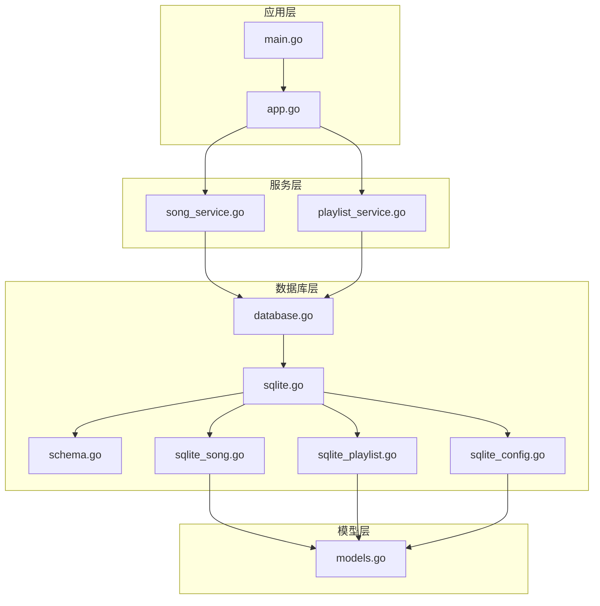
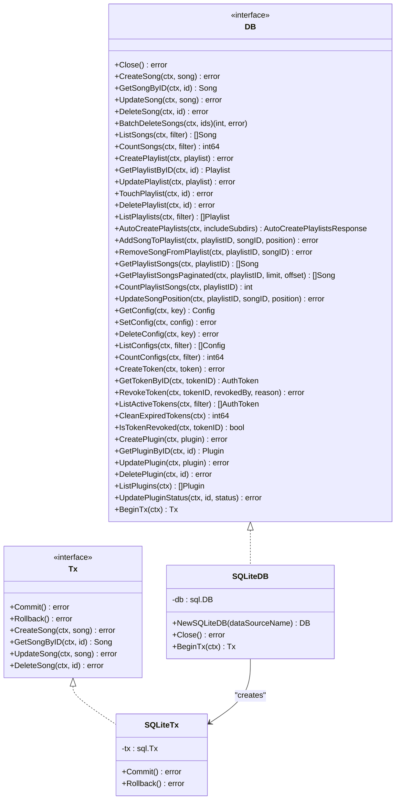
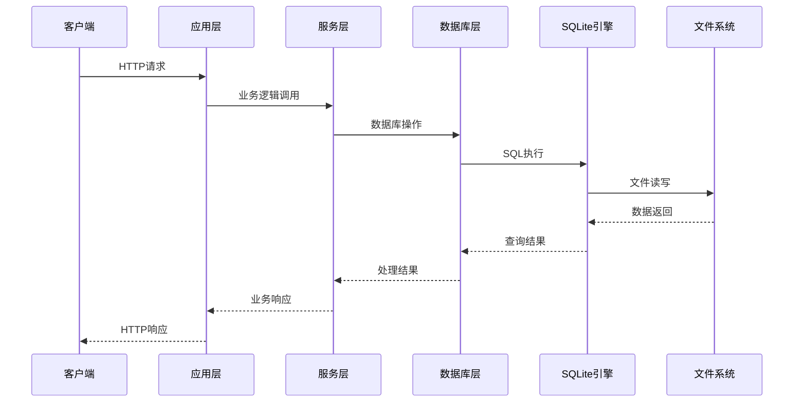
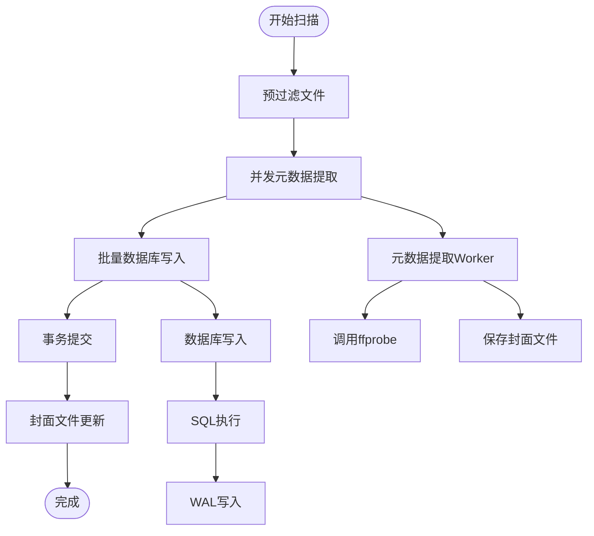
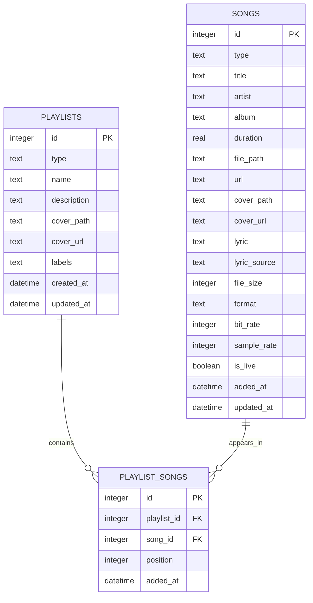
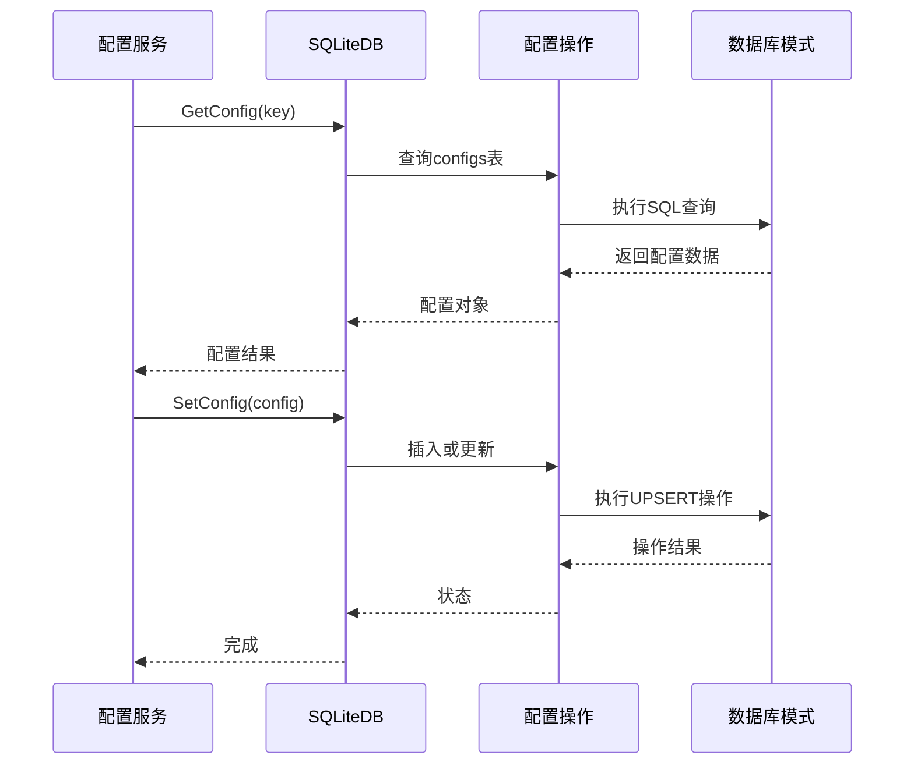
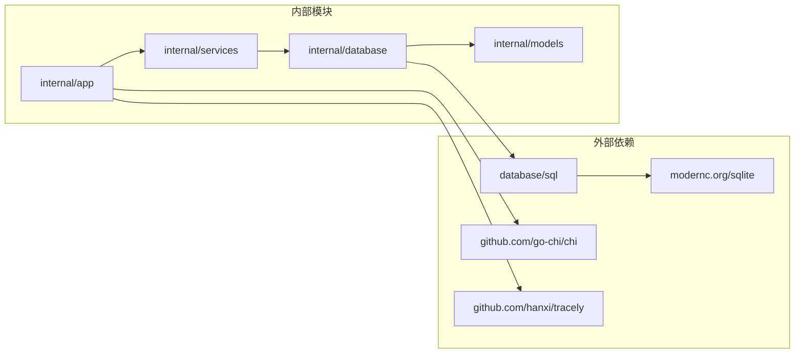
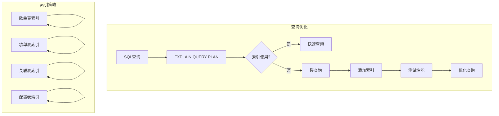
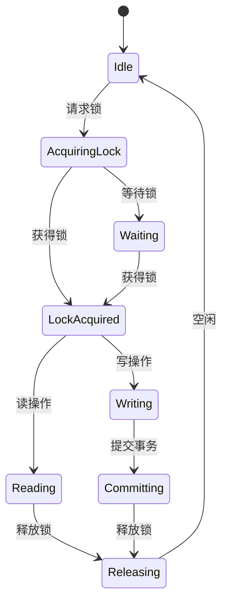

# 数据库性能监控

<cite>
**本文档引用的文件**
- [database.go](file://internal/database/database.go)
- [sqlite.go](file://internal/database/sqlite.go)
- [schema.go](file://internal/database/schema.go)
- [sqlite_song.go](file://internal/database/sqlite_song.go)
- [sqlite_playlist.go](file://internal/database/sqlite_playlist.go)
- [sqlite_config.go](file://internal/database/sqlite_config.go)
- [app.go](file://internal/app/app.go)
- [main.go](file://main.go)
- [models.go](file://internal/models/models.go)
- [song_service.go](file://internal/services/song_service.go)
- [playlist_service.go](file://internal/services/playlist_service.go)
</cite>

## 目录
1. [简介](#简介)
2. [项目结构](#项目结构)
3. [核心组件](#核心组件)
4. [架构概览](#架构概览)
5. [详细组件分析](#详细组件分析)
6. [依赖关系分析](#依赖关系分析)
7. [性能考虑因素](#性能考虑因素)
8. [故障排除指南](#故障排除指南)
9. [结论](#结论)

## 简介

MiMusic 是一个轻量级音乐服务器应用，采用 SQLite 作为主要数据存储引擎。本文档专注于数据库性能监控指南，涵盖 SQLite 数据库的性能指标监控、查询执行时间分析、连接池使用情况、锁等待时间监控、慢查询日志分析、索引使用情况监控、数据库文件大小增长趋势分析以及碎片化监控等方面。

## 项目结构

MiMusic 采用分层架构设计，数据库层位于内部模块中，提供了清晰的抽象接口和实现：

**图表来源**
- [main.go:30-64](file://main.go#L30-L64)
- [app.go:45-227](file://internal/app/app.go#L45-L227)
- [database.go:8-64](file://internal/database/database.go#L8-L64)

**章节来源**
- [main.go:30-64](file://main.go#L30-L64)
- [app.go:45-227](file://internal/app/app.go#L45-L227)

## 核心组件

### 数据库接口设计

数据库层采用了清晰的接口设计，提供了统一的抽象：

**图表来源**
- [database.go:8-76](file://internal/database/database.go#L8-L76)
- [sqlite.go:13-20](file://internal/database/sqlite.go#L13-L20)

### SQLite 连接配置

SQLite 数据库连接采用了优化的配置参数：

| 配置参数 | 值 | 作用 | 性能影响 |
|---------|----|------|----------|
| `_journal_mode=WAL` | WAL | 写入并发，读写分离 | 显著提升并发性能 |
| `_busy_timeout=5000` | 5000ms | 锁等待超时 | 减少 SQLITE_BUSY 错误 |
| `_synchronous=NORMAL` | NORMAL | 安全性与性能平衡 | 提升写入性能 |
| `_cache_size=10000` | 10000页 | 缓存大小 | 减少磁盘IO |
| `_foreign_keys=ON` | ON | 外键约束 | 数据完整性 |

**章节来源**
- [sqlite.go:23-53](file://internal/database/sqlite.go#L23-L53)

## 架构概览

MiMusic 的数据库架构采用了分层设计，确保了良好的可维护性和扩展性：

**图表来源**
- [app.go:146-163](file://internal/app/app.go#L146-L163)
- [song_service.go:45-57](file://internal/services/song_service.go#L45-L57)
- [sqlite.go:13-53](file://internal/database/sqlite.go#L13-L53)

## 详细组件分析

### 歌曲管理模块

歌曲管理模块是数据库性能监控的重点区域，涉及大量读写操作：

**图表来源**
- [song_service.go:215-376](file://internal/services/song_service.go#L215-L376)
- [sqlite_song.go:14-44](file://internal/database/sqlite_song.go#L14-L44)

#### 性能优化策略

1. **批量写入优化**：使用事务批量提交，减少磁盘fsync次数
2. **并发处理**：4个元数据提取worker并行处理
3. **预过滤机制**：跳过已存在的文件，减少不必要的处理
4. **流水线模式**：生产者-消费者模式优化内存使用

**章节来源**
- [song_service.go:215-376](file://internal/services/song_service.go#L215-L376)
- [song_service.go:378-485](file://internal/services/song_service.go#L378-L485)

### 歌单管理模块

歌单管理模块提供了复杂的关联查询能力：

**图表来源**
- [schema.go:28-51](file://internal/database/schema.go#L28-L51)
- [schema.go:90-103](file://internal/database/schema.go#L90-L103)

**章节来源**
- [schema.go:28-51](file://internal/database/schema.go#L28-L51)
- [sqlite_playlist.go:168-260](file://internal/database/sqlite_playlist.go#L168-L260)

### 配置管理模块

配置管理模块提供了灵活的配置存储和检索机制：

**图表来源**
- [sqlite_config.go:13-44](file://internal/database/sqlite_config.go#L13-L44)
- [sqlite_config.go:66-125](file://internal/database/sqlite_config.go#L66-L125)

**章节来源**
- [sqlite_config.go:13-44](file://internal/database/sqlite_config.go#L13-L44)
- [sqlite_config.go:66-125](file://internal/database/sqlite_config.go#L66-L125)

## 依赖关系分析

### 数据库依赖图

**图表来源**
- [sqlite.go:3-10](file://internal/database/sqlite.go#L3-L10)
- [app.go:3-25](file://internal/app/app.go#L3-L25)

### 性能监控依赖

数据库性能监控需要关注以下关键依赖：

1. **SQLite驱动**：modernc.org/sqlite 提供了高性能的SQLite实现
2. **连接池管理**：database/sql 包提供的连接池功能
3. **日志系统**：log/slog 提供的结构化日志记录
4. **监控工具**：Tracely 提供的应用性能监控

**章节来源**
- [sqlite.go:3-10](file://internal/database/sqlite.go#L3-L10)
- [app.go:22-42](file://internal/app/app.go#L22-L42)

## 性能考虑因素

### 连接池配置

SQLite 连接池配置对整体性能有重要影响：

| 配置项 | 当前值 | 建议范围 | 影响说明 |
|--------|--------|----------|----------|
| MaxOpenConns | 10 | 5-20 | WAL模式下读写并发，适度增加 |
| MaxIdleConns | 5 | 2-10 | 空闲连接数量，平衡内存使用 |
| ConnMaxLifetime | 30分钟 | 15-60分钟 | 连接生命周期，防止资源泄漏 |

### 查询性能优化

#### 索引使用情况

根据数据库模式，以下索引有助于性能优化：

**图表来源**
- [schema.go:89-103](file://internal/database/schema.go#L89-L103)

#### 查询执行计划分析

为了分析查询性能，可以使用 SQLite 的 EXPLAIN QUERY PLAN 功能来检查查询执行计划：

**章节来源**
- [schema.go:89-103](file://internal/database/schema.go#L89-L103)

### 锁等待监控

SQLite 的锁机制对性能有直接影响：

**图表来源**
- [sqlite.go:24-30](file://internal/database/sqlite.go#L24-L30)

## 故障排除指南

### 常见性能问题诊断

#### 1. 查询缓慢问题

**症状**：数据库查询响应时间过长

**诊断步骤**：
1. 检查是否有适当的索引
2. 分析查询执行计划
3. 监控锁等待时间
4. 检查连接池使用情况

**解决方案**：
- 为常用查询字段添加索引
- 优化复杂查询的WHERE条件
- 调整连接池参数
- 使用EXPLAIN QUERY PLAN分析

#### 2. 连接池耗尽问题

**症状**：出现连接超时或 SQLITE_BUSY 错误

**诊断步骤**：
1. 检查当前活跃连接数
2. 分析长时间运行的事务
3. 监控连接生命周期

**解决方案**：
- 增加 MaxOpenConns 数量
- 优化事务处理逻辑
- 调整连接超时时间

#### 3. 磁盘空间增长问题

**症状**：数据库文件无故增大

**诊断步骤**：
1. 检查数据库文件大小
2. 分析WAL文件状态
3. 监控碎片化程度

**解决方案**：
- 定期执行VACUUM操作
- 监控数据库文件增长趋势
- 优化数据删除策略

**章节来源**
- [sqlite.go:36-40](file://internal/database/sqlite.go#L36-L40)

### 监控指标收集

#### 1. 连接池指标

| 指标名称 | 描述 | 收集方式 |
|----------|------|----------|
| OpenConnections | 当前打开的连接数 | db.Stats().OpenConnections |
| InUse | 正在使用的连接数 | db.Stats().InUse |
| Idle | 空闲连接数 | db.Stats().Idle |
| WaitCount | 等待连接次数 | db.Stats().WaitCount |
| WaitDuration | 等待总时长 | db.Stats().WaitDuration |

#### 2. 查询性能指标

| 指标名称 | 描述 | 收集方式 |
|----------|------|----------|
| QueryCount | 查询执行次数 | 日志统计 |
| TotalTime | 查询总耗时 | 日志统计 |
| AverageTime | 平均查询时间 | 日志统计 |
| SlowQueries | 慢查询数量 | EXPLAIN分析 |

#### 3. 锁等待指标

| 指标名称 | 描述 | 收集方式 |
|----------|------|----------|
| BusyTimeout | 锁等待超时 | 配置参数 |
| BusyCount | SQLITE_BUSY 错误次数 | 日志统计 |
| LockTime | 平均锁等待时间 | 性能监控 |

**章节来源**
- [sqlite.go:36-40](file://internal/database/sqlite.go#L36-L40)

## 结论

MiMusic 的数据库架构设计充分考虑了性能优化，采用了 WAL 模式、合理的连接池配置和批量操作策略。通过实施本文档提出的监控方案，可以有效识别和解决数据库性能瓶颈，确保应用在高负载情况下仍能保持稳定的性能表现。

关键优化要点包括：
1. **合理的连接池配置**：平衡并发性能和资源使用
2. **索引策略优化**：针对常见查询模式建立合适的索引
3. **批量操作**：使用事务批量提交减少磁盘IO
4. **监控体系建设**：建立完善的性能监控和告警机制
5. **定期维护**：执行VACUUM和分析数据库健康状况

通过持续的性能监控和优化，MiMusic 能够在各种使用场景下提供稳定可靠的音乐服务体验。