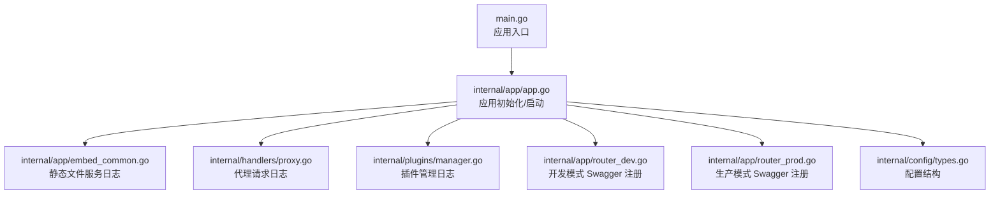
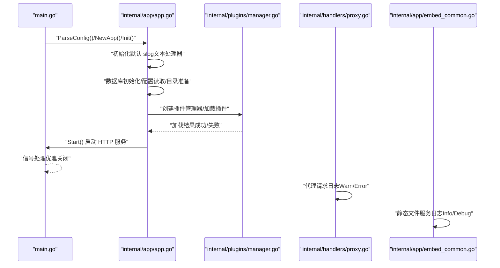
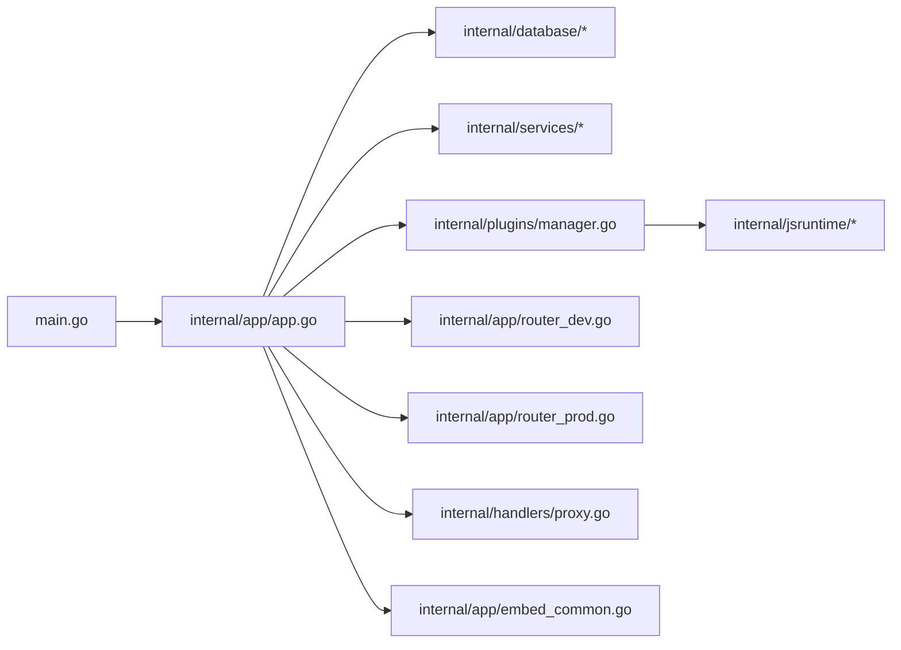

# 日志配置

<cite>
**本文引用的文件**
- [main.go](file://main.go)
- [app.go](file://internal/app/app.go)
- [embed_common.go](file://internal/app/embed_common.go)
- [proxy.go](file://internal/handlers/proxy.go)
- [types.go](file://internal/config/types.go)
- [manager.go](file://internal/plugins/manager.go)
- [router_dev.go](file://internal/app/router_dev.go)
- [router_prod.go](file://internal/app/router_prod.go)
</cite>

## 目录
1. [简介](#简介)
2. [项目结构与日志相关模块](#项目结构与日志相关模块)
3. [核心组件与日志配置](#核心组件与日志配置)
4. [架构总览](#架构总览)
5. [详细组件分析](#详细组件分析)
6. [依赖关系分析](#依赖关系分析)
7. [性能与可运维性建议](#性能与可运维性建议)
8. [故障排查指南](#故障排查指南)
9. [结论](#结论)
10. [附录：日志级别与输出目标对照表](#附录日志级别与输出目标对照表)

## 简介
本指南面向 MiMusic 的运维与开发人员，围绕 Go 标准库 slog 日志系统提供完整的配置与使用说明。内容涵盖：
- 日志级别设置（Debug、Info、Warn、Error）
- 日志格式配置（文本格式与 JSON 格式）
- 日志输出目标（控制台、文件）
- 应用启动关键日志点（数据库初始化、插件加载、服务启动等）
- 日志轮转策略（按大小轮转与按时间轮转）
- 生产环境结构化日志与外部日志系统集成（ELK/Fluentd）
- 性能优化与最佳实践

## 项目结构与日志相关模块
MiMusic 的日志主要集中在后端 Go 代码中，核心入口与应用生命周期均通过 slog 输出关键事件；前端与插件生态通过各自机制进行日志记录。

图表来源
- [main.go:30-63](file://main.go#L30-L63)
- [app.go:64-227](file://internal/app/app.go#L64-L227)
- [embed_common.go:90-148](file://internal/app/embed_common.go#L90-L148)
- [proxy.go:90-145](file://internal/handlers/proxy.go#L90-L145)
- [manager.go:375-511](file://internal/plugins/manager.go#L375-L511)
- [router_dev.go:14-18](file://internal/app/router_dev.go#L14-L18)
- [router_prod.go:7-9](file://internal/app/router_prod.go#L7-L9)
- [types.go:3-9](file://internal/config/types.go#L3-L9)

章节来源
- [main.go:30-63](file://main.go#L30-L63)
- [app.go:64-227](file://internal/app/app.go#L64-L227)
- [embed_common.go:90-148](file://internal/app/embed_common.go#L90-L148)
- [proxy.go:90-145](file://internal/handlers/proxy.go#L90-L145)
- [manager.go:375-511](file://internal/plugins/manager.go#L375-L511)
- [router_dev.go:14-18](file://internal/app/router_dev.go#L14-L18)
- [router_prod.go:7-9](file://internal/app/router_prod.go#L7-L9)
- [types.go:3-9](file://internal/config/types.go#L3-L9)

## 核心组件与日志配置
- 默认日志处理器：应用初始化阶段使用文本处理器输出到标准输出。
- 日志级别：当前代码中广泛使用 Info/Warn/Error，未直接使用 Debug；可通过替换处理器实现 Debug 级别。
- 日志格式：默认文本格式；可切换为 JSON 格式以适配结构化日志系统。
- 输出目标：当前为控制台；可替换为文件或外部日志系统。

章节来源
- [app.go:65-67](file://internal/app/app.go#L65-L67)
- [app.go:96](file://internal/app/app.go#L96)
- [app.go:108](file://internal/app/app.go#L108)
- [app.go:117](file://internal/app/app.go#L117)
- [app.go:126](file://internal/app/app.go#L126)
- [app.go:222](file://internal/app/app.go#L222)

## 架构总览
下图展示应用启动与关键日志点的交互流程。

图表来源
- [main.go:30-63](file://main.go#L30-L63)
- [app.go:64-227](file://internal/app/app.go#L64-L227)
- [manager.go:375-511](file://internal/plugins/manager.go#L375-L511)
- [proxy.go:90-145](file://internal/handlers/proxy.go#L90-L145)
- [embed_common.go:90-148](file://internal/app/embed_common.go#L90-L148)

## 详细组件分析

### 应用入口与启动日志
- 入口负责解析配置、创建应用实例、初始化与启动，并注册信号处理以优雅关闭。
- 关键日志点：
  - 配置解析失败
  - 应用初始化失败
  - 服务启动
  - 收到退出信号并关闭应用

章节来源
- [main.go:30-63](file://main.go#L30-L63)
- [app.go:230-241](file://internal/app/app.go#L230-L241)

### 应用初始化与数据库/配置/插件日志
- 初始化阶段：
  - 设置默认日志处理器（文本格式，控制台）
  - 确保数据库目录存在
  - 初始化 SQLite 数据库并记录路径
  - 读取/使用默认配置（音乐目录、扫描配置、ffprobe 路径、封面存储路径）
  - 创建封面存储目录
  - 初始化服务层（扫描器、元数据提取器、认证/升级服务）
  - 插件目录与数据目录准备
  - 同步插件目录
  - 初始化监控客户端
  - 加载已启用插件（失败时记录警告）

章节来源
- [app.go:64-227](file://internal/app/app.go#L64-L227)

### 插件管理日志
- 插件加载/启用/卸载过程中记录关键事件：
  - 加载失败（错误级别）
  - 获取插件信息失败（警告级别）
  - 插件实例健康状态检查与清理
  - 插件 Deinit/Close 资源回收（带超时与错误处理）

章节来源
- [manager.go:375-511](file://internal/plugins/manager.go#L375-L511)

### 静态文件服务日志
- 提供音乐与封面文件访问时：
  - 访问令牌校验
  - 路径解码与安全校验（防止越权）
  - 文件存在性检查（封面）
  - 记录访问与调试信息

章节来源
- [embed_common.go:90-148](file://internal/app/embed_common.go#L90-L148)

### 代理请求日志
- 对外代理请求：
  - 协议限制（仅 http/https）
  - 域名白名单校验
  - 上游请求失败时记录错误
  - 成功时透传响应头与状态码

章节来源
- [proxy.go:90-145](file://internal/handlers/proxy.go#L90-L145)

### 开发/生产模式路由差异
- 开发模式注册 Swagger 文档路由
- 生产模式不注册 Swagger

章节来源
- [router_dev.go:14-18](file://internal/app/router_dev.go#L14-L18)
- [router_prod.go:7-9](file://internal/app/router_prod.go#L7-L9)

## 依赖关系分析
- 应用入口依赖应用模块完成配置解析与启动。
- 应用模块依赖数据库、服务层、插件管理器与路由器。
- 插件管理器依赖认证服务与 JS 运行时管理器。
- 静态文件与代理处理器分别在应用模块中注册并使用。

图表来源
- [main.go:30-63](file://main.go#L30-L63)
- [app.go:64-227](file://internal/app/app.go#L64-L227)
- [manager.go:137-156](file://internal/plugins/manager.go#L137-L156)
- [router_dev.go:14-18](file://internal/app/router_dev.go#L14-L18)
- [router_prod.go:7-9](file://internal/app/router_prod.go#L7-L9)
- [proxy.go:90-145](file://internal/handlers/proxy.go#L90-L145)
- [embed_common.go:90-148](file://internal/app/embed_common.go#L90-L148)

## 性能与可运维性建议
- 日志级别
  - 开发环境：提升至 Debug，便于定位问题
  - 生产环境：保持 Info/Warn/Error，避免过多 Debug 带来的 I/O 压力
- 日志格式
  - 生产环境推荐 JSON 格式，便于结构化采集与检索
- 输出目标
  - 控制台：适合开发与容器 stdout 采集
  - 文件：配合日志轮转工具（见“日志轮转策略”）
  - 外部系统：通过 syslog、TCP/HTTP 接入 ELK/Fluentd
- 并发与异步
  - 使用异步日志处理器减少请求路径阻塞
  - 合理设置缓冲区与批量写入
- 结构化字段
  - 在关键事件中附加上下文字段（如路径、插件名、用户 ID），提升可观测性
- 资源回收
  - 优雅关闭时确保日志缓冲 flush
- 性能监控
  - 结合应用内置监控客户端，统一上报指标与日志

## 故障排查指南
- 启动失败
  - 检查配置解析与数据库初始化日志
  - 关注“应用初始化失败”“数据库初始化失败”
- 插件异常
  - 关注“加载插件失败”“获取插件信息失败”“插件 Deinit 失败或超时”
  - 检查插件目录权限与文件完整性
- 代理失败
  - 关注“代理上游请求失败”，核对上游地址、协议与域名白名单
- 静态文件访问受限
  - 关注“Access denied: path outside directory”，检查访问令牌与路径编码

章节来源
- [main.go:34-44](file://main.go#L34-L44)
- [app.go:75-81](file://internal/app/app.go#L75-L81)
- [manager.go:378-384](file://internal/plugins/manager.go#L378-L384)
- [manager.go:115-120](file://internal/plugins/manager.go#L115-L120)
- [proxy.go:130-134](file://internal/handlers/proxy.go#L130-L134)
- [embed_common.go:131-135](file://internal/app/embed_common.go#L131-L135)

## 结论
MiMusic 当前采用默认的文本日志处理器输出到控制台，覆盖了应用启动、数据库初始化、插件管理与服务运行等关键节点。建议在生产环境中切换为 JSON 格式、接入文件或外部日志系统，并结合轮转策略与异步写入提升稳定性与可维护性。

## 附录：日志级别与输出目标对照表
- 日志级别
  - Debug：调试信息（开发环境建议开启）
  - Info：关键事件与状态变更
  - Warn：非致命异常或潜在风险
  - Error：致命错误
- 输出目标
  - 控制台：开发与容器 stdout
  - 文件：配合轮转工具
  - 外部系统：ELK/Fluentd/Tail agent/Syslog

## 日志配置实施步骤

### 1. 设置日志级别
- 在应用初始化阶段创建并设置默认日志处理器，随后根据环境调整级别。
- 示例参考：[app.go:65-67](file://internal/app/app.go#L65-L67)

### 2. 切换日志格式
- 文本格式：适用于控制台阅读
- JSON 格式：便于结构化采集与检索
- 参考实现位置：[app.go:65-67](file://internal/app/app.go#L65-L67)

### 3. 配置输出目标
- 控制台：默认 stdout
- 文件：将处理器指向文件句柄
- 外部系统：通过 syslog 或 HTTP/TCP 发送
- 参考实现位置：[app.go:65-67](file://internal/app/app.go#L65-L67)

### 4. 应用启动关键日志点
- 配置解析与初始化：[main.go:32-44](file://main.go#L32-L44)、[app.go:64-81](file://internal/app/app.go#L64-L81)
- 服务启动与版本信息：[app.go:230-241](file://internal/app/app.go#L230-L241)
- 信号处理与优雅关闭：[main.go:46-56](file://main.go#L46-L56)

### 5. 插件加载与管理日志
- 加载/启用/卸载与健康检查：[manager.go:375-511](file://internal/plugins/manager.go#L375-L511)

### 6. 静态文件与代理日志
- 静态文件访问与安全校验：[embed_common.go:90-148](file://internal/app/embed_common.go#L90-L148)
- 代理请求与上游错误：[proxy.go:90-145](file://internal/handlers/proxy.go#L90-L145)

### 7. 日志轮转策略
- 按大小轮转：使用系统工具（如 logrotate/rsyslog/journald）对日志文件进行轮转与压缩
- 按时间轮转：通过外部日志系统（如 Fluentd/Journald）实现
- 建议：生产环境将 slog 输出到文件，再交由系统轮转工具管理

### 8. 结构化日志与外部系统集成
- JSON 格式：便于结构化采集
- ELK Stack：通过 Filebeat/Fluentd 收集 JSON 日志并索引
- Fluentd：作为通用日志收集器，支持多路输出
- 参考实现位置：[app.go:65-67](file://internal/app/app.go#L65-L67)

### 9. 性能优化与最佳实践
- 使用异步日志处理器，降低请求路径阻塞
- 合理设置缓冲区与批量写入
- 在关键事件中添加结构化字段（路径、插件名、用户 ID）
- 优雅关闭时确保日志 flush
- 参考实现位置：[main.go:46-56](file://main.go#L46-L56)