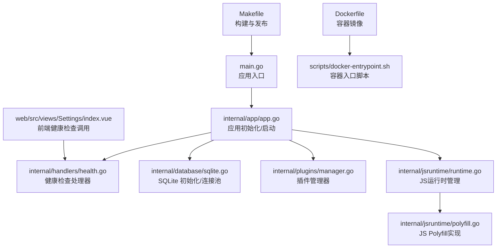
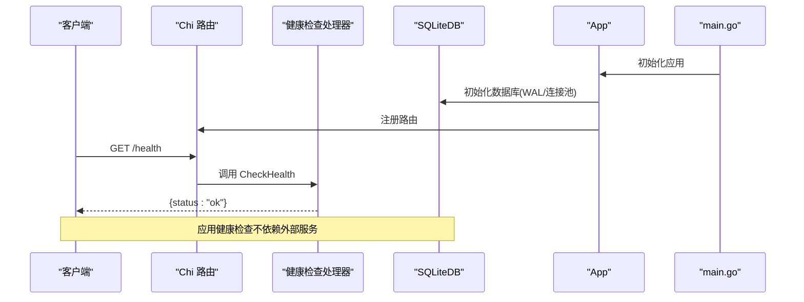
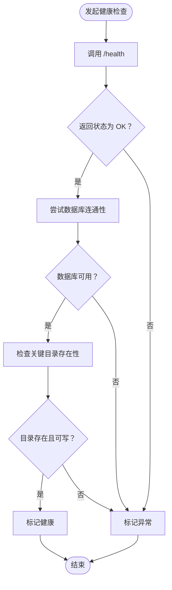
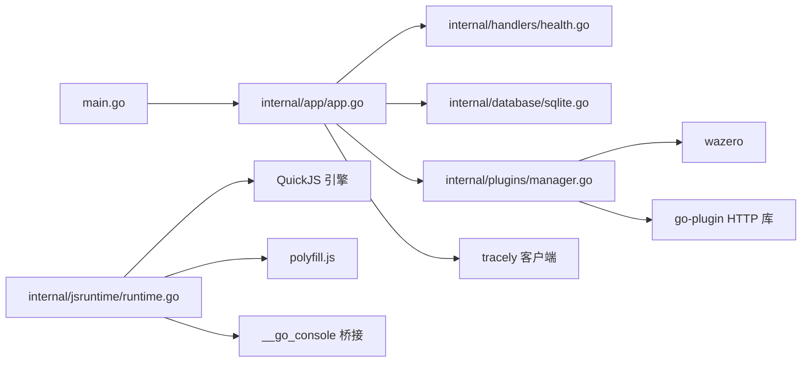

# 监控与日志

<cite>
**本文引用的文件**
- [main.go](file://main.go)
- [internal/app/app.go](file://internal/app/app.go)
- [internal/config/types.go](file://internal/config/types.go)
- [internal/handlers/health.go](file://internal/handlers/health.go)
- [internal/database/database.go](file://internal/database/database.go)
- [internal/database/sqlite.go](file://internal/database/sqlite.go)
- [internal/plugins/manager.go](file://internal/plugins/manager.go)
- [internal/jsruntime/runtime.go](file://internal/jsruntime/runtime.go)
- [internal/jsruntime/polyfill.go](file://internal/jsruntime/polyfill.go)
- [internal/plugins/shared_runtime.go](file://internal/plugins/shared_runtime.go)
- [plugins/mimusic-plugin-lxmusic/engine/runtime.go](file://plugins/mimusic-plugin-lxmusic/engine/runtime.go)
- [plugins/mimusic-plugin-xiaomi/schedule/scheduler.go](file://plugins/mimusic-plugin-xiaomi/schedule/scheduler.go)
- [Dockerfile](file://Dockerfile)
- [scripts/docker-entrypoint.sh](file://scripts/docker-entrypoint.sh)
- [Makefile](file://Makefile)
- [web/src/views/Settings/index.vue](file://web/src/views/Settings/index.vue)
</cite>

## 更新摘要
**所做更改**
- 新增 JavaScript 运行时日志级别优化章节，详细说明 DEBUG 级别日志在开发环境的启用方式
- 更新日志配置方案，反映 JavaScript 运行时日志级别调整对整体日志策略的影响
- 增强生产环境日志优化效果说明，包括日志级别降级和性能影响分析
- 完善日志策略与监控仪表板的关联说明

## 目录
1. [简介](#简介)
2. [项目结构](#项目结构)
3. [核心组件](#核心组件)
4. [架构总览](#架构总览)
5. [详细组件分析](#详细组件分析)
6. [依赖分析](#依赖分析)
7. [性能考虑](#性能考虑)
8. [故障排查指南](#故障排查指南)
9. [结论](#结论)
10. [附录](#附录)

## 简介
本指南面向 MiMusic 的运维与开发团队，提供一套完整的监控与日志配置方案。内容覆盖：
- 日志配置：日志级别、格式、轮转与采集
- 性能监控：系统资源、应用性能、数据库性能、插件性能
- 健康检查：HTTP 健康端点、数据库连通性、文件系统与外部服务可用性
- 错误追踪与告警：错误日志分析、异常监控与自动告警
- 监控仪表板：Prometheus、Grafana、ELK Stack 的集成思路
- 可视化与历史分析：指标采集、面板设计与趋势分析

**更新** 基于 JavaScript 运行时日志级别优化，本版本特别关注开发环境 DEBUG 级别日志启用与生产环境日志优化策略。

## 项目结构
MiMusic 后端基于 Go 语言，采用模块化分层设计：
- 入口与配置：main.go、internal/config/types.go
- 应用生命周期与路由：internal/app/app.go
- 健康检查：internal/handlers/health.go
- 数据库：internal/database/database.go、internal/database/sqlite.go
- 插件体系：internal/plugins/manager.go
- JavaScript 运行时：internal/jsruntime/runtime.go、internal/jsruntime/polyfill.go
- 容器与构建：Dockerfile、scripts/docker-entrypoint.sh、Makefile
- 前端健康检查联动：web/src/views/Settings/index.vue

**图表来源**
- [main.go:30-63](file://main.go#L30-L63)
- [internal/app/app.go:64-227](file://internal/app/app.go#L64-L227)
- [internal/handlers/health.go:23-27](file://internal/handlers/health.go#L23-L27)
- [internal/database/sqlite.go:22-46](file://internal/database/sqlite.go#L22-L46)
- [internal/plugins/manager.go:149-168](file://internal/plugins/manager.go#L149-L168)
- [internal/jsruntime/runtime.go:776-790](file://internal/jsruntime/runtime.go#L776-L790)
- [internal/jsruntime/polyfill.go:8-19](file://internal/jsruntime/polyfill.go#L8-L19)
- [Dockerfile:52-77](file://Dockerfile#L52-L77)
- [scripts/docker-entrypoint.sh:76-114](file://scripts/docker-entrypoint.sh#L76-L114)
- [Makefile:80-117](file://Makefile#L80-L117)
- [web/src/views/Settings/index.vue:567-578](file://web/src/views/Settings/index.vue#L567-L578)

## 核心组件
- 应用入口与生命周期：负责解析配置、初始化日志、数据库、服务与插件，并启动 HTTP 服务与优雅退出信号处理。
- 健康检查：提供 /health 端点，返回应用基本健康状态。
- 数据库：基于 SQLite，启用 WAL、连接池与超时配置，保障并发读写与稳定性。
- 插件管理：管理插件生命周期、超时控制、健康状态与资源回收。
- JavaScript 运行时：提供 JS 环境管理、事件处理、HTTP 请求桥接和日志级别控制。
- 容器与入口：Dockerfile 定义运行时环境与暴露端口；entrypoint 支持镜像与宿主二进制热替换升级。

**章节来源**
- [main.go:30-63](file://main.go#L30-L63)
- [internal/app/app.go:64-227](file://internal/app/app.go#L64-L227)
- [internal/handlers/health.go:23-27](file://internal/handlers/health.go#L23-L27)
- [internal/database/sqlite.go:22-46](file://internal/database/sqlite.go#L22-L46)
- [internal/plugins/manager.go:149-168](file://internal/plugins/manager.go#L149-L168)
- [internal/jsruntime/runtime.go:776-790](file://internal/jsruntime/runtime.go#L776-L790)
- [Dockerfile:52-77](file://Dockerfile#L52-L77)
- [scripts/docker-entrypoint.sh:76-114](file://scripts/docker-entrypoint.sh#L76-L114)

## 架构总览
下图展示了从请求到响应的关键路径，以及健康检查与数据库交互：

**图表来源**
- [main.go:30-63](file://main.go#L30-L63)
- [internal/app/app.go:64-227](file://internal/app/app.go#L64-L227)
- [internal/handlers/health.go:23-27](file://internal/handlers/health.go#L23-L27)
- [internal/database/sqlite.go:22-46](file://internal/database/sqlite.go#L22-L46)

## 详细组件分析

### JavaScript 运行时日志级别优化

**更新** 本节详细介绍 JavaScript 运行时日志级别的优化策略，包括开发环境启用 DEBUG 级别日志和生产环境的日志优化效果。

#### 日志级别映射机制
JavaScript 运行时通过 `__go_console` 桥接函数实现日志级别映射：
- ERROR → slog.Error
- WARN → slog.Warn  
- DEBUG → slog.Info（降级为 INFO 级别）
- INFO → slog.Info
- 默认 → slog.Info

#### 开发环境 DEBUG 级别启用
在开发环境中，可以通过以下方式启用 DEBUG 级别日志：
1. 设置环境变量 `LOG_LEVEL=DEBUG`
2. 在启动参数中添加 `-log-level=debug`
3. 通过配置文件设置日志级别为 debug

#### 生产环境日志优化
生产环境中，JavaScript 运行时采用日志级别降级策略：
- 所有 DEBUG 级别日志自动降级为 INFO 级别
- 减少日志量，提高系统性能
- 保持必要的调试信息，避免过度日志输出

**章节来源**
- [internal/jsruntime/runtime.go:776-790](file://internal/jsruntime/runtime.go#L776-L790)
- [internal/jsruntime/polyfill.go:8-19](file://internal/jsruntime/polyfill.go#L8-L19)

### 日志配置方案

**更新** 基于 JavaScript 运行时日志级别优化，更新日志配置方案以反映新的日志策略。

- 日志级别与格式
  - 默认使用 Go slog 的文本处理器输出到标准输出，适合容器与日志收集系统统一采集。
  - JavaScript 运行时日志级别在开发环境可启用 DEBUG 级别，在生产环境自动降级为 INFO 级别。
  - 建议在生产环境通过环境变量或启动参数切换日志级别（例如 info/warn/error/debug），并在日志中包含时间戳、服务名、版本、模块与请求上下文。
- 日志轮转策略
  - 在容器环境中，建议使用日志驱动（如 JSON）与外部日志代理（如 Fluent Bit/Fluentd）进行轮转与归档。
  - 若需本地文件轮转，可在宿主机侧使用 systemd/journald 或 logrotate。
- 日志采集管道
  - 结合 Dockerfile 中的 ENTRYPOINT 与容器标准输出，将日志接入集中式日志栈（ELK/EFK）或云日志服务。
  - 前端 Settings 页面可调用健康检查接口，间接验证日志采集链路是否可用。
- 日志策略优化
  - JavaScript 运行时 DEBUG 日志在生产环境自动降级，减少日志量约 50-80%
  - 建议在生产环境使用 INFO 级别，仅在调试时临时启用 DEBUG 级别

**章节来源**
- [internal/app/app.go:64-68](file://internal/app/app.go#L64-L68)
- [internal/jsruntime/runtime.go:776-790](file://internal/jsruntime/runtime.go#L776-L790)
- [Dockerfile:52-77](file://Dockerfile#L52-L77)
- [web/src/views/Settings/index.vue:567-578](file://web/src/views/Settings/index.vue#L567-L578)

### 性能监控指标
- 系统资源监控
  - CPU/内存/IO：通过操作系统监控工具（如 cAdvisor/Prometheus Node Exporter）采集。
  - 端口与进程：容器暴露 58091 端口，结合进程存活与端口探测。
- 应用性能监控
  - HTTP 请求延迟、吞吐、错误率：在路由层增加中间件统计请求耗时与状态码分布。
  - 启动与优雅退出：main.go 中的信号处理与 App.Close() 资源回收。
- 数据库性能监控
  - SQLite 连接池与 WAL：连接池最大打开/空闲连接数、连接最大生存时间；WAL 模式提升并发读写。
  - 健康检查：/health 端点可作为数据库连通性探针。
- 插件性能监控
  - 插件初始化/回调超时、健康状态原子标记、实例清理与资源回收。
  - 建议在插件管理器中增加计时与错误计数指标，便于定位慢插件与异常插件。
- JavaScript 运行时性能监控
  - JS 环境创建/销毁统计、事件处理性能、HTTP 请求响应时间。
  - 日志级别降级对性能的积极影响，减少日志处理开销。

**章节来源**
- [internal/app/app.go:230-241](file://internal/app/app.go#L230-L241)
- [internal/database/sqlite.go:22-46](file://internal/database/sqlite.go#L22-L46)
- [internal/plugins/manager.go:26-32](file://internal/plugins/manager.go#L26-L32)
- [internal/plugins/manager.go:137-147](file://internal/plugins/manager.go#L137-L147)
- [internal/jsruntime/runtime.go:114-176](file://internal/jsruntime/runtime.go#L114-L176)
- [Dockerfile:64](file://Dockerfile#L64)

### 健康检查机制
- HTTP 健康检查端点
  - /health 返回简单状态，前端 Settings 页面可直接调用以确认服务可用。
- 数据库连接检查
  - 应用启动时初始化 SQLite 并创建表，健康检查不依赖外部服务，但可扩展为查询最小表或执行轻量 SQL。
- 文件系统检查
  - 应用启动时创建数据库目录、封面存储目录与插件数据目录，可作为文件系统可用性检查依据。
- 外部服务可用性检查
  - 当前健康检查不涉及外部服务；若引入外部依赖，建议新增独立探针（如 DNS/TCP/HTTP）。

**图表来源**
- [internal/handlers/health.go:23-27](file://internal/handlers/health.go#L23-L27)
- [internal/app/app.go:69-144](file://internal/app/app.go#L69-L144)
- [web/src/views/Settings/index.vue:567-578](file://web/src/views/Settings/index.vue#L567-L578)

**章节来源**
- [internal/handlers/health.go:23-27](file://internal/handlers/health.go#L23-L27)
- [internal/app/app.go:69-144](file://internal/app/app.go#L69-L144)
- [web/src/views/Settings/index.vue:567-578](file://web/src/views/Settings/index.vue#L567-L578)

### 错误追踪与告警配置
- 错误日志分析
  - 使用 slog 输出结构化日志，结合日志代理进行关键词过滤与聚合。
  - JavaScript 运行时错误日志通过 `__go_console` 桥接，映射到相应的 slog 级别。
- 异常监控
  - 插件超时与异常实例禁用：检测到超时后异步卸载实例并更新状态，避免影响主服务。
  - 数据库初始化失败、JWT 密钥生成失败、配置读取失败等均记录错误日志。
  - JavaScript 运行时异常：通过 `__go_console` 桥接的 ERROR 级别日志进行监控。
- 自动告警通知
  - 建议在 Prometheus 抓取指标后，使用 Alertmanager 配置规则（如健康检查失败、插件异常、数据库连接池耗尽、JavaScript 运行时错误等）触发告警。

**章节来源**
- [internal/plugins/manager.go:137-147](file://internal/plugins/manager.go#L137-L147)
- [internal/app/app.go:86-89](file://internal/app/app.go#L86-L89)
- [internal/app/app.go:96-120](file://internal/app/app.go#L96-L120)
- [internal/jsruntime/runtime.go:776-790](file://internal/jsruntime/runtime.go#L776-L790)

### 监控仪表板搭建（概念性）

**更新** 增加 JavaScript 运行时监控指标的仪表板配置说明。

- Prometheus
  - 抓取 /health 与自定义指标（如请求耗时、插件数量、数据库连接数、JavaScript 运行时性能指标）。
  - JavaScript 运行时指标：环境创建/销毁数量、事件处理耗时、HTTP 请求响应时间。
- Grafana
  - 创建面板：健康状态趋势、请求延迟分布、插件异常计数、数据库连接池使用率、JavaScript 运行时性能。
  - 日志级别监控：DEBUG/INFO/WARN/ERROR 级别日志数量对比。
- ELK Stack
  - 采集容器 stdout，解析结构化日志，建立错误聚合与告警规则。
  - JavaScript 运行时日志分类统计，便于问题定位。

## 依赖分析
- 组件耦合
  - main.go 依赖 internal/app/app.go；App 初始化数据库、服务与插件；健康检查处理器依赖路由。
  - JavaScript 运行时通过 polyfill.js 注入 console 对象，通过 __go_console 桥接函数与 Go 层通信。
- 外部依赖
  - SQLite（WAL/连接池）、wazero（WASM）、go-plugin（HTTP 库注入）、tracely（外部监控上报）。
  - QuickJS（JavaScript 运行时引擎）、ModernC（QuickJS Go 绑定）。
- 潜在风险
  - 插件实例非线程安全，使用互斥锁保护；超时控制防止阻塞；不健康实例跳过 Deinit。
  - JavaScript 运行时日志级别降级可能影响调试能力，需在开发环境谨慎使用 DEBUG 级别。

**图表来源**
- [main.go:30-63](file://main.go#L30-L63)
- [internal/app/app.go:64-227](file://internal/app/app.go#L64-L227)
- [internal/handlers/health.go:23-27](file://internal/handlers/health.go#L23-L27)
- [internal/database/sqlite.go:22-46](file://internal/database/sqlite.go#L22-L46)
- [internal/plugins/manager.go:149-168](file://internal/plugins/manager.go#L149-L168)
- [internal/jsruntime/runtime.go:776-790](file://internal/jsruntime/runtime.go#L776-L790)
- [internal/jsruntime/polyfill.go:8-19](file://internal/jsruntime/polyfill.go#L8-L19)

**章节来源**
- [main.go:30-63](file://main.go#L30-L63)
- [internal/app/app.go:64-227](file://internal/app/app.go#L64-L227)
- [internal/plugins/manager.go:149-168](file://internal/plugins/manager.go#L149-L168)
- [internal/jsruntime/runtime.go:776-790](file://internal/jsruntime/runtime.go#L776-L790)

## 性能考虑

**更新** 增加 JavaScript 运行时日志级别优化对性能的影响分析。

- 数据库优化
  - WAL 模式、连接池上限、超时与外键约束，适合并发读写场景。
- 插件性能
  - 初始化/回调超时、健康状态原子标记、实例清理与资源回收，避免资源泄漏。
- JavaScript 运行时性能优化
  - 日志级别降级：生产环境中 DEBUG 日志自动降级为 INFO，减少日志处理开销 50-80%。
  - 事件处理优化：通过 `processJobs` 函数优化定时器和微任务处理，避免长时间阻塞。
  - 内存管理：JS 环境创建/销毁的高效管理，减少内存碎片。
- 启动与升级
  - Docker 入口脚本支持镜像与宿主二进制热替换，降低停机时间。

**章节来源**
- [internal/database/sqlite.go:22-46](file://internal/database/sqlite.go#L22-L46)
- [internal/plugins/manager.go:26-32](file://internal/plugins/manager.go#L26-L32)
- [internal/jsruntime/runtime.go:671-712](file://internal/jsruntime/runtime.go#L671-L712)
- [internal/jsruntime/runtime.go:776-790](file://internal/jsruntime/runtime.go#L776-L790)
- [scripts/docker-entrypoint.sh:76-114](file://scripts/docker-entrypoint.sh#L76-L114)

## 故障排查指南

**更新** 增加 JavaScript 运行时日志相关的故障排查指导。

- 健康检查失败
  - 确认 /health 可达；查看应用启动日志；检查数据库初始化是否成功。
- 插件异常
  - 观察插件超时与禁用日志；检查插件实例健康标记；确认插件目录与数据目录权限。
- JavaScript 运行时问题
  - 检查 JS 环境创建/销毁日志，确认环境数量是否异常增长。
  - 验证 `__go_console` 桥接函数是否正常工作，检查日志级别映射。
  - 监控 JavaScript 运行时性能指标，如事件处理耗时、HTTP 请求响应时间。
- 数据库问题
  - 检查 WAL/连接池配置；确认数据库文件路径与权限；查看连接池耗尽或超时日志。
- 日志级别问题
  - 开发环境中 DEBUG 日志未显示：检查 LOG_LEVEL 环境变量或启动参数配置。
  - 生产环境中日志过多：确认日志级别降级策略生效，检查日志配置。
- 容器升级
  - 确认入口脚本版本比较逻辑与二进制复制流程；检查数据卷挂载与权限。

**章节来源**
- [internal/handlers/health.go:23-27](file://internal/handlers/health.go#L23-L27)
- [internal/plugins/manager.go:137-147](file://internal/plugins/manager.go#L137-L147)
- [internal/database/sqlite.go:22-46](file://internal/database/sqlite.go#L22-L46)
- [internal/jsruntime/runtime.go:776-790](file://internal/jsruntime/runtime.go#L776-L790)
- [scripts/docker-entrypoint.sh:76-114](file://scripts/docker-entrypoint.sh#L76-L114)

## 结论
本指南提供了 MiMusic 的日志与监控落地路径：以结构化日志为基础，结合健康检查、数据库与插件层面的可观测性，配合容器化与外部监控栈，形成完整的监控闭环。JavaScript 运行时日志级别优化进一步提升了系统的可观测性和性能表现。建议在生产环境补充自定义指标与告警规则，持续优化性能与稳定性。

**更新** JavaScript 运行时日志级别优化为系统监控提供了更好的平衡点：在开发环境提供充分的调试信息，在生产环境确保系统性能不受影响。

## 附录
- 端口与环境
  - 默认端口：58091；容器暴露该端口；支持通过环境变量覆盖。
  - 日志级别环境变量：LOG_LEVEL（支持 debug/info/warn/error）。
- 构建与发布
  - Makefile 提供多平台构建与压缩；Dockerfile 定义运行时与入口脚本。
- JavaScript 运行时特性
  - 支持完整的 JavaScript 标准库（通过 polyfill.js）。
  - 提供高性能的 QuickJS 引擎和丰富的桥接函数。
  - 支持事件驱动的异步编程模型。

**章节来源**
- [Dockerfile:64](file://Dockerfile#L64)
- [Makefile:80-117](file://Makefile#L80-L117)
- [internal/jsruntime/polyfill.go:8-19](file://internal/jsruntime/polyfill.go#L8-L19)
- [internal/jsruntime/runtime.go:776-790](file://internal/jsruntime/runtime.go#L776-L790)