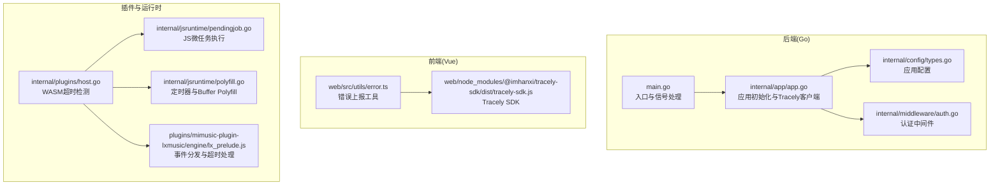
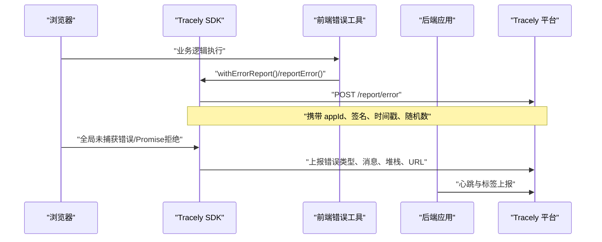
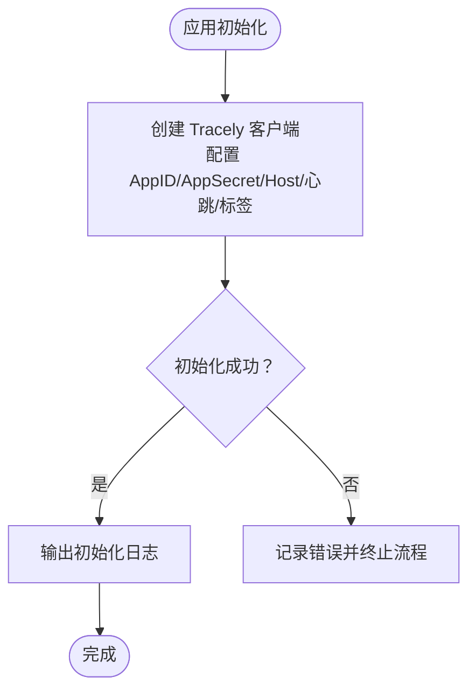
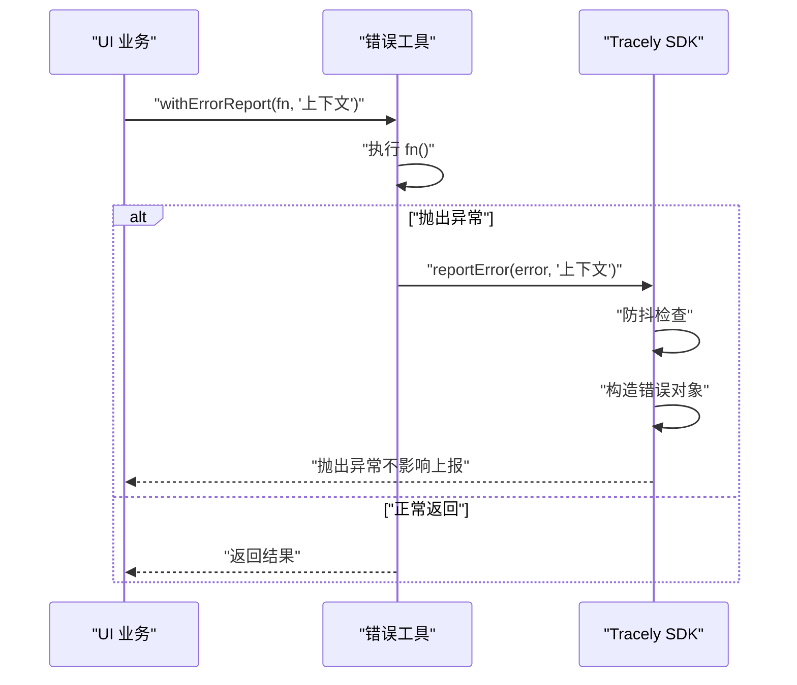
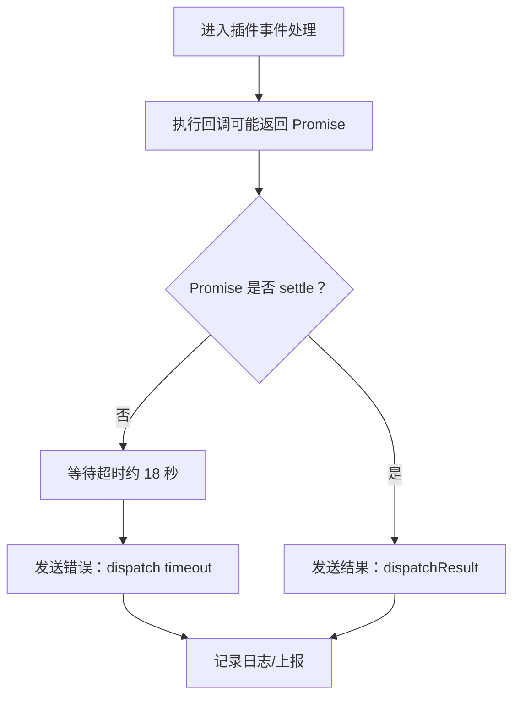
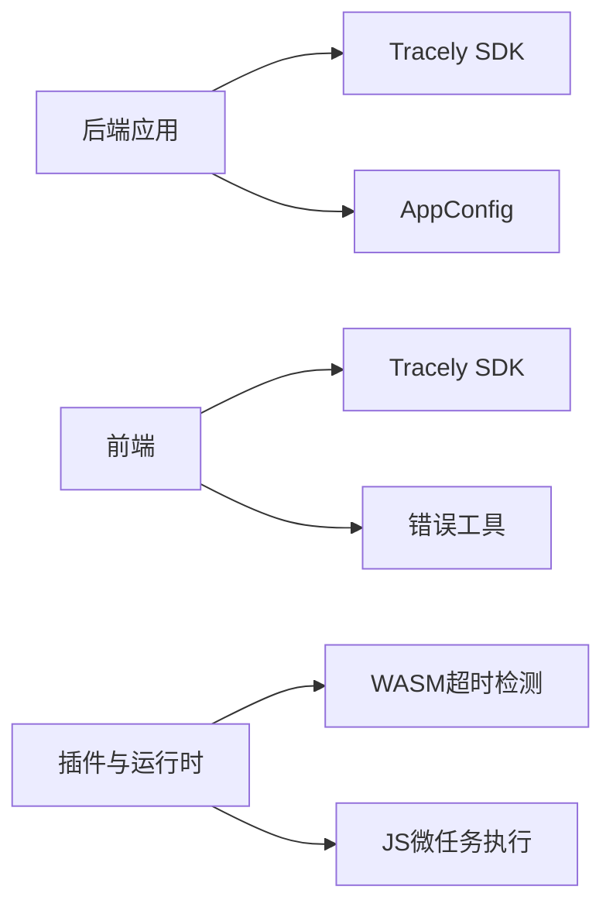

# 错误追踪与告警

<cite>
**本文引用的文件**
- [main.go](file://main.go)
- [app.go](file://internal/app/app.go)
- [error.ts](file://web/src/utils/error.ts)
- [tracely-sdk.js](file://web/node_modules/@imhanxi/tracely-sdk/dist/tracely-sdk.js)
- [types.go](file://internal/config/types.go)
- [auth.go](file://internal/middleware/auth.go)
- [host.go](file://internal/plugins/host.go)
- [pendingjob.go](file://internal/jsruntime/pendingjob.go)
- [polyfill.go](file://internal/jsruntime/polyfill.go)
- [lx_prelude.js](file://plugins/mimusic-plugin-lxmusic/engine/lx_prelude.js)
</cite>

## 目录
1. [简介](#简介)
2. [项目结构](#项目结构)
3. [核心组件](#核心组件)
4. [架构总览](#架构总览)
5. [详细组件分析](#详细组件分析)
6. [依赖关系分析](#依赖关系分析)
7. [性能考虑](#性能考虑)
8. [故障排查指南](#故障排查指南)
9. [结论](#结论)
10. [附录](#附录)

## 简介
本指南面向 MiMusic 的错误追踪与告警系统配置，目标是帮助开发者建立完善的错误日志分析体系，覆盖错误分类、频率统计与趋势分析；配置异常监控（未捕获异常、堆栈跟踪、上下文信息）；实现自动告警通知（邮件、短信、Slack）；完成错误追踪工具（Sentry、Rollbar 或自建平台）的接入；并设定告警阈值与多级告警策略及告警抑制机制。同时提供错误日志结构化处理与统计报表生成方法。

## 项目结构
MiMusic 采用后端 Go 与前端 Vue/Flutter 的混合架构，错误追踪能力主要通过以下位置实现：
- 后端：Go 应用初始化 Tracely 客户端，负责心跳与标签上报。
- 前端：Vue 侧通过 Tracely SDK 主动上报错误、事件与用户标识，并监听全局未捕获异常。
- 插件与运行时：JS 运行时与插件引擎在事件分发与超时场景下进行错误上报与日志记录。

图示来源
- [main.go:30-63](file://main.go#L30-L63)
- [app.go:206-217](file://internal/app/app.go#L206-L217)
- [error.ts:6-41](file://web/src/utils/error.ts#L6-L41)
- [tracely-sdk.js:14](file://web/node_modules/@imhanxi/tracely-sdk/dist/tracely-sdk.js#L14)
- [host.go:561-582](file://internal/plugins/host.go#L561-L582)
- [pendingjob.go:21-65](file://internal/jsruntime/pendingjob.go#L21-L65)
- [polyfill.go:78-116](file://internal/jsruntime/polyfill.go#L78-L116)
- [lx_prelude.js:207-272](file://plugins/mimusic-plugin-lxmusic/engine/lx_prelude.js#L207-L272)

章节来源
- [main.go:30-63](file://main.go#L30-L63)
- [app.go:206-217](file://internal/app/app.go#L206-L217)
- [error.ts:6-41](file://web/src/utils/error.ts#L6-L41)
- [tracely-sdk.js:14](file://web/node_modules/@imhanxi/tracely-sdk/dist/tracely-sdk.js#L14)
- [host.go:561-582](file://internal/plugins/host.go#L561-L582)
- [pendingjob.go:21-65](file://internal/jsruntime/pendingjob.go#L21-L65)
- [polyfill.go:78-116](file://internal/jsruntime/polyfill.go#L78-L116)
- [lx_prelude.js:207-272](file://plugins/mimusic-plugin-lxmusic/engine/lx_prelude.js#L207-L272)

## 核心组件
- 后端 Tracely 客户端：在应用初始化阶段创建并配置 Tracely 客户端，启用心跳与版本标签，便于统一上报与监控。
- 前端 Tracely SDK：提供全局错误监听、手动上报、事件上报与用户标识持久化，支持路由变化埋点。
- 插件与运行时：对 WASM 调用超时进行检测与标记，JS 运行时处理微任务队列，插件引擎在事件分发中处理 Promise 超时与错误回传。
- 认证中间件：为 API 请求提供鉴权，间接影响错误上下文与访问控制相关的告警。

章节来源
- [app.go:206-217](file://internal/app/app.go#L206-L217)
- [error.ts:6-41](file://web/src/utils/error.ts#L6-L41)
- [tracely-sdk.js:14](file://web/node_modules/@imhanxi/tracely-sdk/dist/tracely-sdk.js#L14)
- [host.go:561-582](file://internal/plugins/host.go#L561-L582)
- [pendingjob.go:21-65](file://internal/jsruntime/pendingjob.go#L21-L65)
- [polyfill.go:78-116](file://internal/jsruntime/polyfill.go#L78-L116)
- [lx_prelude.js:207-272](file://plugins/mimusic-plugin-lxmusic/engine/lx_prelude.js#L207-L272)
- [auth.go:12-51](file://internal/middleware/auth.go#L12-L51)

## 架构总览
下图展示从浏览器到后端的错误上报链路，以及插件与运行时的错误处理路径。

图示来源
- [error.ts:6-41](file://web/src/utils/error.ts#L6-L41)
- [tracely-sdk.js:14](file://web/node_modules/@imhanxi/tracely-sdk/dist/tracely-sdk.js#L14)
- [app.go:206-217](file://internal/app/app.go#L206-L217)

## 详细组件分析

### 组件一：后端 Tracely 客户端初始化
- 功能要点
  - 在应用初始化时创建 Tracely 客户端，配置 AppID、AppSecret、上报主机、心跳开关与间隔、版本标签。
  - 初始化完成后输出日志，便于运维确认。
- 配置建议
  - 将 AppID 与 AppSecret 以环境变量注入，避免硬编码。
  - 心跳间隔建议根据实例规模调整，生产环境可设为 60 秒。
  - 版本标签用于区分不同版本的错误趋势。

图示来源
- [app.go:206-217](file://internal/app/app.go#L206-L217)

章节来源
- [app.go:206-217](file://internal/app/app.go#L206-L217)

### 组件二：前端错误上报工具与 SDK
- 功能要点
  - 提供 reportError 手动上报与 withErrorReport 自动包装，捕获 try/catch 中的错误并上报。
  - SDK 监听全局 error 与 unhandledrejection，自动上报 JS 错误与 Promise 拒绝。
  - 提供事件上报与用户标识持久化，支持路由变化埋点。
  - SDK 内置防抖（同一分钟内相同错误去重），降低噪声。
- 配置建议
  - 在应用启动时初始化 SDK，并注册错误处理器。
  - 为关键业务操作包裹 withErrorReport，减少重复代码。
  - 事件上报时附带上下文元数据，便于定位问题。

图示来源
- [error.ts:6-41](file://web/src/utils/error.ts#L6-L41)
- [tracely-sdk.js:14](file://web/node_modules/@imhanxi/tracely-sdk/dist/tracely-sdk.js#L14)

章节来源
- [error.ts:6-41](file://web/src/utils/error.ts#L6-L41)
- [tracely-sdk.js:14](file://web/node_modules/@imhanxi/tracely-sdk/dist/tracely-sdk.js#L14)

### 组件三：插件与运行时错误处理
- 功能要点
  - WASM 超时检测：识别 context.DeadlineExceeded 与 wazero CloseOnContextDone 导致的 sys.ExitError。
  - JS 微任务执行：循环执行 pending jobs，避免 Promise 微任务堆积导致的卡顿。
  - 定时器 polyfill：在插件 JS 环境中提供 setTimeout/clearTimeout 等能力。
  - 插件事件分发：在事件处理中对 Promise 超时进行保护与错误上报。
- 配置建议
  - 对长时间运行的插件任务设置合理超时，结合 isWASMTimeout 判断并记录。
  - 在插件中对异步回调进行超时保护，避免阻塞主循环。

图示来源
- [host.go:561-582](file://internal/plugins/host.go#L561-L582)
- [pendingjob.go:21-65](file://internal/jsruntime/pendingjob.go#L21-L65)
- [polyfill.go:78-116](file://internal/jsruntime/polyfill.go#L78-L116)
- [lx_prelude.js:207-272](file://plugins/mimusic-plugin-lxmusic/engine/lx_prelude.js#L207-L272)

章节来源
- [host.go:561-582](file://internal/plugins/host.go#L561-L582)
- [pendingjob.go:21-65](file://internal/jsruntime/pendingjob.go#L21-L65)
- [polyfill.go:78-116](file://internal/jsruntime/polyfill.go#L78-L116)
- [lx_prelude.js:207-272](file://plugins/mimusic-plugin-lxmusic/engine/lx_prelude.js#L207-L272)

### 组件四：认证中间件与错误上下文
- 功能要点
  - 从 Authorization 头或 URL 查询参数提取 token，验证 JWT 并将 client 信息注入请求上下文。
  - 未通过认证时返回 401，便于区分鉴权失败与业务错误。
- 配置建议
  - 在告警规则中区分 401 与业务错误，避免将鉴权失败计入业务错误指标。

章节来源
- [auth.go:12-51](file://internal/middleware/auth.go#L12-L51)

## 依赖关系分析
- 后端依赖
  - Tracely SDK：用于心跳与标签上报。
  - 配置结构：AppConfig 提供端口、数据库路径、用户名与密码等基础配置。
- 前端依赖
  - Tracely SDK：提供错误上报、事件上报与用户标识。
  - 错误工具：封装 withErrorReport/reportError。
- 插件与运行时
  - WASM 超时检测依赖系统 ExitCode 常量。
  - JS 运行时依赖 QuickJS 与 libc TLS，执行微任务队列。

图示来源
- [app.go:206-217](file://internal/app/app.go#L206-L217)
- [types.go:4-9](file://internal/config/types.go#L4-L9)
- [error.ts:6-41](file://web/src/utils/error.ts#L6-L41)
- [tracely-sdk.js:14](file://web/node_modules/@imhanxi/tracely-sdk/dist/tracely-sdk.js#L14)
- [host.go:561-582](file://internal/plugins/host.go#L561-L582)
- [pendingjob.go:21-65](file://internal/jsruntime/pendingjob.go#L21-L65)

章节来源
- [app.go:206-217](file://internal/app/app.go#L206-L217)
- [types.go:4-9](file://internal/config/types.go#L4-L9)
- [error.ts:6-41](file://web/src/utils/error.ts#L6-L41)
- [tracely-sdk.js:14](file://web/node_modules/@imhanxi/tracely-sdk/dist/tracely-sdk.js#L14)
- [host.go:561-582](file://internal/plugins/host.go#L561-L582)
- [pendingjob.go:21-65](file://internal/jsruntime/pendingjob.go#L21-L65)

## 性能考虑
- 前端防抖：SDK 内置一分钟内的重复错误去重，降低上报压力。
- 心跳与标签：后端心跳周期建议适配实例规模，避免频繁上报造成网络与存储压力。
- 插件超时：对长耗时插件任务设置超时，防止阻塞主线程与微任务队列。
- 日志结构化：统一错误字段（类型、消息、堆栈、URL、时间戳、用户 ID、版本），便于后续统计与检索。

## 故障排查指南
- 未捕获异常未上报
  - 检查前端是否正确初始化 SDK 并注册全局错误监听。
  - 确认 SDK 的 host、appId、appSecret 配置正确。
- Promise 拒绝未上报
  - 确认 SDK 是否监听了 unhandledrejection 事件。
  - 检查错误对象是否有 message/stack 属性。
- 插件超时
  - 使用 isWASMTimeout 判断是否为超时导致的错误。
  - 检查插件事件处理中的 Promise 超时保护逻辑。
- 认证失败告警
  - 区分 401 与业务错误，避免将鉴权失败计入业务错误指标。

章节来源
- [tracely-sdk.js:14](file://web/node_modules/@imhanxi/tracely-sdk/dist/tracely-sdk.js#L14)
- [host.go:561-582](file://internal/plugins/host.go#L561-L582)
- [auth.go:12-51](file://internal/middleware/auth.go#L12-L51)

## 结论
MiMusic 已具备完善的前端错误上报与后端 Tracely 客户端初始化能力。通过统一的日志结构、防抖与去重策略、插件超时保护与认证中间件的上下文注入，可以构建稳定可靠的错误追踪与告警体系。建议在此基础上完善告警阈值与多级告警策略，并接入邮件、短信与 Slack 通知通道，形成闭环的运维保障。

## 附录

### 错误日志结构化与统计报表
- 结构化字段建议
  - 类型：jsError、promiseError、manualError、业务错误等
  - 消息：错误文本
  - 堆栈：完整堆栈信息
  - URL：发生错误的页面或接口
  - 时间戳：上报时间
  - 用户 ID：本地存储的唯一标识
  - 版本：后端版本标签
  - 设备/浏览器：UA 或前端采集
- 统计维度
  - 错误分类占比、Top N 错误、错误频率（每小时/天）、趋势图
  - 用户影响面（按用户 ID 去重后的错误数）

### 告警阈值与多级告警
- 告警级别
  - P0：系统性崩溃或大面积错误（如 Promise 拒绝率突增）
  - P1：关键功能不可用（如播放失败率上升）
  - P2：一般错误（如网络请求错误）
- 阈值建议
  - 连续 5 分钟内错误数超过阈值触发 P1，超过更高阈值触发 P0
  - 同类错误在 1 分钟内重复出现超过阈值触发去重告警
- 多级告警与抑制
  - P0 告警触发后，同类型错误在 10 分钟内不再重复告警
  - 不同业务线或版本分别设置阈值，避免互相干扰

### 通知渠道配置
- 邮件告警：配置 SMTP 服务器与收件人列表
- 短信告警：对接短信网关 API，设置模板与签名
- Slack 通知：创建 Incoming Webhook，配置频道与消息格式
- 建议：将通知内容包含错误类型、URL、时间、影响范围与快速链接至日志平台