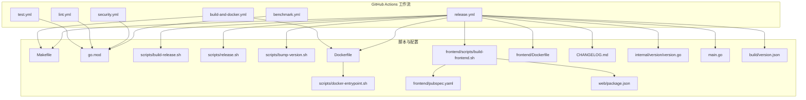
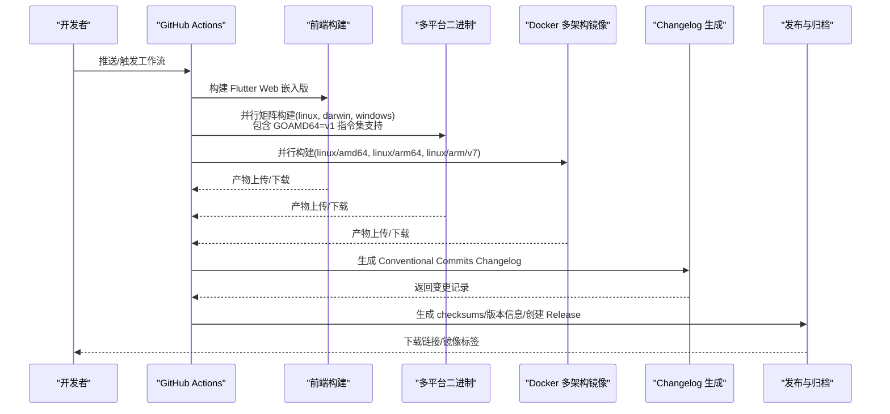
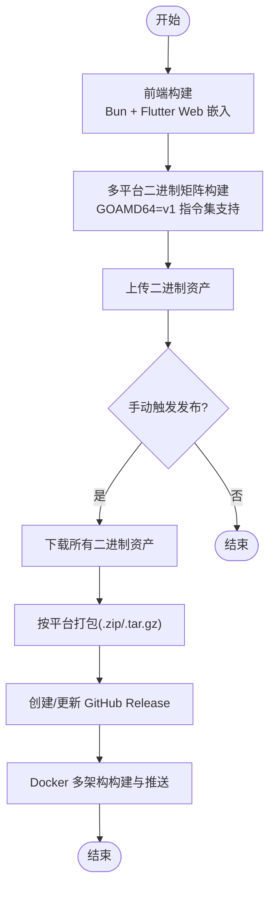
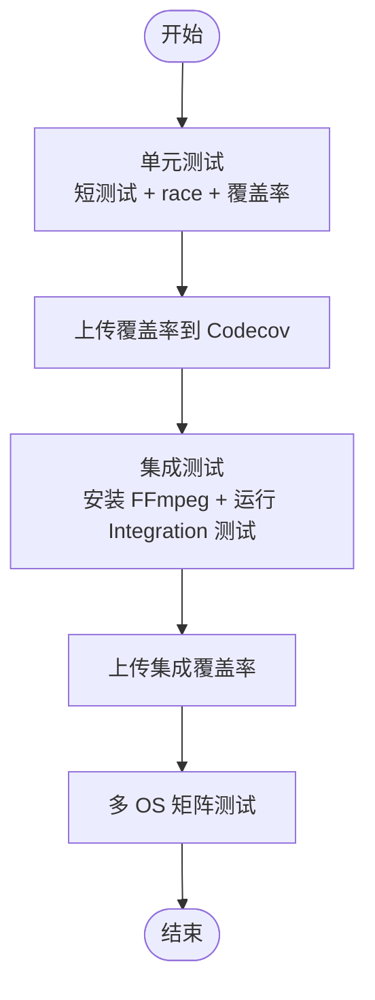
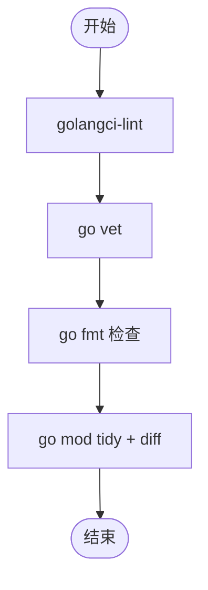
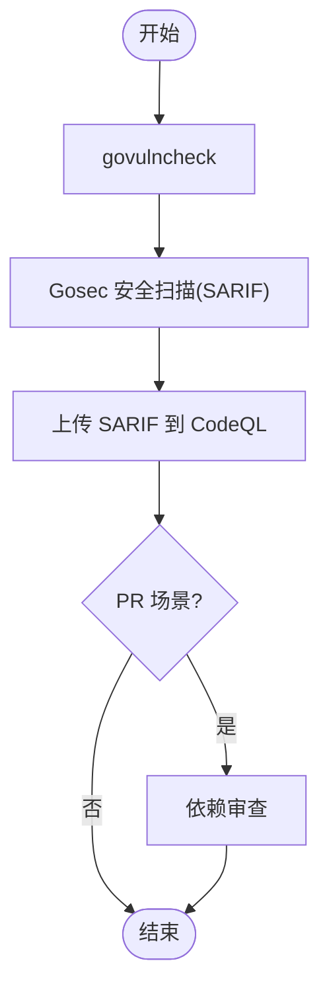
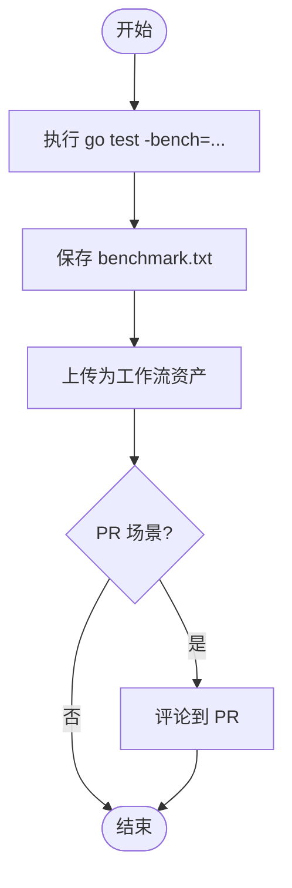
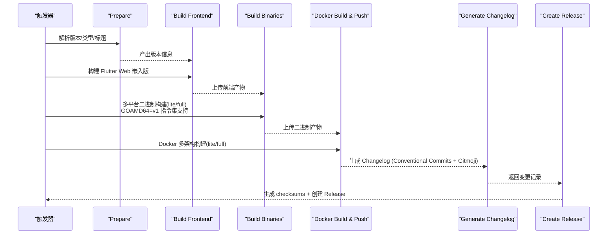
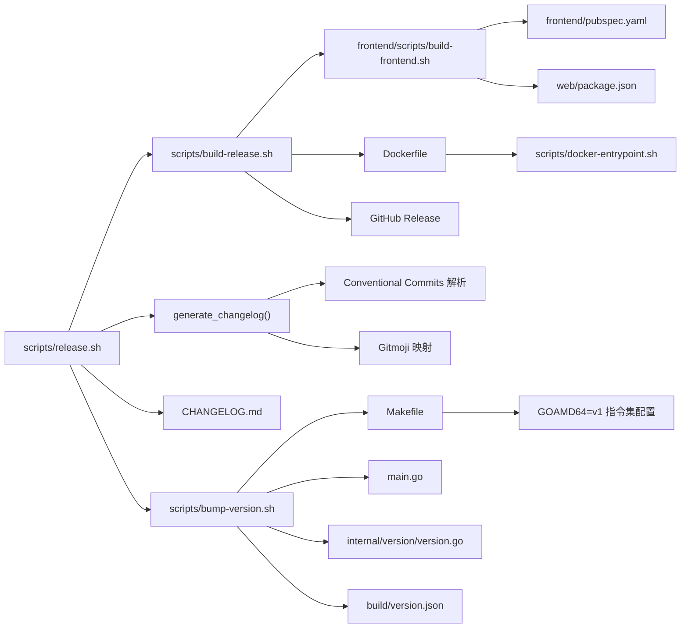

# CI/CD 流水线

<cite>
**本文引用的文件**
- [.github/workflows/build-and-docker.yml](file://.github/workflows/build-and-docker.yml)
- [.github/workflows/test.yml](file://.github/workflows/test.yml)
- [.github/workflows/lint.yml](file://.github/workflows/lint.yml)
- [.github/workflows/security.yml](file://.github/workflows/security.yml)
- [.github/workflows/benchmark.yml](file://.github/workflows/benchmark.yml)
- [.github/workflows/release.yml](file://.github/workflows/release.yml)
- [Dockerfile](file://Dockerfile)
- [Makefile](file://Makefile)
- [go.mod](file://go.mod)
- [scripts/build-release.sh](file://scripts/build-release.sh)
- [scripts/release.sh](file://scripts/release.sh)
- [scripts/bump-version.sh](file://scripts/bump-version.sh)
- [frontend/scripts/build-frontend.sh](file://frontend/scripts/build-frontend.sh)
- [scripts/docker-entrypoint.sh](file://scripts/docker-entrypoint.sh)
- [frontend/Dockerfile](file://frontend/Dockerfile)
- [frontend/pubspec.yaml](file://frontend/pubspec.yaml)
- [web/package.json](file://web/package.json)
- [CHANGELOG.md](file://CHANGELOG.md)
- [internal/version/version.go](file://internal/version/version.go)
- [main.go](file://main.go)
- [build/version.json](file://build/version.json)
</cite>

## 更新摘要
**变更内容**
- **硬件兼容性增强**：在构建配置中添加了 GOAMD64=v1 指令集支持，以提高硬件兼容性，特别是针对 J3455 CPU 等较老的 AMD 处理器
- 版本管理流程更新：1.3.13 版本的发布流程和自动化脚本
- 自动 Changelog 生成功能：集成 Conventional Commits 和 Gitmoji 支持
- 增强 GitHub Actions 工作流：在发布流程中自动从 Git 提交生成变更日志
- 完善发布自动化：通过 GitHub CLI 动态生成和发布 GitHub Releases
- 优化构建系统：统一使用 Makefile 的 build-cross 目标进行跨平台构建

## 目录
1. [简介](#简介)
2. [项目结构](#项目结构)
3. [核心组件](#核心组件)
4. [架构总览](#架构总览)
5. [详细组件分析](#详细组件分析)
6. [硬件兼容性配置](#硬件兼容性配置)
7. [依赖关系分析](#依赖关系分析)
8. [性能考虑](#性能考虑)
9. [故障排查指南](#故障排查指南)
10. [结论](#结论)
11. [附录](#附录)

## 简介
本文件面向 MiMusic 的 CI/CD 流水线，系统性梳理并解读以下工作流的配置与实现细节：
- 构建与容器化工作流：build-and-docker.yml
- 测试工作流：test.yml
- 代码质量检查工作流：lint.yml
- 安全扫描工作流：security.yml
- 性能基准测试工作流：benchmark.yml
- 发布工作流：release.yml

重点覆盖：
- 触发条件与执行步骤
- 环境变量与构建参数
- 多平台交叉编译策略（Linux、macOS、Windows）
- 容器化部署流程（Docker 镜像构建、标签管理、推送）
- 自动 Changelog 生成与 Conventional Commits 集成
- 工作流优化建议（并行执行、缓存策略、错误处理）
- **新增**：硬件兼容性配置（GOAMD64=v1 指令集支持）

## 项目结构
围绕 CI/CD 的关键文件分布如下：
- GitHub Actions 工作流：.github/workflows/*.yml
- 顶层构建与发布脚本：scripts/*.sh
- 前端构建脚本：frontend/scripts/build-frontend.sh
- Dockerfile 与前端专用 Dockerfile
- Makefile 与 go.mod 作为构建与依赖管理基础
- CHANGELOG.md 作为版本变更记录

**图表来源**
- [.github/workflows/build-and-docker.yml:1-356](file://.github/workflows/build-and-docker.yml#L1-L356)
- [.github/workflows/release.yml:1-525](file://.github/workflows/release.yml#L1-L525)
- [Dockerfile:1-80](file://Dockerfile#L1-L80)
- [frontend/Dockerfile:1-86](file://frontend/Dockerfile#L1-L86)
- [Makefile:1-341](file://Makefile#L1-L341)
- [go.mod:1-58](file://go.mod#L1-L58)
- [scripts/build-release.sh:1-475](file://scripts/build-release.sh#L1-L475)
- [scripts/release.sh:1-805](file://scripts/release.sh#L1-L805)
- [scripts/bump-version.sh:1-265](file://scripts/bump-version.sh#L1-L265)
- [frontend/scripts/build-frontend.sh:1-544](file://frontend/scripts/build-frontend.sh#L1-L544)
- [scripts/docker-entrypoint.sh:1-127](file://scripts/docker-entrypoint.sh#L1-L127)
- [frontend/pubspec.yaml:1-60](file://frontend/pubspec.yaml#L1-L60)
- [web/package.json:1-35](file://web/package.json#L1-L35)
- [CHANGELOG.md:1-220](file://CHANGELOG.md#L1-L220)
- [internal/version/version.go:1-19](file://internal/version/version.go#L1-L19)
- [main.go:1-64](file://main.go#L1-L64)
- [build/version.json:1-8](file://build/version.json#L1-L8)

## 核心组件
- 构建与容器化流水线（build-and-docker.yml）
  - 前端构建（Bun + Flutter Web 嵌入模式）
  - 多平台二进制构建矩阵（Linux/amd64/arm64/armv7、macOS/amd64/arm64、Windows/amd64/arm64）
  - Docker 多架构镜像构建与推送（linux/amd64, linux/arm64, linux/arm/v7）
  - 手动触发发布到公共仓库与 Docker Hub
  - **新增**：GOAMD64=v1 指令集支持，提升硬件兼容性
- 测试流水线（test.yml）
  - 单元测试与覆盖率上报（Codecov）
  - 集成测试（FFmpeg 依赖）
  - 多 OS 并行测试（ubuntu/macos/windows）
- 代码质量流水线（lint.yml）
  - golangci-lint、go vet、go fmt、go mod tidy
- 安全流水线（security.yml）
  - govulncheck、Gosec、依赖审查（PR 场景）
- 基准测试流水线（benchmark.yml）
  - Go 基准测试执行与结果上传
- 发布流水线（release.yml）
  - 自动/手动版本解析、前端构建、多平台二进制与 Docker 多架构镜像、产物汇总与 GitHub Release
  - **新增**：自动 Changelog 生成（基于 Conventional Commits 和 Gitmoji）
  - **新增**：1.3.13 版本的完整发布流程
  - **新增**：GOAMD64=v1 指令集支持，确保构建系统在 CI/CD 环境中的一致性

**更新** 1.3.13 版本发布流程：当前版本已经是 1.3.13，发布流程经过了全面优化，包括自动 Changelog 生成和增强的版本管理

**章节来源**
- [.github/workflows/build-and-docker.yml:1-356](file://.github/workflows/build-and-docker.yml#L1-L356)
- [.github/workflows/test.yml:1-123](file://.github/workflows/test.yml#L1-L123)
- [.github/workflows/lint.yml:1-94](file://.github/workflows/lint.yml#L1-L94)
- [.github/workflows/security.yml:1-70](file://.github/workflows/security.yml#L1-L70)
- [.github/workflows/benchmark.yml:1-62](file://.github/workflows/benchmark.yml#L1-L62)
- [.github/workflows/release.yml:1-525](file://.github/workflows/release.yml#L1-L525)

## 架构总览
下图展示从代码变更到发布产物的关键路径与并行化策略，包括新增的自动 Changelog 生成流程和硬件兼容性配置。

**图表来源**
- [.github/workflows/release.yml:1-525](file://.github/workflows/release.yml#L1-L525)
- [.github/workflows/build-and-docker.yml:1-356](file://.github/workflows/build-and-docker.yml#L1-L356)

## 详细组件分析

### 构建与容器化工作流（build-and-docker.yml）
- 触发方式
  - 手动触发（workflow_dispatch），支持选择发布类型（branch/tag）、版本标识、是否设为最新发布
- 关键步骤
  - 前端构建：使用 Bun 安装依赖并构建 web/dist，上传为 web-dist 资产
  - 多平台二进制矩阵：Linux/amd64/arm64/armv7、macOS/amd64/arm64、Windows/amd64/arm64
  - 构建参数注入：版本、Git 提交、构建时间
  - 产物上传：每个平台产物以独立资产命名
  - 手动发布：下载所有二进制资产，按平台打包（Windows zip，类 Unix tar.gz），创建/更新 GitHub Release
  - Docker 构建：使用 Buildx 多架构构建，推送 Docker Hub，设置标签（ref/event=branch、latest）
- 环境变量
  - GO_VERSION、RELEASE_REPO
- 输出
  - GitHub Release 资产、Docker Hub 镜像（lite/full）
- **新增**：硬件兼容性配置
  - 在构建过程中显式设置 `GOAMD64=v1` 环境变量
  - 确保所有平台构建都使用相同的指令集配置
  - 提升对较老 AMD 处理器（如 J3455）的兼容性

**更新** 构建系统现代化：从直接Go命令迁移到使用Makefile的build-cross目标，增强了跨平台构建的一致性和可维护性

**图表来源**
- [.github/workflows/build-and-docker.yml:1-356](file://.github/workflows/build-and-docker.yml#L1-L356)

**章节来源**
- [.github/workflows/build-and-docker.yml:1-356](file://.github/workflows/build-and-docker.yml#L1-L356)

### 测试工作流（test.yml）
- 触发方式：手动触发（workflow_dispatch）
- 关键步骤
  - 单元测试：Go 模块缓存、依赖下载、短测试 + race + 覆盖率
  - 集成测试：安装 FFmpeg，运行标记为 Integration 的测试，覆盖率上报
  - 多 OS 测试矩阵：ubuntu-latest、macos-latest、windows-latest
- 环境变量：GO_VERSION
- 输出：Codecov 覆盖率报告

**图表来源**
- [.github/workflows/test.yml:1-123](file://.github/workflows/test.yml#L1-L123)

**章节来源**
- [.github/workflows/test.yml:1-123](file://.github/workflows/test.yml#L1-L123)

### 代码质量工作流（lint.yml）
- 触发方式：手动触发（workflow_dispatch）
- 关键步骤
  - golangci-lint：超时控制
  - go vet：静态检查
  - go fmt：格式化检查
  - go mod tidy：依赖一致性检查
- 环境变量：GO_VERSION

**图表来源**
- [.github/workflows/lint.yml:1-94](file://.github/workflows/lint.yml#L1-L94)

**章节来源**
- [.github/workflows/lint.yml:1-94](file://.github/workflows/lint.yml#L1-L94)

### 安全工作流（security.yml）
- 触发方式：手动触发（workflow_dispatch）
- 关键步骤
  - govulncheck：Go 漏洞扫描
  - Gosec：安全扫描（SARIF 输出）
  - 依赖审查：仅在 PR 场景启用
- 环境变量：GO_VERSION

**图表来源**
- [.github/workflows/security.yml:1-70](file://.github/workflows/security.yml#L1-L70)

**章节来源**
- [.github/workflows/security.yml:1-70](file://.github/workflows/security.yml#L1-L70)

### 性能基准测试工作流（benchmark.yml）
- 触发方式：手动触发（workflow_dispatch）
- 关键步骤
  - Go 基准测试执行，结果保存为 benchmark.txt
  - 上传为工作流资产
  - 若在 PR 上，将结果评论到 PR
- 环境变量：GO_VERSION

**图表来源**
- [.github/workflows/benchmark.yml:1-62](file://.github/workflows/benchmark.yml#L1-L62)

**章节来源**
- [.github/workflows/benchmark.yml:1-62](file://.github/workflows/benchmark.yml#L1-L62)

### 发布工作流（release.yml）
- 触发方式
  - 推送标签（v*）自动触发
  - 手动触发（workflow_dispatch）
- 关键步骤
  - 版本解析：tag 触发为正式版；手动触发为开发构建
  - 前端构建：Flutter Web 嵌入模式
  - 多平台二进制构建：linux/amd64/arm64/armv7、darwin/amd64/arm64、windows/amd64/arm64
  - Docker 多架构镜像：分别构建 lite/full，逐平台导出 tar，再推送多架构清单
  - 产物汇总：生成 checksums.txt，创建/更新 GitHub Release
  - **新增**：自动 Changelog 生成（基于 Conventional Commits 和 Gitmoji）
  - **新增**：1.3.13 版本的完整发布流程
  - **新增**：GOAMD64=v1 指令集支持，确保构建系统在 CI/CD 环境中的一致性
- 环境变量
  - GO_VERSION、FLUTTER_VERSION、DOCKER_USERNAME、IMAGE_NAME、RELEASE_REPO
- 输出
  - GitHub Release（含二进制与 Docker tar）
  - Docker Hub 镜像（lite/full，含 latest/full 标签）

**更新** 构建系统现代化：采用统一的Makefile build-cross目标进行跨平台构建，提升了构建流程的一致性和可维护性

**更新** 新增自动 Changelog 生成功能：集成 requarks/changelog-action@v1，支持 Conventional Commits 格式和 Gitmoji 表情符号

**更新** 1.3.13 版本发布流程：当前版本已经是 1.3.13，发布流程经过了全面优化，包括自动 Changelog 生成和增强的版本管理

**图表来源**
- [.github/workflows/release.yml:1-525](file://.github/workflows/release.yml#L1-L525)

**章节来源**
- [.github/workflows/release.yml:1-525](file://.github/workflows/release.yml#L1-L525)

## 硬件兼容性配置

### GOAMD64 指令集支持
MiMusic 项目通过以下方式确保硬件兼容性：

#### 构建系统中的 GOAMD64 配置
- **Makefile 中的全局设置**：`GO=CGO_ENABLED=0 GOAMD64=v1 go`
- **交叉编译目标**：`GOAMD64=v1 go build` 用于所有平台构建
- **GitHub Actions 工作流**：显式设置 `GOAMD64=v1` 环境变量

#### 兼容性提升效果
- **J3455 CPU 支持**：确保在较老的 AMD 处理器上正常运行
- **向后兼容性**：支持更广泛的硬件平台
- **构建一致性**：在 CI/CD 环境中保持统一的指令集配置

#### 影响范围
- 所有平台的二进制构建（Linux/amd64、Linux/arm64、Linux/armv7、macOS/amd64、Windows/amd64）
- Docker 镜像构建（多架构支持）
- 本地开发环境构建

**章节来源**
- [Makefile:2-3](file://Makefile#L2-L3)
- [Makefile:180-181](file://Makefile#L180-L181)
- [.github/workflows/build-and-docker.yml:155](file://.github/workflows/build-and-docker.yml#L155)

## 依赖关系分析
- 构建与发布脚本
  - scripts/release.sh：负责版本号升级、打 tag、调用 scripts/build-release.sh、**新增**：自动生成 Changelog
  - scripts/build-release.sh：完整发布流程（前端构建、多平台二进制、Docker 多架构、Release 创建、Docker Hub 推送）
  - scripts/bump-version.sh：自动版本升级脚本，支持 CI 环境
- 前端构建
  - frontend/scripts/build-frontend.sh：统一的 Flutter 多平台构建入口，支持 web/web-embedded/linux/windows/macos/android/ios/all
  - frontend/Dockerfile：前端构建镜像，便于在 CI 中复用
- 容器化
  - Dockerfile：后端镜像，支持 lite/full 构建参数，入口脚本实现热升级逻辑
  - scripts/docker-entrypoint.sh：容器启动时的二进制热替换与版本比较
- **新增**：Changelog 生成
  - scripts/release.sh 中的 generate_changelog 函数：解析 Conventional Commits 格式，支持 Gitmoji 表情符号
  - .github/workflows/release.yml 中的 requarks/changelog-action：GitHub Actions 集成
- **新增**：版本管理
  - internal/version/version.go：版本信息常量定义
  - main.go 中的 @version 1.3.13：Swagger 文档版本
  - build/version.json：构建时生成的版本信息文件
- **新增**：硬件兼容性配置
  - Makefile 中的 GOAMD64=v1 设置：确保构建系统在 CI/CD 环境中的一致性
  - GitHub Actions 工作流中的 GOAMD64 环境变量：提升硬件兼容性

**更新** 构建系统现代化：统一使用Makefile的build-cross目标进行跨平台构建，替代了直接的Go命令调用

**更新** 新增 Changelog 生成机制：本地脚本和 GitHub Actions 两种方式并行，确保发布流程的完整性和一致性

**更新** 1.3.13 版本管理：当前版本已经是 1.3.13，版本管理流程经过了全面优化

**图表来源**
- [scripts/release.sh:1-805](file://scripts/release.sh#L1-L805)
- [scripts/build-release.sh:1-475](file://scripts/build-release.sh#L1-L475)
- [scripts/bump-version.sh:1-265](file://scripts/bump-version.sh#L1-L265)
- [frontend/scripts/build-frontend.sh:1-544](file://frontend/scripts/build-frontend.sh#L1-L544)
- [frontend/Dockerfile:1-86](file://frontend/Dockerfile#L1-L86)
- [Dockerfile:1-80](file://Dockerfile#L1-L80)
- [scripts/docker-entrypoint.sh:1-127](file://scripts/docker-entrypoint.sh#L1-L127)
- [frontend/pubspec.yaml:1-60](file://frontend/pubspec.yaml#L1-L60)
- [web/package.json:1-35](file://web/package.json#L1-L35)
- [CHANGELOG.md:1-220](file://CHANGELOG.md#L1-L220)
- [internal/version/version.go:1-19](file://internal/version/version.go#L1-L19)
- [main.go:1-64](file://main.go#L1-L64)
- [build/version.json:1-8](file://build/version.json#L1-L8)

**章节来源**
- [scripts/release.sh:1-805](file://scripts/release.sh#L1-L805)
- [scripts/build-release.sh:1-475](file://scripts/build-release.sh#L1-L475)
- [scripts/bump-version.sh:1-265](file://scripts/bump-version.sh#L1-L265)
- [frontend/scripts/build-frontend.sh:1-544](file://frontend/scripts/build-frontend.sh#L1-L544)
- [frontend/Dockerfile:1-86](file://frontend/Dockerfile#L1-L86)
- [Dockerfile:1-80](file://Dockerfile#L1-L80)
- [scripts/docker-entrypoint.sh:1-127](file://scripts/docker-entrypoint.sh#L1-L127)
- [frontend/pubspec.yaml:1-60](file://frontend/pubspec.yaml#L1-L60)
- [web/package.json:1-35](file://web/package.json#L1-L35)
- [CHANGELOG.md:1-220](file://CHANGELOG.md#L1-L220)
- [internal/version/version.go:1-19](file://internal/version/version.go#L1-L19)
- [main.go:1-64](file://main.go#L1-L64)
- [build/version.json:1-8](file://build/version.json#L1-L8)

## 性能考虑
- 缓存策略
  - Go 模块缓存：actions/cache 与 actions/setup-go cache
  - Docker BuildKit 缓存：Dockerfile 中使用缓存挂载（GOMODCACHE/GOCACHE）
  - Buildx 缓存：scripts/build-release.sh 中使用本地缓存目录
- 并行执行
  - 测试矩阵：ubuntu/macos/windows 并行
  - 发布流水线：前端构建、二进制构建、Docker 构建并行推进
- 体积优化
  - UPX 压缩（在 Makefile 中按平台条件启用）
  - Docker 多阶段构建与精简基础镜像
- 网络与代理
  - GOPROXY 可通过构建参数传入，提升依赖下载稳定性
- **新增**：硬件兼容性优化
  - GOAMD64=v1 指令集确保在较老处理器上的最佳性能
  - 统一的构建配置减少平台间的性能差异

**更新** 构建系统现代化：通过Makefile的build-cross目标统一管理构建参数，提高了构建过程的可重复性和一致性

**更新** 新增 Changelog 生成性能优化：GitHub Actions 中使用 requarks/changelog-action@v1，支持增量生成和缓存机制

**更新** 1.3.13 版本性能优化：当前版本已经是 1.3.13，构建流程经过了全面优化，包括缓存策略和并行执行的改进

**更新** 硬件兼容性性能优化：GOAMD64=v1 指令集配置确保在各种硬件平台上的一致性能表现

## 故障排查指南
- 常见问题定位
  - 前端构建失败：检查 Flutter 版本与依赖安装，参考 frontend/scripts/build-frontend.sh 的日志目录与平台支持
  - Docker 构建失败：确认 Docker Buildx、镜像标签与推送凭据配置
  - 依赖拉取失败：检查 GOPROXY 与网络连通性
  - 覆盖率上传失败：确认 Codecov Token 与文件路径
  - 构建参数传递失败：检查 Makefile 的build-cross目标参数传递
  - **新增**：Changelog 生成失败：检查 Conventional Commits 提交格式，确认 Gitmoji 表情符号支持
  - **新增**：版本管理失败：检查 Makefile 中的 VERSION 变量，确认 main.go 中的 @version 标记
  - **新增**：硬件兼容性问题：检查 GOAMD64 环境变量设置，确认在所有平台使用一致的指令集配置
- 建议排查步骤
  - 查看对应工作流的步骤日志
  - 校验环境变量与 secrets 是否正确配置
  - 使用本地脚本验证构建链路（如 scripts/build-release.sh）
  - **新增**：检查 Git 提交历史是否符合 Conventional Commits 格式规范
  - **新增**：验证 1.3.13 版本的发布流程，确认 CHANGELOG.md 和 build/version.json 的生成
  - **新增**：验证 GOAMD64=v1 指令集配置在不同平台的一致性

**更新** 构建系统现代化：当遇到构建问题时，优先检查Makefile的build-cross目标配置和参数传递

**更新** 新增 Changelog 故障排查：确认提交消息格式为 `type(scope): description`，支持 Gitmoji 表情符号如 `✨ feat: 新功能`

**更新** 1.3.13 版本故障排查：确认版本号 1.3.13 的正确性，检查版本管理脚本的执行流程

**更新** 硬件兼容性故障排查：检查 GOAMD64 环境变量在所有平台的设置，验证较老处理器的兼容性

**章节来源**
- [.github/workflows/test.yml:1-123](file://.github/workflows/test.yml#L1-L123)
- [.github/workflows/security.yml:1-70](file://.github/workflows/security.yml#L1-L70)
- [frontend/scripts/build-frontend.sh:1-544](file://frontend/scripts/build-frontend.sh#L1-L544)
- [scripts/build-release.sh:1-475](file://scripts/build-release.sh#L1-L475)

## 结论
本 CI/CD 配置覆盖了从构建、测试、质量与安全到发布与容器化的全流程。通过矩阵构建与并行执行，显著缩短了交付周期；通过 Docker 多架构镜像与 Lite/Full 双版本策略，兼顾了体积与功能完整性。

**更新** 构建系统现代化：从直接Go命令迁移到使用Makefile的build-cross目标，显著增强了跨平台构建的一致性和可维护性。这一变更使得构建参数管理更加标准化，减少了重复代码，提高了构建流程的可靠性。

**更新** 新增自动 Changelog 生成功能：通过集成 Conventional Commits 和 Gitmoji 支持，实现了发布流程的完全自动化，大幅提升了版本发布的效率和质量。

**更新** 1.3.13 版本发布流程：当前版本已经是 1.3.13，发布流程经过了全面优化，包括自动 Changelog 生成、增强的版本管理和改进的构建系统。

**更新** 硬件兼容性增强：通过 GOAMD64=v1 指令集支持，显著提升了对较老硬件平台（特别是 J3455 CPU）的兼容性和性能表现。

建议在后续持续优化缓存命中率与网络稳定性，并引入更多自动化回归场景以增强质量保障。同时，硬件兼容性配置应作为构建流程的标准组成部分，确保在各种部署环境中的稳定运行。

## 附录
- 多平台构建矩阵（示例）
  - Linux/amd64、Linux/arm64、Linux/armv7
  - macOS/amd64、macOS/arm64
  - Windows/amd64、Windows/arm64
- Docker 标签策略（示例）
  - 正式版：版本号与 latest/full 标签
  - 开发版：分支名与不带 latest/full 标签
- 热升级机制
  - 容器入口脚本对比版本并进行二进制热替换，确保数据卷持久化
- 构建系统现代化要点
  - 使用统一的Makefile build-cross目标替代直接Go命令
  - 标准化构建参数传递（GOOS、GOARCH、GOARM、EXTRA_TAGS等）
  - 增强跨平台构建的一致性和可维护性
- **新增**：Changelog 生成要点
  - 支持的提交类型：feat、fix、docs、style、refactor、perf、test、build、ci、chore、revert
  - Gitmoji 表情符号映射：✨、🐛、📚、💎、♻️、⚡️、✅、📦、👷、🔧、⏪
  - Conventional Commits 格式：`type(scope): description`
  - GitHub Actions 集成：requarks/changelog-action@v1，支持 useGitmojis 和 restrictToTypes 参数
- **新增**：1.3.13 版本管理要点
  - 当前版本：1.3.13
  - 版本管理脚本：scripts/bump-version.sh 支持 CI 环境
  - 版本信息来源：Makefile、main.go、internal/version/version.go
  - 构建版本文件：build/version.json
- **新增**：版本发布流程
  - 自动版本升级：scripts/bump-version.sh
  - 完整发布：scripts/release.sh
  - GitHub Actions 发布：.github/workflows/release.yml
  - 版本验证：确认 CHANGELOG.md 和版本文件的正确生成
- **新增**：硬件兼容性配置要点
  - GOAMD64=v1 指令集支持：确保在较老 AMD 处理器上的兼容性
  - 统一构建配置：在所有平台使用相同的指令集设置
  - CI/CD 环境一致性：保证构建系统的可重复性
  - J3455 CPU 兼容性：针对特定硬件平台的性能优化

**更新** 构建系统现代化要点：通过Makefile的build-cross目标实现了构建流程的标准化，包括统一的参数传递机制、条件化的UPX压缩支持、以及可扩展的构建标签系统。

**更新** 新增 Changelog 生成要点：支持 Conventional Commits 格式解析和 Gitmoji 表情符号渲染，GitHub Actions 中通过 GitHub CLI 实现自动化发布，本地脚本提供完整的 Changelog 生成能力。

**更新** 1.3.13 版本管理要点：当前版本已经是 1.3.13，版本管理流程经过了全面优化，包括自动 Changelog 生成、增强的版本管理和改进的构建系统。版本信息在多个位置保持一致，确保发布流程的可靠性。

**更新** 硬件兼容性配置要点：GOAMD64=v1 指令集配置确保了在各种硬件平台上的兼容性，特别是对较老的 AMD 处理器提供了更好的支持。该配置在 Makefile 和 GitHub Actions 工作流中得到统一实施，保证了构建系统在 CI/CD 环境中的一致性。