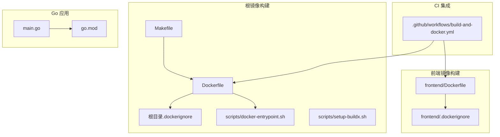
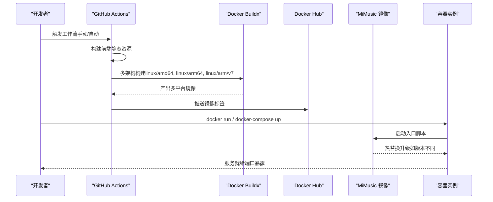
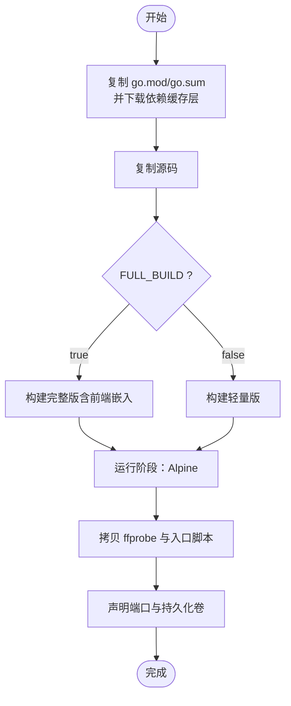
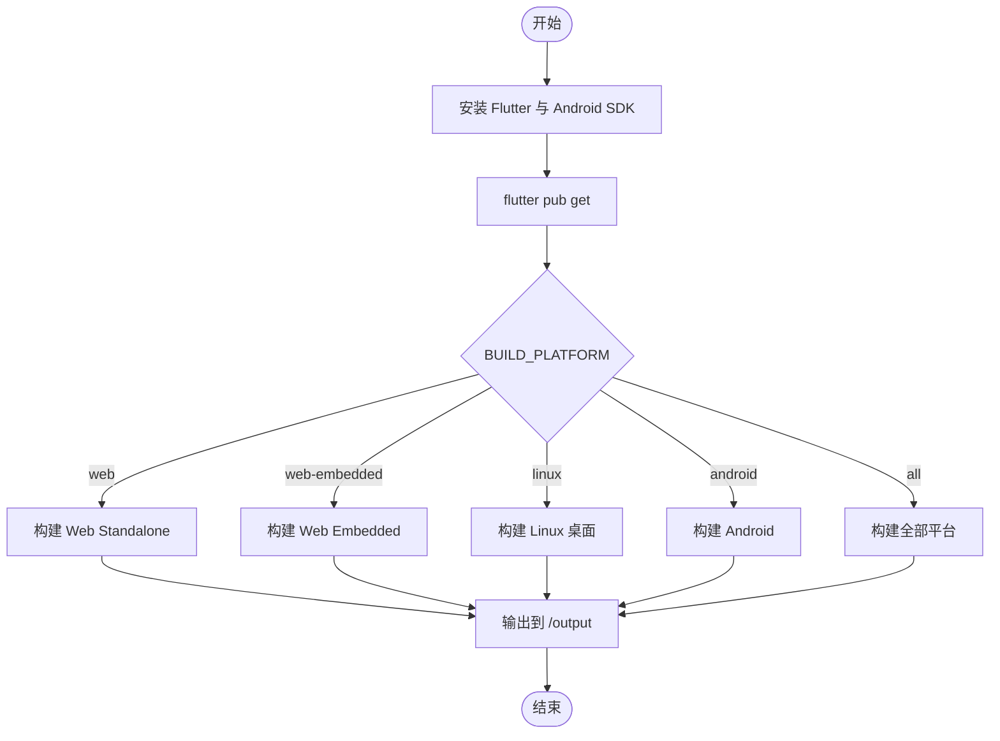
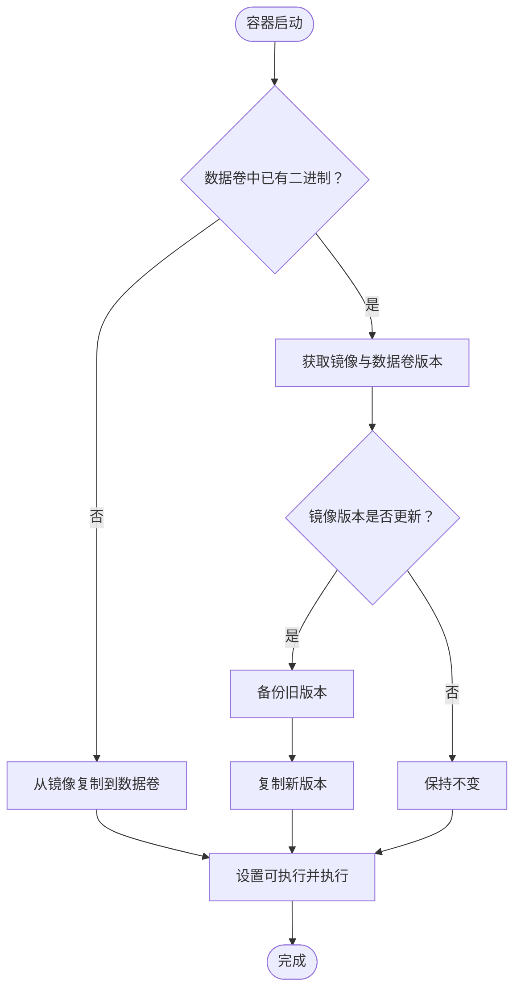
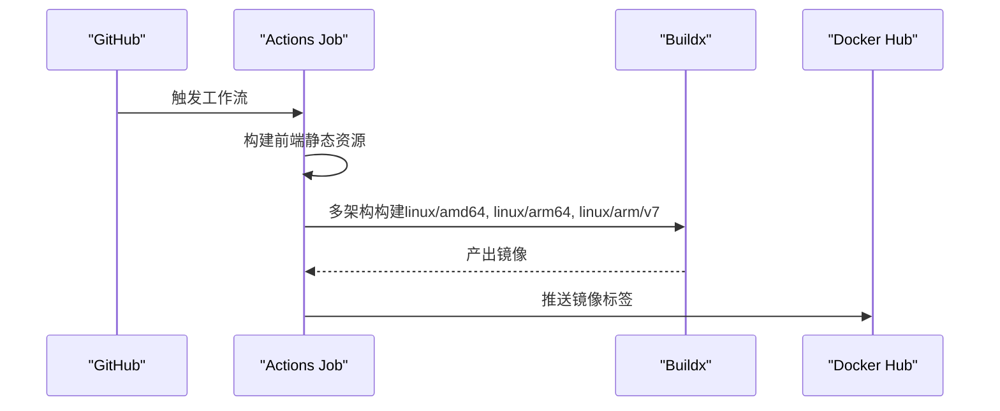
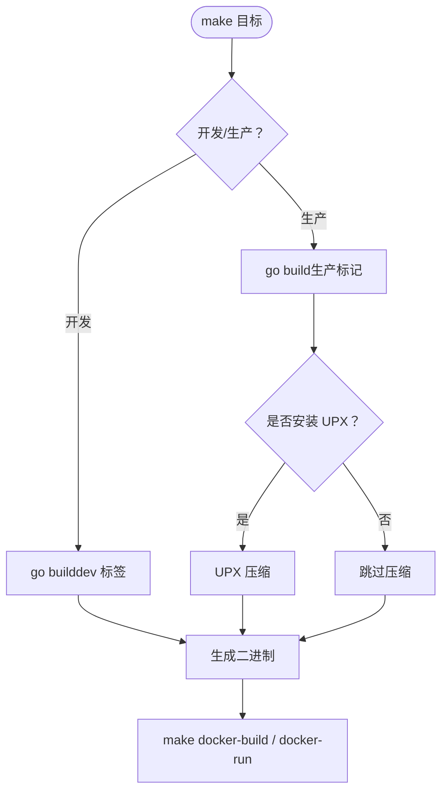
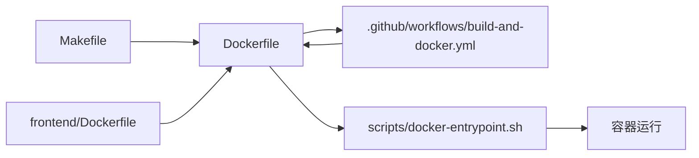

# 基础设施即代码

<cite>
**本文引用的文件**
- [Dockerfile](file://Dockerfile)
- [Makefile](file://Makefile)
- [.github/workflows/build-and-docker.yml](file://.github/workflows/build-and-docker.yml)
- [scripts/docker-entrypoint.sh](file://scripts/docker-entrypoint.sh)
- [scripts/setup-buildx.sh](file://scripts/setup-buildx.sh)
- [frontend/Dockerfile](file://frontend/Dockerfile)
- [.dockerignore](file://.dockerignore)
- [frontend/.dockerignore](file://frontend/.dockerignore)
- [go.mod](file://go.mod)
- [main.go](file://main.go)
</cite>

## 目录
1. [简介](#简介)
2. [项目结构](#项目结构)
3. [核心组件](#核心组件)
4. [架构总览](#架构总览)
5. [详细组件分析](#详细组件分析)
6. [依赖关系分析](#依赖关系分析)
7. [性能考量](#性能考量)
8. [故障排查指南](#故障排查指南)
9. [结论](#结论)
10. [附录](#附录)

## 简介
本指南面向 MiMusic 的基础设施即代码（IaC）落地，围绕以下目标展开：
- Docker 容器化：多阶段构建策略、镜像优化、容器运行时配置、多平台镜像构建
- 容器编排：Docker Compose 配置思路、网络与数据卷、健康检查
- 构建系统：Makefile 构建规则、依赖管理、构建优化
- 环境配置：环境变量、配置文件与敏感信息保护
- IaC 最佳实践：版本控制、配置变更管理、环境一致性

本指南以仓库中现有的 Dockerfile、Makefile、CI 工作流与脚本为基础，结合概念性编排与最佳实践建议，帮助团队在不同环境中稳定、可重复地交付 MiMusic。

## 项目结构
从 IaC 角度，与容器化直接相关的关键目录与文件如下：
- 根镜像构建：Dockerfile、.dockerignore、Makefile、scripts/docker-entrypoint.sh、scripts/setup-buildx.sh
- 前端镜像构建：frontend/Dockerfile、frontend/.dockerignore
- CI 集成：.github/workflows/build-and-docker.yml
- Go 模块与入口：go.mod、main.go

图表来源
- [Dockerfile:1-77](file://Dockerfile#L1-L77)
- [.dockerignore:1-67](file://.dockerignore#L1-L67)
- [Makefile:280-284](file://Makefile#L280-L284)
- [scripts/docker-entrypoint.sh:1-127](file://scripts/docker-entrypoint.sh#L1-L127)
- [scripts/setup-buildx.sh:1-112](file://scripts/setup-buildx.sh#L1-L112)
- [frontend/Dockerfile:1-86](file://frontend/Dockerfile#L1-L86)
- [frontend/.dockerignore:1-36](file://frontend/.dockerignore#L1-L36)
- [go.mod:1-58](file://go.mod#L1-L58)
- [main.go:1-64](file://main.go#L1-L64)

章节来源
- [Dockerfile:1-77](file://Dockerfile#L1-L77)
- [.dockerignore:1-67](file://.dockerignore#L1-L67)
- [Makefile:280-284](file://Makefile#L280-L284)
- [scripts/docker-entrypoint.sh:1-127](file://scripts/docker-entrypoint.sh#L1-L127)
- [scripts/setup-buildx.sh:1-112](file://scripts/setup-buildx.sh#L1-L112)
- [frontend/Dockerfile:1-86](file://frontend/Dockerfile#L1-L86)
- [frontend/.dockerignore:1-36](file://frontend/.dockerignore#L1-L36)
- [go.mod:1-58](file://go.mod#L1-L58)
- [main.go:1-64](file://main.go#L1-L64)

## 核心组件
- 多阶段构建的后端镜像：基于 golang:alpine 作为构建阶段，Alpine 作为运行阶段，减少体积并提升安全性；通过缓存挂载加速编译；在最终镜像中注入 ffprobe 与入口脚本，并声明持久化卷与默认环境变量。
- 前端构建镜像：基于 Debian Slim，安装 Flutter SDK、Android SDK 与构建工具，统一复用前端构建脚本，最终仅保留构建产物。
- 容器入口脚本：实现“热替换升级”能力，对比镜像内与数据卷内二进制版本，必要时进行安全升级并保留备份。
- CI 多平台镜像构建：使用 Buildx 在多架构上构建并推送镜像，同时构建前端静态资源并注入到最终镜像。
- 构建系统：Makefile 提供统一构建入口，支持开发/生产、lite/full、跨平台与压缩等能力，并包含 Docker 构建与运行快捷方式。

章节来源
- [Dockerfile:4-77](file://Dockerfile#L4-L77)
- [frontend/Dockerfile:20-86](file://frontend/Dockerfile#L20-L86)
- [scripts/docker-entrypoint.sh:14-127](file://scripts/docker-entrypoint.sh#L14-L127)
- [.github/workflows/build-and-docker.yml:293-355](file://.github/workflows/build-and-docker.yml#L293-L355)
- [Makefile:80-174](file://Makefile#L80-L174)

## 架构总览
下图展示从源码到镜像、再到容器运行的总体流程，以及 CI 如何参与多平台镜像构建与推送。

图表来源
- [.github/workflows/build-and-docker.yml:293-355](file://.github/workflows/build-and-docker.yml#L293-L355)
- [Dockerfile:45-77](file://Dockerfile#L45-L77)
- [scripts/docker-entrypoint.sh:76-114](file://scripts/docker-entrypoint.sh#L76-L114)

## 详细组件分析

### 组件一：后端镜像（Dockerfile 多阶段构建）
- 多阶段策略
  - 构建阶段：golang:alpine，安装编译所需工具与依赖，利用缓存挂载（GOMODCACHE/GOCACHE）加速编译；根据 FULL_BUILD 参数决定是否嵌入前端资源。
  - 运行阶段：Alpine，仅包含运行时必需的证书与时区数据，拷贝二进制与入口脚本，声明持久化卷与默认环境变量。
- 镜像优化
  - 使用 BuildKit 语法与缓存挂载，避免重复下载依赖与编译。
  - 运行阶段最小化，仅拷贝必要文件。
  - 通过构建参数注入版本信息，便于追踪。
- 容器运行时
  - 暴露端口、声明持久化卷、设置时区、默认管理员凭据环境变量。
  - 入口脚本负责热替换升级与执行二进制。

图表来源
- [Dockerfile:4-77](file://Dockerfile#L4-L77)

章节来源
- [Dockerfile:4-77](file://Dockerfile#L4-L77)

### 组件二：前端镜像（Flutter 多平台构建）
- 目标：在容器内统一构建 Flutter Web/Linux/Android 产物，避免本地环境差异。
- 关键点
  - 安装 Flutter SDK 与 Android SDK/Build Tools。
  - 通过构建参数选择平台（web/web-embedded/linux/android/all），调用统一脚本。
  - 最终仅保留构建产物目录，减小镜像体积。
- 适用场景：CI 中预构建前端静态资源，再注入到后端镜像中。

图表来源
- [frontend/Dockerfile:20-86](file://frontend/Dockerfile#L20-L86)

章节来源
- [frontend/Dockerfile:1-86](file://frontend/Dockerfile#L1-L86)
- [frontend/.dockerignore:1-36](file://frontend/.dockerignore#L1-L36)

### 组件三：容器入口脚本（热替换升级）
- 功能要点
  - 初始化：若数据卷中无二进制，从镜像复制一份。
  - 升级判定：比较镜像与数据卷中二进制版本，若镜像更优则备份旧版本并复制新版本。
  - 执行：确保可执行权限后，以传入参数启动二进制。
- 价值
  - 实现“热替换升级”，降低停机风险；保留备份便于回滚。

图表来源
- [scripts/docker-entrypoint.sh:76-127](file://scripts/docker-entrypoint.sh#L76-L127)

章节来源
- [scripts/docker-entrypoint.sh:1-127](file://scripts/docker-entrypoint.sh#L1-L127)

### 组件四：CI 多平台镜像构建与推送
- 关键流程
  - 构建前端静态资源并作为制品上传。
  - 多矩阵构建：linux/amd64/arm64/arm_v7，darwin/amd64/arm64，windows/amd64/arm64。
  - 使用 Buildx 构建并推送多平台镜像，注入版本信息。
- 产出
  - 多架构镜像推送到 Docker Hub，支持 latest 与分支标签策略。

图表来源
- [.github/workflows/build-and-docker.yml:293-355](file://.github/workflows/build-and-docker.yml#L293-L355)

章节来源
- [.github/workflows/build-and-docker.yml:1-355](file://.github/workflows/build-and-docker.yml#L1-L355)

### 组件五：构建系统（Makefile）
- 构建目标
  - 开发/生产、lite/full、跨平台、压缩等多套规则。
  - 前端构建：Flutter Web/Linux/Android/iOS 等平台。
  - Docker：一键构建与运行容器。
- 依赖管理
  - 通过 go.mod/go.sum 管理 Go 依赖，提供下载与整理目标。
- 版本注入
  - 通过 ldflags 注入版本、提交哈希与构建时间，便于审计与追踪。

图表来源
- [Makefile:80-174](file://Makefile#L80-L174)

章节来源
- [Makefile:1-325](file://Makefile#L1-L325)
- [go.mod:1-58](file://go.mod#L1-L58)
- [main.go:11-28](file://main.go#L11-L28)

### 组件六：环境配置与敏感信息保护
- 环境变量
  - 默认管理员账号与密码、IN_DOCKER 标记、时区等在镜像中设定；可通过 docker run -e 或编排工具覆盖。
- 配置文件
  - 生产镜像中保留 web/dist 产物；根目录.dockerignore 控制构建上下文排除项。
- 敏感信息
  - 建议通过外部密钥管理或编排工具注入，不在镜像中硬编码；入口脚本与运行参数优先级需明确。

章节来源
- [Dockerfile:69-71](file://Dockerfile#L69-L71)
- [.dockerignore:52-57](file://.dockerignore#L52-L57)
- [scripts/docker-entrypoint.sh:120-127](file://scripts/docker-entrypoint.sh#L120-L127)

## 依赖关系分析
- 构建链路
  - Makefile -> Dockerfile（多阶段构建）-> CI 工作流（多架构构建与推送）
  - 前端镜像 -> 前端产物 -> 注入到后端镜像
- 运行链路
  - 容器启动 -> 入口脚本热替换 -> 二进制执行 -> 服务监听端口

图表来源
- [Makefile:280-284](file://Makefile#L280-L284)
- [Dockerfile:45-77](file://Dockerfile#L45-L77)
- [.github/workflows/build-and-docker.yml:293-355](file://.github/workflows/build-and-docker.yml#L293-L355)
- [frontend/Dockerfile:20-86](file://frontend/Dockerfile#L20-L86)
- [scripts/docker-entrypoint.sh:76-127](file://scripts/docker-entrypoint.sh#L76-L127)

章节来源
- [Makefile:280-284](file://Makefile#L280-L284)
- [Dockerfile:45-77](file://Dockerfile#L45-L77)
- [.github/workflows/build-and-docker.yml:293-355](file://.github/workflows/build-and-docker.yml#L293-L355)
- [frontend/Dockerfile:20-86](file://frontend/Dockerfile#L20-L86)
- [scripts/docker-entrypoint.sh:76-127](file://scripts/docker-entrypoint.sh#L76-L127)

## 性能考量
- 构建性能
  - 使用 BuildKit 与缓存挂载（GOMODCACHE/GOCACHE）显著缩短编译时间。
  - 前端在独立镜像中构建，避免本地环境差异导致的重复构建。
- 镜像体积
  - 运行阶段采用 Alpine，仅拷贝必要文件，减少攻击面与拉取时间。
- 多平台构建
  - 使用 Buildx 并行构建多架构镜像，配合缓存目录提升效率。
- 压缩与瘦身
  - 生产构建可选 UPX 压缩，进一步减小二进制体积（需权衡兼容性）。

章节来源
- [Dockerfile:37-43](file://Dockerfile#L37-L43)
- [scripts/setup-buildx.sh:35-78](file://scripts/setup-buildx.sh#L35-L78)
- [Makefile:96-116](file://Makefile#L96-L116)

## 故障排查指南
- 容器无法启动或立即退出
  - 检查入口脚本日志与版本比较逻辑，确认二进制可执行权限与版本匹配。
  - 章节来源: [scripts/docker-entrypoint.sh:76-127](file://scripts/docker-entrypoint.sh#L76-L127)
- 端口占用或映射异常
  - 确认容器端口映射与主机端口冲突；镜像默认暴露端口为 58091。
  - 章节来源: [Dockerfile:64-65](file://Dockerfile#L64-L65)
- 镜像体积过大或构建缓慢
  - 检查 .dockerignore 是否正确排除无关文件；确认是否启用 BuildKit 与缓存挂载。
  - 章节来源: [.dockerignore:1-67](file://.dockerignore#L1-L67)
- 多平台镜像构建失败
  - 确认 Buildx builder 已创建并启动；代理配置是否正确；缓存目录权限。
  - 章节来源: [scripts/setup-buildx.sh:39-78](file://scripts/setup-buildx.sh#L39-L78)
- 前端静态资源未生效
  - 确认 CI 工作流已成功上传 web/dist 并在构建镜像时被正确注入。
  - 章节来源: [.github/workflows/build-and-docker.yml:49-60](file://.github/workflows/build-and-docker.yml#L49-L60)

## 结论
本指南基于 MiMusic 仓库现有 Dockerfile、Makefile、CI 工作流与脚本，给出了容器化与 IaC 的实施路径。通过多阶段构建、多平台镜像、入口脚本热替换与统一构建系统，实现了可重复、可观测、可演进的交付体系。建议在实际落地中补充 Docker Compose 编排、健康检查与密钥管理策略，以进一步完善 IaC 能力。

## 附录
- Docker Compose 编排建议（概念性）
  - 网络：自定义桥接网络隔离服务
  - 服务：后端服务、数据库（可选）、反向代理（可选）
  - 数据卷：分别挂载音乐目录与应用数据目录
  - 健康检查：HTTP/GRPC 健康探针，结合重启策略
  - 环境：通过 .env 或编排文件注入敏感信息
- 配置变更管理
  - 版本化配置文件，变更走 PR 审批与自动化测试
  - 环境分层（dev/stage/prod），差异化覆盖
- 环境一致性
  - 使用相同的 Dockerfile 与 Makefile，在 CI 中统一构建与测试
  - 通过 CI 工作流固定 Go 版本与构建参数，避免漂移