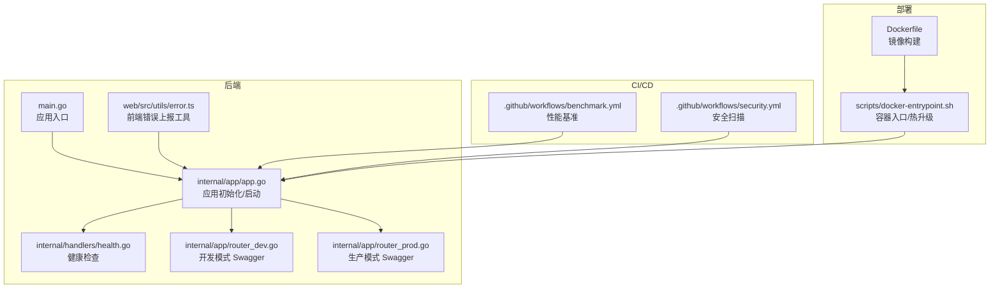
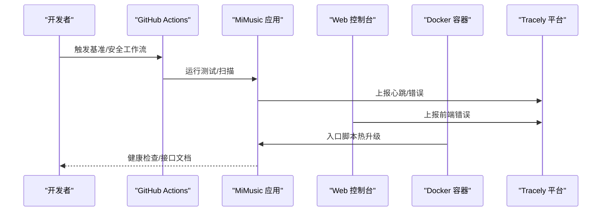
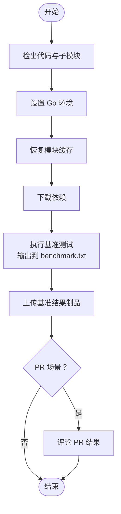
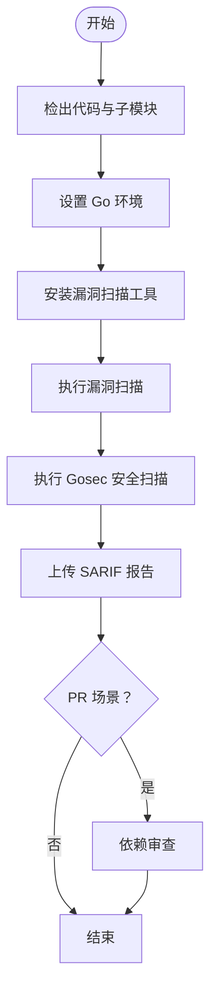
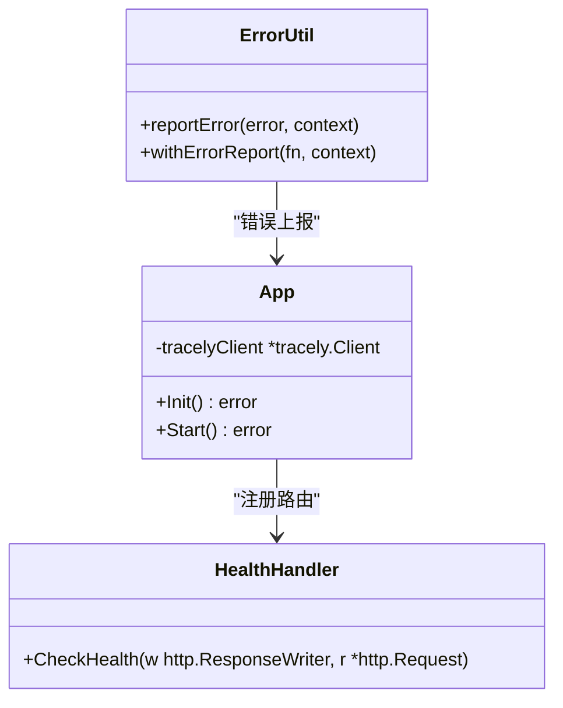
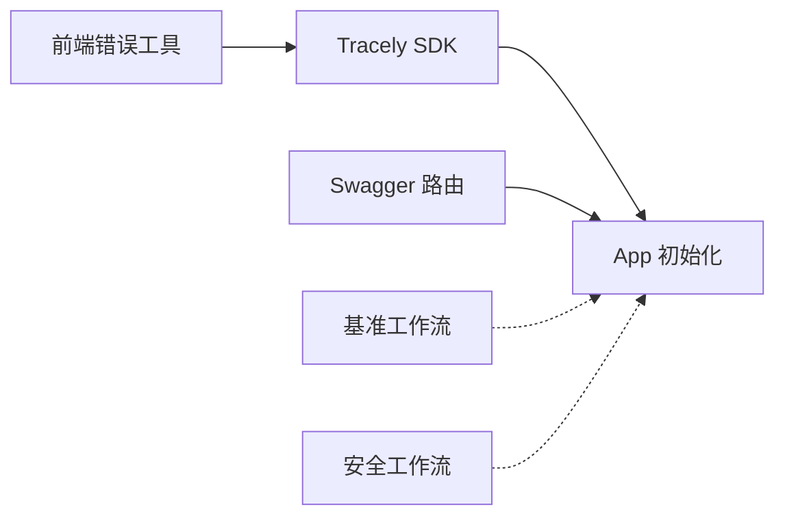

# 监控自动化

<cite>
**本文引用的文件**
- [.github/workflows/benchmark.yml](file://.github/workflows/benchmark.yml)
- [.github/workflows/security.yml](file://.github/workflows/security.yml)
- [internal/handlers/health.go](file://internal/handlers/health.go)
- [internal/app/app.go](file://internal/app/app.go)
- [internal/app/router_dev.go](file://internal/app/router_dev.go)
- [internal/app/router_prod.go](file://internal/app/router_prod.go)
- [scripts/docker-entrypoint.sh](file://scripts/docker-entrypoint.sh)
- [Dockerfile](file://Dockerfile)
- [web/src/utils/error.ts](file://web/src/utils/error.ts)
- [main.go](file://main.go)
- [docs/swagger.yaml](file://docs/swagger.yaml)
</cite>

## 目录
1. [简介](#简介)
2. [项目结构](#项目结构)
3. [核心组件](#核心组件)
4. [架构总览](#架构总览)
5. [详细组件分析](#详细组件分析)
6. [依赖关系分析](#依赖关系分析)
7. [性能考虑](#性能考虑)
8. [故障排查指南](#故障排查指南)
9. [结论](#结论)
10. [附录](#附录)

## 简介
本指南面向 MiMusic 项目的监控自动化落地，围绕以下目标展开：
- 性能监控自动化：基准测试工作流（benchmark.yml）的配置、性能指标采集、性能回归检测与报告生成。
- 安全监控自动化：安全扫描工作流（security.yml）的配置、漏洞检测、依赖安全审计与安全合规检查。
- 应用监控配置：健康检查端点、日志聚合、错误追踪与性能指标监控。
- 告警自动化机制：阈值设置、告警规则配置、通知渠道集成与告警升级策略。
- 监控最佳实践：指标选择、监控数据可视化与监控系统维护。

## 项目结构
本项目采用“后端 Go 应用 + 前端 Web 控制台 + GitHub Actions 工作流”的监控体系：
- 后端应用负责业务逻辑、健康检查、Tracely 错误追踪与心跳上报。
- 前端 Web 控制台负责错误上报与用户体验监控。
- GitHub Actions 负责性能与安全自动化流水线。
- Dockerfile 与 docker-entrypoint.sh 负责容器化部署与热升级。

图表来源
- [main.go:30-64](file://main.go#L30-L64)
- [internal/app/app.go:64-227](file://internal/app/app.go#L64-L227)
- [internal/handlers/health.go:15-27](file://internal/handlers/health.go#L15-L27)
- [internal/app/router_dev.go:13-18](file://internal/app/router_dev.go#L13-L18)
- [internal/app/router_prod.go:6-9](file://internal/app/router_prod.go#L6-L9)
- [.github/workflows/benchmark.yml:1-62](file://.github/workflows/benchmark.yml#L1-L62)
- [.github/workflows/security.yml:1-70](file://.github/workflows/security.yml#L1-L70)
- [Dockerfile:1-77](file://Dockerfile#L1-L77)
- [scripts/docker-entrypoint.sh:1-127](file://scripts/docker-entrypoint.sh#L1-L127)
- [web/src/utils/error.ts:1-42](file://web/src/utils/error.ts#L1-L42)

章节来源
- [main.go:30-64](file://main.go#L30-L64)
- [internal/app/app.go:64-227](file://internal/app/app.go#L64-L227)
- [internal/handlers/health.go:15-27](file://internal/handlers/health.go#L15-L27)
- [.github/workflows/benchmark.yml:1-62](file://.github/workflows/benchmark.yml#L1-L62)
- [.github/workflows/security.yml:1-70](file://.github/workflows/security.yml#L1-L70)
- [Dockerfile:1-77](file://Dockerfile#L1-L77)
- [scripts/docker-entrypoint.sh:1-127](file://scripts/docker-entrypoint.sh#L1-L127)
- [web/src/utils/error.ts:1-42](file://web/src/utils/error.ts#L1-L42)

## 核心组件
- 健康检查端点：提供 /health 快速判断服务可用性。
- Tracely 错误追踪：后端与前端均接入 Tracely，实现错误上报与心跳监控。
- Swagger 文档：开发模式下暴露接口文档，便于联调与监控验证。
- Docker 容器化与热升级：通过入口脚本实现版本比较与热替换。
- GitHub Actions 自动化：基准测试与安全扫描流水线。

章节来源
- [internal/handlers/health.go:15-27](file://internal/handlers/health.go#L15-L27)
- [internal/app/app.go:206-217](file://internal/app/app.go#L206-L217)
- [internal/app/router_dev.go:13-18](file://internal/app/router_dev.go#L13-L18)
- [internal/app/router_prod.go:6-9](file://internal/app/router_prod.go#L6-L9)
- [scripts/docker-entrypoint.sh:66-114](file://scripts/docker-entrypoint.sh#L66-L114)
- [.github/workflows/benchmark.yml:38-46](file://.github/workflows/benchmark.yml#L38-L46)
- [.github/workflows/security.yml:25-54](file://.github/workflows/security.yml#L25-L54)

## 架构总览
下图展示监控自动化的整体交互：CI 触发基准与安全任务 -> 应用暴露健康与文档 -> 前端错误上报 -> 容器热升级与可观测性。

图表来源
- [.github/workflows/benchmark.yml:1-62](file://.github/workflows/benchmark.yml#L1-L62)
- [.github/workflows/security.yml:1-70](file://.github/workflows/security.yml#L1-L70)
- [internal/app/app.go:206-217](file://internal/app/app.go#L206-L217)
- [web/src/utils/error.ts:6-11](file://web/src/utils/error.ts#L6-L11)
- [scripts/docker-entrypoint.sh:66-114](file://scripts/docker-entrypoint.sh#L66-L114)
- [internal/handlers/health.go:23-26](file://internal/handlers/health.go#L23-L26)

## 详细组件分析

### 性能监控自动化（benchmark.yml）
- 触发方式：手动触发（workflow_dispatch），适合 PR 或发布前评估。
- 步骤概览：
  - 检出代码与子模块
  - 设置 Go 环境与模块缓存
  - 运行基准测试并将结果输出到文件
  - 上传基准结果为制品
  - 在 PR 场景下评论基准结果（可选）

图表来源
- [.github/workflows/benchmark.yml:13-61](file://.github/workflows/benchmark.yml#L13-L61)

章节来源
- [.github/workflows/benchmark.yml:1-62](file://.github/workflows/benchmark.yml#L1-L62)

### 安全监控自动化（security.yml）
- 触发方式：手动触发（workflow_dispatch），适合发布前安全审计。
- 步骤概览：
  - 安装并运行漏洞扫描工具（govulncheck）
  - 使用 Gosec 扫描安全风险，输出 SARIF 报告并上传
  - 对 PR 场景执行依赖审查（dependency-review-action）

图表来源
- [.github/workflows/security.yml:13-70](file://.github/workflows/security.yml#L13-L70)

章节来源
- [.github/workflows/security.yml:1-70](file://.github/workflows/security.yml#L1-L70)

### 应用监控配置
- 健康检查端点：/health 返回服务可用状态，便于外部探活与编排。
- 日志聚合：应用使用标准日志库，结合容器日志收集即可。
- 错误追踪：后端与前端均接入 Tracely，实现错误上报与心跳监控。
- 性能指标监控：应用初始化时创建 Tracely 客户端并开启心跳，版本信息作为标签注入。

图表来源
- [internal/handlers/health.go:15-27](file://internal/handlers/health.go#L15-L27)
- [internal/app/app.go:206-217](file://internal/app/app.go#L206-L217)
- [web/src/utils/error.ts:6-11](file://web/src/utils/error.ts#L6-L11)

章节来源
- [internal/handlers/health.go:15-27](file://internal/handlers/health.go#L15-L27)
- [internal/app/app.go:206-217](file://internal/app/app.go#L206-L217)
- [web/src/utils/error.ts:1-42](file://web/src/utils/error.ts#L1-L42)

### 告警自动化机制
- 阈值与规则：建议基于 Tracely 平台的错误率、响应时间、心跳丢失等指标设定阈值；对关键接口（如 /auth/*、/songs/*）设置更严格规则。
- 通知渠道：在 Tracely 平台配置邮件/IM/Webhook 通知；在 CI 中通过 SARIF 与基准结果制品进行通知。
- 升级策略：针对严重错误与心跳异常设置多级升级（首次告警、重复告警、静默窗口、升级到更高级别通道）。

章节来源
- [internal/app/app.go:206-217](file://internal/app/app.go#L206-L217)
- [.github/workflows/security.yml:51-55](file://.github/workflows/security.yml#L51-L55)
- [.github/workflows/benchmark.yml:48-61](file://.github/workflows/benchmark.yml#L48-L61)

### 监控最佳实践
- 指标选择：CPU/内存/磁盘 IO、请求延迟与错误率、活跃会话数、插件加载状态、扫描进度与失败数。
- 可视化：在 Tracely 平台建立仪表盘，关联版本标签与环境维度。
- 维护：定期清理过期制品与日志；对健康检查与错误上报进行回归验证；在 PR 中强制安全扫描与基准结果对比。

## 依赖关系分析
- 应用依赖 Tracely SDK 进行错误上报与心跳。
- 前端通过工具函数主动上报错误，增强可观测性。
- Swagger 在开发模式启用，便于接口联调与监控验证。
- CI 工作流独立于应用运行，互不干扰。

图表来源
- [internal/app/app.go:206-217](file://internal/app/app.go#L206-L217)
- [web/src/utils/error.ts:6-11](file://web/src/utils/error.ts#L6-L11)
- [internal/app/router_dev.go:13-18](file://internal/app/router_dev.go#L13-L18)
- [.github/workflows/benchmark.yml:1-62](file://.github/workflows/benchmark.yml#L1-L62)
- [.github/workflows/security.yml:1-70](file://.github/workflows/security.yml#L1-L70)

章节来源
- [internal/app/app.go:206-217](file://internal/app/app.go#L206-L217)
- [web/src/utils/error.ts:1-42](file://web/src/utils/error.ts#L1-L42)
- [internal/app/router_dev.go:13-18](file://internal/app/router_dev.go#L13-L18)
- [.github/workflows/benchmark.yml:1-62](file://.github/workflows/benchmark.yml#L1-L62)
- [.github/workflows/security.yml:1-70](file://.github/workflows/security.yml#L1-L70)

## 性能考虑
- 基准测试稳定性：使用固定 Go 版本与模块缓存，避免环境波动影响结果。
- 结果留存与对比：将基准结果作为制品保存并支持 PR 评论，便于回归对比。
- 安全扫描成本：在 PR 场景启用依赖审查，减少上游依赖引入的风险。

章节来源
- [.github/workflows/benchmark.yml:6-34](file://.github/workflows/benchmark.yml#L6-L34)
- [.github/workflows/benchmark.yml:41-46](file://.github/workflows/benchmark.yml#L41-L46)
- [.github/workflows/security.yml:57-70](file://.github/workflows/security.yml#L57-L70)

## 故障排查指南
- 健康检查失败：确认端口配置与容器暴露；检查应用启动日志。
- 错误上报无数据：确认 Tracely 客户端初始化与标签设置；检查前端工具函数是否正确调用。
- CI 执行异常：查看制品上传与 PR 评论权限；核对 Go 版本与模块缓存命中情况。
- 热升级失败：检查版本比较逻辑与二进制权限；确认数据目录挂载与备份文件存在。

章节来源
- [internal/handlers/health.go:23-26](file://internal/handlers/health.go#L23-L26)
- [internal/app/app.go:206-217](file://internal/app/app.go#L206-L217)
- [web/src/utils/error.ts:6-11](file://web/src/utils/error.ts#L6-L11)
- [.github/workflows/benchmark.yml:48-61](file://.github/workflows/benchmark.yml#L48-L61)
- [scripts/docker-entrypoint.sh:66-114](file://scripts/docker-entrypoint.sh#L66-L114)

## 结论
通过基准测试与安全扫描的自动化工作流、健康检查端点、Tracely 错误追踪与心跳监控、以及容器热升级能力，MiMusic 已具备完善的监控自动化基础。建议在此基础上持续完善告警规则、可视化面板与回归基线，以保障系统稳定性与可维护性。

## 附录
- 接口文档：开发模式下 Swagger 路由可用于接口验证与监控联调。
- 端口与环境：应用默认监听端口与环境变量可在入口与配置中查阅。

章节来源
- [internal/app/router_dev.go:13-18](file://internal/app/router_dev.go#L13-L18)
- [docs/swagger.yaml:512-523](file://docs/swagger.yaml#L512-L523)
- [main.go:22-28](file://main.go#L22-L28)