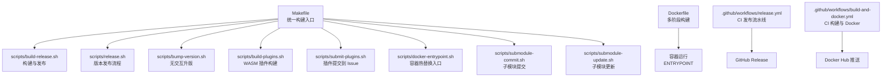
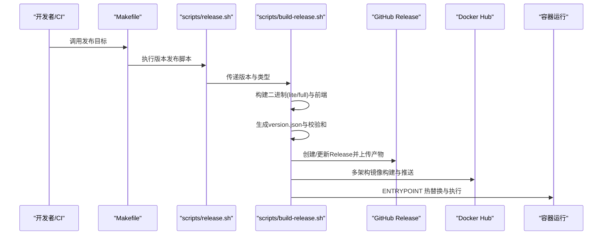
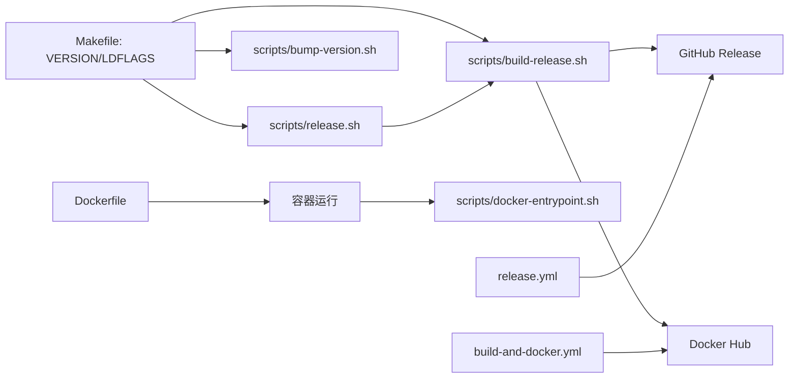

# 自动化部署

<cite>
**本文引用的文件**   
- [scripts/build-plugins.sh](file://scripts/build-plugins.sh)
- [scripts/build-release.sh](file://scripts/build-release.sh)
- [scripts/release.sh](file://scripts/release.sh)
- [scripts/docker-entrypoint.sh](file://scripts/docker-entrypoint.sh)
- [scripts/bump-version.sh](file://scripts/bump-version.sh)
- [scripts/submodule-commit.sh](file://scripts/submodule-commit.sh)
- [scripts/submodule-update.sh](file://scripts/submodule-update.sh)
- [scripts/submit-plugins.sh](file://scripts/submit-plugins.sh)
- [Makefile](file://Makefile)
- [Dockerfile](file://Dockerfile)
- [.github/workflows/build-and-docker.yml](file://.github/workflows/build-and-docker.yml)
- [.github/workflows/release.yml](file://.github/workflows/release.yml)
</cite>

## 目录
1. [简介](#简介)
2. [项目结构](#项目结构)
3. [核心组件](#核心组件)
4. [架构总览](#架构总览)
5. [详细组件分析](#详细组件分析)
6. [依赖关系分析](#依赖关系分析)
7. [性能考量](#性能考量)
8. [故障排查指南](#故障排查指南)
9. [结论](#结论)
10. [附录](#附录)

## 简介
本指南面向 MiMusic 的自动化部署与发布，覆盖以下方面：
- 部署脚本：构建脚本（build-plugins.sh、build-release.sh）、发布脚本（release.sh、submit-plugins.sh）与维护脚本（docker-entrypoint.sh、submodule-commit.sh、submodule-update.sh）的功能与执行流程
- 容器化策略：Dockerfile 配置、多阶段构建、镜像构建与容器运行参数
- 版本管理自动化：版本号更新（bump-version.sh）、Git 子模块管理与发布流程
- 环境配置：开发、测试、生产三类环境的差异化配置要点
- 部署最佳实践：蓝绿部署、滚动更新与回滚方案

## 项目结构
围绕自动化部署的关键文件与目录如下：
- 脚本目录 scripts：集中存放构建、发布、版本与维护脚本
- Makefile：统一的构建目标与跨平台编译入口
- Dockerfile：应用镜像构建定义
- .github/workflows：CI 工作流，涵盖前端构建、二进制与 Docker 多架构构建、发布等

**图示来源**
- [Makefile:1-325](file://Makefile#L1-L325)
- [scripts/build-release.sh:1-475](file://scripts/build-release.sh#L1-L475)
- [scripts/release.sh:1-245](file://scripts/release.sh#L1-L245)
- [scripts/bump-version.sh:1-256](file://scripts/bump-version.sh#L1-L256)
- [scripts/build-plugins.sh:1-11](file://scripts/build-plugins.sh#L1-L11)
- [scripts/submit-plugins.sh:1-283](file://scripts/submit-plugins.sh#L1-L283)
- [scripts/docker-entrypoint.sh:1-127](file://scripts/docker-entrypoint.sh#L1-L127)
- [scripts/submodule-commit.sh:1-79](file://scripts/submodule-commit.sh#L1-L79)
- [scripts/submodule-update.sh:1-54](file://scripts/submodule-update.sh#L1-L54)
- [Dockerfile:1-77](file://Dockerfile#L1-L77)
- [.github/workflows/release.yml:1-479](file://.github/workflows/release.yml#L1-L479)
- [.github/workflows/build-and-docker.yml:1-355](file://.github/workflows/build-and-docker.yml#L1-L355)

**章节来源**
- [Makefile:1-325](file://Makefile#L1-L325)
- [Dockerfile:1-77](file://Dockerfile#L1-L77)
- [.github/workflows/release.yml:1-479](file://.github/workflows/release.yml#L1-L479)
- [.github/workflows/build-and-docker.yml:1-355](file://.github/workflows/build-and-docker.yml#L1-L355)

## 核心组件
- 构建与发布脚本
  - build-plugins.sh：批量构建插件并复制到数据目录
  - build-release.sh：统一构建二进制、生成 version.json、构建 Docker 多架构镜像、上传校验和、创建/更新 GitHub Release、推送 Docker Hub
  - release.sh：版本号解析与升级、更新 Makefile/main.go/web/package.json、创建 tag、调用 build-release.sh
  - bump-version.sh：无交互升版、更新 Makefile/main.go/CHANGELOG、创建 tag（不推送），便于 CI 链路
  - submit-plugins.sh：插件版本号更新、WASM 构建与压缩、上传到 GitHub Release 并在 Issue 下评论
- 维护脚本
  - docker-entrypoint.sh：容器启动时的热替换逻辑（比较镜像与数据目录版本，必要时复制新版本并执行）
  - submodule-commit.sh：批量提交子模块变更
  - submodule-update.sh：批量更新子模块到最新分支
- 容器与构建
  - Dockerfile：多阶段构建，Go 交叉编译产物与前端资源合并，ENTRYPOINT 为 docker-entrypoint.sh
  - Makefile：提供 build、build-prod、build-all-prod、build-cross、docker-build、run 等常用目标
  - CI 工作流：release.yml 与 build-and-docker.yml 覆盖发布、多架构 Docker 构建与推送

**章节来源**
- [scripts/build-plugins.sh:1-11](file://scripts/build-plugins.sh#L1-L11)
- [scripts/build-release.sh:1-475](file://scripts/build-release.sh#L1-L475)
- [scripts/release.sh:1-245](file://scripts/release.sh#L1-L245)
- [scripts/bump-version.sh:1-256](file://scripts/bump-version.sh#L1-L256)
- [scripts/submit-plugins.sh:1-283](file://scripts/submit-plugins.sh#L1-L283)
- [scripts/docker-entrypoint.sh:1-127](file://scripts/docker-entrypoint.sh#L1-L127)
- [scripts/submodule-commit.sh:1-79](file://scripts/submodule-commit.sh#L1-L79)
- [scripts/submodule-update.sh:1-54](file://scripts/submodule-update.sh#L1-L54)
- [Dockerfile:1-77](file://Dockerfile#L1-L77)
- [Makefile:1-325](file://Makefile#L1-L325)
- [.github/workflows/release.yml:1-479](file://.github/workflows/release.yml#L1-L479)
- [.github/workflows/build-and-docker.yml:1-355](file://.github/workflows/build-and-docker.yml#L1-L355)

## 架构总览
下图展示从本地脚本到 CI 的整体发布与容器化流程：

**图示来源**
- [Makefile:305-311](file://Makefile#L305-L311)
- [scripts/release.sh:191-198](file://scripts/release.sh#L191-L198)
- [scripts/build-release.sh:78-138](file://scripts/build-release.sh#L78-L138)
- [scripts/build-release.sh:140-163](file://scripts/build-release.sh#L140-L163)
- [scripts/build-release.sh:301-343](file://scripts/build-release.sh#L301-L343)
- [scripts/build-release.sh:347-420](file://scripts/build-release.sh#L347-L420)
- [scripts/docker-entrypoint.sh:76-114](file://scripts/docker-entrypoint.sh#L76-L114)

## 详细组件分析

### 构建与发布脚本

#### 构建插件脚本（build-plugins.sh）
- 功能：进入各插件目录执行构建，将生成的 wasm 文件复制到数据目录
- 关键点：按顺序构建并复制，确保后续容器内可加载

**章节来源**
- [scripts/build-plugins.sh:1-11](file://scripts/build-plugins.sh#L1-L11)

#### 发布脚本（build-release.sh）
- 功能概览
  - 参数解析：版本号与发布类型（稳定/开发）
  - 前端构建：调用 Makefile 目标生成嵌入式前端
  - 多平台二进制：遍历平台矩阵，交叉编译 lite 与 full 版本
  - 生成 version.json：包含版本、提交哈希、构建时间与下载前缀
  - Docker 多架构镜像：使用 buildx 构建并导出 tar，同时推送多标签
  - 校验和：对产物生成 sha256sum
  - GitHub Release：删除旧 Release 并重新创建，上传产物
  - Docker Hub：推送多架构清单与 full 版本镜像
  - 清理：删除 build 目录
- 适用场景：本地或 CI 的完整发布流程

**章节来源**
- [scripts/build-release.sh:1-475](file://scripts/build-release.sh#L1-L475)

#### 版本发布脚本（release.sh）
- 功能概览
  - 解析当前版本、计算新版本（major/minor/patch）
  - 更新 Makefile、main.go（Swagger 版本）、web/package.json、CHANGELOG.md
  - 提交变更并创建 tag
  - 调用 build-release.sh 执行构建与发布
- 适用场景：需要交互确认的本地发布流程

**章节来源**
- [scripts/release.sh:1-245](file://scripts/release.sh#L1-L245)

#### 无交互升版脚本（bump-version.sh）
- 功能概览
  - 解析参数（major/minor/patch）与 dry-run
  - 更新 Makefile、main.go、CHANGELOG.md
  - 创建 tag（不推送），便于 CI 推送与触发工作流
- 适用场景：CI 环境自动化升版与发布

**章节来源**
- [scripts/bump-version.sh:1-256](file://scripts/bump-version.sh#L1-L256)

#### 插件提交脚本（submit-plugins.sh）
- 功能概览
  - 自动生成日期版本号（年.月.日）
  - 更新插件 main.go 版本字段
  - 构建 wasm 并压缩为 zip
  - 上传到独立 Release（按 plugin-{name}-{version} 命名）
  - 在 Issue #4 下提交评论，包含下载链接
  - 清理临时压缩包
- 适用场景：插件生态的自动发布与公告

**章节来源**
- [scripts/submit-plugins.sh:1-283](file://scripts/submit-plugins.sh#L1-L283)

### 维护脚本

#### 容器入口脚本（docker-entrypoint.sh）
- 功能概览
  - 初始化：若数据目录无二进制则复制镜像内的二进制
  - 比较版本：镜像内与数据目录版本，支持 dev/unknown 特殊处理
  - 热替换：新版本时备份旧版本并复制新版本
  - 权限与执行：确保可执行权限，切换工作目录后 exec
- 适用场景：容器内二进制热更新与版本控制

**章节来源**
- [scripts/docker-entrypoint.sh:1-127](file://scripts/docker-entrypoint.sh#L1-L127)

#### 子模块维护脚本
- submodule-update.sh：递归更新子模块到各自分支的最新状态
- submodule-commit.sh：批量提交子模块变更（需 gitc-hanxi 工具）

**章节来源**
- [scripts/submodule-update.sh:1-54](file://scripts/submodule-update.sh#L1-L54)
- [scripts/submodule-commit.sh:1-79](file://scripts/submodule-commit.sh#L1-L79)

### 容器化与多阶段构建

#### Dockerfile 设计
- 多阶段构建
  - go-builder 阶段：安装编译依赖、下载 Go 依赖、交叉编译（lite/full）
  - 运行时阶段：基于 alpine，拷贝二进制与入口脚本，设置时区与挂载点
- 关键参数
  - FULL_BUILD：控制是否嵌入前端资源
  - GOPROXY：可注入代理
  - GIT_COMMIT/BUILD_TIME：注入版本信息
- 入口与卷
  - ENTRYPOINT 为 docker-entrypoint.sh
  - 暴露 58091 端口，挂载 /app/music 与 /app/data

**章节来源**
- [Dockerfile:1-77](file://Dockerfile#L1-L77)

#### CI 容器化流程（build-and-docker.yml）
- 构建前端 Web 资产并上传为 artifact
- 多矩阵构建二进制（linux/amd64/arm64/armv7, darwin, windows）
- 构建 Docker 多架构镜像并推送
- 手动触发：可选择分支或 tag，决定是否设为 latest

**章节来源**
- [.github/workflows/build-and-docker.yml:1-355](file://.github/workflows/build-and-docker.yml#L1-L355)

#### CI 发布流程（release.yml）
- 解析版本：push tag 为正式版，workflow_dispatch 为开发版
- 构建 Flutter Web（嵌入模式）并上传 artifact
- 多矩阵交叉编译（lite/full），生成 version.json
- Docker 多架构构建与导出 tar，同时推送多标签
- 汇总产物并创建/更新 GitHub Release，生成校验和

**章节来源**
- [.github/workflows/release.yml:1-479](file://.github/workflows/release.yml#L1-L479)

### 版本管理自动化
- 本地发布：release.sh 更新版本、提交 tag、调用 build-release.sh
- CI 发布：bump-version.sh 无交互升版，创建 tag，由 CI 触发 release.yml
- Makefile：VERSION 由 Makefile 控制，LDFLAGS 注入版本信息

**章节来源**
- [scripts/release.sh:160-198](file://scripts/release.sh#L160-L198)
- [scripts/bump-version.sh:182-241](file://scripts/bump-version.sh#L182-L241)
- [Makefile:7-22](file://Makefile#L7-L22)

### 环境配置差异
- 开发环境：Makefile 提供 dev 标签与完整前端嵌入选项；docker-entrypoint.sh 支持热替换
- 测试环境：可通过 CI 的 workflow_dispatch 以开发版本发布，生成带时间戳的版本标识
- 生产环境：release.yml 与 build-release.sh 默认构建 lite/full 二进制与 Docker 镜像，生成 version.json 与校验和

**章节来源**
- [Makefile:80-116](file://Makefile#L80-L116)
- [scripts/docker-entrypoint.sh:76-114](file://scripts/docker-entrypoint.sh#L76-L114)
- [.github/workflows/release.yml:38-56](file://.github/workflows/release.yml#L38-L56)

### 部署最佳实践
- 蓝绿部署
  - 使用不同镜像标签区分新旧版本（如 :green 与 :blue），通过编排工具切换服务指向
  - 结合 docker-entrypoint.sh 的热替换能力，可在同一容器内平滑升级
- 滚动更新
  - 以多实例方式逐步替换容器，结合健康检查与就绪探针
  - Docker 多架构镜像可减少部署复杂度
- 回滚机制
  - 通过标签回退（如 :latest 指向稳定版本）
  - 若启用热替换，可保留备份二进制（docker-entrypoint.sh 会生成 .backup），快速回滚

[本节为通用实践说明，不直接分析具体文件]

## 依赖关系分析

**图示来源**
- [Makefile:7-22](file://Makefile#L7-L22)
- [scripts/release.sh:191-198](file://scripts/release.sh#L191-L198)
- [scripts/build-release.sh:301-343](file://scripts/build-release.sh#L301-L343)
- [scripts/docker-entrypoint.sh:76-114](file://scripts/docker-entrypoint.sh#L76-L114)
- [Dockerfile:36-43](file://Dockerfile#L36-L43)
- [.github/workflows/release.yml:442-476](file://.github/workflows/release.yml#L442-L476)
- [.github/workflows/build-and-docker.yml:293-355](file://.github/workflows/build-and-docker.yml#L293-L355)

**章节来源**
- [Makefile:1-325](file://Makefile#L1-L325)
- [scripts/build-release.sh:1-475](file://scripts/build-release.sh#L1-L475)
- [scripts/docker-entrypoint.sh:1-127](file://scripts/docker-entrypoint.sh#L1-L127)
- [Dockerfile:1-77](file://Dockerfile#L1-L77)
- [.github/workflows/release.yml:1-479](file://.github/workflows/release.yml#L1-L479)
- [.github/workflows/build-and-docker.yml:1-355](file://.github/workflows/build-and-docker.yml#L1-L355)

## 性能考量
- 交叉编译与缓存
  - Makefile 使用 CGO_ENABLED=0 与 -s -w 压缩二进制，提升运行效率
  - Docker 多阶段构建与缓存挂载（GOMODCACHE/GOCACHE）加速编译
- 前端嵌入
  - FULL_BUILD 标签会嵌入前端资源，提升单体部署体验但增大体积
- Docker 多架构
  - buildx 平台矩阵与缓存目录（/tmp/buildx-cache）提升构建速度

[本节为通用性能讨论，不直接分析具体文件]

## 故障排查指南
- GitHub CLI 未安装或未登录
  - build-release.sh 与 submit-plugins.sh 依赖 gh，需先安装并登录
- Docker 未安装或未登录
  - build-release.sh 与 CI 工作流依赖 docker 与 docker login
- Docker buildx 不可用
  - CI 与本地均需启用 buildx 并创建 builder
- 热替换未生效
  - docker-entrypoint.sh 会比较版本，dev/unknown 特殊处理；确认数据目录二进制存在且可执行
- 子模块未更新
  - 使用 submodule-update.sh 更新子模块；如需提交，使用 submodule-commit.sh

**章节来源**
- [scripts/build-release.sh:42-54](file://scripts/build-release.sh#L42-L54)
- [scripts/submit-plugins.sh:208-213](file://scripts/submit-plugins.sh#L208-L213)
- [scripts/docker-entrypoint.sh:14-64](file://scripts/docker-entrypoint.sh#L14-L64)
- [scripts/submodule-update.sh:1-54](file://scripts/submodule-update.sh#L1-L54)
- [scripts/submodule-commit.sh:1-79](file://scripts/submodule-commit.sh#L1-L79)

## 结论
本指南梳理了 MiMusic 的自动化部署体系：从本地脚本到 CI 工作流，覆盖构建、版本管理、容器化与发布全流程。通过统一的 Makefile 与多阶段 Dockerfile，配合 CI 的多架构构建与发布，可实现稳定高效的交付。结合热替换与多标签策略，可进一步完善蓝绿与滚动更新的部署实践。

## 附录
- 常用命令参考
  - 本地发布：make release TYPE={patch|minor|major} RELEASE_TYPE={stable|dev}
  - 无交互升版：scripts/bump-version.sh {patch|minor|major} [--dry-run]
  - 构建并发布：scripts/release.sh {patch|minor|major} {stable|dev}
  - 构建插件：scripts/build-plugins.sh
  - 提交插件：scripts/submit-plugins.sh
  - 容器入口：scripts/docker-entrypoint.sh
  - 子模块维护：scripts/submodule-update.sh、scripts/submodule-commit.sh
- CI 触发
  - release.yml：push tag 或 workflow_dispatch
  - build-and-docker.yml：workflow_dispatch，支持选择分支/标签与是否 latest

**章节来源**
- [Makefile:305-311](file://Makefile#L305-L311)
- [scripts/release.sh:217-235](file://scripts/release.sh#L217-L235)
- [scripts/bump-version.sh:39-58](file://scripts/bump-version.sh#L39-L58)
- [.github/workflows/release.yml:3-15](file://.github/workflows/release.yml#L3-L15)
- [.github/workflows/build-and-docker.yml:3-23](file://.github/workflows/build-and-docker.yml#L3-L23)