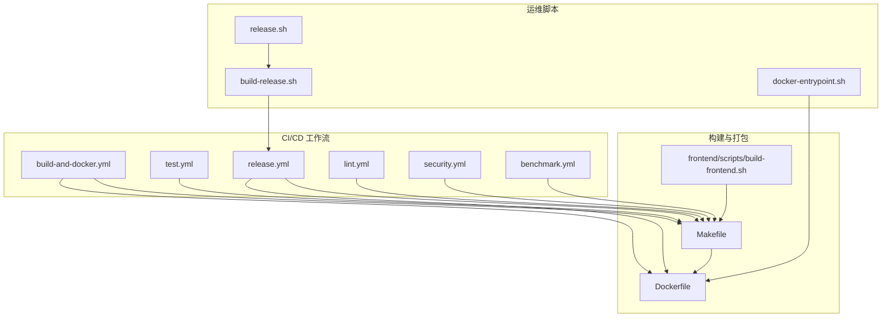
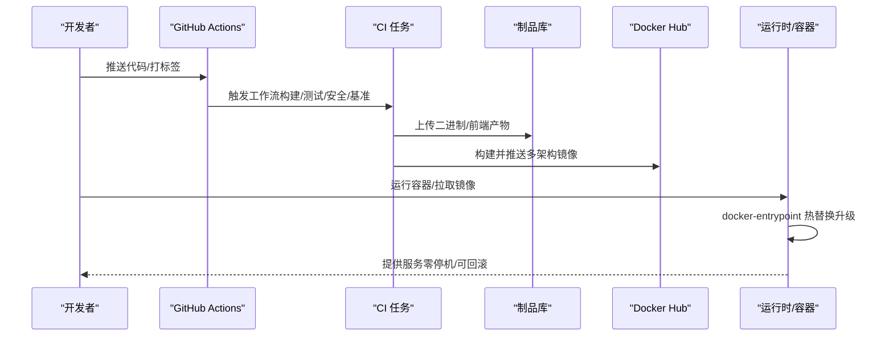
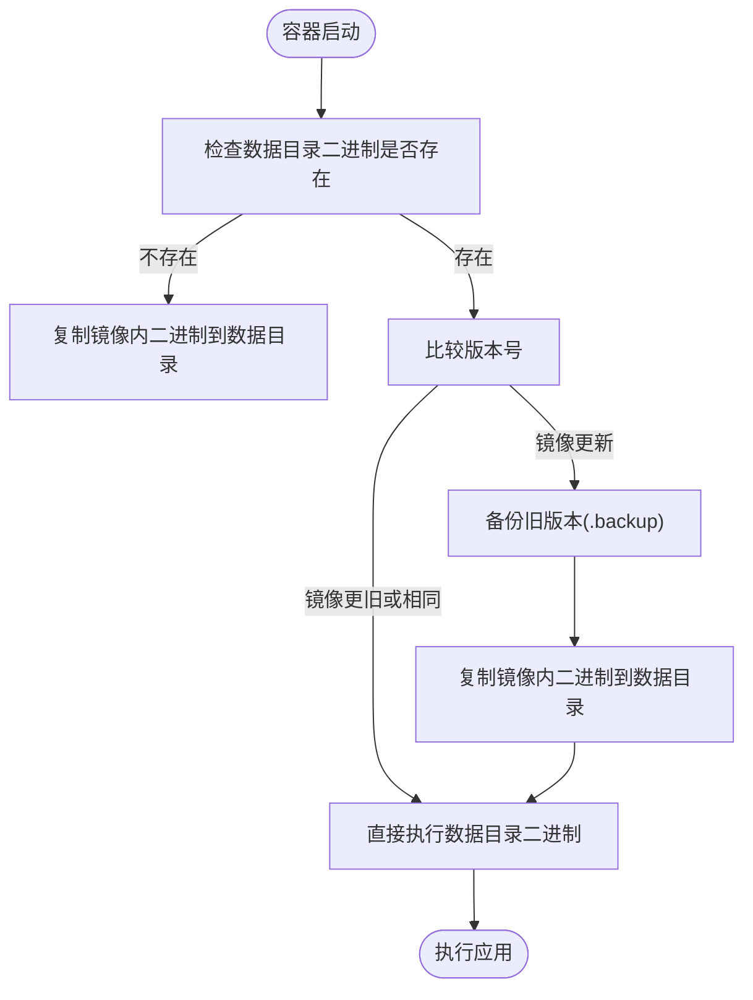
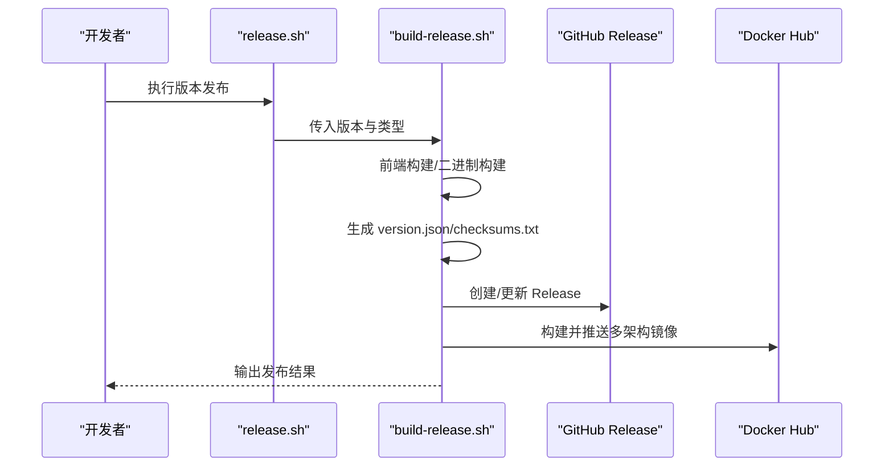
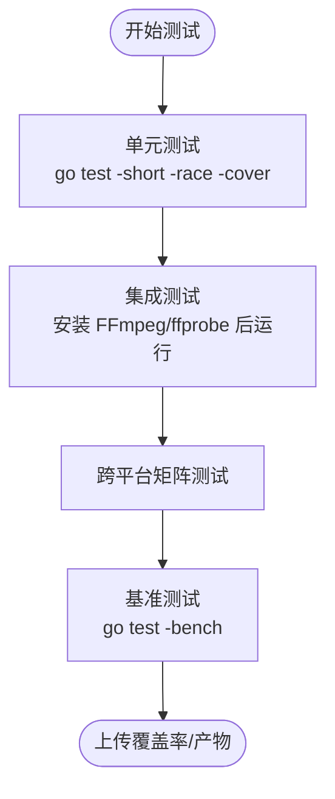
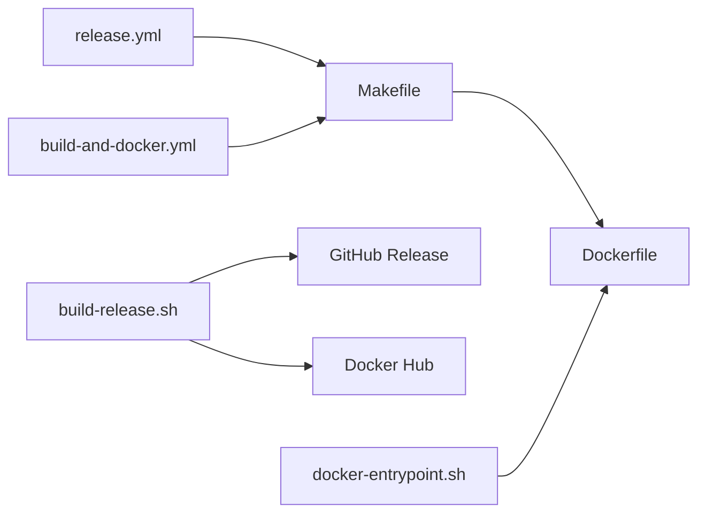

# 运维自动化

<cite>
**本文引用的文件**
- [build-and-docker.yml](file://.github/workflows/build-and-docker.yml)
- [test.yml](file://.github/workflows/test.yml)
- [release.yml](file://.github/workflows/release.yml)
- [lint.yml](file://.github/workflows/lint.yml)
- [security.yml](file://.github/workflows/security.yml)
- [benchmark.yml](file://.github/workflows/benchmark.yml)
- [README.md](file://scripts/README.md)
- [build-release.sh](file://scripts/build-release.sh)
- [release.sh](file://scripts/release.sh)
- [docker-entrypoint.sh](file://scripts/docker-entrypoint.sh)
- [Makefile](file://Makefile)
- [Dockerfile](file://Dockerfile)
- [build-frontend.sh](file://frontend/scripts/build-frontend.sh)
- [README_INTEGRATION_TESTS.md](file://test/README_INTEGRATION_TESTS.md)
- [INTEGRATION_TEST_SETUP.md](file://test/INTEGRATION_TEST_SETUP.md)
</cite>

## 目录
1. [简介](#简介)
2. [项目结构](#项目结构)
3. [核心组件](#核心组件)
4. [架构总览](#架构总览)
5. [详细组件分析](#详细组件分析)
6. [依赖关系分析](#依赖关系分析)
7. [性能考量](#性能考量)
8. [故障排查指南](#故障排查指南)
9. [结论](#结论)
10. [附录](#附录)

## 简介
本指南面向 MiMusic 的运维与工程团队，提供一套完整的自动化运维方案，覆盖 CI/CD 流水线、自动化部署策略（蓝绿/滚动/回滚/零停机）、运维脚本与工具、基础设施即代码（IaC）实践建议、自动化测试策略以及监控与告警的落地方法。文档基于仓库内现有 GitHub Actions 工作流、Shell 脚本与 Makefile，结合容器化与多平台构建能力，给出可操作的实施路径。

## 项目结构
MiMusic 的自动化体系由以下层次构成：
- CI/CD 工作流：GitHub Actions 定义构建、测试、安全扫描、基准测试与发布流程
- 运维脚本：本地与 CI 环境下的发布、构建、版本管理与容器入口脚本
- 构建与打包：Makefile 统一编译与打包；Dockerfile 容器化；前端构建脚本
- 测试与质量：单元测试、集成测试、覆盖率、静态分析与安全扫描
- 部署与升级：容器入口脚本实现“热替换升级”，支持零停机与回滚

**图表来源**
- [.github/workflows/build-and-docker.yml:1-355](file://.github/workflows/build-and-docker.yml#L1-L355)
- [.github/workflows/test.yml:1-123](file://.github/workflows/test.yml#L1-L123)
- [.github/workflows/release.yml:1-479](file://.github/workflows/release.yml#L1-L479)
- [.github/workflows/lint.yml:1-94](file://.github/workflows/lint.yml#L1-L94)
- [.github/workflows/security.yml:1-70](file://.github/workflows/security.yml#L1-L70)
- [.github/workflows/benchmark.yml:1-62](file://.github/workflows/benchmark.yml#L1-L62)
- [build-release.sh:1-475](file://scripts/build-release.sh#L1-L475)
- [release.sh:1-245](file://scripts/release.sh#L1-L245)
- [docker-entrypoint.sh:1-127](file://scripts/docker-entrypoint.sh#L1-L127)
- [Makefile:1-325](file://Makefile#L1-L325)
- [Dockerfile:1-77](file://Dockerfile#L1-L77)
- [build-frontend.sh:1-544](file://frontend/scripts/build-frontend.sh#L1-L544)

**章节来源**
- [.github/workflows/build-and-docker.yml:1-355](file://.github/workflows/build-and-docker.yml#L1-L355)
- [.github/workflows/release.yml:1-479](file://.github/workflows/release.yml#L1-L479)
- [Makefile:1-325](file://Makefile#L1-L325)
- [Dockerfile:1-77](file://Dockerfile#L1-L77)
- [build-frontend.sh:1-544](file://frontend/scripts/build-frontend.sh#L1-L544)
- [build-release.sh:1-475](file://scripts/build-release.sh#L1-L475)
- [release.sh:1-245](file://scripts/release.sh#L1-L245)
- [docker-entrypoint.sh:1-127](file://scripts/docker-entrypoint.sh#L1-L127)

## 核心组件
- CI/CD 工作流
  - 构建与容器化：build-and-docker.yml 与 release.yml 分别负责前端构建、多平台二进制与 Docker 多架构镜像构建与推送
  - 测试：test.yml 覆盖单元、集成与跨平台矩阵测试
  - 质量与安全：lint.yml、security.yml、benchmark.yml
- 运维脚本
  - 版本发布：release.sh 自动升级版本、打 tag、调用构建与发布
  - 构建发布：build-release.sh 本地/CI 执行完整发布流程
  - 容器入口：docker-entrypoint.sh 实现二进制热替换与版本比较
- 构建与打包
  - Makefile：统一编译、测试、压缩、Docker 构建、Swagger 更新
  - Dockerfile：多阶段构建、缓存优化、Entrypoint 配置
  - 前端构建：build-frontend.sh 支持 Web 嵌入/独立、桌面端与移动端多平台

**章节来源**
- [.github/workflows/build-and-docker.yml:1-355](file://.github/workflows/build-and-docker.yml#L1-L355)
- [.github/workflows/test.yml:1-123](file://.github/workflows/test.yml#L1-L123)
- [.github/workflows/release.yml:1-479](file://.github/workflows/release.yml#L1-L479)
- [.github/workflows/lint.yml:1-94](file://.github/workflows/lint.yml#L1-L94)
- [.github/workflows/security.yml:1-70](file://.github/workflows/security.yml#L1-L70)
- [.github/workflows/benchmark.yml:1-62](file://.github/workflows/benchmark.yml#L1-L62)
- [release.sh:1-245](file://scripts/release.sh#L1-L245)
- [build-release.sh:1-475](file://scripts/build-release.sh#L1-L475)
- [docker-entrypoint.sh:1-127](file://scripts/docker-entrypoint.sh#L1-L127)
- [Makefile:1-325](file://Makefile#L1-L325)
- [Dockerfile:1-77](file://Dockerfile#L1-L77)
- [build-frontend.sh:1-544](file://frontend/scripts/build-frontend.sh#L1-L544)

## 架构总览
下图展示从代码提交到发布与部署的关键路径，包括 GitHub Actions、本地脚本与容器化流程：

**图表来源**
- [.github/workflows/release.yml:1-479](file://.github/workflows/release.yml#L1-L479)
- [.github/workflows/build-and-docker.yml:1-355](file://.github/workflows/build-and-docker.yml#L1-L355)
- [docker-entrypoint.sh:1-127](file://scripts/docker-entrypoint.sh#L1-L127)
- [Dockerfile:1-77](file://Dockerfile#L1-L77)

## 详细组件分析

### CI/CD 工作流与触发条件
- 构建与容器化（build-and-docker.yml）
  - 触发：workflow_dispatch（手动触发），支持选择发布类型、版本与是否设为最新
  - 前端：使用 Bun 构建 web，产物上传为 artifact
  - 多平台二进制：矩阵构建 linux/amd64/arm64/arm_v7、darwin/amd64/arm64、windows/amd64/arm64
  - 发布：将产物打包并上传至 mimusic-org/mimusic Release
  - 容器：使用 Buildx 构建多架构镜像并推送
- 发布（release.yml）
  - 触发：push 标签或 workflow_dispatch
  - 前端：Flutter Web 嵌入模式构建
  - 多平台二进制：矩阵构建并生成 lite/full 两套产物
  - Docker：分别构建并推送 lite/full 多架构镜像
  - Release：汇总产物并创建/更新 GitHub Release，生成 checksums.txt
- 测试（test.yml）
  - 单元测试：go test -short -race -cover
  - 集成测试：安装 FFmpeg/ffprobe 后运行 -run Integration
  - 跨平台矩阵：ubuntu/macos/windows
- 质量与安全（lint.yml、security.yml、benchmark.yml）
  - 代码质量：golangci-lint、go vet、go fmt、go mod tidy
  - 安全：govulncheck、gosec SARIF 上报
  - 基准：go test -bench 产出 benchmark.txt

**章节来源**
- [.github/workflows/build-and-docker.yml:1-355](file://.github/workflows/build-and-docker.yml#L1-L355)
- [.github/workflows/release.yml:1-479](file://.github/workflows/release.yml#L1-L479)
- [.github/workflows/test.yml:1-123](file://.github/workflows/test.yml#L1-L123)
- [.github/workflows/lint.yml:1-94](file://.github/workflows/lint.yml#L1-L94)
- [.github/workflows/security.yml:1-70](file://.github/workflows/security.yml#L1-L70)
- [.github/workflows/benchmark.yml:1-62](file://.github/workflows/benchmark.yml#L1-L62)

### 自动化部署策略与零停机
- 热替换升级（容器内）
  - docker-entrypoint.sh 在启动时比较镜像与数据目录中二进制版本，若镜像版本更高则热替换并备份旧版本，支持回滚
  - 通过版本号比较函数与 -version 输出实现
- 回滚机制
  - 启动时自动备份旧版本（.backup），若替换失败或新版本不可用，可保留旧版本继续运行
- 零停机部署
  - 通过多实例/多副本 + 健康检查的编排方式（如 Kubernetes Deployment）实现滚动更新与蓝绿切换
  - 容器内二进制替换避免重启，结合外部负载均衡器进行流量切换

**图表来源**
- [docker-entrypoint.sh:1-127](file://scripts/docker-entrypoint.sh#L1-L127)

**章节来源**
- [docker-entrypoint.sh:1-127](file://scripts/docker-entrypoint.sh#L1-L127)
- [Dockerfile:1-77](file://Dockerfile#L1-L77)

### 运维脚本与工具
- 版本发布（release.sh）
  - 自动升级版本号（Makefile、main.go、web/package.json、CHANGELOG.md）
  - 创建 git tag，调用 build-release.sh 完成构建、Release 与 Docker 推送
- 构建发布（build-release.sh）
  - 前端构建（Flutter Web 嵌入模式）
  - 多平台二进制构建（lite/full）
  - 生成 version.json 与 checksums.txt
  - GitHub Release 创建/更新
  - Docker 镜像构建与推送（含缓存加速）
- 容器入口（docker-entrypoint.sh）
  - 热替换升级与回滚
  - 权限与目录准备
- Makefile
  - 统一编译、测试、压缩、Docker 构建、Swagger 更新
  - 交叉编译与全平台打包
- 前端构建（build-frontend.sh）
  - 支持 web-embedded、standalone、Linux/Windows/macOS、Android/iOS
  - 并行构建与日志记录

**图表来源**
- [release.sh:1-245](file://scripts/release.sh#L1-L245)
- [build-release.sh:1-475](file://scripts/build-release.sh#L1-L475)

**章节来源**
- [release.sh:1-245](file://scripts/release.sh#L1-L245)
- [build-release.sh:1-475](file://scripts/build-release.sh#L1-L475)
- [Makefile:1-325](file://Makefile#L1-L325)
- [build-frontend.sh:1-544](file://frontend/scripts/build-frontend.sh#L1-L544)

### 自动化测试策略
- 单元测试
  - go test -short -race -cover，上传覆盖率至 Codecov
- 集成测试
  - 依赖 FFmpeg/ffprobe，测试扫描与导入、去重、歌词导入等真实场景
  - 可自动跳过（无 ffprobe 时）
- 跨平台测试
  - Matrix 在 ubuntu/macos/windows 上运行测试
- 基准测试
  - 产出 benchmark.txt，可在 PR 中评论结果

**图表来源**
- [.github/workflows/test.yml:1-123](file://.github/workflows/test.yml#L1-L123)
- [.github/workflows/benchmark.yml:1-62](file://.github/workflows/benchmark.yml#L1-L62)
- [README_INTEGRATION_TESTS.md:1-112](file://test/README_INTEGRATION_TESTS.md#L1-L112)
- [INTEGRATION_TEST_SETUP.md:1-204](file://test/INTEGRATION_TEST_SETUP.md#L1-L204)

**章节来源**
- [.github/workflows/test.yml:1-123](file://.github/workflows/test.yml#L1-L123)
- [.github/workflows/benchmark.yml:1-62](file://.github/workflows/benchmark.yml#L1-L62)
- [README_INTEGRATION_TESTS.md:1-112](file://test/README_INTEGRATION_TESTS.md#L1-L112)
- [INTEGRATION_TEST_SETUP.md:1-204](file://test/INTEGRATION_TEST_SETUP.md#L1-L204)

### 基础设施即代码（IaC）与配置管理
- 现状
  - 仓库未包含 Terraform/Ansible 配置文件
- 建议
  - 使用 Terraform 管理云资源（容器服务、对象存储、域名与证书）
  - 使用 Ansible/Shell 脚本进行主机配置与服务编排
  - 将 docker-compose 或 Kubernetes manifests 放置在独立目录，配合 CI 自动化部署
  - 通过环境变量与密钥管理工具（如 Vault/Secret Manager）注入敏感配置

[本节为概念性建议，不直接分析具体文件，故无“章节来源”]

## 依赖关系分析
- 工作流与脚本
  - release.yml 与 build-and-docker.yml 依赖 Makefile 与 Dockerfile
  - build-release.sh 与 release.sh 依赖 GitHub CLI 与 Docker
  - docker-entrypoint.sh 依赖二进制 -version 输出与 shell 版本比较
- 构建链路
  - 前端构建（Flutter）→ 二进制构建（Go）→ Docker 多架构镜像 → Release/GitHub

**图表来源**
- [.github/workflows/release.yml:1-479](file://.github/workflows/release.yml#L1-L479)
- [.github/workflows/build-and-docker.yml:1-355](file://.github/workflows/build-and-docker.yml#L1-L355)
- [Makefile:1-325](file://Makefile#L1-L325)
- [Dockerfile:1-77](file://Dockerfile#L1-L77)
- [build-release.sh:1-475](file://scripts/build-release.sh#L1-L475)
- [docker-entrypoint.sh:1-127](file://scripts/docker-entrypoint.sh#L1-L127)

**章节来源**
- [.github/workflows/release.yml:1-479](file://.github/workflows/release.yml#L1-L479)
- [.github/workflows/build-and-docker.yml:1-355](file://.github/workflows/build-and-docker.yml#L1-L355)
- [Makefile:1-325](file://Makefile#L1-L325)
- [Dockerfile:1-77](file://Dockerfile#L1-L77)
- [build-release.sh:1-475](file://scripts/build-release.sh#L1-L475)
- [docker-entrypoint.sh:1-127](file://scripts/docker-entrypoint.sh#L1-L127)

## 性能考量
- 构建性能
  - Docker 多阶段构建与缓存挂载（GOCACHE/GOMODCACHE）显著缩短编译时间
  - Buildx 多架构镜像并行构建与缓存复用
  - Makefile 中 UPX 压缩（条件满足时）减小二进制体积
- 测试性能
  - 单元测试短路，集成测试需安装 FFmpeg/ffprobe，建议在 CI 中运行
  - 基准测试结果上传并可评论到 PR，便于回归分析

[本节提供通用指导，不直接分析具体文件，故无“章节来源”]

## 故障排查指南
- GitHub CLI 未登录
  - 使用 gh auth login 初始化认证
- Docker 未登录或未启用 Buildx
  - docker login 与 docker buildx version 检查
- 前端构建失败
  - bun 安装与 flutter pub get，确认网络代理与缓存
- Go 构建失败
  - go mod tidy、go build -v，检查版本与依赖
- 集成测试跳过
  - 安装 FFmpeg/ffprobe，验证版本输出
- 容器热替换异常
  - 检查二进制 -version 输出与版本比较逻辑，确认备份文件存在

**章节来源**
- [README.md:212-236](file://scripts/README.md#L212-L236)
- [build-release.sh:168-194](file://scripts/build-release.sh#L168-L194)
- [build-frontend.sh:64-96](file://frontend/scripts/build-frontend.sh#L64-L96)
- [README_INTEGRATION_TESTS.md:73-94](file://test/README_INTEGRATION_TESTS.md#L73-L94)
- [docker-entrypoint.sh:14-74](file://scripts/docker-entrypoint.sh#L14-L74)

## 结论
MiMusic 已具备完善的 CI/CD 与自动化运维基础：多平台构建、容器化、热替换升级与回滚、质量与安全扫描、基准测试与覆盖率上报。建议在此基础上引入 IaC（Terraform/Ansible）与编排（Kubernetes/Docker Compose），完善监控与告警体系，形成从“代码—构建—发布—部署—观测”的闭环自动化。

## 附录
- 快速开始（本地发布）
  - 执行版本发布：./scripts/release.sh patch stable
  - 手动触发 GitHub Actions：选择 release.yml，输入版本与类型
- 常用 Make 目标
  - make build-prod、make build-all-prod、make docker-build、make test、make bench

**章节来源**
- [release.sh:1-245](file://scripts/release.sh#L1-L245)
- [.github/workflows/release.yml:1-479](file://.github/workflows/release.yml#L1-L479)
- [Makefile:1-325](file://Makefile#L1-L325)