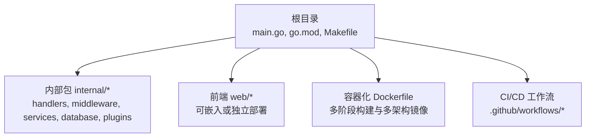
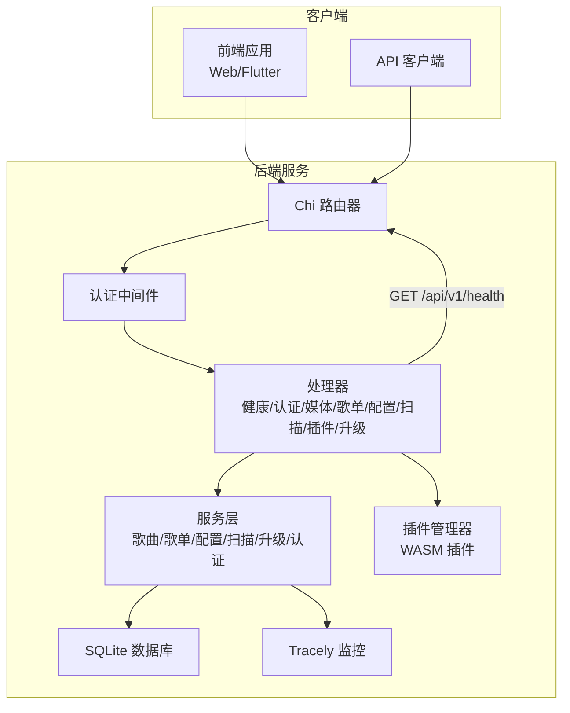
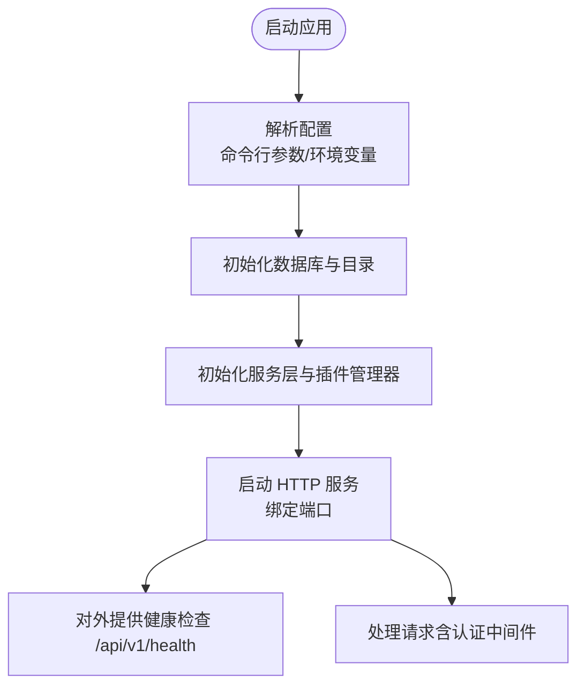
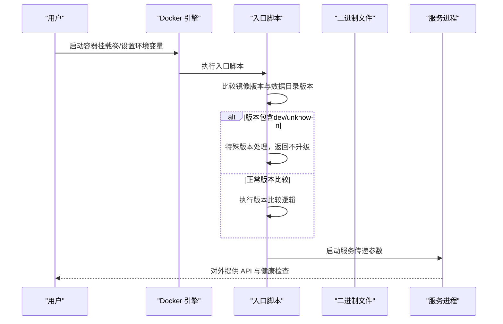
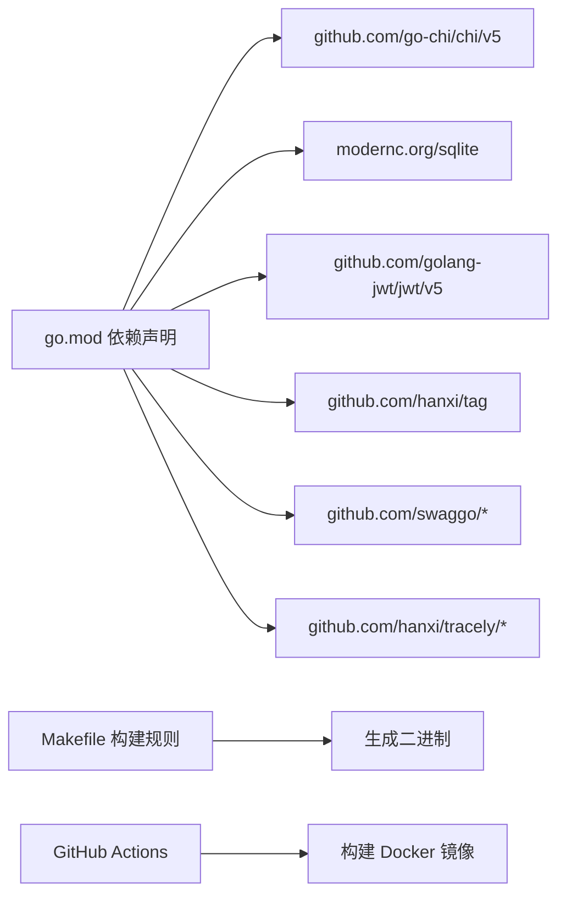

# 部署与运维

<cite>
**本文引用的文件**
- [README.md](file://README.md)
- [Dockerfile](file://Dockerfile)
- [main.go](file://main.go)
- [go.mod](file://go.mod)
- [Makefile](file://Makefile)
- [internal/app/app.go](file://internal/app/app.go)
- [internal/config/types.go](file://internal/config/types.go)
- [internal/handlers/health.go](file://internal/handlers/health.go)
- [internal/handlers/auth.go](file://internal/handlers/auth.go)
- [internal/middleware/auth.go](file://internal/middleware/auth.go)
- [.github/workflows/build-and-docker.yml](file://.github/workflows/build-and-docker.yml)
- [.github/workflows/test.yml](file://.github/workflows/test.yml)
- [scripts/docker-entrypoint.sh](file://scripts/docker-entrypoint.sh)
- [internal/version/version.go](file://internal/version/version.go)
</cite>

## 更新摘要
**变更内容**
- 更新Docker入口脚本中dev/unknown特殊版本处理逻辑的说明
- 新增版本比较函数中对特殊版本的防升级保护机制
- 补充版本处理的最佳实践和注意事项

## 目录
1. [简介](#简介)
2. [项目结构](#项目结构)
3. [核心组件](#核心组件)
4. [架构总览](#架构总览)
5. [详细组件分析](#详细组件分析)
6. [依赖关系分析](#依赖关系分析)
7. [性能考量](#性能考量)
8. [故障排除指南](#故障排除指南)
9. [结论](#结论)
10. [附录](#附录)

## 简介
本指南面向运维工程师与平台团队，提供 MiMusic 的部署与运维全生命周期方案，覆盖传统部署、Docker 部署、Kubernetes 部署与云平台部署；同时给出监控与日志配置、安全加固、性能优化、容量规划、故障排除、备份恢复与灾难恢复、以及 CI/CD 自动化与运维自动化的实施建议。

## 项目结构
- 后端主程序位于根目录，采用 Go 语言与 Chi 路由框架，提供 RESTful API 与内置 Swagger 文档（开发环境）。
- Docker 化支持完整，包含多架构镜像构建与推送流水线。
- 前端资源可通过嵌入模式打包进二进制，亦可独立部署。
- 项目提供完善的 Makefile 与 GitHub Actions 工作流，便于本地与云端自动化构建与发布。

**章节来源**
- [README.md:398-479](file://README.md#L398-L479)
- [go.mod:1-58](file://go.mod#L1-L58)
- [Dockerfile:1-77](file://Dockerfile#L1-L77)
- [.github/workflows/build-and-docker.yml:1-355](file://.github/workflows/build-and-docker.yml#L1-L355)

## 核心组件
- 应用入口与配置解析：负责解析命令行参数与环境变量，初始化日志、数据库、服务层与插件管理器，并启动 HTTP 服务。
- 认证与授权：基于 JWT 的双 Token（访问/刷新）机制，支持登录、刷新、登出与令牌管理。
- 健康检查：提供 /api/v1/health 接口，便于探针与负载均衡器进行存活/就绪检查。
- 监控与追踪：集成 Tracely 前端监控 SDK，支持心跳上报与版本标签。
- 日志：使用 Go 标准库 slog 输出结构化日志，便于集中采集与检索。

**章节来源**
- [internal/app/app.go:27-353](file://internal/app/app.go#L27-L353)
- [internal/config/types.go:1-10](file://internal/config/types.go#L1-L10)
- [internal/handlers/health.go:1-28](file://internal/handlers/health.go#L1-L28)
- [internal/handlers/auth.go:1-254](file://internal/handlers/auth.go#L1-L254)
- [internal/middleware/auth.go:1-52](file://internal/middleware/auth.go#L1-L52)
- [main.go:30-64](file://main.go#L30-L64)

## 架构总览
下图展示从客户端到后端、数据库与插件系统的整体交互，以及健康检查与监控链路。

**图表来源**
- [internal/app/app.go:27-353](file://internal/app/app.go#L27-L353)
- [internal/handlers/health.go:1-28](file://internal/handlers/health.go#L1-L28)
- [internal/middleware/auth.go:1-52](file://internal/middleware/auth.go#L1-L52)

## 详细组件分析

### 传统部署（裸机/虚拟机）
- 系统要求与前置条件
  - Go 1.26+、可选 ffprobe（用于音频技术参数提取）、SQLite（内置，无需额外安装）。
- 构建与运行
  - 使用 Makefile 的构建目标生成二进制，支持开发/生产、嵌入/非嵌入前端、跨平台编译。
  - 运行时通过命令行参数或环境变量注入管理员凭据、监听端口与数据库路径。
- 配置优先级
  - 命令行参数优先于环境变量；数据库路径与端口支持环境变量回退。
- 健康检查
  - 对外暴露 /api/v1/health 接口，便于系统集成探针。
- 日志
  - 使用标准库 slog 输出结构化日志，建议对接统一日志收集系统（如 Fluent Bit、Filebeat + Elasticsearch/OpenSearch）。

**章节来源**
- [README.md:19-479](file://README.md#L19-L479)
- [Makefile:80-175](file://Makefile#L80-L175)
- [internal/app/app.go:287-352](file://internal/app/app.go#L287-L352)

### Docker 部署
- 镜像构建
  - 多阶段构建，使用 Alpine 基础镜像，预装证书与时区数据；镜像内包含 ffprobe。
  - 支持通过构建参数控制是否嵌入前端资源与注入版本信息。
- 容器运行
  - 暴露端口 58091；建议挂载音乐目录与数据目录以持久化。
  - 提供环境变量注入管理员凭据与运行标识。
- 热升级能力
  - 容器入口脚本具备"镜像版本 vs 数据目录版本"的比较与热替换逻辑，结合数据卷实现平滑升级。

**更新** Docker入口脚本中的版本比较函数现已增强对dev/unknown等特殊版本的处理逻辑，防止不必要的升级触发。

**图表来源**
- [Dockerfile:45-77](file://Dockerfile#L45-L77)
- [scripts/docker-entrypoint.sh:14-127](file://scripts/docker-entrypoint.sh#L14-L127)

**章节来源**
- [Dockerfile:1-77](file://Dockerfile#L1-L77)
- [scripts/docker-entrypoint.sh:1-127](file://scripts/docker-entrypoint.sh#L1-L127)
- [README.md:143-171](file://README.md#L143-L171)

### Kubernetes 部署
- 基本建议
  - 使用 Deployment 管理副本，Service 暴露 58091 端口。
  - 使用 PersistentVolumeClaim 挂载音乐与数据目录，确保数据持久化。
  - 配置 HorizontalPodAutoscaler 基于 CPU/内存或自定义指标弹性伸缩。
- 健康检查
  - 使用 readinessProbe/ livenessProbe 调用 /api/v1/health。
- 配置管理
  - 使用 ConfigMap 管理非敏感配置，Secret 管理管理员凭据与 JWT 密钥。
- 插件与资源
  - 插件目录建议单独挂载，避免随主程序滚动升级影响插件状态。
- 安全
  - 限制容器权限，启用 PodSecurity；对 API 网关或 Ingress 启用 TLS 终止与速率限制。

**章节来源**
- [internal/handlers/health.go:15-27](file://internal/handlers/health.go#L15-L27)
- [internal/config/types.go:3-9](file://internal/config/types.go#L3-L9)

### 云平台部署（公有云/混合云）
- 建议方案
  - 云主机：直接使用 Docker 部署或裸机部署，结合云盘挂载实现持久化。
  - 容器服务：在 ACK/AKS/ECS 上部署，结合 SLB/NLB 与 WAF/CLB 实现高可用与安全防护。
  - 边缘/对象存储：结合 CDN 与对象存储，分离静态资源与媒体文件，降低主站压力。
- 配置与密钥
  - 使用云平台的密钥管理服务（KMS/Secrets Manager）管理敏感配置。
- 监控与告警
  - 对接云监控与日志服务，建立端到端可观测性。

**章节来源**
- [README.md:143-171](file://README.md#L143-L171)

## 依赖关系分析
- 运行时依赖
  - Web 框架：Chi v5
  - 数据库：modernc.org/sqlite（纯 Go 实现）
  - 认证：golang-jwt/jwt/v5
  - 元数据提取：hanxi/tag（fork dhowden/tag）
  - 监控：hanxi/tracely
  - Swagger：swaggo
- 构建与打包
  - Makefile 提供跨平台编译、压缩与嵌入前端资源的能力。
- CI/CD
  - GitHub Actions 支持前端构建、多平台二进制构建、Docker 多架构镜像构建与推送。

**图表来源**
- [go.mod:5-21](file://go.mod#L5-L21)
- [Makefile:80-175](file://Makefile#L80-L175)
- [.github/workflows/build-and-docker.yml:293-355](file://.github/workflows/build-and-docker.yml#L293-L355)

**章节来源**
- [go.mod:1-58](file://go.mod#L1-L58)
- [Makefile:1-325](file://Makefile#L1-L325)
- [.github/workflows/build-and-docker.yml:1-355](file://.github/workflows/build-and-docker.yml#L1-L355)

## 性能考量
- 构建优化
  - 使用 UPX 压缩生产环境二进制（Makefile 已内置）。
  - 多平台交叉编译与缓存（Go 模块缓存与构建缓存）。
- 运行时优化
  - SQLite 为纯 Go 实现，适合中小规模并发；若并发较高，建议评估外部数据库与连接池。
  - 元数据提取与音频分析依赖 ffprobe，建议在容器内预置并合理配置磁盘 I/O。
- 监控与追踪
  - Tracely SDK 已集成，建议在生产环境开启心跳并设置合理的标签（版本、环境）。
- 前端资源
  - 生产环境可嵌入前端资源，减少静态文件分发压力；也可独立部署并配合 CDN。

**章节来源**
- [Makefile:92-116](file://Makefile#L92-L116)
- [internal/app/app.go:206-217](file://internal/app/app.go#L206-L217)
- [README.md:387-479](file://README.md#L387-L479)

## 故障排除指南
- 常见问题定位
  - 启动失败：检查配置解析（命令行参数与环境变量）、数据库路径与权限、端口占用。
  - 认证失败：确认 JWT 密钥是否正确初始化、刷新令牌是否有效、客户端 ID 是否正确传递。
  - 健康检查异常：确认 /api/v1/health 可达，排查中间件链路与服务初始化顺序。
  - Docker 热升级失败：检查入口脚本版本比较逻辑与数据卷权限。
- 日志与诊断
  - 使用标准库 slog 输出结构化日志，建议接入集中式日志系统。
  - 对外暴露 /api/v1/health 便于探针检查；结合业务日志定位问题。
- 回滚策略
  - Docker 热升级具备备份与回滚能力；生产环境建议在变更窗口内执行并做好监控。

**更新** Docker入口脚本中的版本比较函数已增强对dev/unknown等特殊版本的处理，防止意外升级触发。

**章节来源**
- [internal/app/app.go:30-62](file://internal/app/app.go#L30-L62)
- [internal/handlers/health.go:15-27](file://internal/handlers/health.go#L15-L27)
- [scripts/docker-entrypoint.sh:76-114](file://scripts/docker-entrypoint.sh#L76-L114)

## 结论
MiMusic 提供了从传统部署到容器化与云原生的完整路径。通过明确的配置优先级、健壮的健康检查、结构化日志与监控集成，以及完善的 CI/CD 流水线，可在不同环境中实现稳定、可观测与可演进的部署与运维体系。

## 附录

### 监控与日志配置
- 日志
  - 使用标准库 slog 输出结构化日志，建议对接集中式日志系统（如 OpenSearch/ELK、Cloud Logging）。
- 性能监控
  - Tracely SDK 已集成，建议在生产环境启用心跳并设置版本标签。
- 错误追踪
  - 建议在前端引入 Tracely 前端 SDK，结合后端日志与链路追踪实现端到端问题定位。
- 健康检查
  - 使用 /api/v1/health 接口进行存活/就绪探测，结合探针与负载均衡器实现高可用。

**章节来源**
- [main.go:30-64](file://main.go#L30-L64)
- [internal/app/app.go:206-217](file://internal/app/app.go#L206-L217)
- [internal/handlers/health.go:15-27](file://internal/handlers/health.go#L15-L27)

### 安全考虑
- 认证安全
  - 使用 JWT 双 Token 机制，支持登录、刷新与登出；建议强制 HTTPS 传输与安全 Cookie（如适用）。
- 数据安全
  - 数据库存储在挂载卷中，建议开启加密与定期备份；对敏感配置使用密钥管理服务。
- 网络安全
  - 建议在网关层启用 TLS 终止、WAF、速率限制与 IP 白名单。
- 插件安全
  - 插件通过 WASM 运行，建议限制插件权限与资源配额，隔离插件间通信。

**章节来源**
- [internal/handlers/auth.go:27-134](file://internal/handlers/auth.go#L27-L134)
- [internal/middleware/auth.go:11-51](file://internal/middleware/auth.go#L11-L51)

### 部署最佳实践
- 传统部署
  - 使用 systemd 或服务管理器托管进程，配置日志轮转与资源限制。
- Docker/Kubernetes
  - 使用只读根文件系统、最小权限容器；持久化卷与配置分离；健康检查与优雅退出。
- 云平台
  - 使用托管数据库与对象存储；启用自动备份与异地容灾；结合 WAF 与 CDN。

**章节来源**
- [Dockerfile:45-77](file://Dockerfile#L45-L77)
- [internal/app/app.go:55-62](file://internal/app/app.go#L55-L62)

### 容量规划与性能优化
- 存储
  - 音乐目录与数据目录建议使用高性能磁盘；根据并发与吞吐需求评估 IOPS。
- 数据库
  - SQLite 适合中小规模；若并发高，建议评估外部数据库与连接池策略。
- 前端与静态资源
  - 生产环境嵌入前端资源或独立部署并配合 CDN；开启缓存与压缩。
- 监控
  - 建立端到端监控与告警，关注延迟、错误率与资源使用情况。

**章节来源**
- [Makefile:80-116](file://Makefile#L80-L116)
- [README.md:387-479](file://README.md#L387-L479)

### 备份恢复与灾难恢复
- 备份
  - 定期备份数据库文件与插件目录；记录版本与配置快照。
- 恢复
  - 使用一致的时间点恢复；验证 /api/v1/health 与核心接口可用性。
- 灾难恢复
  - 建立跨区域或多集群部署；演练恢复流程并定期验证。

**章节来源**
- [scripts/docker-entrypoint.sh:98-110](file://scripts/docker-entrypoint.sh#L98-L110)

### 运维自动化与 CI/CD
- 构建与测试
  - 使用 Makefile 与 GitHub Actions 实现多平台构建、测试与覆盖率上报。
- 发布与镜像
  - Docker 多架构镜像构建与推送；版本标签与发布管理。
- 持续部署
  - 建议在 CI 中加入安全扫描与合规检查；在 CD 中加入灰度发布与回滚策略。

**章节来源**
- [.github/workflows/build-and-docker.yml:1-355](file://.github/workflows/build-and-docker.yml#L1-L355)
- [.github/workflows/test.yml:1-123](file://.github/workflows/test.yml#L1-L123)
- [Makefile:188-218](file://Makefile#L188-L218)

### 版本处理与升级策略

**更新** Docker入口脚本中的版本比较函数现已增强对dev/unknown等特殊版本的处理逻辑，防止不必要的升级触发。

#### 版本比较逻辑增强
Docker入口脚本中的compare_versions函数现已包含以下特殊版本处理逻辑：

- **dev版本处理**：当镜像版本或数据目录版本为"dev"时，直接返回不升级（return 1）
- **unknown版本处理**：当镜像版本或数据目录版本为"unknown"时，直接返回不升级（return 1）
- **版本相等处理**：如果两个版本完全相同，直接返回不升级（return 1）

#### 版本注入机制
- **构建时注入**：通过Makefile和GitHub Actions将版本信息注入到二进制文件中
- **默认值设置**：internal/version/version.go中设置了默认的dev/unknown版本值
- **CI/CD集成**：GitHub Actions工作流根据触发类型动态设置版本号

#### 最佳实践建议
- **开发环境**：使用"dev"版本标记开发构建，避免意外升级
- **生产环境**：使用语义化版本号，确保升级的确定性
- **版本比较**：遵循语义化版本规范，确保版本比较的准确性
- **回滚策略**：利用入口脚本的备份机制，确保升级失败时能够快速回滚

**章节来源**
- [scripts/docker-entrypoint.sh:14-64](file://scripts/docker-entrypoint.sh#L14-L64)
- [internal/version/version.go:1-19](file://internal/version/version.go#L1-L19)
- [Makefile:8-16](file://Makefile#L8-L16)
- [.github/workflows/build-and-docker.yml:155-175](file://.github/workflows/build-and-docker.yml#L155-L175)