# Docker 部署

<cite>
**本文引用的文件**
- [Dockerfile](file://Dockerfile)
- [.github/workflows/build-and-docker.yml](file://.github/workflows/build-and-docker.yml)
- [scripts/docker-entrypoint.sh](file://scripts/docker-entrypoint.sh)
- [.dockerignore](file://.dockerignore)
- [Makefile](file://Makefile)
- [internal/version/version.go](file://internal/version/version.go)
- [frontend/Dockerfile](file://frontend/Dockerfile)
- [frontend/.dockerignore](file://frontend/.dockerignore)
- [README.md](file://README.md)
- [scripts/generate-changelog.sh](file://scripts/generate-changelog.sh)
</cite>

## 更新摘要
**变更内容**
- 新增 VERSION 构建参数支持，实现版本号传递和注入
- 添加 docker-build Makefile 目标，简化 Docker 镜像构建流程
- 集成 generate-changelog.sh 自动化脚本，支持 Conventional Commits 格式化变更日志生成
- 更新构建参数详解，包含 VERSION 参数的使用方法
- 增强自动化发布流程，支持版本管理和变更日志生成

## 目录
1. [简介](#简介)
2. [项目结构](#项目结构)
3. [核心组件](#核心组件)
4. [架构概览](#架构概览)
5. [详细组件分析](#详细组件分析)
6. [依赖关系分析](#依赖关系分析)
7. [性能考虑](#性能考虑)
8. [故障排除指南](#故障排除指南)
9. [结论](#结论)
10. [附录](#附录)

## 简介

MiMusic 是一个基于 Go 和 Chi 框架的轻量级音乐服务器，支持本地音乐文件管理、元数据提取和歌单管理。本文档提供了 MiMusic 的完整 Docker 部署指南，涵盖多阶段构建策略、Go 编译优化、缓存机制和体积优化等关键主题。

MiMusic 提供了现代化的 Docker 容器化解决方案，包括：
- 多阶段 Docker 构建
- Go 编译优化和缓存机制
- 生产环境和开发环境的不同构建选项
- 完整的 CI/CD 集成
- 热升级和版本管理功能
- 自动化版本发布和变更日志生成

## 项目结构

MiMusic 项目采用模块化的组织结构，主要包含以下关键目录：

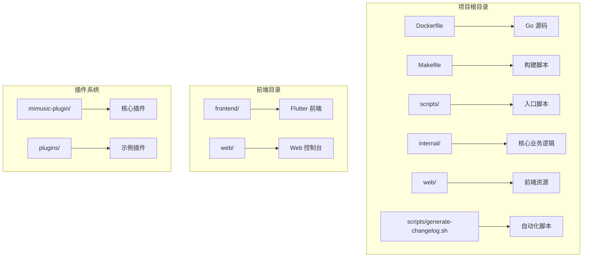

**图表来源**
- [Dockerfile:1-80](file://Dockerfile#L1-L80)
- [Makefile:1-339](file://Makefile#L1-L339)

**章节来源**
- [Dockerfile:1-80](file://Dockerfile#L1-L80)
- [Makefile:1-339](file://Makefile#L1-L339)

## 核心组件

### Dockerfile 多阶段构建

MiMusic 采用了精心设计的多阶段 Docker 构建策略，实现了高效的构建流程和最小化的镜像体积。

#### 构建阶段概述

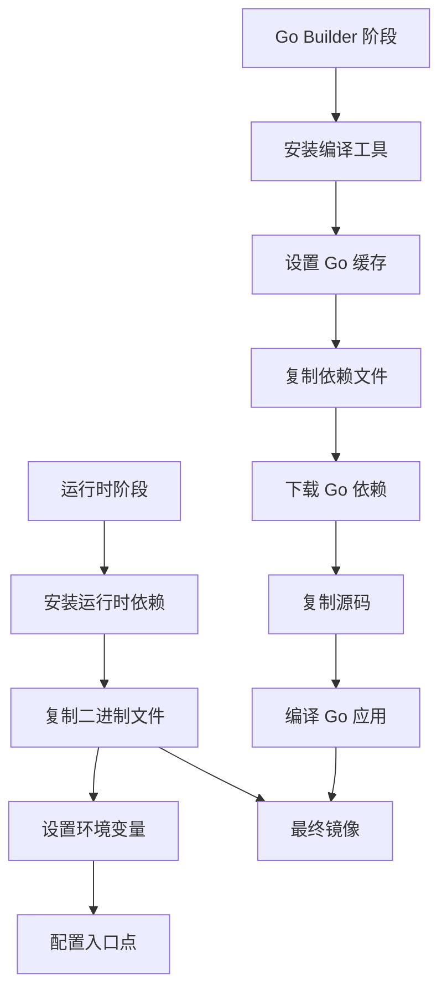

**图表来源**
- [Dockerfile:4-44](file://Dockerfile#L4-L44)
- [Dockerfile:48-77](file://Dockerfile#L48-L77)

#### 关键构建参数

| 参数名称 | 默认值 | 用途 | 示例 |
|---------|--------|------|------|
| `FULL_BUILD` | `false` | 控制是否构建完整版本 | `--build-arg FULL_BUILD=true` |
| `VERSION` | 未设置 | 应用版本号传递 | `--build-arg VERSION=v1.3.13` |
| `GIT_COMMIT` | `unknown` | Git 提交哈希 | `--build-arg GIT_COMMIT=abc123` |
| `BUILD_TIME` | `unknown` | 构建时间戳 | `--build-arg BUILD_TIME=2024-01-01_12:00:00` |
| `GOPROXY` | 未设置 | Go 模块代理 | `--build-arg GOPROXY=https://proxy.golang.org` |

**更新** 新增 VERSION 构建参数，支持版本号传递和注入

**章节来源**
- [Dockerfile:16-21](file://Dockerfile#L16-L21)
- [Dockerfile:36-46](file://Dockerfile#L36-L46)

### 缓存优化策略

MiMusic 实现了多层次的缓存优化策略，显著提升了构建效率：

#### Go 编译缓存

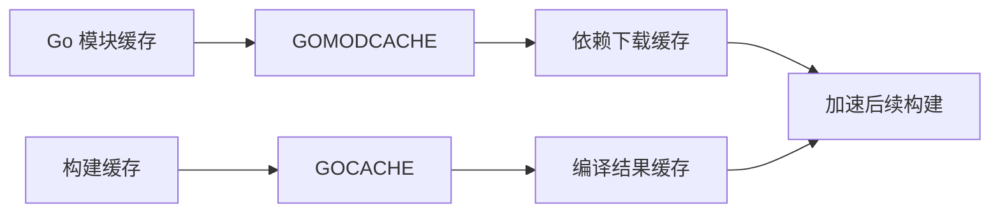

**图表来源**
- [Dockerfile:13-14](file://Dockerfile#L13-L14)
- [Dockerfile:37-38](file://Dockerfile#L37-L38)

#### 缓存挂载配置

| 缓存类型 | 目标路径 | 用途 | 性能影响 |
|---------|----------|------|----------|
| `GOMODCACHE` | `/go/pkg/mod` | Go 模块依赖缓存 | 减少网络依赖下载 |
| `GOCACHE` | `/root/.cache/go-build` | Go 编译缓存 | 加速编译过程 |
| `upx` | 二进制压缩 | 体积优化 | 减少镜像大小 |

**章节来源**
- [Dockerfile:37-38](file://Dockerfile#L37-L38)
- [Makefile:96-102](file://Makefile#L96-L102)

## 架构概览

MiMusic 的 Docker 架构采用分层设计，实现了构建时和运行时的最佳分离：

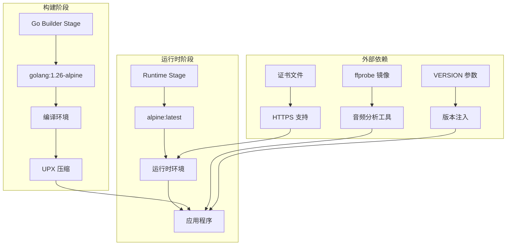

**图表来源**
- [Dockerfile:4-44](file://Dockerfile#L4-L44)
- [Dockerfile:48-77](file://Dockerfile#L48-L77)

## 详细组件分析

### 构建参数详解

#### FULL_BUILD 构建选项

MiMusic 提供了两种构建模式，通过 `FULL_BUILD` 参数控制：

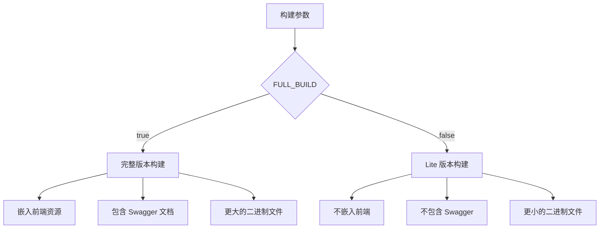

**图表来源**
- [Dockerfile:42-46](file://Dockerfile#L42-L46)
- [Makefile:86-116](file://Makefile#L86-L116)

#### VERSION 参数支持

**新增功能** MiMusic 现在支持 VERSION 构建参数，用于传递和注入应用版本信息：

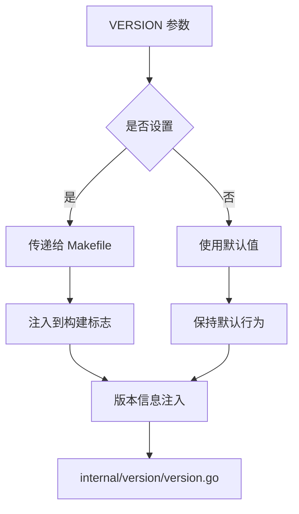

**图表来源**
- [Dockerfile:37](file://Dockerfile#L37)
- [Dockerfile:41-46](file://Dockerfile#L41-L46)
- [Makefile:14](file://Makefile#L14)

#### Git 提交信息注入

构建过程中自动注入版本信息，便于追踪和调试：

| 版本信息 | 注入位置 | 用途 |
|---------|----------|------|
| `Version` | `internal/version/version.go` | 显示当前版本号 |
| `GitCommit` | `internal/version/version.go` | 显示 Git 提交哈希 |
| `BuildTime` | `internal/version/version.go` | 显示构建时间 |

**章节来源**
- [Dockerfile:17-18](file://Dockerfile#L17-L18)
- [Makefile:8-16](file://Makefile#L8-L16)
- [internal/version/version.go:4-8](file://internal/version/version.go#L4-L8)

### 容器配置最佳实践

#### 环境变量设置

MiMusic 容器支持多种环境变量配置：

| 环境变量 | 默认值 | 用途 | 安全性 |
|---------|--------|------|--------|
| `ADMIN_USERNAME` | `admin` | 管理员用户名 | 中等 |
| `ADMIN_PASSWORD` | `admin` | 管理员密码 | 低 |
| `IN_DOCKER` | `true` | 标识 Docker 环境 | 无 |
| `TZ` | `Asia/Shanghai` | 时区设置 | 无 |

**章节来源**
- [Dockerfile:72-74](file://Dockerfile#L72-L74)
- [Dockerfile:52](file://Dockerfile#L52)

#### 卷挂载策略

```mermaid
graph LR
A[/app/music] --> B[音乐文件存储]
C[/app/data] --> D[应用数据存储]
B --> E[持久化存储]
D --> F[配置和数据库]
E --> G[外部卷映射]
F --> G
```

**图表来源**
- [Dockerfile:61-65](file://Dockerfile#L61-L65)
- [Dockerfile:76](file://Dockerfile#L76)

#### 网络配置

| 端口 | 协议 | 用途 | 安全性 |
|------|------|------|--------|
| `58091` | TCP | 主要 API 端口 | 高 |
| `58092` | TCP | 可选 API 端口 | 高 |
| `8080` | TCP | Web 控制台端口 | 中 |

**章节来源**
- [Dockerfile:67](file://Dockerfile#L67)

### docker-compose 配置示例

虽然项目没有提供官方的 docker-compose.yml 文件，但可以基于现有配置创建生产级别的编排文件：

```yaml
version: '3.8'

services:
  mimusic:
    image: hanxi/mimusic:latest
    container_name: mimusic
    restart: unless-stopped
    ports:
      - "58091:58091"
    volumes:
      - ./music:/app/music:rw
      - ./data:/app/data:rw
    environment:
      - ADMIN_USERNAME=admin
      - ADMIN_PASSWORD=your_secure_password
      - TZ=Asia/Shanghai
    networks:
      - mimusic-network
    healthcheck:
      test: ["CMD", "wget", "--spider", "-q", "localhost:58091/api/v1/health"]
      interval: 30s
      timeout: 10s
      retries: 3
      start_period: 40s

  nginx:
    image: nginx:alpine
    container_name: mimusic-nginx
    restart: unless-stopped
    ports:
      - "80:80"
      - "443:443"
    volumes:
      - ./nginx.conf:/etc/nginx/nginx.conf
      - ./ssl:/etc/nginx/ssl
    depends_on:
      - mimusic
    networks:
      - mimusic-network

networks:
  mimusic-network:
    driver: bridge
```

### 容器运行参数

#### 资源限制

```bash
docker run -d \
  --name mimusic \
  --restart unless-stopped \
  --memory=1g \
  --cpus=1.5 \
  --shm-size=256m \
  -p 58091:58091 \
  -v ./music:/app/music:rw \
  -v ./data:/app/data:rw \
  -e ADMIN_USERNAME=admin \
  -e ADMIN_PASSWORD=your_secure_password \
  -e TZ=Asia/Shanghai \
  hanxi/mimusic:latest
```

#### 健康检查

```bash
docker inspect --format "{{json .State.Health }}" mimusic
```

#### 重启策略

| 策略 | 行为 | 适用场景 |
|------|------|----------|
| `unless-stopped` | 容器退出后重启，除非手动停止 | 生产环境 |
| `always` | 无论状态如何都重启 | 开发环境 |
| `on-failure` | 仅在失败时重启 | 特定场景 |

**章节来源**
- [Dockerfile:78-79](file://Dockerfile#L78-L79)

### Docker 镜像优化技巧

#### 多阶段构建优化

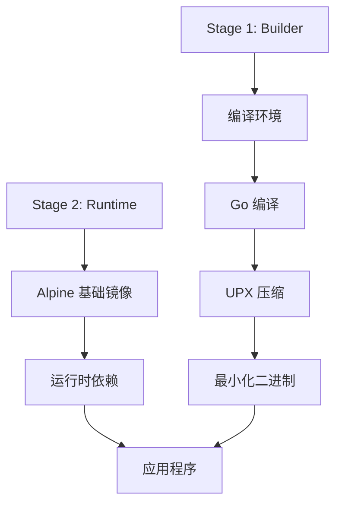

**图表来源**
- [Dockerfile:4-44](file://Dockerfile#L4-L44)
- [Dockerfile:48-77](file://Dockerfile#L48-L77)

#### 精简基础镜像

| 组件 | 用途 | 可选性 |
|------|------|--------|
| `ca-certificates` | HTTPS 支持 | 必需 |
| `tzdata` | 时区支持 | 必需 |
| `ffprobe` | 音频分析 | 可选 |

#### 安全加固措施

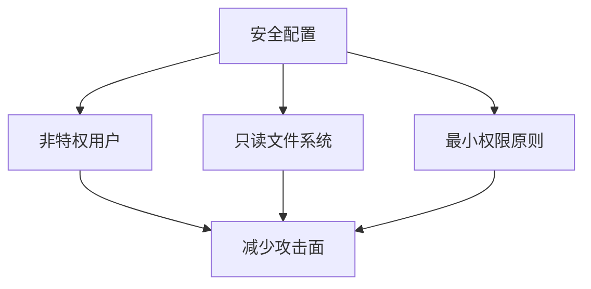

**章节来源**
- [.dockerignore:1-67](file://.dockerignore#L1-L67)

### 自动化发布和版本管理

**新增功能** MiMusic 现在集成了完整的自动化发布流程，包括版本管理和变更日志生成：

#### VERSION 构建参数使用

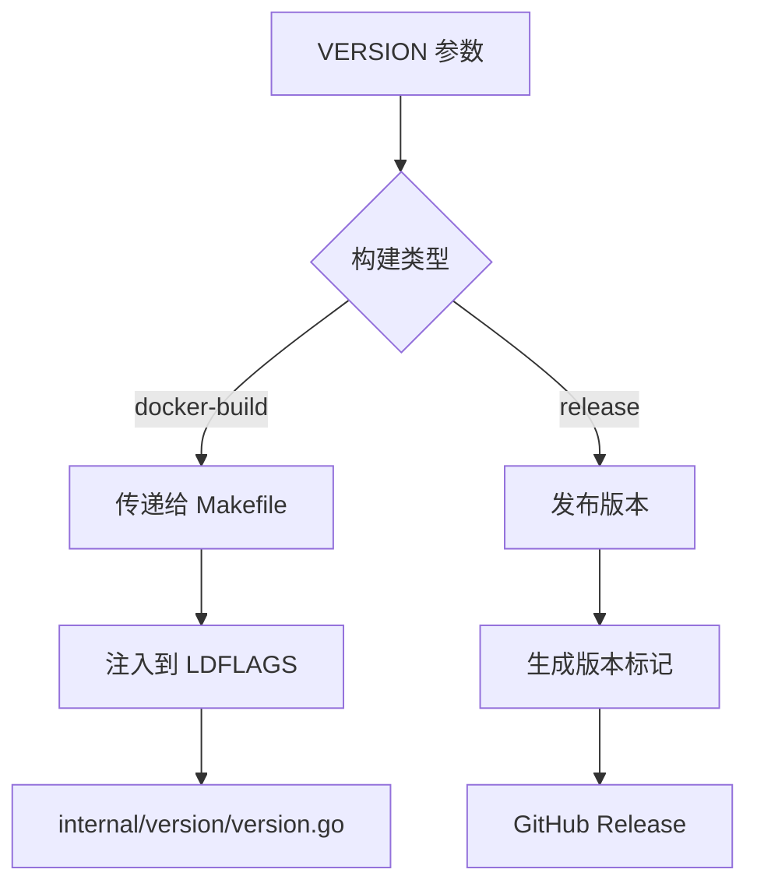

**图表来源**
- [Dockerfile:37](file://Dockerfile#L37)
- [Dockerfile:41-46](file://Dockerfile#L41-L46)
- [Makefile:14](file://Makefile#L14)

#### generate-changelog.sh 自动化脚本

**新增功能** 自动生成符合 Conventional Commits 格式的变更日志：

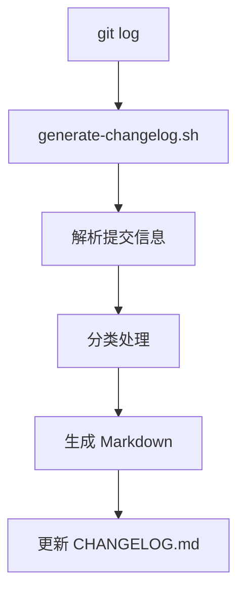

**图表来源**
- [scripts/generate-changelog.sh:76-191](file://scripts/generate-changelog.sh#L76-L191)

**章节来源**
- [scripts/generate-changelog.sh:1-457](file://scripts/generate-changelog.sh#L1-L457)

## 依赖关系分析

### 构建时依赖

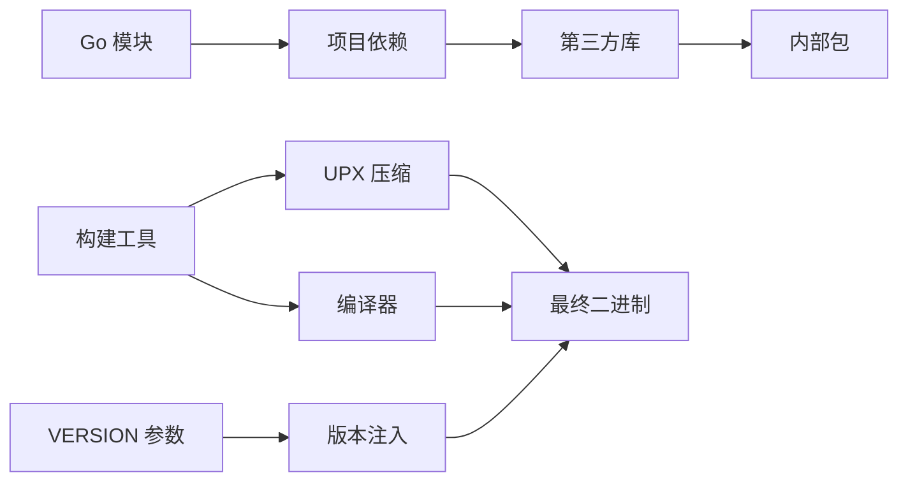

**图表来源**
- [Dockerfile:8-10](file://Dockerfile#L8-L10)
- [Dockerfile:22-28](file://Dockerfile#L22-L28)
- [Dockerfile:37](file://Dockerfile#L37)

### 运行时依赖

| 依赖类型 | 包名 | 版本 | 用途 |
|---------|------|------|------|
| 基础系统 | alpine | latest | 最小化操作系统 |
| Go 运行时 | golang | 1.26 | 应用程序运行 |
| 音频工具 | ffprobe | 来自外部镜像 | 音频分析 |
| 证书 | ca-certificates | Alpine 包 | HTTPS 支持 |

**章节来源**
- [Dockerfile:48-50](file://Dockerfile#L48-L50)

## 性能考虑

### 构建性能优化

#### 缓存策略

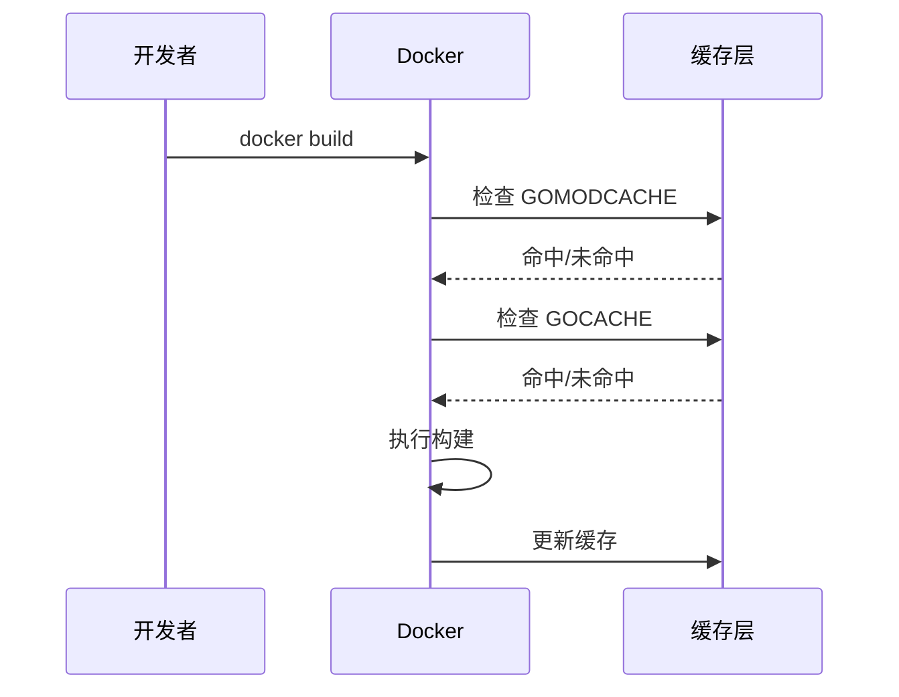

**图表来源**
- [Dockerfile:37-38](file://Dockerfile#L37-L38)

#### 编译优化

| 优化选项 | 效果 | 影响 |
|---------|------|------|
| `-s -w` | 移除符号和调试信息 | 减少 20% 体积 |
| UPX 压缩 | 进一步减小体积 | 需要额外时间 |
| CGO_ENABLED=0 | 纯静态链接 | 更小的二进制文件 |

**章节来源**
- [Makefile:13-16](file://Makefile#L13-L16)
- [Makefile:96-102](file://Makefile#L96-L102)

### 运行时性能

#### 内存使用

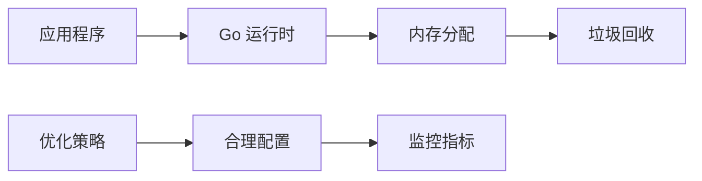

**图表来源**
- [Dockerfile:78-79](file://Dockerfile#L78-L79)

## 故障排除指南

### 常见构建问题

#### 缓存相关问题

```bash
# 清理构建缓存
docker builder prune --all

# 清理特定镜像缓存
docker rmi <image-id>

# 重新构建（忽略缓存）
docker build --no-cache -t mimusic .
```

#### 依赖下载失败

```bash
# 设置 GOPROXY
docker build --build-arg GOPROXY=https://proxy.golang.org -t mimusic .

# 检查网络连接
ping proxy.golang.org
```

#### VERSION 参数问题

```bash
# 检查 VERSION 参数传递
docker build --build-arg VERSION=v1.3.13 -t mimusic:v1.3.13 .

# 验证版本注入
docker run --rm mimusic:v1.3.13 /app/mimusic version
```

**更新** 新增 VERSION 参数相关故障排除指导

### 运行时问题诊断

#### 日志查看

```bash
# 查看容器日志
docker logs -f mimusic

# 查看最近日志
docker logs --tail 100 mimusic

# 查看错误日志
docker logs --tail 100 --since "1h" mimusic
```

#### 健康检查

```bash
# 检查容器健康状态
docker inspect --format "{{json .State.Health }}" mimusic

# 查看容器状态
docker ps -a
```

#### 端口冲突

```bash
# 检查端口占用
netstat -tulpn | grep 58091

# 查找占用进程
lsof -i :58091

# 更改端口映射
docker run -p 58092:58091 ...
```

**章节来源**
- [scripts/docker-entrypoint.sh:14-64](file://scripts/docker-entrypoint.sh#L14-L64)

### 热升级功能

MiMusic 提供了智能的热升级功能，允许在不停机的情况下更新应用程序：

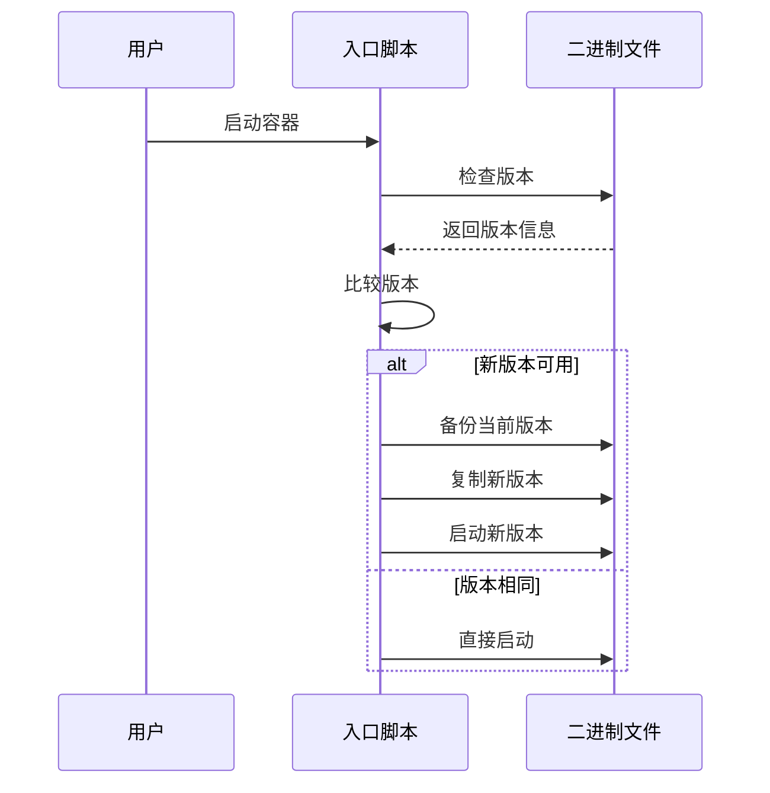

**图表来源**
- [scripts/docker-entrypoint.sh:66-114](file://scripts/docker-entrypoint.sh#L66-L114)

**章节来源**
- [scripts/docker-entrypoint.sh:1-127](file://scripts/docker-entrypoint.sh#L1-L127)

### 自动化发布流程

**新增功能** 完整的自动化发布流程，包括版本管理和变更日志生成：

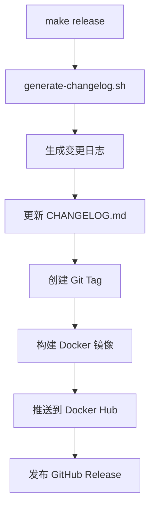

**图表来源**
- [scripts/generate-changelog.sh:196-269](file://scripts/generate-changelog.sh#L196-L269)
- [Makefile:310-320](file://Makefile#L310-L320)

**章节来源**
- [scripts/generate-changelog.sh:1-457](file://scripts/generate-changelog.sh#L1-L457)

## 结论

MiMusic 的 Docker 部署方案展现了现代容器化应用的最佳实践。通过精心设计的多阶段构建、智能的缓存策略和全面的安全加固，实现了高效、可靠且易于维护的部署体验。

### 主要优势

1. **高效的构建流程**：多阶段构建和缓存优化显著减少了构建时间
2. **最小化的镜像体积**：通过精简基础镜像和 UPX 压缩实现了优化
3. **灵活的配置选项**：支持多种构建模式和环境配置
4. **智能的热升级**：实现了零停机的应用更新
5. **完善的监控支持**：内置健康检查和日志管理
6. **自动化版本管理**：支持 VERSION 参数传递和注入
7. **完整的发布流程**：集成变更日志生成和自动化发布

### 建议的改进方向

1. **添加 docker-compose 示例**：提供生产级别的编排配置
2. **增强安全配置**：考虑使用非-root 用户运行
3. **添加资源限制**：为生产环境提供更严格的资源约束
4. **完善监控集成**：添加 Prometheus 指标和日志聚合
5. **优化 VERSION 参数处理**：确保 TEST_VERSION 变量正确定义

## 附录

### 完整的构建命令

```bash
# 基础构建
docker build -t mimusic .

# 完整版本构建
docker build --build-arg FULL_BUILD=true -t mimusic-full .

# 带 Git 信息的构建
docker build \
  --build-arg GIT_COMMIT=$(git rev-parse --short HEAD) \
  --build-arg BUILD_TIME=$(date -u '+%Y-%m-%d_%H:%M:%S') \
  -t mimusic-with-info .

# 带版本号的构建
docker build \
  --build-arg VERSION=v1.3.13 \
  --build-arg FULL_BUILD=true \
  -t mimusic:v1.3.13 .

# 多架构构建
docker buildx build \
  --platform linux/amd64,linux/arm64,linux/arm/v7 \
  --push \
  -t hanxi/mimusic:latest .
```

**更新** 新增 VERSION 参数和多架构构建示例

### 环境变量参考

| 变量名 | 类型 | 默认值 | 描述 |
|-------|------|--------|------|
| `ADMIN_USERNAME` | 字符串 | `admin` | 管理员用户名 |
| `ADMIN_PASSWORD` | 字符串 | `admin` | 管理员密码 |
| `IN_DOCKER` | 布尔值 | `true` | 标识 Docker 环境 |
| `TZ` | 字符串 | `Asia/Shanghai` | 时区设置 |
| `LISTEN_PORT` | 数字 | `58091` | 监听端口 |
| `DB_PATH` | 字符串 | `data/mimusic.db` | 数据库路径 |

### 卷挂载参考

| 挂载点 | 权限 | 描述 |
|-------|------|------|
| `/app/music` | 读写 | 音乐文件存储目录 |
| `/app/data` | 读写 | 应用数据和配置目录 |

### VERSION 参数使用示例

```bash
# 在 Makefile 中使用
make docker-build VERSION=v1.3.13

# 在 Docker 构建中使用
docker build --build-arg VERSION=v1.3.13 -t mimusic:v1.3.13 .

# 生成变更日志
./scripts/generate-changelog.sh --update-file v1.3.13
```

**新增** VERSION 参数使用示例和自动化脚本集成说明