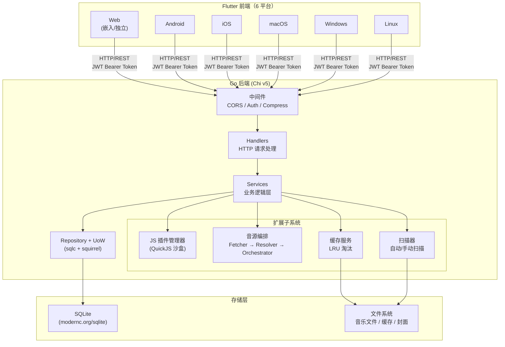
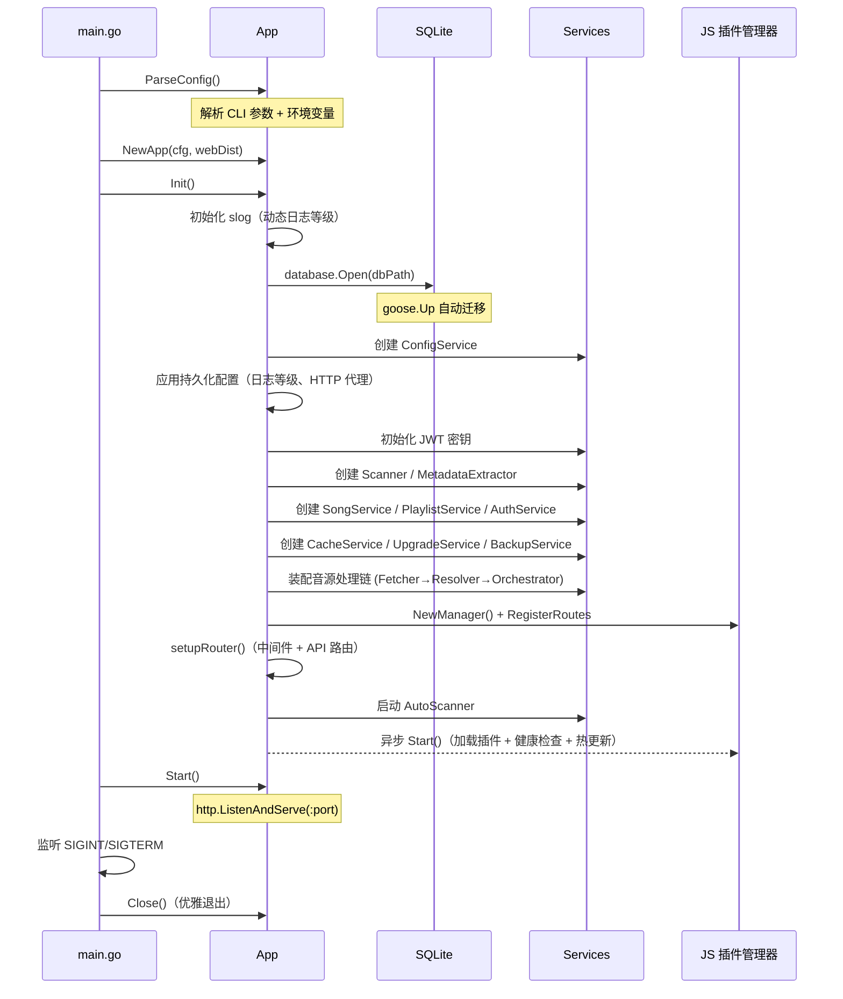

# 项目概述


本文档基于以下源文件编写：

- [main.go](https://github.com/songloft-org/songloft/blob/main/main.go) -- 程序入口、Swagger 注解、信号处理
- [internal/app/app.go](https://github.com/songloft-org/songloft/blob/main/internal/app/app.go) -- 应用初始化流程（`Init` / `Start` / `Close`）
- [internal/app/routers.go](https://github.com/songloft-org/songloft/blob/main/internal/app/routers.go) -- 路由注册与中间件装配
- [internal/config/types.go](https://github.com/songloft-org/songloft/blob/main/internal/config/types.go) -- 启动配置结构定义
- [internal/version/version.go](https://github.com/songloft-org/songloft/blob/main/internal/version/version.go) -- 版本号注入与输出
- [go.mod](https://github.com/songloft-org/songloft/blob/main/go.mod) -- Go 模块声明与依赖列表
- [Makefile](https://github.com/songloft-org/songloft/blob/main/Makefile) -- 构建、测试、部署命令


## 目录

1. [简介](#1-简介)
2. [项目结构](#2-项目结构)
3. [核心特性](#3-核心特性)
4. [技术栈总览](#4-技术栈总览)
5. [系统架构概览](#5-系统架构概览)
6. [快速开始](#6-快速开始)
7. [结论](#7-结论)

---

## 1. 简介

Songloft 是一款**自托管的本地音乐服务器**，旨在让用户在自有硬件上统一管理和播放本地音乐与网络音源。项目当前版本为 **2.10.0**，采用 Apache 2.0 许可证开源。

核心价值：

- **自主可控** -- 音乐文件与元数据存储在用户本地，无需依赖第三方云服务。
- **跨平台覆盖** -- 单一后端搭配 Flutter 前端，一套代码部署到 Android、iOS、macOS、Windows、Linux 和 Web 共 6 个平台。
- **可扩展** -- 通过 QuickJS 沙盒运行 JS 插件，用户可自行开发音源、歌词、元数据等插件扩展功能。
- **轻量部署** -- 后端编译为单一二进制（可选嵌入前端），SQLite 零外部依赖，Docker 一行即启动。

**章节来源**
- [main.go:26-38](https://github.com/songloft-org/songloft/blob/main/main.go#L26-L38) -- Swagger 注解中的项目描述、版本与默认端口
- [internal/version/version.go:1-24](https://github.com/songloft-org/songloft/blob/main/internal/version/version.go#L1-L24) -- 版本号定义

---

## 2. 项目结构

Songloft 采用多仓库结构，各子项目职责明确：

| 目录 | 技术 | 说明 |
|------|------|------|
| `/`（根目录） | Go 1.26 + Chi v5 + SQLite | 后端 API 服务，默认端口 58091 |
| `/mobile` | Go + gomobile | Go 后端的移动端绑定入口（`gomobile bind` 用，导出 Start/Stop/IsRunning/GetPort，供 Bundle 本地模式） |
| `/songloft-player` | Flutter 3.29+ / Dart 3.7+ | 跨平台前端（独立仓库 [songloft-player](https://github.com/songloft-org/songloft-player)） |
| `/plugin-toolchain` | TypeScript + pnpm | JS 插件开发工具链：SDK、Builder、脚手架（独立仓库） |
| `/jsplugins-src` | TypeScript | JS 插件源码集合（子模块，每个插件独立仓库分发 Release） |
| `/pkg/tag` | Go | 音频元数据读写库（基于上游 tag 库扩展 MP3/FLAC 写入） |
| `/addon` | HA add-on | Home Assistant 加载项（薄层复用 Docker 镜像） |

后端 `internal/` 目录遵循标准 Go layout，防止外部包直接引用内部实现：

```
internal/
├── app/            # 应用入口：初始化、路由注册、配置解析
├── config/         # 启动配置结构（AppConfig）
├── database/       # 数据库打开、迁移、Repository、UnitOfWork
├── handlers/       # HTTP handler 层
├── httputil/       # HTTP 代理、共享 Transport
├── jsplugin/       # JS 插件管理器（加载/卸载/路由/健康检查/热更新）
├── jsruntime/      # QuickJS 运行时桥接（host 能力注入）
├── middleware/     # 认证、日志等中间件
├── models/         # 数据模型定义
├── services/       # 业务逻辑层（Song/Playlist/Cache/Scanner/Source 等）
├── tracelycfg/     # Tracely 监控编译时注入配置
└── version/        # 版本号编译时注入
```

**章节来源**
- [go.mod:1-3](https://github.com/songloft-org/songloft/blob/main/go.mod#L1-L3) -- 模块名称与 Go 版本
- [internal/app/app.go:34-58](https://github.com/songloft-org/songloft/blob/main/internal/app/app.go#L34-L58) -- App 结构体字段一览（展示各核心组件）

---

## 3. 核心特性

### 3.1 本地音乐管理

自动扫描指定音乐目录，提取音频文件的元数据（标题、艺术家、专辑、封面），支持 MP3、FLAC、WAV、APE、OGG、M4A、WMA、AIF/AIFF 等格式。扫描配置（排除目录、格式列表）持久化在数据库中，运行时可动态修改。

### 3.2 歌单管理

内置「收藏」（id=1）和「电台收藏」（id=2）两个系统歌单，用户可自由创建、编辑和删除自定义歌单，支持批量操作。

### 3.3 JS 插件系统

基于 QuickJS 沙盒运行 JavaScript 插件，通过 `host` 桥接层提供 `http.fetch`、`storage`、`logger` 等宿主能力。插件系统包含：

- **权限模型** -- manifest 声明 `permissions`（`net`/`storage`/`fs:music` 等），运行时校验。
- **健康检查与热更新** -- 文件指纹监控，变更时自动重载。
- **公共资源注入** -- `common.css` / `common.js` / 字体自动注入到插件 HTML 页面，支持主题同步。
- **独立工具链** -- `npx create-songloft-plugin@latest` 交互式脚手架快速创建插件。

### 3.4 音频源编排（Source Orchestrator）

三层处理链架构 **Fetcher -> Resolver -> Orchestrator**，解耦音源的获取、解析与调度：

- **SourceResolver** -- 按健康度指标排序可用音源插件，选择最优插件解析歌曲 URL。
- **SourceFetcher** -- 执行实际的 HTTP 请求获取音频流，支持 URL 有效性验证。
- **SourceOrchestrator** -- 协调上述两者，处理快速切歌时的旧请求让位（`playActivity` 注册表）。

### 3.5 HLS 电台代理

可选的 HLS 代理模式，服务端拉取并改写 `.m3u8` 播放列表，代理切片/密钥/初始化段。支持经典 HLS 与 LL-HLS 全集（PART / PRELOAD-HINT / RENDITION-REPORT），带同源校验防 SSRF。

### 3.6 音频缓存

播放远程歌曲时透明缓存音频文件到服务端，LRU 淘汰策略（默认 1 GB 上限），支持自定义缓存目录。同 ID 并发请求 inflight 去重，仅下载一次。

### 3.7 指纹去重

基于音频指纹检测重复歌曲，扫描时自动提取指纹并比对，避免同一首歌以不同文件名重复入库。

### 3.8 自动扫描

`AutoScanner` 按用户配置的时间间隔自动扫描音乐目录，新增/变更/删除的文件自动同步到数据库。启动时从持久化配置恢复调度状态。

### 3.9 多平台前端

Flutter 前端覆盖 Android、iOS、macOS、Windows、Linux、Web 六个平台。支持两种部署模式：

- **嵌入模式（embedded）** -- Flutter Web 产物嵌入 Go 二进制，单文件部署。
- **独立模式（standalone）** -- 前端独立部署，需手动配置 API 地址。

### 3.10 Bundle 本地模式（v2.9.0+）

将 Go 后端嵌入 Flutter 客户端，用户无需单独部署服务器即可使用。编译时 `--dart-define=HAS_BACKEND=true` 启用。

- **移动端（Android/iOS）** -- 通过 `gomobile bind` 将 Go 后端编译为原生库（`.aar` / `.xcframework`），Flutter 通过 `MethodChannel` 调用（入口 `mobile/mobile.go`）。
- **桌面端（macOS/Windows/Linux）** -- Go 后端编译为独立可执行文件 `songloft-server`，Flutter 启动时作为子进程运行。
- **Web** -- 不支持 Bundle 模式（仅远程服务器）。
- **运行模式** -- `RunMode.local`（本地嵌入后端 `127.0.0.1:<port>`，健康检查后自动 admin/admin 登录）与 `RunMode.remote`（远程服务器）可切换，持久化到 SharedPreferences，启动时自动恢复。

**章节来源**
- [internal/app/app.go:87-391](https://github.com/songloft-org/songloft/blob/main/internal/app/app.go#L87-L391) -- `Init()` 方法中各服务的创建与装配
- [internal/app/app.go:291-323](https://github.com/songloft-org/songloft/blob/main/internal/app/app.go#L291-L323) -- 音源处理链装配（Fetcher/Resolver/Orchestrator）
- [internal/app/app.go:378-389](https://github.com/songloft-org/songloft/blob/main/internal/app/app.go#L378-L389) -- 自动扫描与 JS 插件异步启动

---

## 4. 技术栈总览

### 4.1 后端

| 组件 | 技术选型 | 用途 |
|------|---------|------|
| 语言 | Go 1.26 | 核心语言，编译为无 CGO 的单一二进制 |
| HTTP 路由 | [Chi v5](https://github.com/go-chi/chi) | 轻量级路由器，支持中间件链 |
| 数据库 | SQLite（[modernc.org/sqlite](https://modernc.org/sqlite)） | 纯 Go 实现，无需 CGO，零外部依赖 |
| SQL 生成 | [sqlc](https://sqlc.dev/) | 固定 SQL 编译时生成类型安全代码 |
| 动态 SQL | [Squirrel](https://github.com/Masterminds/squirrel) | 变长 WHERE/SET 动态构建 |
| 数据库迁移 | [goose v3](https://github.com/pressly/goose) | 启动时自动执行 `goose.Up` |
| 认证 | [golang-jwt v5](https://github.com/golang-jwt/jwt) | JWT 双 Token（access + refresh） |
| JS 运行时 | [QuickJS](https://bellard.org/quickjs/)（[modernc.org/quickjs](https://modernc.org/quickjs)） | 纯 Go 绑定，沙盒执行 JS 插件 |
| API 文档 | [swaggo/swag](https://github.com/swaggo/swag) | 从注释生成 Swagger / OpenAPI |
| WebSocket | [gorilla/websocket](https://github.com/gorilla/websocket) | 实时通信（扫描进度等） |
| 压缩 | [andybalholm/brotli](https://github.com/andybalholm/brotli) | Brotli 压缩中间件 |
| 监控 | [Tracely](https://github.com/hanxi/tracely) | 心跳、安装/升级统计（可选，编译时注入） |

### 4.2 前端

| 组件 | 技术选型 | 用途 |
|------|---------|------|
| 框架 | Flutter 3.29+ / Dart 3.7+ | 跨 6 平台 UI |
| 状态管理 | Riverpod | 声明式状态管理 |
| 路由 | GoRouter | 声明式路由 |
| 音频播放 | just_audio + just_audio_media_kit | 跨平台音频后端（Windows/Linux 走 libmpv） |

### 4.3 插件工具链

| 组件 | 技术选型 | 用途 |
|------|---------|------|
| 语言 | TypeScript | 插件开发语言 |
| 包管理 | pnpm | 依赖管理 |
| 脚手架 | create-songloft-plugin | 交互式创建插件项目 |

**章节来源**
- [go.mod:5-22](https://github.com/songloft-org/songloft/blob/main/go.mod#L5-L22) -- 直接依赖列表
- [go.mod:57](https://github.com/songloft-org/songloft/blob/main/go.mod#L57) -- `pkg/tag` 本地替换

---

## 5. 系统架构概览

Songloft 采用经典的三层架构：Flutter 前端通过 HTTP/REST API 与 Go 后端通信，后端通过 Repository 模式操作 SQLite 数据库。



**图表来源**
- [internal/app/app.go:34-58](https://github.com/songloft-org/songloft/blob/main/internal/app/app.go#L34-L58) -- App 结构体展示了各子系统的组合关系
- [internal/app/routers.go:1-35](https://github.com/songloft-org/songloft/blob/main/internal/app/routers.go#L1-L35) -- 路由注册流程展示了中间件与 handler 的装配顺序

### 5.1 启动流程

应用启动经过以下关键步骤：



**图表来源**
- [main.go:45-78](https://github.com/songloft-org/songloft/blob/main/main.go#L45-L78) -- `main()` 函数：解析配置、初始化、信号处理、启动
- [internal/app/app.go:87-391](https://github.com/songloft-org/songloft/blob/main/internal/app/app.go#L87-L391) -- `Init()` 完整初始化流程

### 5.2 关键设计决策

| 决策 | 选择 | 理由 |
|------|------|------|
| 数据库 | SQLite（纯 Go） | 零外部依赖，单文件部署，`modernc.org/sqlite` 无需 CGO |
| ORM | 不使用 | 固定 SQL 用 sqlc 编译时生成；动态 SQL 用 squirrel 构建；跨表写用 `RunInTx + UnitOfWork` |
| JS 沙盒 | QuickJS（纯 Go） | 隔离插件代码，`modernc.org/quickjs` 无需 CGO，与二进制一起分发 |
| 内存管理 | `GOMEMLIMIT=2GB` + `GOGC=50` | 主动限制内存峰值，更频繁 GC 换取平稳内存曲线 |
| 前端嵌入 | `embed.FS` | SPA 文件嵌入 Go 二进制，单文件部署无需额外 Web 服务器 |
| 跨设备文件移动 | `moveFile` 封装 | 先 `os.Rename`，EXDEV 时回退 copy + remove，适配 Docker volume 场景 |

**章节来源**
- [main.go:12-24](https://github.com/songloft-org/songloft/blob/main/main.go#L12-L24) -- 内存软限制与 GC 配置
- [internal/app/app.go:100-112](https://github.com/songloft-org/songloft/blob/main/internal/app/app.go#L100-L112) -- 数据库打开与迁移

---

## 6. 快速开始

### 6.1 环境要求

- Go 1.26+（后端编译）
- Flutter 3.29+ / Dart 3.7+（前端编译，仅构建完整版时需要）
- SQLite 无需单独安装（纯 Go 实现）

### 6.2 CLI 参数

```
./songloft [选项]

选项：
  -port        监听端口（默认: 58091）
  -db          数据库文件路径（默认: data/songloft.db）
  -username    管理员用户名（默认: admin）
  -password    管理员密码（默认: admin）
  -base-path   URL 基础路径，用于反向代理子路径部署（如 /songloft）
  -version     显示版本信息
  -help        显示帮助信息
```

### 6.3 环境变量

CLI 参数优先，环境变量作为备选：

| 环境变量 | 对应参数 | 默认值 |
|---------|---------|--------|
| `ADMIN_USERNAME` | `-username` | `admin` |
| `ADMIN_PASSWORD` | `-password` | `admin` |
| `LISTEN_PORT` | `-port` | `58091` |
| `DB_PATH` | `-db` | `data/songloft.db` |
| `BASE_PATH` | `-base-path` | （空） |
| `GOMEMLIMIT` | -- | `2GB`（代码内默认） |
| `GOGC` | -- | `50`（代码内默认） |

### 6.4 使用 Make 命令

```bash
# 开发模式运行（含 Swagger + pprof，账号 admin/admin）
make run

# 编译开发版（完整版，嵌入前端）
make build

# 编译开发版（精简版，不嵌入前端）
make build-lite

# 编译生产版
make build-prod          # 完整版（嵌入前端）
make build-prod-lite     # 精简版（不含前端）

# 测试
make test                # 全部测试
make test-short          # 快速测试（跳过集成测试）
make check               # fmt + vet + test

# 数据库相关
make sqlc                # 重新生成 sqlc 代码
make swagger             # 重新生成 API 文档
```

### 6.5 Docker 部署

```bash
# 构建并运行
make docker-build
docker run -p 58091:58091 -e ADMIN_USERNAME=admin -e ADMIN_PASSWORD=admin \
  -v /path/to/music:/app/music -v /path/to/data:/app/data songloft:latest
```

### 6.6 前端开发

```bash
cd songloft-player && flutter run -d chrome                                    # 独立模式
cd songloft-player && flutter run -d chrome --dart-define=DEPLOY_MODE=embedded # 嵌入模式
make build-frontend-web-embedded                                               # 构建嵌入产物
```

### 6.7 访问服务

- **Web UI**: `http://localhost:58091/`
- **API 文档**（仅 dev 模式）: `http://localhost:58091/swagger/index.html`
- **默认账号**: `admin` / `admin`

**章节来源**
- [internal/app/app.go:547-637](https://github.com/songloft-org/songloft/blob/main/internal/app/app.go#L547-L637) -- `ParseConfig()` 函数：CLI 参数与环境变量解析
- [internal/app/app.go:458-483](https://github.com/songloft-org/songloft/blob/main/internal/app/app.go#L458-L483) -- `Start()` 函数：HTTP 服务启动与 BasePath 处理
- [Makefile:97-108](https://github.com/songloft-org/songloft/blob/main/Makefile#L97-L108) -- `build` / `build-lite` 目标
- [Makefile:249-252](https://github.com/songloft-org/songloft/blob/main/Makefile#L249-L252) -- `run` 目标
- [Makefile:298-305](https://github.com/songloft-org/songloft/blob/main/Makefile#L298-L305) -- `docker-build` / `docker-run` 目标

---

## 7. 结论

Songloft 是一个架构清晰、部署简单的自托管音乐服务器。后端通过 Go 实现了零 CGO 依赖的单一二进制，涵盖本地音乐管理、音源编排、HLS 代理、音频缓存等核心功能。前端通过 Flutter 实现 6 平台覆盖，可嵌入后端二进制实现单文件分发。JS 插件系统基于 QuickJS 沙盒提供安全的扩展能力，配合独立的插件工具链降低开发门槛。

如需深入了解各子系统的设计细节，请参考：

- [后端系统设计](后端系统设计/后端系统设计) -- 路由、中间件、数据访问、服务层详细设计
- [核心功能实现](核心功能实现/核心功能实现) -- 扫描、缓存、音源编排、HLS 代理等功能实现
- [插件系统设计](插件系统设计/插件系统设计) -- JS 运行时、插件管理器、权限模型
- [API 接口参考](API%20接口参考/API%20接口参考) -- RESTful API 完整文档

**章节来源**
- [main.go:26-28](https://github.com/songloft-org/songloft/blob/main/main.go#L26-L28) -- 项目定位描述
- [internal/app/app.go:34-58](https://github.com/songloft-org/songloft/blob/main/internal/app/app.go#L34-L58) -- 核心组件一览
